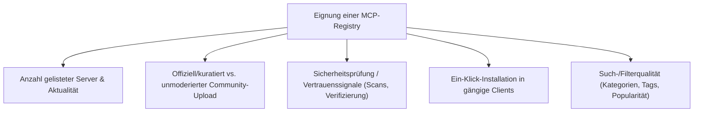
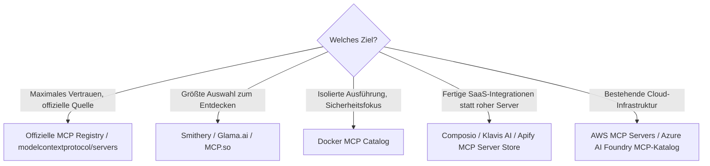

# Beste MCP-Registries — Top-20-Topliste

Die [MCP-Server-](mcp-server-topliste.md)- und [MCP-Client-Toplisten](mcp-client-topliste.md) dieser Serie bewerten einzelne Server bzw. Clients. Diese Seite bewertet die Ebene dazwischen: **MCP-Registries** — Kataloge und Verzeichnisse, über die MCP-Server auffindbar, geprüft und in einen Client eingebunden werden, statt sie einzeln aus verstreuten GitHub-Repos zusammenzusuchen.

!!! note "Hinweis: Registry ≠ Server ≠ Client"
    Eine **Registry** listet und indiziert MCP-Server (teils mit Metadaten, Bewertungen, Sicherheitsprüfung). Ein **MCP-Server** stellt die eigentlichen Tools bereit (siehe [MCP-Server-Topliste](mcp-server-topliste.md)). Ein **MCP-Client** verbindet sich mit diesen Servern (siehe [MCP-Client-Topliste](mcp-client-topliste.md)). Registries lösen primär das Auffindbarkeits- und Vertrauensproblem in einem schnell wachsenden Ökosystem.

---

## Bewertungskriterien

!!! warning "Achtung: Registry-Landschaft noch ohne klaren Standard-Gewinner"
    Anders als bei npm oder PyPI gibt es im MCP-Ökosystem noch keine einzelne, allgemein anerkannte zentrale Registry — mehrere kommerzielle und community-getragene Kataloge konkurrieren parallel, und die offizielle Registry befindet sich noch im Ausbau. Serverqualität und Sicherheitsprüfung vor Installation immer selbst gegenprüfen, unabhängig von der Quelle. **Stand: Juli 2026.**

---

## Top 20 im Überblick

| Rang | Registry | Betreiber | Typ | Besondere Stärke | Schwäche |
|---|---|---|---|---|---|
| 1 | **Offizielle MCP Registry** (registry.modelcontextprotocol.io) | Anthropic + Community (Governance-Board) | Offiziell | Referenzverzeichnis des Protokolls selbst, herstellerneutrale Governance | Noch im Ausbau, Umfang kleiner als etablierte Community-Kataloge |
| 2 | **`modelcontextprotocol/servers`** (GitHub-Repo) | Anthropic | Offiziell (Referenz-Repo) | Enthält die offiziellen Referenzserver (Filesystem, Fetch, Memory …), historisch der erste zentrale Anlaufpunkt | Kein durchsuchbarer Katalog im eigentlichen Sinn, reines Git-Repository |
| 3 | **Smithery** | Smithery (kommerziell) | Kommerzielle Plattform | Sehr große Serverzahl, Ein-Klick-Installation direkt in gängige Clients | Qualitätsschwankung bei unmoderiert eingereichten Community-Servern |
| 4 | **Glama.ai MCP-Verzeichnis** | Glama | Kommerzielle Plattform | Gute Kategorisierung und Bewertungsanzeige, aktive Pflege | Manche Einträge ohne tiefere Sicherheitsprüfung übernommen |
| 5 | **PulseMCP** | PulseMCP (Community) | Community-Katalog | Übersichtliche Neuigkeiten- und Trend-Ansicht neben reiner Auflistung | Kleineres Team als kommerzielle Plattformen, Update-Takt schwankt |
| 6 | **MCP.so** | Community | Community-Katalog | Sehr breite, schnell wachsende Auflistung inkl. chinesischsprachiger Server-Szene | Uneinheitliche Qualität der Kurzbeschreibungen |
| 7 | **Docker MCP Catalog** | Docker | Kommerzielle Plattform | Server laufen isoliert als Container, gutes Sicherheitsmodell durch Docker-Sandboxing | Erfordert Docker-Laufzeitumgebung, zusätzlicher Ressourcen-Overhead |
| 8 | **Composio** | Composio (kommerziell) | Kommerzielle Plattform | Fokus auf vorgefertigte, authentifizierte Integrationen (SaaS-Tools) statt roher Server-Liste | Tiefere Integrationen teils kostenpflichtig |
| 9 | **Klavis AI** | Klavis (kommerziell) | Kommerzielle Plattform | Gehostete, sofort nutzbare MCP-Server ohne eigenes Deployment | Gehostetes Modell bedeutet Abhängigkeit vom Anbieter statt Self-Hosting |
| 10 | **mcp-get.com** | Community | Community-Katalog | CLI-Installationsbefehl direkt aus dem Katalog kopierbar, sehr entwicklerfreundlich | Kleinerer Umfang als die großen kommerziellen Plattformen |
| 11 | **Cursor Directory** (MCP-Sektion) | Cursor-Community | Community-Katalog | Direkt auf Cursor-Nutzer zugeschnitten, gute Verzahnung mit Editor-Setup | Fokus stark auf Cursor statt editor-neutral |
| 12 | **Continue Hub** | Continue.dev | Kommerzielle Plattform (Open-Source-Umfeld) | MCP-Server als „Blocks" direkt in Continue-Konfigurationen einbindbar | An das Continue.dev-Ökosystem gebunden |
| 13 | **OpenTools** | OpenTools (kommerziell) | Kommerzielle Plattform | Standardisierte Tool-Beschreibungen erleichtern Vergleichbarkeit zwischen Servern | Jüngere Plattform, kleinere Serverzahl als Smithery/Glama |
| 14 | **Toolbase** | Toolbase (kommerziell) | Kommerzielle Plattform | Kombiniert Registry und lokalen Client-Manager in einer Anwendung | Ökosystem kleiner als reine Web-Registries |
| 15 | **Apify MCP Server Store** | Apify | Kommerzielle Plattform | Zugriff auf tausende bestehende Apify-Actors (Scraper, Automationen) als MCP-Tools | Volle Nutzung erfordert Apify-Konto/-Abrechnung |
| 16 | **Higress MCP Marketplace** | Alibaba Cloud | Kommerzielle Plattform | Gute Anbindung an chinesische Cloud-Infrastruktur und AI-Gateway-Funktionen | Fokus stark auf Alibaba-Cloud-Ökosystem |
| 17 | **AWS MCP Servers** (AWS Labs, GitHub) | Amazon | Offiziell (Anbieter-Repo) | Offiziell gepflegte Server-Sammlung speziell für AWS-Dienste (Bedrock, CDK, Kosten …) | Kein allgemeiner Katalog, nur AWS-eigene Server |
| 18 | **Azure AI Foundry MCP-Katalog** | Microsoft | Offiziell (Anbieter-Katalog) | Nahtlose Einbettung in bestehende Azure-/Foundry-Enterprise-Umgebungen | Nur innerhalb des Azure-Ökosystems relevant |
| 19 | **Awesome MCP Servers** (kuratierte GitHub-Liste) | Community (diverse Maintainer) | Community-Katalog (unkuratiert im Sinne einer Plattform) | Sehr transparente, versionskontrollierte Liste ohne Plattform-Lock-in | Reine Markdown-Liste, keine Such-/Filterfunktion wie bei echten Registries |
| 20 | **VS Code Marketplace** (MCP-Erweiterungen) | Microsoft | Offiziell (Editor-Marktplatz) | Installation direkt im gewohnten Erweiterungs-Workflow von VS Code | Nur für VS-Code-kompatible Installationswege gedacht, kein editor-neutraler Katalog |

!!! tip "Tipp: Vertrauenswürdigkeit vor Bequemlichkeit"
    Für **produktiven Einsatz** lohnt sich der Blick zuerst auf offiziell gepflegte Quellen (Rang 1, 2, 17, 18) oder Plattformen mit Sandboxing (Rang 7). Community-Kataloge mit großer Serverzahl (Smithery, Glama, MCP.so) sind ideal zum **Entdecken und Ausprobieren**, verlangen vor Produktivnutzung aber eine eigene Prüfung des Quellcodes — ein Registry-Eintrag ist kein Sicherheitszertifikat.

---

## Entscheidungshilfe nach Anwendungsfall

---

## 🔗 Verwandte Themen

- [Startseite](../../index.md) — zurück zur Dokumentations-Zentrale
- [Beste MCP-Server (Top 20)](mcp-server-topliste.md) — einzelne Server statt der Verzeichnisse, in denen sie gelistet sind
- [Beste MCP-Clients (Top 20)](mcp-client-topliste.md) — Anwendungen, die über diese Registries gefundene Server nutzen
- [Beste Open-Source-Software mit MCP-Server (Top 20)](mcp-server-opensource-software-topliste.md) — selbst hostbare Software mit eigenem MCP-Server
- [Agent Client Protocol (ACP) — Übersicht](agent-client-protocol-acp.md) — komplementäres Protokoll für die Editor-Anbindung
- [Antigravity CLI 2 — Kapitel 9: MCP, Headless & Security](antigravity-cli-advanced-mcp-cicd.md) — MCP-Client-Konfiguration in der Praxis
- [Beste MCP-Gateways (Top 20)](mcp-gateway-topliste.md) — Absicherungs-/Routing-Ebene für über eine Registry gefundene Server
- [MCP-Sicherheit & Best Practices (Top 20)](mcp-sicherheit-best-practices-topliste.md) — Herkunftsprüfung und weitere Praktiken vor der Installation aus einer Registry
