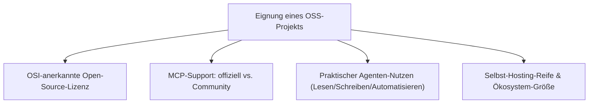
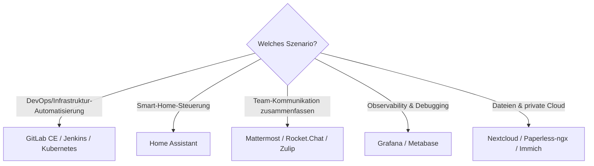

# Beste Open-Source-Software mit MCP-Server — Top-20-Topliste

Die [MCP-Server-Topliste](mcp-server-topliste.md) dieser Serie bewertet vor allem Protokoll-Referenzserver und entwicklernahe Werkzeuge (Filesystem, GitHub, Playwright …). Hier geht es um eine andere Frage: **Welche selbst hostbare Open-Source-Software** — Smart-Home-Zentralen, DevOps-Plattformen, Media-Server, Chat-Systeme — **bringt einen eigenen MCP-Server mit**, sodass ein KI-Agent direkt mit der laufenden Instanz sprechen kann, statt nur über deren REST-API gebastelt zu werden?

!!! note "Hinweis: Abgrenzung zu den Wissensmanagement- und CMS-Toplisten"
    Wiki-/Wissensmanagement-Systeme und CMS-Plattformen mit MCP-Support werden in eigenen, dedizierten Toplisten vertieft: [Wissensmanagement-Systeme mit MCP-Server](../../wissen/dokumentation/wissensmanagement-mcp-server-topliste.md) und [CMS-Systeme mit MCP-Server](../../wissen/dokumentation/cms-mcp-server-topliste.md). Diese Seite bewertet die übrige Bandbreite selbst hostbarer Open-Source-Software.

---

## Bewertungskriterien

!!! warning "Achtung: MCP-Nachrüstung bei Community-Servern unterschiedlich stabil"
    Bei vielen Projekten stammt der MCP-Server von der Community statt vom Kernteam — Funktionsumfang und Update-Takt schwanken entsprechend stark. Vor Produktiveinsatz prüfen, ob der Server aktiv gegen die aktuelle Version des Hauptprojekts getestet wird. **Stand: Juli 2026.**

---

## Top 20 im Überblick

| Rang | Software | Kategorie | Lizenz | MCP-Support | Besondere Stärke | Schwäche |
|---|---|---|---|---|---|---|
| 1 | **Nextcloud** | Cloud-/Dateispeicher | AGPL-3.0 | Community (Files/Talk/Notes-Anbindung) | Riesiges App-Ökosystem, ein Agent kann Dateien, Kalender und Kontakte gleichzeitig ansprechen | Kein einheitlicher offizieller Server für alle Apps, Abdeckung je App unterschiedlich |
| 2 | **GitLab CE** (Community Edition) | DevOps-Plattform | MIT | **offiziell** | Issues, Merge Requests, CI/CD-Pipelines direkt aus dem Agent-Loop steuerbar | Volle Feature-Tiefe teils der Enterprise-Edition vorbehalten |
| 3 | **Home Assistant** | Smart Home | Apache-2.0 | Community (`Model Context Protocol Server`-Integration) | Sehr großes Geräte-Ökosystem, Agent kann Automatisierungen direkt auslösen | Fehlkonfiguration kann reale Geräte im Haushalt beeinflussen — Berechtigungen eng fassen |
| 4 | **Grafana** | Observability/Dashboards | AGPL-3.0 | **offiziell** | Direkter Zugriff auf Dashboards, Alerts und Datenquellen für Debugging-Agenten | Volle Wirkung erst mit bereits bestehender Observability-Infrastruktur |
| 5 | **n8n** | Workflow-Automatisierung | Fair-Code (Sustainable Use License), Kernteile Apache-2.0 | **offiziell** | Agent kann bestehende No-Code-Workflows auslösen/verwalten statt sie neu zu bauen | Lizenz bei kommerzieller Weiterverteilung genau prüfen (kein reines OSI-Open-Source) |
| 6 | **Gitea / Forgejo** | Git-Hosting (leichtgewichtig) | MIT | Community | Sehr ressourcenschonende Alternative zu GitLab mit wachsender MCP-Anbindung | Community-Server noch jünger als GitLab CE |
| 7 | **Mattermost** | Team-Chat | MIT (Team Edition) | **offiziell** | Nachrichten, Kanäle und Playbooks direkt aus dem Agent-Loop ansprechbar | Volle Funktionstiefe teils in kostenpflichtigen Editionen |
| 8 | **PostgreSQL** | Datenbank | PostgreSQL-Lizenz | Community (mehrere ausgereifte Server) | Direkte Schema-Introspektion und Query-Ausführung, sehr breite Community-Unterstützung | Schreibzugriff in Produktivumgebungen erfordert strenge Rechteeinschränkung |
| 9 | **Jenkins** | CI/CD | MIT | Community | Build-Trigger, Job-Status und Logs direkt für den Agenten verfügbar | Community-Server unterschiedlich aktuell je nach Plugin-Ökosystem |
| 10 | **Kubernetes** | Container-Orchestrierung | Apache-2.0 | Community (mehrere `kubectl`-nahe Server) | Cluster-Status, Pods und Deployments agentengesteuert abfragbar/steuerbar | Schreibender Zugriff auf Produktions-Cluster erfordert besonders sorgfältiges RBAC |
| 11 | **Metabase** | Business Intelligence | AGPL-3.0 (Open Source Edition) | Community | Agent kann bestehende Dashboards/Fragen direkt referenzieren statt SQL neu zu schreiben | Enterprise-Features nicht in der Open-Source-Edition enthalten |
| 12 | **Rocket.Chat** | Team-Chat | MIT | Community | Gute Alternative zu Mattermost mit wachsendem Bot-/Agenten-Ökosystem | MCP-Anbindung weniger ausgereift als bei Mattermosts offiziellem Server |
| 13 | **Odoo** | ERP/Business-Suite | LGPL-3.0 (Community Edition) | Community | Ein Server deckt potenziell CRM, Lager und Rechnungen gleichzeitig ab | Enterprise-Module außerhalb der Community Edition nicht abgedeckt |
| 14 | **Jellyfin** | Media-Server | GPL-2.0 | Community | Agent kann Mediathek durchsuchen und Wiedergabe steuern | Nischenanwendungsfall außerhalb von Media-Center-Setups |
| 15 | **Immich** | Foto-/Video-Backup | AGPL-3.0 | Community | Durchsuchbare Foto-Bibliothek per natürlicher Sprache statt manueller Alben-Pflege | Jüngeres Projekt, MCP-Server-Ökosystem noch klein |
| 16 | **Paperless-ngx** | Dokumentenmanagement | GPL-3.0 | Community | Gescannte Dokumente per Agent durchsuchbar und kategorisierbar | Volle Texterkennung hängt von OCR-Qualität der Quelldokumente ab |
| 17 | **Redmine** | Projektmanagement | GPL-2.0 | Community | Tickets/Issues direkt aus dem Agent-Loop anlegen und aktualisieren | Kleineres Ökosystem als moderne Alternativen (Linear, GitLab Issues) |
| 18 | **Zulip** | Team-Chat (Thread-basiert) | Apache-2.0 | Community | Thread-Struktur eignet sich gut für strukturierte Agent-Zusammenfassungen | MCP-Server-Reife hinter Mattermost/Rocket.Chat |
| 19 | **Vaultwarden** (Bitwarden-kompatibel) | Passwortverwaltung | AGPL-3.0 | Community (stark eingeschränkter Lesezugriff empfohlen) | Ermöglicht Agenten kontrollierten Zugriff auf Metadaten ohne Klartext-Passwörter | Sicherheitskritischste Kategorie dieser Liste — MCP-Zugriff nur mit äußerster Vorsicht einrichten |
| 20 | **Grocy** | Haushalts-/Vorratsverwaltung | MIT | Community | Nischenbeispiel für Alltags-Automatisierung (Vorratsbestand, Einkaufslisten) per Agent | Sehr kleine, wenig aktive MCP-Community |

!!! tip "Tipp: Sicherheitskritische Systeme zuletzt anbinden"
    Für den **Einstieg** eignen sich Systeme mit reinem Lesezugriff oder unkritischen Daten (Grafana, Metabase, Jellyfin) am besten. Bei **schreibendem Zugriff auf Produktivsysteme** (GitLab CE, Kubernetes, Vaultwarden) lohnt sich ein separater, eng beschränkter Service-Account statt der eigenen Admin-Zugangsdaten.

---

## Entscheidungshilfe nach Einsatzszenario

---

## 🔗 Verwandte Themen

- [Startseite](../../index.md) — zurück zur Dokumentations-Zentrale
- [Beste MCP-Server (Top 20)](mcp-server-topliste.md) — protokollnahe Referenzserver und Entwickler-Tools statt selbst hostbarer Anwendungen
- [Beste Wissensmanagement-Systeme (Open Source) mit MCP-Server (Top 20)](../../wissen/dokumentation/wissensmanagement-mcp-server-topliste.md) — Wiki-/KM-Systeme mit MCP-Anbindung
- [Beste CMS-Systeme (Open Source) mit MCP-Server (Top 20)](../../wissen/dokumentation/cms-mcp-server-topliste.md) — Content-Management-Systeme mit MCP-Anbindung
- [Agent Client Protocol (ACP) — Übersicht](agent-client-protocol-acp.md) — komplementäres Protokoll für die Editor-Anbindung des Agenten
- [Beste Self-Hosting-KI-Agenten (Allgemein, Top 20)](selbsthosting-ki-agenten-topliste.md) — Agenten, die diese MCP-Server praktisch ansprechen
