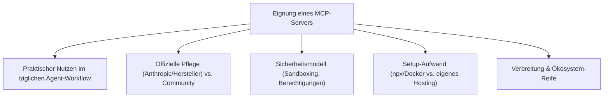
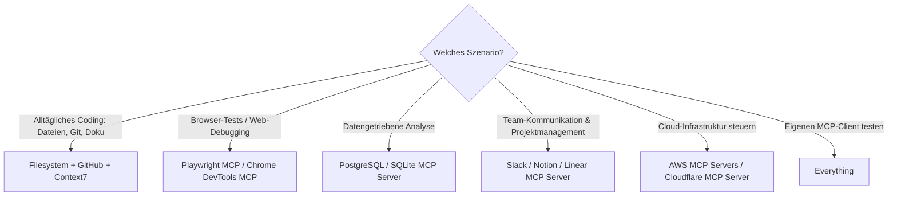

# Beste MCP-Server — Top-20-Topliste

Nach den [ACP-Seiten](agent-client-protocol-acp.md) dieser Serie — die die Kommunikation zwischen Editor und Agent standardisieren — geht es hier um das Gegenstück: das **Model Context Protocol (MCP)** und die Frage, welche **MCP-Server** einem KI-Agenten (Claude Code, Antigravity CLI, Gemini CLI & Co.) den größten praktischen Mehrwert bringen, indem sie Tools, Datenquellen oder externe Dienste standardisiert anbindbar machen.

!!! note "Hinweis: MCP-Server vs. MCP-Client"
    Ein **MCP-Server** stellt Tools/Ressourcen bereit (z. B. Dateisystemzugriff, GitHub-API, Browser-Steuerung). Der **MCP-Client** läuft im Agenten selbst (siehe [Antigravity-CLI-Kapitel 9](antigravity-cli-advanced-mcp-cicd.md)) und verbindet sich mit einem oder mehreren Servern. Diese Liste bewertet ausschließlich die Server-Seite — welche Anbindung sich lohnt, unabhängig davon, welcher Agent sie nutzt.

---

## Bewertungskriterien



!!! warning "Achtung: Momentaufnahme in einer extrem dynamischen Kategorie"
    MCP-Server erscheinen seit der Veröffentlichung des Protokolls Ende 2024 in enormem Tempo — neue Server, auch von großen Anbietern (AWS, Cloudflare, Figma …), kommen praktisch monatlich hinzu. Vor Produktiveinsatz Berechtigungsumfang jedes Servers genau prüfen, da viele weitreichenden Datei-/API-Zugriff erhalten. **Stand: Juli 2026.**

---

## Top 20 im Überblick

| Rang | MCP-Server | Kategorie | Anbieter/Herkunft | Einschätzung | Besondere Stärke | Schwäche |
|---|---|---|---|---|---|---|
| 1 | **Filesystem** | Dateizugriff | Anthropic (offizieller Referenzserver) | Sehr stark | Grundbaustein praktisch jedes Agent-Setups, granular auf Verzeichnisse einschränkbar | Ohne sorgfältige Pfad-Beschränkung weitreichender Schreibzugriff möglich |
| 2 | **GitHub MCP Server** | Entwicklung / VCS | GitHub (offiziell) | Sehr stark | Issues, PRs, Code-Suche und Repo-Verwaltung direkt aus dem Agent-Loop heraus | Erfordert sorgfältiges Scoping des Personal-Access-Tokens |
| 3 | **Playwright MCP** | Browser-Automatisierung | Microsoft (offiziell) | Sehr stark | Strukturierte Accessibility-Tree-Steuerung statt reiner Screenshot-Interpretation, siehe [Playwright-Grundlagen](../automatisierung/playwright-anleitung.md) | Höherer Ressourcenbedarf als reine API-Server |
| 4 | **Chrome DevTools MCP** | Browser-Automatisierung / Debugging | Google (offiziell) | Stark | Direkter Zugriff auf Performance-Traces, Konsolen-Logs und Netzwerk-Requests aus echtem Chrome | Chrome-spezifisch, kein Cross-Browser-Support wie Playwright MCP |
| 5 | **Context7** | Dokumentation / Code-Kontext | Upstash (Community) | Stark | Liefert aktuelle, versionsgenaue Bibliotheks-Dokumentation direkt in den Kontext, reduziert veraltete Trainingsdaten-Antworten | Abdeckung hängt von der aktiven Pflege der jeweiligen Bibliotheks-Doku ab |
| 6 | **Sequential Thinking** | Reasoning-Gerüst | Anthropic (offizieller Referenzserver) | Solide bis stark | Strukturiert mehrstufiges Denken bei komplexen Aufgaben nachvollziehbar in einzelne Schritte | Kein externer Datenzugriff — reines Denk-Gerüst, kein Tool im engeren Sinn |
| 7 | **Fetch** | Web-Zugriff | Anthropic (offizieller Referenzserver) | Solide bis stark | Einfacher, sicherer Web-Abruf mit HTML-zu-Markdown-Konvertierung für Agenten-Kontext | Kein JavaScript-Rendering — für dynamische Seiten ungeeignet (dafür Playwright MCP) |
| 8 | **Memory** | Persistenter Kontext | Anthropic (offizieller Referenzserver) | Solide | Knowledge-Graph-basiertes Langzeitgedächtnis über einzelne Sessions hinaus | Einfaches Graph-Modell, kein Ersatz für eine vollwertige Vector-DB bei großem Umfang |
| 9 | **PostgreSQL MCP Server** | Datenbank | Community / diverse Maintainer | Solide bis stark | Direkte Schema-Introspektion und Query-Ausführung für datengetriebene Agent-Workflows | Schreibzugriff erfordert besonders sorgfältige Rechteeinschränkung in Produktivumgebungen |
| 10 | **SQLite MCP Server** | Datenbank | Anthropic (offizieller Referenzserver) | Solide | Sehr geringe Einstiegshürde für lokale, dateibasierte Datenanalyse durch den Agenten | Nicht für produktive Multi-User-Datenbanken gedacht |
| 11 | **Slack MCP Server** | Kommunikation | Community | Solide | Nachrichten lesen/senden und Kanalkontext direkt in Agent-Workflows einbinden | Berechtigungsscope in Slack-Workspaces muss bewusst eng gehalten werden |
| 12 | **Google Drive MCP Server** | Produktivität / Speicher | Community | Solide | Zugriff auf Dokumente/Sheets als Kontextquelle ohne manuellen Export | OAuth-Setup pro Nutzer etwas aufwendiger als reine API-Key-Server |
| 13 | **Notion MCP Server** | Produktivität / Wissensdatenbank | Notion (offiziell) | Solide | Direkter Lese-/Schreibzugriff auf Notion-Workspaces als Wissensquelle für den Agenten | Rate-Limits der Notion-API bei sehr großen Workspaces spürbar |
| 14 | **Linear MCP Server** | Projektmanagement | Linear (offiziell) | Solide | Issues direkt aus dem Agent-Loop anlegen/aktualisieren, gute Fit für Dev-Teams | Außerhalb von Linear-nutzenden Teams ohne Mehrwert |
| 15 | **Sentry MCP Server** | Observability | Sentry (offiziell) | Solide | Fehlerberichte und Stacktraces direkt als Debugging-Kontext für den Agenten verfügbar | Voller Nutzen erst bei bereits etablierter Sentry-Integration im Projekt |
| 16 | **Docker MCP Toolkit** | Infrastruktur | Docker (offiziell) | Solide | Container-Verwaltung und kuratierter Server-Katalog mit isoliertem Ausführungsmodell | Zusätzliche Docker-Desktop-Abhängigkeit für volle Funktionalität |
| 17 | **AWS MCP Servers** (AWS Labs) | Cloud-Infrastruktur | Amazon (offiziell, mehrere Server) | Solide | Mehrere spezialisierte Server (z. B. für Bedrock, CDK, Kosten) statt einer monolithischen Anbindung | Setup mehrerer Einzelserver statt eines einheitlichen AWS-Gesamtservers |
| 18 | **Cloudflare MCP Server** | Cloud-Infrastruktur | Cloudflare (offiziell) | Ausreichend bis solide | Direkte Steuerung von Workers, DNS und Cache-Purge aus dem Agent-Loop | Nur innerhalb des Cloudflare-Ökosystems relevant |
| 19 | **Figma Dev Mode MCP Server** | Design-Übergabe | Figma (offiziell) | Ausreichend bis solide | Übersetzt Figma-Designs direkt in strukturierten Code-Kontext für den Agenten | Nur im Zusammenspiel mit Figma Dev Mode nutzbar, kein Ersatz für volles Figma-API |
| 20 | **Everything** | Referenz-/Testserver | Anthropic (offizieller Referenzserver) | Ausreichend | Deckt alle MCP-Primitive (Tools, Resources, Prompts) in einem Server ab — ideal zum Testen eigener Client-Implementierungen | Kein praktischer Produktivnutzen, reines Referenzbeispiel für Entwickler |

!!! tip "Tipp: Klein anfangen statt alles gleichzeitig verbinden"
    Für den **Einstieg** genügen meist Filesystem, GitHub und Fetch — sie decken den Großteil alltäglicher Coding-Workflows ab. Browser-Automatisierung (Playwright MCP/Chrome DevTools MCP) und Cloud-Server (AWS/Cloudflare) lohnen sich erst, sobald der Agent tatsächlich in Browser-Tests oder Infrastruktur-Aufgaben eingebunden wird — jeder zusätzliche Server vergrößert auch die Angriffsfläche.

---

## Beispiel-Konfiguration

```json
{
  "mcpServers": {
    "filesystem": {
      "command": "npx",
      "args": ["-y", "@modelcontextprotocol/server-filesystem", "/pfad/zum/projekt"]
    },
    "github": {
      "command": "npx",
      "args": ["-y", "@modelcontextprotocol/server-github"],
      "env": { "GITHUB_PERSONAL_ACCESS_TOKEN": "ghp_..." }
    }
  }
}
```

---

## Entscheidungshilfe nach Einsatzszenario



---

## 🔗 Verwandte Themen

- [Startseite](../../index.md) — zurück zur Dokumentations-Zentrale
- [Agent Client Protocol (ACP) — Übersicht](agent-client-protocol-acp.md) — komplementäres Protokoll für die Editor-Anbindung des Agenten
- [Beste Alternativen zum Agent Client Protocol (ACP, Top 20)](agent-client-protocol-alternativen-topliste.md) — Einordnung von MCP im Vergleich zu ACP und weiteren Protokollen
- [Antigravity CLI 2 — Kapitel 9: MCP, Headless & Security](antigravity-cli-advanced-mcp-cicd.md) — MCP-Client-Konfiguration in der Praxis
- [Claude Code Praxis-Handbuch](claude-code-praxis.md) — Agent, der MCP-Server nativ einbindet
- [AI Agents Praxis-Handbuch](ai-agents-praxis.md) — Grundlagen zu Tool-Use unabhängig vom konkreten Protokoll
- [Playwright & KI Web-Scraping](../automatisierung/playwright-ki-extraction.md) — vertiefend zu Rang 3
- [Beste KI-Agent-CLIs (Allgemein, Top 20)](ki-agent-cli-topliste.md) — Agenten, die diese MCP-Server praktisch nutzen
