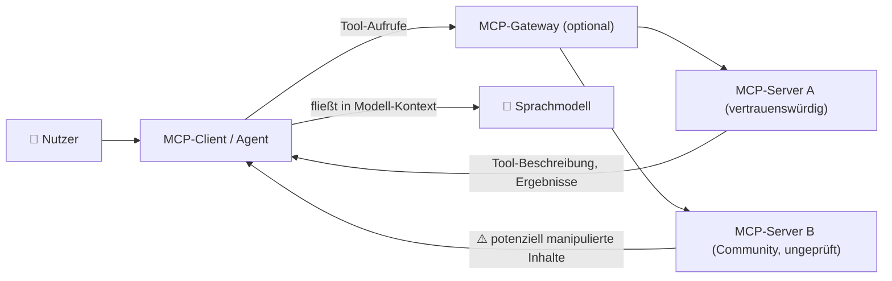
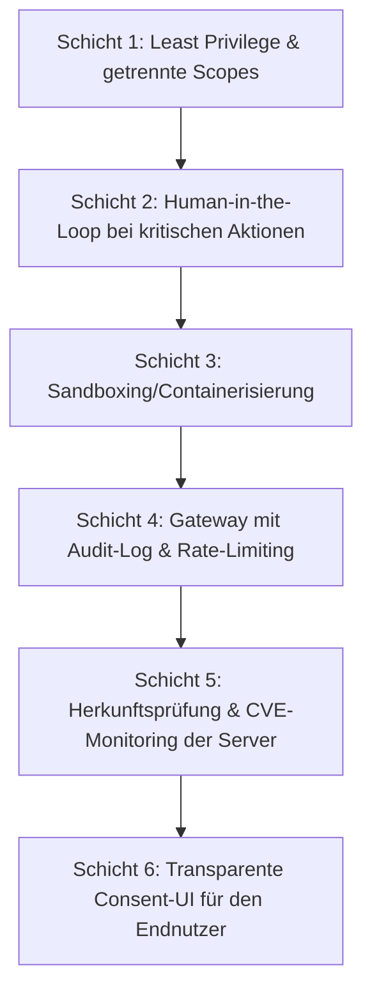

# MCP-Sicherheit & Best Practices — Top-20-Topliste

Die bisherigen Seiten dieser Serie — [Server](mcp-server-topliste.md), [Clients](mcp-client-topliste.md), [Registries](mcp-registry-topliste.md), [Gateways](mcp-gateway-topliste.md) — bewerten konkrete Produkte. Diese Seite bewertet stattdessen **Praktiken**: Welche Sicherheitsmaßnahmen und Best Practices sind beim produktiven Einsatz von MCP am wichtigsten, um die bekannten Angriffsmuster auf Agenten-Tool-Anbindungen einzudämmen?

!!! note "Hinweis: MCP erweitert die Angriffsfläche eines Agenten erheblich"
    Jeder verbundene MCP-Server ist potenziell in der Lage, Inhalte in den Kontext des Modells einzuschleusen (Tool-Beschreibungen, Ressourcen-Inhalte, Fehlermeldungen) — nicht nur Aktionen auszuführen. Sicherheitsbetrachtungen müssen daher sowohl die **Ausführungsebene** (was darf ein Tool tun?) als auch die **Kontextebene** (was darf ein Server dem Modell „sagen"?) abdecken.

---

## Angriffsfläche im Überblick

!!! warning "Achtung: sich schnell entwickelnde Bedrohungslandschaft"
    Angriffsmuster gegen MCP-Implementierungen (Tool Poisoning, Rug Pulls, Tool Shadowing …) wurden größtenteils erst 2025 systematisch dokumentiert, und neue Varianten erscheinen laufend. Diese Liste ersetzt keine dedizierte Sicherheitsprüfung vor Produktiveinsatz. **Stand: Juli 2026.**

---

## Top 20 im Überblick

| Rang | Best Practice | Adressiertes Risiko | Empfehlung | Warum kritisch |
|---|---|---|---|---|
| 1 | **Least-Privilege-Scoping von Tokens** | Übermäßige Berechtigungen bei kompromittiertem Server | Jedem MCP-Server nur die minimal nötigen API-Scopes/Rechte geben, nie das eigene Admin-Token wiederverwenden | Ein kompromittierter Server kann nie mehr anrichten, als sein eigenes Token erlaubt |
| 2 | **Human-in-the-Loop bei destruktiven Aktionen** | Ungewollte Datei-Löschung, Shell-Ausführung, Zahlungen | Explizite Nutzerfreigabe vor Schreib-/Ausführungs-/Zahlungsoperationen einfordern (siehe `session/request_permission` in [ACP](agent-client-protocol-acp.md)) | Verhindert automatisierte Kettenreaktionen ohne menschliche Kontrolle |
| 3 | **Sandboxing/Containerisierung von Servern** | Kompromittierter Server greift auf Host-System zu | MCP-Server in isolierten Containern (siehe [Docker MCP Gateway](mcp-gateway-topliste.md)) statt direkt auf dem Host ausführen | Begrenzt den Schaden auf die Container-Grenze statt das gesamte System |
| 4 | **Schutz vor Tool Poisoning** | Bösartige Anweisungen versteckt in Tool-Beschreibungen | Tool-Beschreibungen vor Vertrauensgewährung prüfen/scannen, nicht blind vom Server übernehmen | Ein Modell folgt Anweisungen in Tool-Metadaten oft genauso wie Nutzereingaben |
| 5 | **Schutz vor Rug-Pull-Updates** | Server ändert Verhalten nach initialer Freigabe unbemerkt | Versionen/Hashes pinnen, Änderungen an Tool-Definitionen aktiv gegenprüfen statt automatisch zu vertrauen | Einmal freigegebene Server können nachträglich bösartigen Code nachladen |
| 6 | **Schutz vor Tool Shadowing** | Bösartiger Server tarnt/überschreibt Tool-Namen eines vertrauenswürdigen Servers | Tool-Namen serverübergreifend eindeutig referenzieren, Namenskollisionen aktiv erkennen | Der Agent kann sonst unbemerkt den falschen (bösartigen) Server aufrufen |
| 7 | **Getrennte Scopes statt globalem Token (Confused Deputy)** | Agent wird zur missbräuchlichen Nutzung seiner legitimen Rechte verleitet | Pro Tool/Aufgabe eigene, eng begrenzte Credentials statt eines einzigen mächtigen Tokens verwenden | Verhindert, dass ein manipulierter Prompt legitime Rechte für fremde Zwecke missbraucht |
| 8 | **Eindämmung indirekter Prompt-Injection** | Bösartige Anweisungen in abgerufenen Dokumenten/Ressourcen | Von Tools zurückgegebene Inhalte klar als Daten statt als Anweisungen kennzeichnen, kritische Aktionen nie allein daraus ableiten | Angreifer müssen den Agenten nicht direkt ansprechen, nur von ihm gelesene Inhalte manipulieren |
| 9 | **TLS-Pflicht für Remote-Transporte** | Abhören/Manipulation von Streamable-HTTP-/SSE-Verbindungen | Remote-MCP-Server ausschließlich über HTTPS betreiben, unverschlüsseltes HTTP nur für lokale stdio-Verbindungen akzeptieren | Ohne TLS sind Tool-Aufrufe und Ergebnisse im Klartext einsehbar/manipulierbar |
| 10 | **Nicht erratbare Session-IDs** | Session-Hijacking bei vorhersagbaren IDs | Kryptographisch zufällige Session-Identifier verwenden, keine sequenziellen/zeitbasierten IDs | Vorhersagbare Session-IDs erlauben Dritten, fremde Agenten-Sessions zu übernehmen |
| 11 | **Output-Validierung von Tool-Ergebnissen** | Unerwartete/übergroße/schädliche Rückgabewerte destabilisieren den Agenten-Loop | Struktur, Größe und Inhalt von Tool-Antworten vor Weitergabe an das Modell validieren | Verhindert sowohl technische Fehler als auch versteckte Injection-Versuche in Antworten |
| 12 | **Zentrale Audit-Protokollierung** | Fehlende Nachvollziehbarkeit bei Sicherheitsvorfällen | Jeden Tool-Aufruf (wer, welcher Server, welche Parameter, wann) zentral loggen, idealerweise über ein [Gateway](mcp-gateway-topliste.md) | Ohne Audit-Log ist ein Vorfall im Nachhinein kaum rekonstruierbar |
| 13 | **Rate-Limiting & Kostenkontrolle** | Missbrauch durch Endlosschleifen oder kompromittierte Agenten | Aufruf-Frequenz und -Volumen je Server/Nutzer begrenzen | Verhindert sowohl versehentliche Kostenexplosion als auch gezielten Denial-of-Service |
| 14 | **Herkunfts-/Signaturprüfung vor Installation** | Bösartiger Server aus ungeprüfter Registry-Quelle | Server aus [Registries](mcp-registry-topliste.md) vor Nutzung auf Quellcode, Maintainer-Reputation und Signaturen prüfen | Ein Registry-Eintrag allein ist kein Sicherheitszertifikat |
| 15 | **Netzwerksegmentierung der Ausführungsumgebung** | Kompromittierter Server exfiltriert Daten über beliebige Ausgangsverbindungen | Ausgehenden Netzwerkverkehr von Tool-Ausführungsumgebungen auf notwendige Ziele beschränken | Begrenzt Datenexfiltration selbst bei erfolgreichem Kompromittieren eines Servers |
| 16 | **Secrets-Management über Vault statt Klartext** | API-Keys landen in Logs, Configs oder Versionskontrolle | Secrets über einen dedizierten Secret-Manager statt Umgebungsvariablen in Klartext-Configs verwalten | Klartext-Keys in Configs/Logs sind eine der häufigsten realen Leck-Ursachen |
| 17 | **Laufendes CVE-/Patch-Monitoring** | Bekannte Schwachstellen in verwendeten Servern bleiben unbemerkt | Verwendete Server-Versionen aktiv gegen Sicherheitsmeldungen abgleichen, zeitnah patchen | Viele Vorfälle nutzen bereits bekannte, aber ungepatchte Lücken aus |
| 18 | **Trennung von Dev- und Prod-Credentials** | Entwicklungs-Zugangsdaten mit Produktionsrechten im Einsatz | Für jede Umgebung eigene, eigenständig widerrufbare Credentials je MCP-Server anlegen | Verhindert, dass ein kompromittiertes Testsystem Zugriff auf Produktivdaten hat |
| 19 | **Statische Code-Analyse vor Serverbetrieb** | Unauditierter Community-Server-Code mit verstecktem Schadverhalten | Insbesondere Community-Server vor Erstnutzung scannen/lesen statt „nur mal ausprobieren" | Reduziert das Risiko unentdeckter Backdoors in schnell wachsenden Registries |
| 20 | **Transparente Consent-UI für Endnutzer** | Nutzer wissen nicht, welche Server mit welchen Rechten verbunden sind | Verbundene Server, deren Tools und Berechtigungsumfang für den Endnutzer sichtbar und nachvollziehbar darstellen | Informierte Zustimmung ist Voraussetzung für kontrollierten Einsatz statt Blackbox-Vertrauen |

!!! tip "Tipp: Priorisierung bei begrenzten Ressourcen"
    Wer nicht alle 20 Punkte gleichzeitig umsetzen kann, sollte mit **Rang 1–3** beginnen (Least-Privilege, Human-in-the-Loop, Sandboxing) — sie decken die Fälle mit dem größten Schadenspotenzial ab. Erst danach lohnt sich die Vertiefung in die spezifischeren Angriffsmuster (Tool Poisoning, Rug Pulls, Tool Shadowing).

---

## Verteidigung in Schichten (Defense in Depth)

---

## 🔗 Verwandte Themen

- [Startseite](../../index.md) — zurück zur Dokumentations-Zentrale
- [Beste MCP-Server (Top 20)](mcp-server-topliste.md) — konkrete Server, auf die diese Praktiken angewendet werden
- [Beste MCP-Clients (Top 20)](mcp-client-topliste.md) — Client-seitige Umsetzung von Human-in-the-Loop & Consent-UI
- [Beste MCP-Registries (Top 20)](mcp-registry-topliste.md) — Herkunftsprüfung vor der Installation aus einem Katalog
- [Beste MCP-Gateways (Top 20)](mcp-gateway-topliste.md) — zentrale Umsetzung von Audit-Logging, Rate-Limiting und Zugriffskontrolle
- [Agent Client Protocol (ACP) — Übersicht](agent-client-protocol-acp.md) — Permission-Request-Modell als Grundlage für Rang 2
- [Beste Open-Source-Software mit MCP-Server (Top 20)](mcp-server-opensource-software-topliste.md) — praktische Beispiele mit teils sicherheitskritischem Zugriff (z. B. Passwortverwaltung, Kubernetes)
