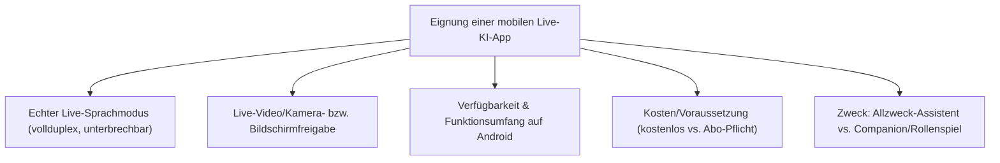
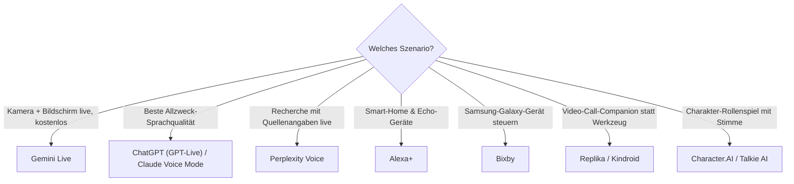

# Beste Mobile KI-Chat-Apps mit Live-Sprach- & Video-Modus (Android, Top 20)

Seit Google mit **Gemini Live** ein flüssiges, unterbrechbares Sprachgespräch inklusive Kamera- und Bildschirmfreigabe auf Android etabliert hat, ziehen praktisch alle großen Anbieter nach: OpenAI hat ChatGPTs bisherigen "Advanced Voice Mode" am 8. Juli 2026 durch das neue, vollduplexfähige **GPT-Live** ersetzt, Anthropic hat Claudes **Voice Mode** auf Opus/Sonnet erweitert, und daneben etabliert sich ein wachsender Markt an Companion-Apps mit eigenem Video-Call-Modus (Replika, Kindroid). Diese Seite ordnet ein, welche **Android-Apps mit echtem Live-Sprachmodus** (durchgehendes Zuhören/Sprechen statt Sprachnachricht-Aufnahme) existieren, welche davon zusätzlich **Live-Video/Kamera** unterstützen und wie sie sich unterscheiden.

!!! note "Hinweis: Was zählt hier als „Live"?"
    Als **Live-Sprachmodus** zählt in dieser Liste ein durchgehend offener Sprachkanal mit kurzer Latenz (idealerweise unterbrechbar/vollduplex), nicht das klassische "Sprachnachricht aufnehmen → Antwort abspielen" älterer Assistenten. **Live-Video** meint, dass die App live über die Handykamera oder den Bildschirm "mitsieht" bzw. per Video-Call antwortet — nicht nur einzelne Fotos analysiert.

---

## Bewertungskriterien

!!! warning "Achtung: Sehr schnelllebiges Feld — Stand Juli 2026"
    Live-Sprach- und Video-Funktionen werden aktuell im Wochentakt erweitert (z. B. GPT-Live erst am 8. Juli 2026 gestartet, Kindroid V2 mit Video-Calls am 17. Juli 2026). Diese Liste ist eine **Momentaufnahme** — vor einer Entscheidung die aktuelle Produktseite bzw. den Play-Store-Eintrag der jeweiligen App prüfen.

---

## Top 20 im Überblick

| Rang | App | Anbieter | Voice-Live | Video/Kamera-Live | Kosten (Android) | Besondere Stärke | Schwäche |
|---|---|---|---|---|---|---|---|
| 1 | **Gemini Live** | Google | ja (Astra-Modell, vollduplex) | ja — Kamera **und** Bildschirmfreigabe, für alle Android-Nutzer freigegeben | kostenlos, mehr Kontingent mit Google AI Pro/Ultra | am tiefsten in Android integriert, Kamera+Screen-Share ohne Zusatzkosten | volle Funktionstiefe an Google-Konto/-Ökosystem gebunden |
| 2 | **ChatGPT (GPT-Live)** | OpenAI | ja (vollduplex, seit 8.7.2026, löst „Advanced Voice Mode" ab) | ja — Kamera-Vision | Basis-Voice teils kostenlos, Kamera-Vision nur mit Plus/Pro/Team | natürlichste Sprachqualität, riesige bestehende Nutzerbasis | Video-/Vision-Funktion nur mit Bezahl-Abo |
| 3 | **Claude Voice Mode** | Anthropic | ja (Modellwahl Haiku/Sonnet/Opus, 18+ Sprachen, Tool-Connectors) | nein, reine Sprachfunktion | Haiku kostenlos mit 1 Connector, volle Modellauswahl mit Claude Pro/Max | stärkste Modellqualität für komplexe Gespräche + Tool-Anbindung (Notion, Canva) | kein Kamera-/Bildschirm-Live-Modus |
| 4 | **Grok Voice** | xAI | ja (ElevenLabs-Stimmen, viele Sprachen/Dialekte, sehr niedrige Latenz) | nein, im Consumer-Live-Chat kein Kamera-Modus | in X- bzw. Grok-App, Premium-Stufen für vollen Zugriff | sehr niedrige Latenz, tief in X integriert | außerhalb der X-Plattform weniger verbreitet |
| 5 | **Microsoft Copilot (Voice & Vision)** | Microsoft | ja | ja — Vision auf Bildschirm-/App-Kontext (z. B. Webseite ansehen) | kostenlos nutzbar, mehr mit Copilot Pro/M365 Copilot | direkte Einbindung von Bildschirm-/App-Kontext | Video-Fokus eher Bildschirm als freie Kamera-Live-Szene |
| 6 | **Meta AI Voice** | Meta | ja (vollduplex mit natürlichen Einwürfen) | eingeschränkt, primär über Smart-Glasses-Anbindung | kostenlos in WhatsApp/Instagram/Messenger | riesige Reichweite über bestehende Meta-Apps | Rollout regional uneinheitlich (Fokus Nordamerika, EU im Ausbau) |
| 7 | **Perplexity Voice** | Perplexity | ja | nein, Fokus auf Sprache + Web-Recherche | kostenlos, mehr mit Perplexity Pro | Live-Antworten mit Quellenangaben aus dem Web | kein Kamera-/Video-Live-Modus |
| 8 | **Le Chat Voice Mode** | Mistral AI | ja (Voxtral-Modell, niedrige Latenz) | nein | für alle Plan-Stufen inkl. kostenlos verfügbar | europäischer Anbieter, Voxtral auch offen/selbst hostbar | noch kein Kamera-Live-Modus |
| 9 | **Alexa+** | Amazon | ja (generativ überarbeitet) | nur eingeschränkt in der mobilen App, volles Bild primär auf Echo-Show-Geräten | kostenlos für Prime-Mitglieder | tiefe Smart-Home-Anbindung | mobile App-Erfahrung schwächer als Kern-Erlebnis auf Echo-Geräten |
| 10 | **Bixby (Perplexity-powered)** | Samsung | ja | Kamera-bezogene Bildbearbeitung, kein offener Live-Video-Chat wie Gemini | kostenlos, auf Galaxy-Geräten vorinstalliert | direkter Geräte-Agent (Einstellungen finden/ändern per Sprache) | nur auf Samsung-Galaxy-Geräten, kein herstellerunabhängiger Assistent |
| 11 | **Pi.ai** | Inflection AI | ja, sehr natürliche Stimmen | nein | kostenlos | als Gesprächspartner/Companion konzipiert statt als Werkzeug | schwächer bei komplexen Aufgaben/Tool-Nutzung |
| 12 | **Poe** | Quora | ja, über ElevenLabs-/Cartesia-TTS, viele Modelle wählbar | nein | kostenlos nutzbar, Punkte-/Abo-System für mehr Nutzung | ein Login für sehr viele verschiedene Chat-Modelle | Sprachfunktion eher Text-zu-Sprache als echtes Full-Duplex-Gespräch |
| 13 | **Character.AI (Character Calls)** | Character.AI | ja, mehrsprachig | nein | kostenlos, c.ai+ für mehr Kapazität | Rollenspiel-/Charakter-Fokus mit vielen Sprachen | Fokus Unterhaltung, kein produktiver Allzweck-Assistent |
| 14 | **Replika** | Replika (Luka Inc.) | ja | ja — Video-Call-Companion | kostenlos mit Einschränkungen, Pro-Abo für vollen Funktionsumfang | eine der ältesten, ausgereiftesten Companion-Apps mit Video-Calls | Fokus auf emotionale Begleitung, nicht Produktivität |
| 15 | **Kindroid** | Kindroid | ja | ja — Live-Video-Calls mit frei gestaltbarem Avatar, seit V2 (Juli 2026) 60 Sprachen | kostenpflichtig ab Einstiegs-Abo | aktuell umfangreichste Video-Call-Personalisierung unter Companion-Apps | kein Allzweck-Assistent, rein Companion-fokussiert |
| 16 | **Talkie AI** | Talkie (Weaver) | ja, Gespräche bis 10 Minuten am Stück | nein | kostenlos mit Limits | native Android-/iOS-App mit großer Charakter-Community | Gesprächsdauer pro Voice-Call begrenzt |
| 17 | **Sesame AI** | Sesame | ja, sehr realistisch klingende Stimme | nein | kostenlos mit Limits | Fokus auf besonders menschlich klingende Stimme | kein Kamera-Modus, kein Tool-/Such-Zugriff |
| 18 | **Krater.ai Voice Mode** | Krater | ja, über 350 wählbare Modelle | eingeschränkt (Foto-Kontext) | abo-basiert | Modellvielfalt/-flexibilität in einer einzigen Voice-Oberfläche | kleinerer Anbieter, weniger Ökosystem-Integration |
| 19 | **Google Assistant (klassisch)** | Google | ja, aber Legacy-Technik | nein | kostenlos, auf vielen Android-Geräten vorinstalliert | sehr breite Geräte-Kompatibilität, auch ältere/günstigere Android-Geräte | wird schrittweise durch Gemini/Gemini Live ersetzt, keine neuen Live-Funktionen mehr |
| 20 | **DeepSeek** | DeepSeek | nein, kein natives Live-Voice-Feature in der App | nein | kostenlos | starkes, günstiges Textmodell | kein Live-Chat-Modus — als Kontrastpunkt in dieser Liste |

!!! tip "Tipp: Rang ≠ einzige Entscheidungsgröße"
    Für **Kamera- und Bildschirm-Live-Verständnis ohne Zusatzkosten** ist Gemini Live aktuell konkurrenzlos, da als einzige App der Liste beides kostenlos und vollständig für Android freigegeben ist. Für **maximale Sprachqualität** liefern GPT-Live und Claude Voice Mode die natürlichsten Gespräche. Für **Video-Call-Companions** statt Werkzeug-Assistenten sind Replika und Kindroid aktuell führend.

---

## Empfehlung nach Einsatzszenario

!!! warning "Achtung: Datenschutz bei Kamera- und Voice-Live-Modi"
    Kamera- und Bildschirmfreigabe-Modi (Gemini Live, ChatGPT-Vision, Copilot Vision) übertragen kontinuierlich Bild- bzw. Audiodaten an die Server des Anbieters, solange die Live-Sitzung aktiv ist. Vor der Nutzung in sensiblen Umgebungen (Arbeitsplatz, private Räume Dritter) die jeweilige Datenschutzerklärung prüfen und die Sitzung nach Gebrauch aktiv beenden.

---

## Verwandte Themen

- [Startseite](../../index.md) — zurück zur Dokumentations-Zentrale
- [Multi-LLM- & Sprachmodell-Anbieter im Vergleich](llm-anbieter-vergleich.md) — Preise & API-Zugriffswege der gleichen Anbieter
- [Custom Chat-Assistenten im Anbieter-Vergleich (Gems, GPTs, Projects)](custom-chat-assistenten-anbieter-vergleich.md) — persistente Assistenten-Konzepte derselben Anbieter
- [Beste Voice-Steuerung-KI-Agenten (Top 20)](../automatisierung/voice-steuerung-ki-agent-topliste.md) — Sprachsteuerung für Desktop-Automatisierung statt Chat
- [Beste KI-Agent-CLIs (Allgemein, Top 20)](../coding/ki-agent-cli-topliste.md) — Terminal-Gegenstück für produktives KI-Arbeiten statt mobiler Live-Chats
