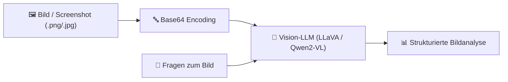

# Praxis-Guide: Multimodale KI-Vision Pipelines mit Ollama

Multimodale LLMs (z. B. **llava**, **qwen2-vl**) verarbeiten sowohl Text als auch Bilder. Sie ermöglichen die automatische Analyse von Diagrammen, Screenshots, Belegen und Infrastrukturskizzen.

---



---

## 🛠️ 1. Vision-Modell laden

```bash
ollama pull llava
# Alternativ: qwen2-vl
```

---

## 🐍 2. Python Skript (`vision_analysis.py`)

```python
import base64
import ollama

# 1. Bild in Base64 umwandeln
def encode_image(image_path):
    with open(image_path, "rb") as image_file:
        return base64.b64encode(image_file.read()).decode('utf-8')

# 2. Vision-Anfrage senden
def analyze_diagram(image_path: str, user_prompt: str):
    response = ollama.chat(
        model='llava',
        messages=[
            {
                'role': 'user',
                'content': user_prompt,
                'images': [image_path]
            }
        ]
    )
    return response['message']['content']

if __name__ == "__main__":
    image_file = "server_architecture.png"
    prompt = "Beschreibe die Serverarchitektur in diesem Diagramm und liste alle Komponenten auf."
    
    print(f"Analysiere Bild '{image_file}'...")
    analysis = analyze_diagram(image_file, prompt)
    print("\nAnalyse-Ergebnis:")
    print(analysis)
```

---

## 🔗 Verwandte Themen
* [Lokales RAG & LLM-Serving](lokales-rag-ollama.md) – RAG mit Ollama
* [Playwright & KI Web-Scraping](../automatisierung/playwright-ki-extraction.md) – Web-Analysen
* [PyAutoGUI OpenCV & OCR](../automatisierung/pyautogui-ocr-vision.md) – Bildschirmsuche
