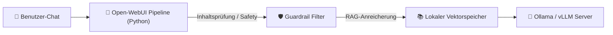

# Praxis-Guide: Open-WebUI Pipelines & Filter Extensions

**Open-WebUI Pipelines** ermöglichen das Erstellen lokaler Python-Plugins für Open-WebUI, um RAG-Verarbeitungen, Prompt-Transformationen, Inhaltsfilter und Multi-Modell-Routing vor der Antwortgenerierung einzuklinken.

---



---

## 🐍 1. Python Pipeline-Klasse schreiben (`custom_pipeline.py`)

```python
from typing import List, Union, Generator, Iterator

class Pipeline:
    def __init__(self):
        self.name = "Custom Safety & Translation Pipeline"

    async def on_startup(self):
        print("Pipeline gestartet!")

    def pipe(
        self, user_message: str, model_id: str, messages: List[dict], body: dict
    ) -> Union[str, Generator, Iterator]:
        
        # 1. Eingabe prüfen
        if "geheimnis" in user_message.lower():
            return "⚠️ Anfrage abgelehnt: Vertrauliche Begriffe erkannt."

        # 2. Modifizierter Prompt an Modell weiterleiten
        modified_prompt = f"Antworte höflich und präzise auf Deutsch: {user_message}"
        return modified_prompt
```

---

## 🔗 Verwandte Themen
* [Lokales RAG & LLM-Serving](lokales-rag-ollama.md) – RAG mit Ollama
* [vLLM High-Throughput Serving](vllm-high-throughput-serving.md) – LLM Engine
* [Lokale KI-Frontends](../../entwicklung/ide/lokale-ki-frontends.md) – Web UIs
