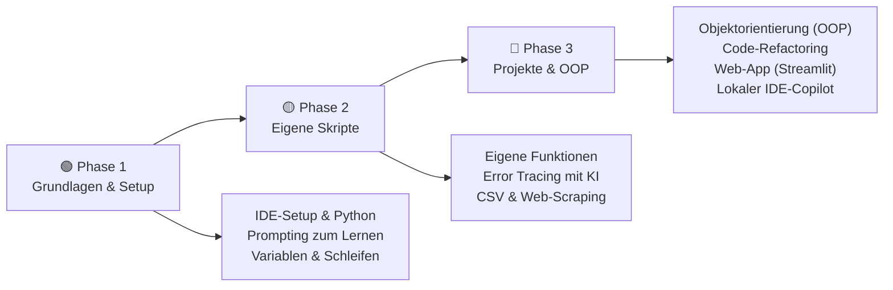
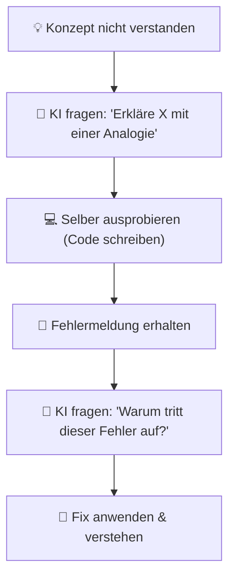
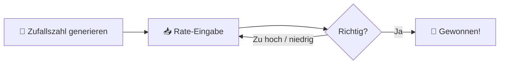
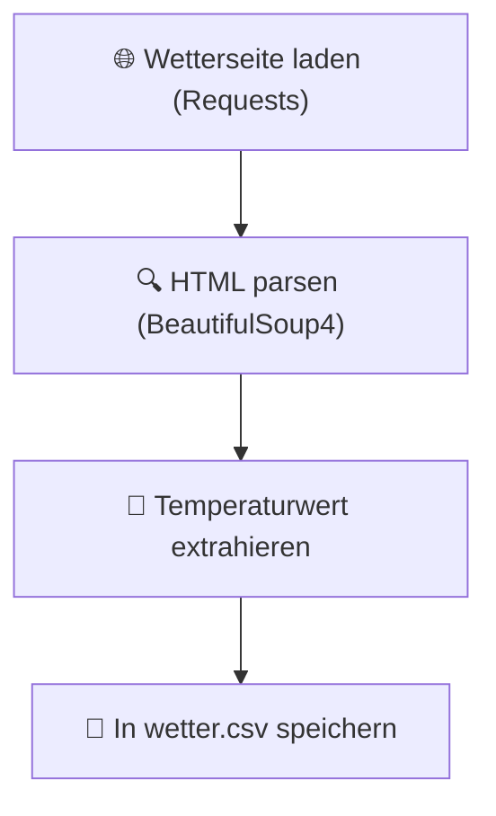
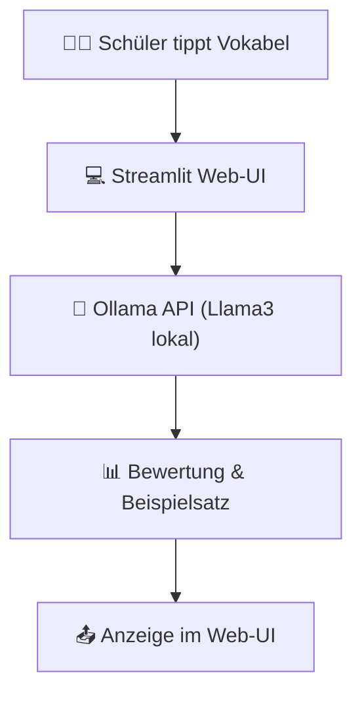

# Programmieren lernen mit KI

> **Hinweis zur Software-Auswahl:**  
> Diese Dokumentation priorisiert **Open-Source-Software**, die unter Ubuntu installiert und betrieben werden kann.  
> Bei kommerziellen Services wird stets eine **Open-Source-Alternative** mit gleichem Funktionsumfang gegenübergestellt.  
> **LLM-Modelle** und APIs werden unabhängig vom Preis gelistet, da sie als primäre Lernbegleiter dienen.

---

## Legende

| Symbol | Bedeutung |
|---|---|
| 🟩 | Open Source – kostenlos, lokal / Ubuntu-kompatibel |
| 💰 | Kostenpflichtig |
| 🤖 | LLM-Modell / API – bleibt immer gelistet |
| 🐧 | Linux / Ubuntu nativ |
| 🌐 | Nur Web-Browser |

---

## Lernpfad-Übersicht



---

## Inhaltsverzeichnis

- [🟢 Phase 1 – Die ersten Schritte & Grundlagen](#phase-1-die-ersten-schritte-grundlagen)
    - [1.1 Konzept: Wie hilft die KI beim Programmieren lernen?](#11-konzept-wie-hilft-die-ki-beim-programmieren-lernen)
    - [1.2 Thema: Entwicklungsumgebung & Python-Setup](#12-thema-entwicklungsumgebung-python-setup)
    - [1.3 Thema: Prompt-Strategien für Code-Anfänger](#13-thema-prompt-strategien-fur-code-anfanger)
    - [1.4 Thema: Variablen, Datentypen und Kontrollstrukturen](#14-thema-variablen-datentypen-und-kontrollstrukturen)
- [🟡 Phase 2 – Eigene Skripte, Funktionen & Debugging](#phase-2-eigene-skripte-funktionen-debugging)
    - [2.1 Konzept: Das DRY-Prinzip und Modularisierung](#21-konzept-das-dry-prinzip-und-modularisierung)
    - [2.2 Thema: Eigene Funktionen & Module schreiben](#22-thema-eigene-funktionen-module-schreiben)
    - [2.3 Thema: Fehler verstehen und beheben (Debugging)](#23-thema-fehler-verstehen-und-beheben-debugging)
    - [2.4 Thema: Dateiverarbeitung & einfaches Web-Scraping](#24-thema-dateiverarbeitung-einfaches-web-scraping)
- [🔴 Phase 3 – Fortgeschrittene Konzepte & Web-Apps](#phase-3-fortgeschrittene-konzepte-web-apps)
    - [3.1 Konzept: Was ist Objektorientierung (OOP)?](#31-konzept-was-ist-objektorientierung-oop)
    - [3.2 Thema: Code-Refactoring & Lesbarkeit](#32-thema-code-refactoring-lesbarkeit)
    - [3.3 Thema: Erste Web-Anwendungen bauen (Streamlit)](#33-thema-erste-web-anwendungen-bauen-streamlit)
    - [3.4 Thema: Lokale KI-Assistenten in der IDE (Continue.dev)](#34-thema-lokale-ki-assistenten-in-der-ide-continuedev)
- [📋 Praxisprojekte](#praxisprojekte)
- [📦 Vollständige Softwareübersicht & Vergleich](#vollstandige-softwareubersicht-vergleich)

---

## 🟢 Phase 1 – Die ersten Schritte & Grundlagen

> **Was lerne ich hier?**  
> Wie du KI gezielt als geduldigen Tutor nutzt, dein Programmier-Setup einrichtest und erste einfache Anweisungen in Python schreibst.  
> **Voraussetzungen:** Keine.

---

### 1.1 Konzept: Wie hilft die KI beim Programmieren lernen?

#### Der interaktive Lernkreislauf

Lass dir Code nicht einfach von der KI schreiben. Der Lerneffekt entsteht, wenn du den generierten Code hinterfragst und Schritt für Schritt verstehst:



- **Vorteil:** Ein persönlicher Lehrer, der 24/7 jede „dumme" Frage beantwortet.
- **Gefahr:** Blindes Copy-Paste blockiert den eigenen Lerneffekt. Code immer selbst eintippen!

---

### 1.2 Thema: Entwicklungsumgebung & Python-Setup

#### Konzept: Editor vs. Interpreter

- **Interpreter (Python):** Übersetzt deinen Python-Code in Maschinencode und führt ihn aus.
- **Editor / IDE:** Die Schreiboberfläche (z. B. Thonny oder VSCodium), die dir mit Syntax-Highlighting und Fehlererkennung hilft.

#### Software – Open Source zuerst:

| Software | Typ | Funktion | Ubuntu | Link |
|---|---|---|---|---|
| 🟩 [Python 3](https://www.python.org) | Interpreter | Standard-Sprachlaufzeitumgebung | 🐧 Ja | python.org |
| 🟩 [Thonny](https://thonny.org) | IDE | Anfängerfreundliche IDE mit visuellem Variablen-Debugger | 🐧 Ja | thonny.org |
| 🟩 [VSCodium](https://vscodium.com) | IDE | Open-Source-Alternative zu VS Code | 🐧 Ja | vscodium.com |

---

### 1.3 Thema: Prompt-Strategien für Code-Anfänger

#### Konzept: Der "Tutor-Prompt"

Zwinge die KI, dich anzuleiten, statt dir die Lösung direkt zu schenken:

```
Prompt: "Ich lerne gerade Python. Ich möchte eine Aufgabe zum Thema Schleifen lösen.
         Gib mir eine einfache Übungsaufgabe.
         Schreibe keinen Python-Code. Bewerte meine Lösung, sobald ich sie poste."
```

#### Software – Open Source / LLM:

| Software | Typ | Funktion | Ubuntu | Link |
|---|---|---|---|---|
| 🤖 [ChatGPT](https://chat.openai.com) | LLM Cloud | Schneller Einstieg, guter Allround-Erklärer | 🌐 Web | openai.com |
| 🤖 [Claude](https://claude.ai) | LLM Cloud | Sehr strukturiert und präzise bei Code-Erklärungen | 🌐 Web | claude.ai |
| 🟩 🤖 [Ollama](https://ollama.com) | LLM lokal | Komplett private Offline-Codeunterstützung (Llama3/Qwen) | 🐧 Ja | ollama.com |

---

### 1.4 Thema: Variablen, Datentypen und Kontrollstrukturen

#### Konzept: Variablen als Speicherboxen

Eine Variable speichert einen Wert. Der Datentyp legt fest, was man damit tun kann:

```python
name = "Schrödinger"  # String (Text)
alter = 42             # Integer (Ganzzahl)
preis = 19.99          # Float (Kommazahl)
ist_aktiv = True       # Boolean (Wahrheitswert)
```

#### Konzept: Logische Verzweigungen (If/Else)

```python
if alter >= 18:
    print("Volljährig")
else:
    print("Minderjährig")
```

---

## 🟡 Phase 2 – Eigene Skripte, Funktionen & Debugging

> **Was lerne ich hier?**  
> Wie du Code in Funktionen strukturierst, Fehlermeldungen analysierst und Daten aus CSV-Dateien und Webseiten verarbeitest.  
> **Voraussetzungen:** Phase 1 abgeschlossen.

---

### 2.1 Konzept: Das DRY-Prinzip und Modularisierung

#### DRY: Don't Repeat Yourself

Schreibe keinen Code doppelt. Wenn du ein Code-Stück mehr als einmal verwendest, packe es in eine **Funktion** oder ein separates **Modul**.

```python
# ❌ Schlecht: Code-Duplizierung
print("Hallo Alex!")
print("Hallo Ben!")

# ✅ Gut: Wiederverwendbare Funktion
def begrueße(name):
    print(f"Hallo {name}!")

begrueße("Alex")
begrueße("Ben")
```

---

### 2.2 Thema: Eigene Funktionen & Module schreiben

#### Konzept: Parameter und Rückgabewerte

Eine Funktion nimmt Eingaben (Parameter) entgegen, verarbeitet sie und gibt ein Ergebnis zurück (`return`).

```python
def berechne_quadrat(zahl):
    return zahl * zahl

ergebnis = berechne_quadrat(5)  # ergebnis ist 25
```

---

### 2.3 Thema: Fehler verstehen und beheben (Debugging)

#### Konzept: Den Traceback lesen

Ein Traceback zeigt dir exakt, **in welcher Zeile** welcher **Fehlertyp** aufgetreten ist.

```text
Traceback (most recent call last):
  File "script.py", line 4, in <module>
    ergebnis = 10 / 0
ZeroDivisionError: division by zero
```

**Der Debugging-Prompt:**
```
Prompt: "Warum tritt dieser Fehler in meinem Python-Code auf?
         Traceback: [Fehlermeldung kopieren]
         Mein Code: [Code kopieren]"
```

#### Software – Open Source zuerst:

| Software | Typ | Funktion | Ubuntu | Link |
|---|---|---|---|---|
| 🟩 [Thonny Debugger](https://thonny.org) | Tool | Klicke Schritt-für-Schritt durch den Code, um Variablen zu prüfen | 🐧 Ja | thonny.org |
| 🟩 [pydocstyle](https://github.com/PyCQA/pydocstyle) | Linter | Prüft Code-Dokumentation | 🐧 Ja | github.com/PyCQA |

---

### 2.4 Thema: Dateiverarbeitung & einfaches Web-Scraping

#### Konzept: CSV einlesen und strukturieren

CSV (Comma Separated Values) ist das Standardformat für tabellarische Daten.

```python
import csv

with open("daten.csv", mode="r") as file:
    reader = csv.reader(file)
    for zeile in reader:
        print(zeile)
```

#### Software – alle Open Source:

| Software | Typ | Funktion | Ubuntu | Link |
|---|---|---|---|---|
| 🟩 [BeautifulSoup4](https://www.crummy.com/software/BeautifulSoup/) | Python-Lib | Parsen von HTML-Seiten für Web-Scraping | 🐧 Ja | crummy.com |
| 🟩 [Requests](https://requests.readthedocs.io) | Python-Lib | HTTP-Anfragen senden (Webseiten laden) | 🐧 Ja | requests.readthedocs.io |

---

## 🔴 Phase 3 – Fortgeschrittene Konzepte & Web-Apps

> **Was lerne ich hier?**  
> Wie du Klassen und Objekte erstellst, Code professionell aufräumst und deine erste interaktive Web-App mit Streamlit veröffentlichst.  
> **Voraussetzungen:** Phase 1 & 2 abgeschlossen.

---

### 3.1 Konzept: Was ist Objektorientierung (OOP)?

#### Baupläne und Objekte

- **Klasse:** Der Bauplan (z. B. Bauplan für ein „Auto").
- **Objekt / Instanz:** Das konkrete Auto, das nach diesem Bauplan gebaut wurde (z. B. „Roter VW Golf").

```python
class Auto:
    def __init__(self, marke, farbe):
        self.marke = marke
        self.farbe = farbe

mein_auto = Auto("VW", "rot")
```

---

### 3.2 Thema: Code-Refactoring & Lesbarkeit

#### Konzept: Clean Code und PEP 8

PEP 8 ist der offizielle Style-Guide für Python-Code. Die KI kann deinen funktionierenden, aber unordentlichen Code in sauberen Code refaktorieren.

```
Refactoring-Prompt:
"Strukturiere diesen funktionierenden Code nach PEP 8 um.
 Verbessere die Lesbarkeit und füge sinnvolle Kommentare hinzu."
```

#### Software – alle Open Source:

| Software | Typ | Funktion | Ubuntu | Link |
|---|---|---|---|---|
| 🟩 [Ruff](https://github.com/astral-sh/ruff) | Linter / Formatter | Extrem schneller Linter zur Einhaltung von PEP 8 | 🐧 Ja | github.com/astral-sh |
| 🟩 [Black](https://github.com/psf/black) | Formatter | Automatische, kompromisslose Code-Formatierung | 🐧 Ja | github.com/psf/black |

---

### 3.3 Thema: Erste Web-Anwendungen bauen (Streamlit)

#### Konzept: Web-Oberflächen ohne HTML/CSS

Mit **Streamlit** baust du interaktive Webanwendungen direkt in Python – perfekt für kleine KI-Tools, Daten-Visualisierungen oder Taschenrechner.

```python
import streamlit as st

st.title("Interaktiver Rechner")
zahl = st.slider("Wähle eine Zahl:", 1, 100)
st.write(f"Das Quadrat der Zahl ist: {zahl * zahl}")
```

#### Software – alle Open Source:

| Software | Typ | Funktion | Ubuntu | Link |
|---|---|---|---|---|
| 🟩 [Streamlit](https://streamlit.io) | Web-Framework | Erstellung interaktiver Web-UIs in reinem Python | 🐧 Ja | streamlit.io |

---

### 3.4 Thema: Lokale KI-Assistenten in der IDE (Continue.dev)

#### Konzept: Copilot im eigenen Editor

Ein lokales KI-Plugin hilft dir direkt beim Schreiben von Code im Editor – ohne dass du Text in den Browser kopieren musst.

#### Software – Open Source zuerst:

| Software | Typ | Funktion | Ubuntu | Link |
|---|---|---|---|---|
| 🟩 [Continue.dev](https://continue.dev) | IDE-Plugin | Verbindet VSCodium mit lokalen LLMs über Ollama | 🐧 Ja | continue.dev |

#### Vergleich: Open Source vs. Kommerziell

| KI-Tool | Open Source 🟩 (Ubuntu / Lokal) | Kommerziell 💰 |
|---|---|---|
| Editor-Copilot | Continue.dev + Ollama | GitHub Copilot, Tabnine |

---

## 📋 Praxisprojekte

### 🟢 Einsteiger: Das interaktive Zahlenratespiel

Die KI gibt dir den Rahmen vor, du programmierst das Spiel: Die KI wählt eine Zufallszahl (1–100), und der Spieler muss sie mit Hinweisen („zu hoch", „zu niedrig") erraten.



**Software (alle Open Source):** Thonny · Python

---

### 🟡 Fortgeschritten: Automatischer Wetter-Scraper

Wir laden die aktuelle Temperatur einer Wetter-Webseite herunter und speichern die Daten strukturiert in einer CSV-Datei.



**Software (alle Open Source):** Python · Requests · BeautifulSoup4 · Thonny

---

### 🔴 Experte: KI-Assistent als Web-App

Wir bauen eine interaktive Streamlit-Oberfläche unter Ubuntu, die mit unserer lokalen Ollama-API spricht, um einen personalisierten Vokabel-Trainer zu erstellen.



**Software (alle Open Source):** Python · Streamlit · Ollama · VSCodium

---

## 📦 Vollständige Softwareübersicht & Vergleich

### Programmiersprachen & IDEs

| Funktion | Open Source 🟩 (Ubuntu) | Kommerziell 💰 |
|---|---|---|
| Lern-IDE | Thonny 🐧 | — |
| Professionelle IDE | VSCodium 🐧 | PyCharm, VS Code |
| Python-Laufzeit | Python 3 🐧 | — |

### Code-Assistenten & Generatoren

| Funktion | Open Source 🟩 (Ubuntu / Lokal) | Kommerziell 💰 |
|---|---|---|
| IDE-Assistent | Continue.dev + Ollama 🐧 | GitHub Copilot, Tabnine |
| Chat-Tutor | Ollama 🐧 | ChatGPT Plus, Claude Pro |

### Bibliotheken & Frameworks

| Funktion | Open Source 🟩 (Ubuntu) | Kommerziell 💰 |
|---|---|---|
| Web-Framework | Streamlit 🐧, Flask 🐧 | — |
| Web-Scraping | BeautifulSoup4 🐧, Requests 🐧 | Scraper-APIs |
| Code-Formatierung | Ruff 🐧, Black 🐧 | — |

---

## Weiterführende Ressourcen

- **[Python Doku](https://docs.python.org/3/)** – Offizielle Python-Referenz 🟩
- **[Thonny Guide](https://thonny.org)** – Einstieg in die Thonny IDE 🟩
- **[Streamlit Docs](https://docs.streamlit.io)** – Web-Apps in Python erstellen 🟩
- **[BeautifulSoup Tutorials](https://www.crummy.com/software/BeautifulSoup/bs4/doc/)** – Web-Scraping lernen 🟩
- **[Continue.dev Setup](https://docs.continue.dev)** – IDE-Copilot konfigurieren 🟩

---

*Letzte Aktualisierung: Juli 2026*
