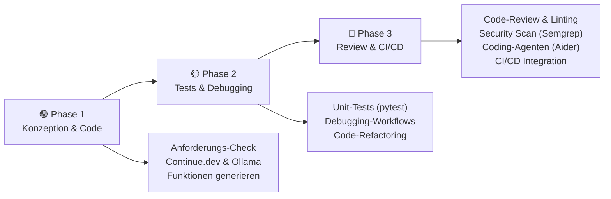
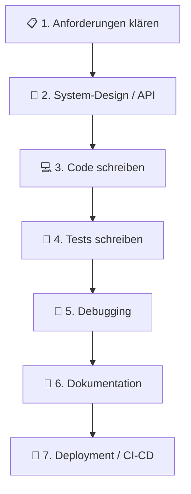
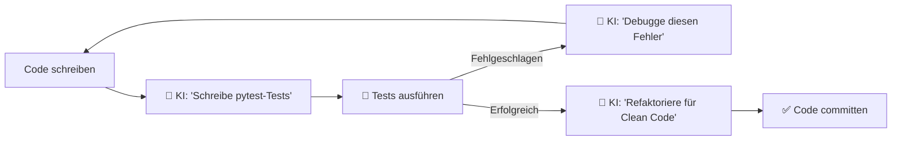
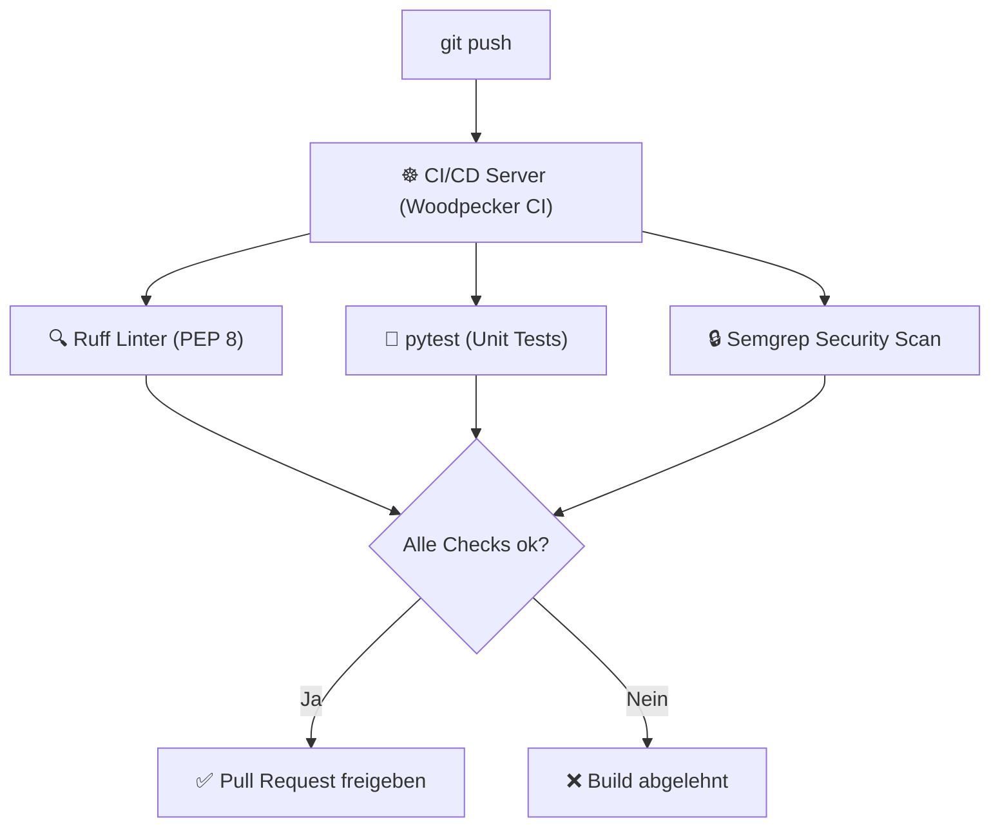
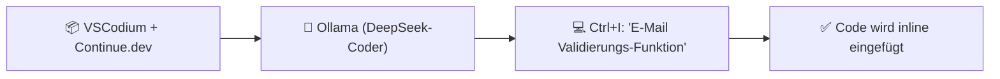
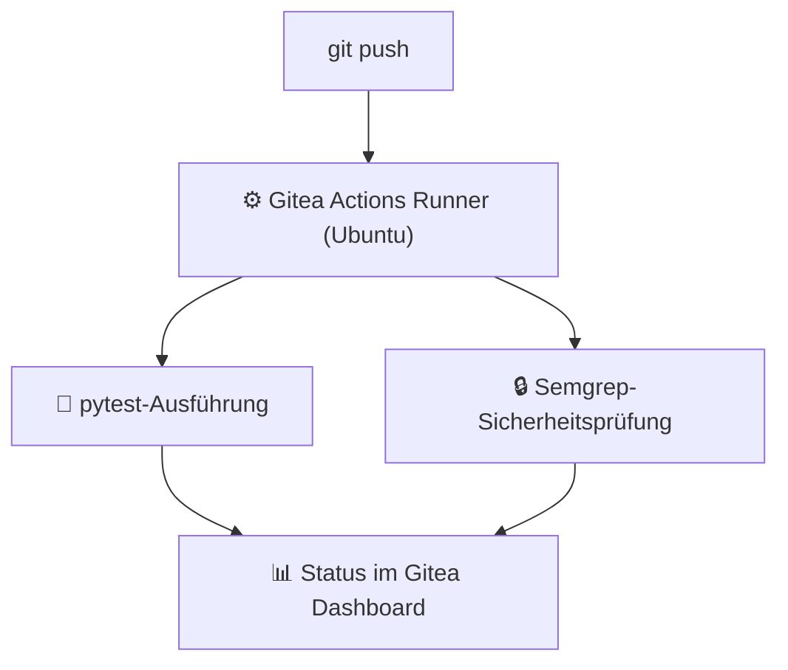

# Programmieren mit KI

> **Hinweis zur Software-Auswahl:**  
> Diese Dokumentation priorisiert **Open-Source-Software**, die lokal unter Ubuntu installiert und betrieben werden kann.  
> Bei proprietären Services wird stets eine **Open-Source-Alternative** mit gleichem Funktionsumfang gegenübergestellt.  
> **LLM-Modelle** und APIs werden unabhängig vom Preis gelistet, da sie die Grundlage für Code-Intelligenz darstellen.

---

## Legende

| Symbol | Bedeutung |
|---|---|
| 🟩 | Open Source – kostenlos, lokal / Ubuntu-kompatibel |
| 💰 | Kostenpflichtig |
| 🤖 | LLM-Modell / API – bleibt immer gelistet |
| 🐧 | Linux / Ubuntu nativ |
| 🌐 | Nur Web-Browser |

---

## Lernpfad-Übersicht



---

## Inhaltsverzeichnis

- [🟢 Phase 1 – Konzeption & Code-Generierung](#phase-1-konzeption-code-generierung)
    - [1.1 Konzept: KI-Unterstützung über den gesamten Software-Lebenszyklus](#11-konzept-ki-unterstutzung-uber-den-gesamten-software-lebenszyklus)
    - [1.2 Thema: Konzeption & API-Design mit KI](#12-thema-konzeption-api-design-mit-ki)
    - [1.3 Thema: Code-Completion vs. Chat-basierte Code-Generierung](#13-thema-code-completion-vs-chat-basierte-code-generierung)
    - [1.4 Thema: Lokale Integration in VSCodium (Continue.dev)](#14-thema-lokale-integration-in-vscodium-continuedev)
- [🟡 Phase 2 – Testing, Debugging & Refactoring](#phase-2-testing-debugging-refactoring)
    - [2.1 Konzept: Der iterative Entwicklungs- und Testzyklus](#21-konzept-der-iterative-entwicklungs-und-testzyklus)
    - [2.2 Thema: Automatisches Generieren von Unit-Tests](#22-thema-automatisches-generieren-von-unit-tests)
    - [2.3 Thema: Systematisches Debugging mit Stack Traces](#23-thema-systematisches-debugging-mit-stack-traces)
    - [2.4 Thema: Code-Refactoring & Verbesserung der Lesbarkeit](#24-thema-code-refactoring-verbesserung-der-lesbarkeit)
- [🔴 Phase 3 – Code-Review, Security & Automation](#phase-3-code-review-security-automation)
    - [3.1 Konzept: Qualitätssicherung in der Team-Pipeline](#31-konzept-qualitatssicherung-in-der-team-pipeline)
    - [3.2 Thema: Automatisches Code-Review vor dem Merge](#32-thema-automatisches-code-review-vor-dem-merge)
    - [3.3 Thema: Sicherheitsprüfung (Security Auditing) mit KI](#33-thema-sicherheitsprufung-security-auditing-mit-ki)
    - [3.4 Thema: Autonome Coding-Agenten im Terminal (Aider)](#34-thema-autonome-coding-agenten-im-terminal-aider)
- [📋 Praxisprojekte](#praxisprojekte)
- [📦 Vollständige Softwareübersicht & Vergleich](#vollstandige-softwareubersicht-vergleich)

---

## 🟢 Phase 1 – Konzeption & Code-Generierung

> **Was lerne ich hier?**  
> Wie du Anforderungen präzise an KIs übergibst, den Unterschied zwischen automatischer Vervollständigung und Chat-Generierung verstehst und deine lokale IDE aufrüstest.  
> **Voraussetzungen:** Grundlegende Programmierkenntnisse.

---

### 1.1 Konzept: KI-Unterstützung über den gesamten Software-Lebenszyklus

#### Die Phasen der Codeerstellung

KI-Unterstützung beschränkt sich nicht nur auf das Schreiben von Codezeilen. Sie erstreckt sich über alle Entwicklungsphasen:



---

### 1.2 Thema: Konzeption & API-Design mit KI

#### Konzept: Spezifikationen und JSON-Schemata generieren

Bevor eine Zeile Code geschrieben wird, hilft die KI, die Datenstruktur festzulegen. Ein OpenAPI-Dokument oder eine JSON-Spezifikation lässt sich präzise über einen System-Prompt entwerfen.

---

### 1.3 Thema: Code-Completion vs. Chat-basierte Code-Generierung

#### Zwei unterschiedliche Interaktionsmuster

- **Code-Completion (Inline):** Arbeitet unauffällig im Hintergrund. Schlägt das nächste Wort oder die nächste Zeile vor, während du tippst (FIM-Prinzip: Fill-in-the-Middle).
- **Chat-basierte Generierung:** Du stellst eine explizite Frage in einer Seitenleiste und bekommst einen vollständigen Codeblock inklusive Erklärung zurück.

---

### 1.4 Thema: Lokale Integration in VSCodium (Continue.dev)

#### Konzept: Datenschutzkonformer IDE-Copilot

Über das Open-Source-Plugin **Continue.dev** verbindest du deine IDE mit einem lokalen **Ollama**-Server auf deinem Ubuntu-Rechner. Dein Quellcode verlässt somit niemals deine eigene Hardware.

#### Software – Open Source zuerst:

| Software | Typ | Funktion | Ubuntu | Link |
|---|---|---|---|---|
| 🟩 [VSCodium](https://vscodium.com) | IDE | Der quelloffene Code-Editor ohne Telemetrie | 🐧 Ja | vscodium.com |
| 🟩 [Continue.dev](https://continue.dev) | IDE-Plugin | Verbindet VSCodium mit lokalen oder Cloud-LLMs | 🐧 Ja | continue.dev |
| 🟩 🤖 [Ollama](https://ollama.com) | LLM Server | Lokaler Modell-Server (Modelle: DeepSeek-Coder, Qwen) | 🐧 Ja | ollama.com |

#### Vergleich: Open Source vs. Kommerziell

| Funktion | Open Source 🟩 (Ubuntu / Lokal) | Kommerziell 💰 |
|---|---|---|
| Code-Assistent | VSCodium + Continue.dev + Ollama | VS Code + GitHub Copilot, Cursor |

---

## 🟡 Phase 2 – Testing, Debugging & Refactoring

> **Was lerne ich hier?**  
> Wie du automatische Tests schreibst, Fehler systematisch behebst und deinen Code so aufräumst, dass er wartbar bleibt.  
> **Voraussetzungen:** Phase 1 abgeschlossen.

---

### 2.1 Konzept: Der iterative Entwicklungs- und Testzyklus

#### Roter und grüner Code



---

### 2.2 Thema: Automatisches Generieren von Unit-Tests

#### Konzept: Testabdeckung und Edge-Cases

KI ist hervorragend darin, stupide Schreibarbeit zu übernehmen. Sie generiert Unit-Tests für deine Funktionen und findet dabei oft Randfälle (z. B. leere Listen, negative Zahlen, ungültige Zeichen), an die du selbst nicht gedacht hast.

#### Software – alle Open Source:

| Software | Typ | Funktion | Ubuntu | Link |
|---|---|---|---|---|
| 🟩 [pytest](https://pytest.org) | Test-Framework | Der Standard für Python-Testing | 🐧 Ja | pytest.org |
| 🟩 [Vitest](https://vitest.dev) | Test-Framework | Ultraschnelles Test-Framework für JavaScript/TypeScript | 🐧 Ja | vitest.dev |

---

### 2.3 Thema: Systematisches Debugging mit Stack Traces

#### Der strukturierte Debug-Prompt

Anstatt Fehlermeldungen manuell zu suchen, kopierst du den kompletten Traceback in den Chat:

```
Prompt: "Erkläre diese Fehlermeldung verständlich und schlage einen Bugfix vor.
         Traceback: [Fehler-Text]
         Code: [Code-Ausschnitt]"
```

---

### 2.4 Thema: Code-Refactoring & Verbesserung der Lesbarkeit

#### Refactoring-Paradigmen

- **DRY (Don't Repeat Yourself):** Redundanzen entfernen.
- **KISS (Keep It Simple, Stupid):** Code-Komplexität minimieren (keine tief verschachtelten If-Bedingungen).
- **PEP 8 / Clean Code:** Einhaltung des offiziellen Python-Design-Guides.

#### Software – alle Open Source:

| Software | Typ | Funktion | Ubuntu | Link |
|---|---|---|---|---|
| 🟩 [Ruff](https://github.com/astral-sh/ruff) | Linter / Formatter | Extrem schneller Linter zur Einhaltung von Programmierstandards | 🐧 Ja | github.com/astral-sh |
| 🟩 [Black](https://github.com/psf/black) | Formatter | Formatierung des Python-Codes nach PEP 8 | 🐧 Ja | github.com/psf/black |

---

## 🔴 Phase 3 – Code-Review, Security & Automation

> **Was lerne ich hier?**  
> Wie du automatische Sicherheitsprüfungen in deine Pipeline einbaust, Code-Reviewprozesse automatisierst und autonome Coding-Agenten nutzt.  
> **Voraussetzungen:** Phase 1 & 2 abgeschlossen. Git-Grundkenntnisse.

---

### 3.1 Konzept: Qualitätssicherung in der Team-Pipeline



---

### 3.2 Thema: Automatisches Code-Review vor dem Merge

#### Konzept: Automatisches Feedback für Entwickler

Über Open-Source-Tools (wie `reviewdog`) analysiert die KI die Differenz (git diff) einer Änderung und postet Verbesserungsvorschläge direkt als Review-Kommentar in den Pull Request.

#### Software – alle Open Source:

| Software | Typ | Funktion | Ubuntu | Link |
|---|---|---|---|---|
| 🟩 [reviewdog](https://github.com/reviewdog/reviewdog) | Code-Review | Postet automatisch Linter-Ergebnisse in Pull Requests | 🐧 Ja | github.com/reviewdog |

---

### 3.3 Thema: Sicherheitsprüfung (Security Auditing) mit KI

#### Konzept: Statische Code-Analyse (SAST)

Sicherheits-Scanner suchen nach unsicheren Code-Mustern (z. B. hardcodierte API-Keys, SQL-Injections, unsichere Kryptografie), bevor der Code deployed wird.

#### Software – alle Open Source:

| Software | Typ | Funktion | Ubuntu | Link |
|---|---|---|---|---|
| 🟩 [Semgrep](https://semgrep.dev) | SAST | Findet Programmierfehler und Sicherheitslücken im Code | 🐧 Ja | semgrep.dev |
| 🟩 [Trivy](https://github.com/aquasecurity/trivy) | Scanner | Scant Programm-Bibliotheken auf bekannte Schwachstellen | 🐧 Ja | github.com/aquasecurity |

---

### 3.4 Thema: Autonome Coding-Agenten im Terminal (Aider)

#### Konzept: Git-integriertes autonomes Coding

Ein Terminal-Agent (wie **Aider**) liest deine Aufgabe, sucht selbstständig die passenden Dateien im Repository, ändert den Code, führt Tests aus und erstellt bei Erfolg direkt einen Git-Commit mit passender Commit-Message.

```bash
# Aider lokal mit Ollama starten
aider --model ollama/deepseek-coder-v2
```

#### Software – alle Open Source:

| Software | Typ | Funktion | Ubuntu | Link |
|---|---|---|---|---|
| 🟩 [Aider](https://aider.chat) | KI-Agent | Autonomer Coding-Agent auf Terminalebene | 🐧 Ja | aider.chat |

---

## 📋 Praxisprojekte

### 🟢 Einsteiger: Erste Schritte mit VSCodium und Continue.dev

Wir richten die lokale IDE ein, laden ein kleines Python-Modell über Ollama und generieren eine Funktion zur Validierung von E-Mail-Adressen.



**Software (alle Open Source):** VSCodium · Continue.dev · Ollama

---

### 🟡 Fortgeschritten: Testgetriebene Entwicklung (TDD) eines API-Clients

Wir lassen uns von der KI Tests für eine Wetter-API generieren und schreiben anschließend die API-Implementierung, bis alle Tests erfolgreich durchlaufen.

**Software (alle Open Source):** Python · pytest · VSCodium · Continue.dev

---

### 🔴 Experte: Vollautomatisierte Code-Prüfung in Gitea

Wir bauen eine Gitea-Actions-Pipeline, die bei jedem Push automatisch Tests läuft, den Code mit Semgrep auf Sicherheitslücken prüft und eine Rückmeldung per Linter an den PR sendet.



**Software (alle Open Source):** Gitea · Gitea Actions · Semgrep · pytest · Docker

---

## 📦 Vollständige Softwareübersicht & Vergleich

### Code-Generierung & IDEs

| Funktion | Open Source 🟩 (Ubuntu / Lokal) | Kommerziell 💰 |
|---|---|---|
| Editor & Code-Assistent | VSCodium 🐧 + Continue.dev 🐧 | VS Code + GitHub Copilot, Cursor |
| Terminal-Coding-Agent | Aider 🐧 | Devin, Cursor Composer |

### Testing & Code-Qualität

| Funktion | Open Source 🟩 (Ubuntu) | Kommerziell 💰 |
|---|---|---|
| Test-Framework (Python) | pytest 🐧 | — |
| Test-Framework (JS/TS) | Vitest 🐧 | — |
| Code-Formatierung | Ruff 🐧, Black 🐧 | — |

### Code-Review & Security-Scanning

| Funktion | Open Source 🟩 (Ubuntu) | Kommerziell 💰 |
|---|---|---|
| Static Security Analysis | Semgrep 🐧, Trivy 🐧 | Snyk Pro |
| Review-Automation | reviewdog 🐧 | — |

---

## Weiterführende Ressourcen

- **[Continue.dev Anleitung](https://docs.continue.dev)** – Konfigurationsmöglichkeiten 🟩
- **[Aider documentation](https://aider.chat/docs/)** – Terminal-Befehle & CLI-Agenten-Tipps 🟩
- **[Semgrep Registry](https://semgrep.dev/r)** – Vordefinierte Sicherheitsregeln für deinen Code 🟩
- **[Pytest documentation](https://docs.pytest.org)** – Professionell Testen mit Python 🟩
- **[Ollamas Modell-Bibliothek](https://ollama.com/library)** – Code-Modelle für lokale GPUs 🟩

---

*Letzte Aktualisierung: Juli 2026*
