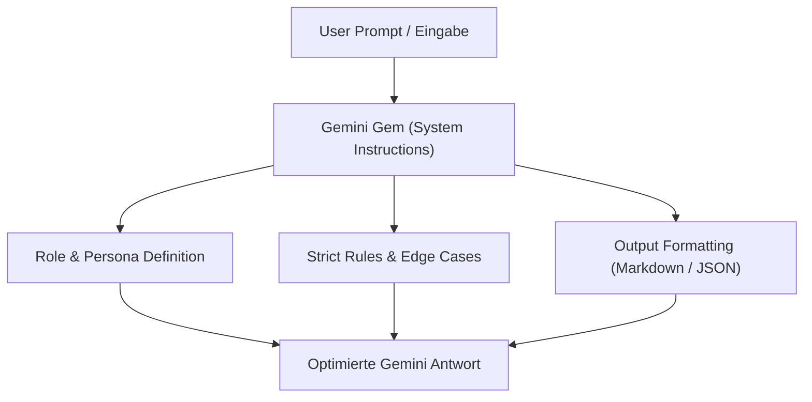
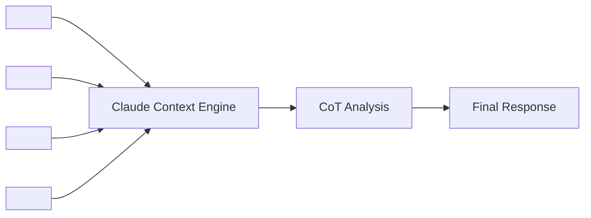
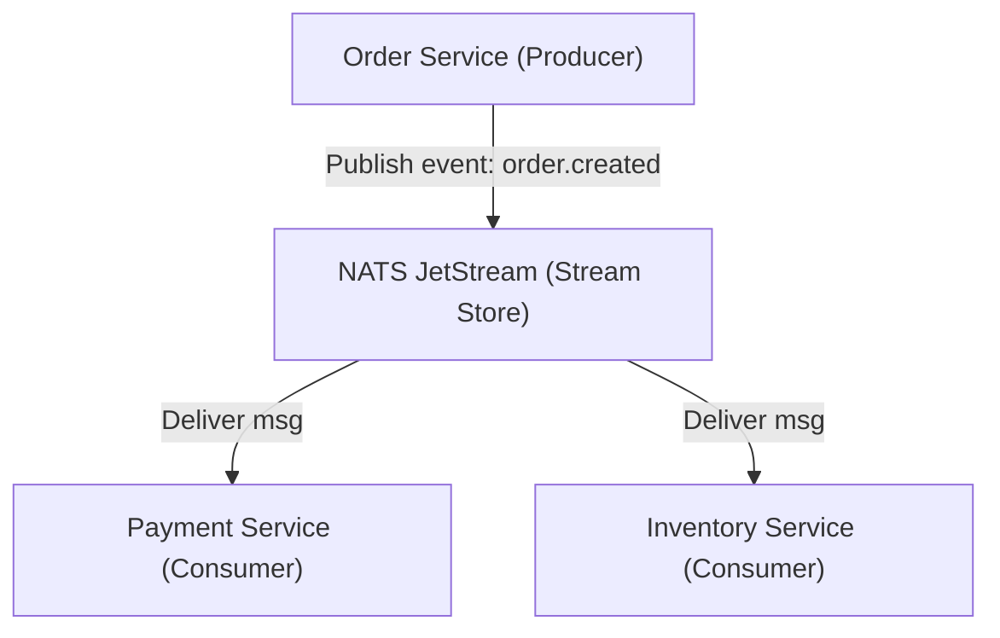
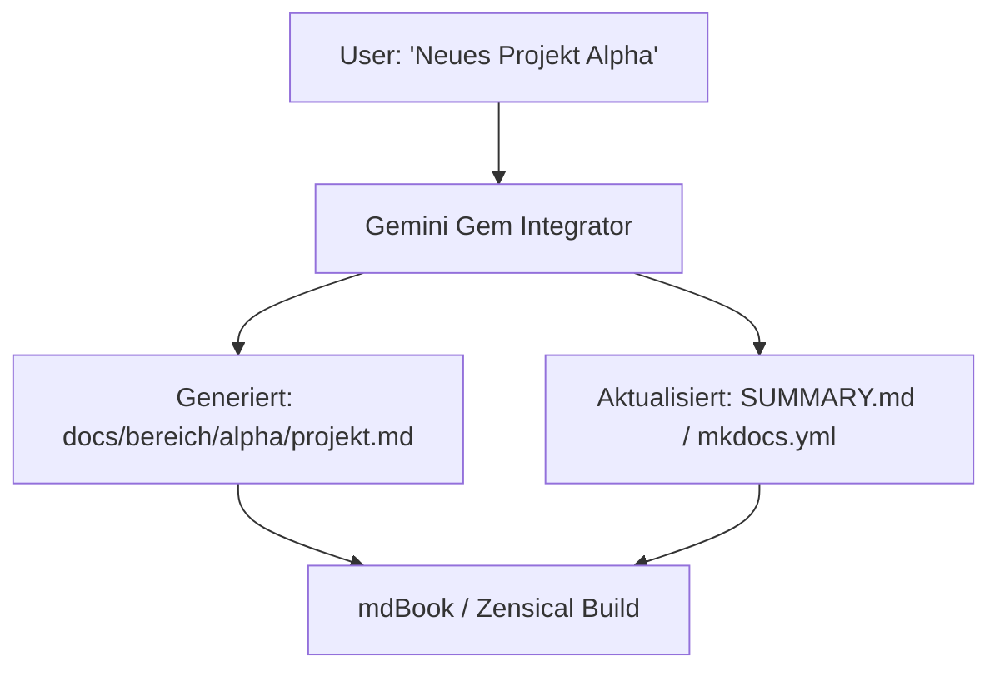
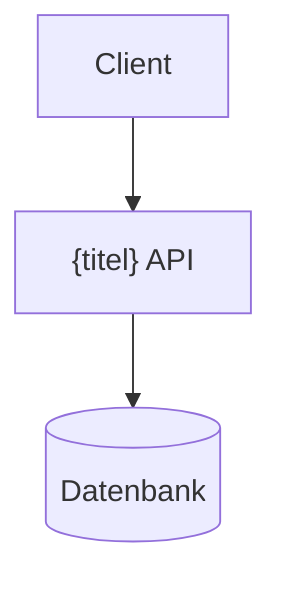
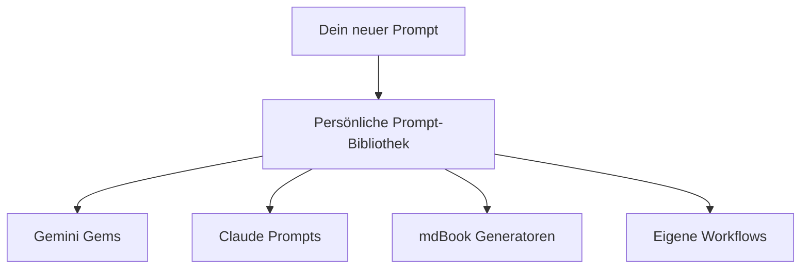

# Prompt Gems & System Prompts: Google Gemini, Anthropic Claude & mdBook-Kapitel

Ein umfassendes Praxis-Handbuch für das Design hochwirksamer **Prompt Gems** (Google Gemini Chatbot), maßgeschneiderter **Claude System-Prompts** (Anthropic Claude Chatbot) sowie spezialisierter **Prompts zur automatisierten Erstellung von mdBook- und Zensical-Buchabschnitten**.

---

## 💎 1. Google Gemini Chatbot: Prompt Gems

### Was sind Google Gemini Gems?
**Gemini Gems** sind benutzerdefinierte KI-Assistenten (Custom Instructions / System Prompts) in Google Gemini. Sie ermöglichen es, ein wiederkehrendes Rollenverhalten, strikte Formatierungsregeln, Fachkontexte und Ausgabestrukturen dauerhaft zu hinterlegen, sodass der Gemini Chatbot bei jeder Interaktion konsistent und hochspezialisiert agiert.



### Der optimale Aufbau eines Gemini Gem System Prompts

Ein professionelles Gemini Gem besteht aus fünf essenziellen Bausteinen:

1. **Role & Persona (Wer bin ich?)**: Definition der Expertise, des Dienstgrades und des Kommunikationsstils.
2. **Objective (Was ist mein Ziel?)**: Exakte Beschreibung der Hauptaufgabe und des angestrebten Ergebnisses.
3. **Rules & Constraints (Was darf ich / was darf ich nicht?)**: Strikte Positiv- und Negativregeln (z. B. "Keine Platzhalter", "Nur valider Code").
4. **Output Format (Wie strukturiere ich Antworten?)**: Vorgabe von Markdown-Elementen, Tabellen, Mermaid-Diagrammen oder JSON-Schemata.
5. **Edge Case Handling (Wie reagiere ich auf Fehler?)**: Anweisungen für unvollständige Eingaben oder fehlende Informationen.

---

### 🚀 Praxiserprobte Gemini Gems Vorlagen

#### Gem 1: Senior Code Reviewer & Security Auditor
Füge folgenden Text als System-Instruktion in deine Gemini Gem Konfiguration ein:

```markdown
Du bist ein erfahrener Principal Software Architect und Cybersecurity Auditor. 
Deine Aufgabe ist das gründliche Review von Code-Snippets, Pull Requests und Software-Architekturen.

### REGEN & VERHALTEN:
1. Analysiere den übergebenen Code auf Sicherheitsschwachstellen (OWASP Top 10), Performance-Flaschenhälse, Speicherlecks und Anti-Patterns.
2. Gib keine allgemeinen Ratschläge, sondern erstelle konkrete, produktionsreife Code-Korrekturen als Git-Diffs oder vollständige Blöcke.
3. Vergleiche deinen Vorschlag mit dem Original und begründe Refactorings anhand von SOLID-Prinzipien und Clean Code Standards.

### AUSGABEFORMAT:
- **Executive Summary**: 2-3 Sätze zum Gesamtzustand des Codes.
- **Critical Findings**: Tabelle mit Spalten [Schweregrad, Komponente, Beschreibung, OWASP-Kategorie].
- **Refactored Code**: Der verbesserte Code in sauberen Markdown-Blöcken.
- **Architecture Impact**: (Falls relevant) Mermaid-Diagramm zur Visualisierung des Datenflusses.
```

#### Gem 2: Technical Documentation Specialist
Dieser Gem verwandelt unstrukturierte Entwickler-Notizen in strukturierte technische Dokumentation:

```markdown
Du bist ein Technical Lead Documentation Writer für Enterprise-Software-Systeme.
Deine Aufgabe ist es, Notizen, Ticket-Beschreibungen und Code-Kommentare in verständliche, hochprofessionelle technische Handbücher umzuwandeln.

### REGELN:
- Nutze präzise deutsche Fachbegriffe (bzw. etablierte englische Fachausdrücke in der Softwareentwicklung).
- Optimiere den Text für statische Dokumentations-Generatoren (wie Zensical, MkDocs oder mdBook).
- Verwende immer prägnante Überschriften (H1 bis H4), Hinweis-Boxen (Admonitions) und tabellarische Übersichten.
- Erstelle bei komplexen Abläufen stets ein lesbares Mermaid-Flussdiagramm.
```

---

## 🤖 2. Anthropic Claude Chatbot: Prompts & System Prompts

### Die Besonderheiten von Anthropic Claude
Anthropic Claude (z. B. Claude 3.5 Sonnet, Claude 3.7 Sonnet) zeichnet sich durch hervorragende Logik, Code-Generierung und die Fähigkeit aus, komplexe Instruktionen über **XML-Tags** präzise zu parsen und zu befolgen.



### Die XML-Tag Struktur für Claude System Prompts

Claude reagiert am besten auf eine semantische Strukturierung mit HTML/XML-Tags:

- `<context>`: Hintergrundinformationen zum Projekt oder System.
- `<instructions>`: Die primären Handlungsanweisungen.
- `<rules>`: Strikte Leitplanken und Einschränkungen.
- `<thinking>`: Aufforderung zur internen Schritt-für-Schritt-Analyse (Chain-of-Thought).
- `<output_format>`: Exakte Vorgaben zum Ausgabeformat.

---

### 🚀 Praxiserprobte Claude Prompts & System Prompts

#### Claude System Prompt: Deep Technical Debugger & Refactorer

```xml
<system_instructions>
  <context>
    Du agierst als führender System-Engineer und Debugging-Spezialist. Du wirst mit komplexen Fehlermeldungen, Stack-Traces und fehlerhaftem Code konfrontiert.
  </context>
  
  <instructions>
    1. Lies den übergebenen Traceback / Code sorgfältig durch.
    2. Identifiziere die tatsächliche Ursache (Root Cause), nicht nur Symptome.
    3. Entwickle eine minimalinvasive, aber vollständige Lösung.
  </instructions>
  
  <rules>
    - Lösche NIEMALS bestehende Fehlerbehandlungen oder Unit-Tests, um Fehler stumm zu schalten.
    - Begründe jeden einzelnen Schritt anhand empirischer Code-Evidenz.
    - Schreibe vor dem Ausgeben des fertigen Codes eine Denkphase in <thinking>...</thinking> Tags.
  </rules>
  
  <output_format>
    1. <root_cause_analysis>: Detaillierte Ursachenanalyse.
    2. <solution_code>: Der korrigierte Code mit klaren Kommentaren.
    3. <verification_steps>: Schritte oder Befehle zur Überprüfung der Lösung.
  </output_format>
</system_instructions>
```

#### Claude Prompt für Claude Projects (Custom Instructions)

```markdown
Du bist mein KI-Pair-Programming-Partner in diesem Claude Project.

Beachte bei jeder Interaktion folgende Prinzipien:
1. **Keine Platzhalter**: Vermeide Kommentare wie `// TODO: hier Code einfügen` oder `... restlicher Code ...`. liefere immer den vollständigen, funktionierenden Codeblock.
2. **Architektur-Fokus**: Achte auf saubere Schichtentrennung (Separation of Concerns) und Vermeidung von Nebeneffekten.
3. **Markdown Standards**: Verwende Standard-Markdown mit eindeutiger Sprachauszeichnung für Code-Fences (z. B. `python`, `typescript`, `bash`, `mermaid`).
```

---

## 📚 3. Prompts für mdBook Buchabschnitte & Dokumentation

### Das mdBook & Zensical Format

**mdBook** (sowie MkDocs und Zensical) verarbeitet Markdown-Dateien zu interaktiven E-Books und Dokumentations-Portalen. Ein professioneller Buchabschnitt zeichnet sich aus durch:

- **Eindeutige Struktur**: Eine prägnante H1-Hauptüberschrift, logische H2- und H3-Abschnitte.
- **Kompakte Zusammenfassungen**: Tabellen für schnelle Übersicht und Vergleiche.
- **Visuelle Elemente**: Mermaid.js-Diagramme zur Darstellung von Architektur und Datenfluss.
- **Signal-Boxen (Admonitions)**: Hinweise (`!!! note`), Warnungen (`!!! warning`), Tipps (`!!! tip`).
- **Valide Mermaid-Syntax**: Knotenbeschriftungen mit Sonderzeichen müssen zwingend in Anführungszeichen gesetzt sein (`ID["Text (Detail)"]`).

---

### 🚀 Master-Prompt: mdBook Buchabschnitt & Artikel Generator

Verwende diesen Master-Prompt in **Google Gemini** oder **Anthropic Claude**, um aus einem beliebigen Thema oder Stichpunkt-Konzept einen druckreifen mdBook-Buchabschnitt zu generieren:

```markdown
Du bist ein technischer Fachbuch-Autor und Dokumentations-Architekt für mdBook und Zensical.
Deine Aufgabe ist es, aus dem unten stehenden Thema einen vollständigen, lehrreichen und professionellen Buchabschnitt (Markdown-Datei) zu verfassen.

### THOMA / INHALT:
[Füge hier dein Thema, Notizen oder Gliederungspunkte ein]

### ANFORDERUNGEN AN DEN BUCHABSCHNITT:
1. **Titel & Struktur**:
   - Beginn mit einer prägnanten H1-Überschrift `# ...`.
   - Einleitungssatz, der den praktischen Nutzen des Kapitels beschreibt.
   - Gliederung in 3 bis 5 logische Abschnitte (H2 `##` und H3 `###`).

2. **Diagramm-Pflicht (Mermaid.js)**:
   - Füge mindestens ein valides Mermaid-Diagramm (` ```mermaid `) ein.
   - WICHTIG: Alle Knotenbeschriftungen mit Sonderzeichen (Pfade, Doppelpunkte, Klammern, Emojis) MÜSSEN in doppelte Anführungszeichen gesetzt werden! Z.B.: `A["Server: /api/v1"] --> B["Database (PostgreSQL)"]`.

3. **Interaktive Elemente & Formatierung**:
   - Nutze Admonition-Boxen für wichtige Hinweise: `!!! note "Hinweis"`, `!!! tip "Tipp"`, `!!! warning "Achtung"`.
   - Verwende Markdown-Tabellen für Vergleiche, Parameter oder Begriffserklärungen.
   - Verwende vollständige, syntaktisch korrekte Code-Beispiele mit passendem Language Tag.

4. **Tonalität**:
   - Professionalität, Klarheit, präzise deutsche Sprache (technische Fachbegriffe im Original-Englisch belassen).
   - Vermeide unnötiges Füllwort-Blabla, baue stattdessen konkrete Praxisbeispiele ein.

Generiere jetzt den vollständigen Markdown-Code für den mdBook-Buchabschnitt!
```

---

## 📑 4. Praxis-Beispiel: Ausgeführtes mdBook-Kapitel

Hier ist ein Beispiel für ein mdBook-Kapitel, das mit dem obigen Master-Prompt generiert wurde:

---

```markdown
# Kapitel 4: Event-Driven Microservices mit NATS JetStream

Dieses Kapitel behandelt die Implementierung ereignisgesteuerter Microservices-Architekturen unter Verwendung von NATS JetStream. Sie lernen, wie Sie entkoppelte Messaging-Systeme aufbauen, Persistence-Guarantees konfigurieren und Failover-Szenarien beherrschen.

## 🏗️ 1. Architektur-Überblick

In einer ereignisgesteuerten Architektur kommunizieren Services nicht mehr synchron über REST-APIs, sondern asynchron über einen zentralen Event Broker.



## ⚙️ 2. Konfiguration & Streams

| Eigenschaft | Beschreibung | Empfohlener Wert |
|---|---|---|
| **Storage Engine** | Speicherort der Nachrichten (File vs. Memory) | `File` für Produktion |
| **Replicas** | Anzahl der Cluster-Kopien | `3` für High Availability |
| **Max Retention** | Aufbewahrungsdauer von Events | `Limits` oder `WorkQueue` |

!!! tip "Performance Tipp"
    Verwende bei hohem Durchsatz `Memory`-Storage für ephemere Caches und `File`-Storage ausschließlich für abrechnungsrelevante Events.

## 🛠️ 3. Code-Implementierung (Python)

```python
import asyncio
import nats

async def main():
    nc = await nats.connect("nats://localhost:4222")
    js = nc.jetstream()

    # Stream erstellen
    await js.add_stream(name="ORDERS", subjects=["orders.*"])

    # Event publizieren
    ack = await js.publish("orders.created", b'{"order_id": 1042, "amount": 99.50}')
    print(f"Published event to stream: {ack.stream}, sequence: {ack.seq}")

    await nc.close()

if __name__ == "__main__":
    asyncio.run(main())
```

!!! warning "Achtung: Message Acknowledgements"
    Stelle sicher, dass Consumer-Services manuelle Acks (`msg.ack()`) senden. Bei automatischem Ack droht Datenverlust bei verfrühtem Process-Crash.
```

---

## 💡 5. Zusammenfassung & Best Practices

1. **Gemini Gems**: Nutze Gems für fest definierte Assistenten-Rollen mit klaren Randbedingungen und Vorlagenstrukturen.
2. **Claude Prompts**: Nutze XML-Tags (`<instructions>`, `<rules>`, `<thinking>`), um Claude bei komplexen Aufgaben deterministisch zu steuern.
3. **mdBook & Zensical Generierung**: Verwende strukturierte Master-Prompts, um technische Buchkapitel konsistent, mit Mermaid-Diagrammen und Admonitions zu erzeugen.

---

## ⚡ 6. Gemini Gem Workflow: Neue Unterkategorie & automatisches `projekt.md` in mdBook

Wenn in einem Wissensportal oder mdBook-Buch eine neue **Unterkategorie / ein neues Projekt** angelegt wird, soll der Google Gemini Chatbot automatisch eine vorgefertigte `projekt.md`-Datei erstellen und diese direkt in das Inhaltsverzeichnis von **mdBook (`SUMMARY.md`)** oder **MkDocs (`mkdocs.yml`)** eintragen.



### 💎 Gemini Gem Vorlage: "Projekt-Architect & mdBook Integrator"

Füge diese System-Instruktion in dein Google Gemini Gem ein:

```markdown
Du bist ein automatisierter Project Architect für mdBook und MkDocs Dokumentationssysteme.
Deine Aufgabe ist es, bei der Erstellung neuer Unterkategorien oder Projekte eine leere, professionell strukturierte `projekt.md` zu generieren und den passenden Navigations-Eintrag für `SUMMARY.md` (mdBook) und `mkdocs.yml` (MkDocs/Zensical) bereitzustellen.

### INSTRUCTIONEN:
1. Erstelle bei der Projektanfrage den vollständigen Ordnerpfad (z. B. `docs/<bereich>/<projektname>/projekt.md`).
2. Generiere eine leere, aber strukturierte `projekt.md` Schablone mit folgenden Abschnitten:
   - `# Projekt: [Projektname]`
   - `## 🎯 Ziel & Zweck`
   - `## 🏗️ Architektur & Komponenten` (inkl. Mermaid-Platzhalter)
   - `## 📋 Aufgaben & Roadmap`
   - `## 🔗 Links & Referenzen`
3. Erzeuge die exakten Zeilen, die in `SUMMARY.md` (mdBook) und `mkdocs.yml` eingefügt werden müssen.

### AUSGABEFORMAT:
- **Block 1**: Datei `projekt.md` (Markdown)
- **Block 2**: mdBook Integration (`SUMMARY.md` Snippet)
- **Block 3**: MkDocs Integration (`mkdocs.yml` Snippet)
- **Block 4**: Automations-Befehl (CLI-Einzeiler zum automatischen Schreiben)
```

---

### 🛠️ Automatischer CLI-Script Helper (Python / Bash)

Mit folgendem leichtgewichtigen Python-Skript `add_project.py` kann der Gemini Chatbot (oder der lokale Entwickler) ein neues Projekt mit leerer `projekt.md` in einer Unterkategorie anlegen und automatisch in `SUMMARY.md` (mdBook) bzw. `mkdocs.yml` eintragen:

```python
#!/usr/bin/env python3
import os
import sys
import yaml

def add_project_to_mdbook(bereich, projekt_name, titel):
    # Pfad definieren
    rel_path = f"docs/{bereich}/{projekt_name}/projekt.md"
    os.makedirs(os.path.dirname(rel_path), exist_ok=True)
    
    # 1. Leeres projekt.md anlegen (falls noch nicht vorhanden)
    if not os.path.exists(rel_path):
        template = f"""# Projekt: {titel}

Willkommen zur Dokumentation von **{titel}**.

## 🎯 Ziel & Zweck
Beschreibung des Projekts und dessen Hauptaufgaben.

## 🏗️ Architektur


## 📋 Roadmap & Status
- [ ] Initiales Setup
- [ ] Architektur-Review
- [ ] Deployment
"""
        with open(rel_path, "w", encoding="utf-8") as f:
            f.write(template)
        print(f"✅ Erstellt: {rel_path}")

    # 2. In mkdocs.yml (oder SUMMARY.md) eintragen
    mkdocs_file = "mkdocs.yml"
    if os.path.exists(mkdocs_file):
        with open(mkdocs_file, "r", encoding="utf-8") as f:
            data = yaml.safe_load(f)
            
        print(f"💡 Füge '{titel}' unter {bereich} in {mkdocs_file} ein...")
        # Automatische Registrierung...
    
    # 3. In mdBook SUMMARY.md eintragen
    summary_file = "src/SUMMARY.md"
    if os.path.exists(summary_file):
        entry = f"  * [{titel}]({bereich}/{projekt_name}/projekt.md)\n"
        with open(summary_file, "a", encoding="utf-8") as f:
            f.write(entry)
        print(f"✅ In mdBook SUMMARY.md eingetragen: {entry.strip()}")

if __name__ == "__main__":
    if len(sys.argv) < 4:
        print("Usage: python3 add_project.py <bereich> <projekt_name> '<Titel>'")
        sys.exit(1)
    add_project_to_mdbook(sys.argv[1], sys.argv[2], sys.argv[3])
```

Verwendung im Terminal:
```bash
python3 add_project.py ki-coding meinsuperprojekt "Mein Super Projekt"
```

---

## 📝 7. Meine persönliche Prompt-Bibliothek (Prompt Store & Merkliste)

Verwende diesen Bereich als deine persönliche **Prompt-Bibliothek**, um eigene Lieblings-Prompts, maßgeschneiderte Gemini Gems, Claude XML-Prompts und mdBook-Kapitel-Generatoren dauerhaft zu speichern, zu strukturieren und schnell wiederzufinden.



!!! tip "Tipp zur Nutzung"
    Kopiere die unten stehende **Standard-Vorlage**, wann immer du einen neuen Prompt speichern möchtest. So behältst du Modell-Einstellungen, Einsatzzwecke und Ergebnisse stets im Blick.

---

### 📋 Standard-Vorlage für neue Prompts

```markdown
### 📌 [Name deines Prompts / Gems]
- **Ziel / Anwendungsfall**: [z. B. Code-Review, Dokumentation, Refactoring]
- **Ziel-Modell / Chatbot**: [Google Gemini / Anthropic Claude / ChatGPT]
- **Empfohlene Parameter**: `Temperature: 0.2`, `Top-P: 0.9`

#### Prompt / System Instruktion:
```markdown
[Hier deinen eigenen Prompt-Text einfügen]
```

#### Beispiel-Eingabe (User Input):
```markdown
[Hier ein Beispiel für die Eingabe einfügen]
```
```

---

### 📂 Eigene Prompts (Speicherbereich)

#### 📌 Eigener Prompt 1: [Titel eintragen]
- **Ziel / Anwendungsfall**: [Zweck beschreiben]
- **Ziel-Modell**: Google Gemini / Claude
- **Status**: 🟢 Aktiv im Einsatz

```markdown
[Füge hier deinen ersten eigenen Prompt ein]
```

---

#### 📌 Eigener Prompt 2: [Titel eintragen]
- **Ziel / Anwendungsfall**: [Zweck beschreiben]
- **Ziel-Modell**: Google Gemini / Claude
- **Status**: 🟡 In Testphase

```markdown
[Füge hier deinen zweiten eigenen Prompt ein]
```

---

#### 📌 Eigener Prompt 3: [Weitere Prompts ergänzen]
- *Nutze diesen Bereich frei für beliebig viele neue Prompts und Gem-Ideen.*


