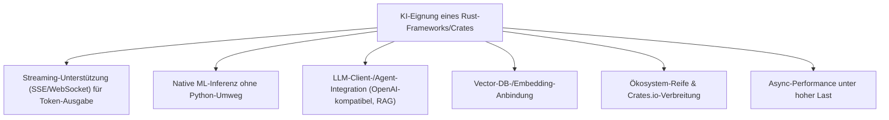
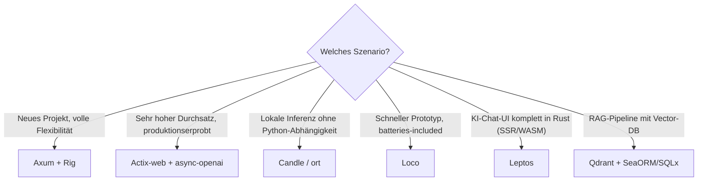

# Beste Rust-Frameworks & Web-Backends mit KI-Unterstützung — Top-20-Topliste

Während die bisherigen Rust-Toplisten bewerten, **womit** Rust-Code entwickelt wird (Modelle, Agenten, IDEs), geht es hier um die andere Seite: **womit** in Rust selbst KI-gestützte Anwendungen gebaut werden — Web-Backends mit gutem Streaming für Token-für-Token-LLM-Antworten, native ML-Inferenz ohne Python-Abhängigkeit und Vector-DB-Anbindung für RAG-Pipelines. Diese Seite ordnet Web-Frameworks und KI-native Crates danach ein, wie gut sie sich für den Bau produktiver KI-Backends in Rust eignen.

!!! note "Hinweis: Web-Framework und KI-Crate sind zwei verschiedene Bausteine"
    Ein Web-Framework (Axum, Actix-web, …) übernimmt HTTP/WebSocket-Routing und Streaming — es enthält selbst kein LLM-Wissen. Erst in Kombination mit einer KI-nativen Crate (Rig, Candle, async-openai, …) entsteht ein vollständiges KI-Backend. Diese Liste bewertet beide Kategorien gemeinsam, da sie in der Praxis meist zusammen ausgewählt werden.

---

## Bewertungskriterien

!!! warning "Achtung: Rust-KI-Ökosystem noch jung"
    Anders als im Python-Ökosystem (LangChain, LlamaIndex) sind viele Rust-KI-Crates noch vergleichsweise neu und ändern sich schneller als etablierte Web-Frameworks. Vor Produktiveinsatz die aktuelle Crates.io-Aktivität (letzte Version, offene Issues) prüfen. **Stand: Juli 2026.**

---

## Top 20 im Überblick

| Rang | Framework / Crate | Kategorie | Rust-KI-Einschätzung | Besondere Stärke | Schwäche |
|---|---|---|---|---|---|
| 1 | **Axum** | Web-Framework | Sehr stark | Vom Tokio-Team gepflegt, exzellente native SSE-/Streaming-Unterstützung für Token-für-Token-LLM-Ausgabe, Standard für neue Rust-KI-Backends | Kein eingebautes LLM-Wissen — erfordert Kombination mit einer KI-Crate |
| 2 | **Rig** | KI-Anwendungs-Framework | Sehr stark | Am ehesten das „LangChain für Rust": Agents, RAG-Pipelines, Tool-Use direkt eingebaut | Jüngeres Projekt, kleinere Community als Python-Pendants |
| 3 | **Candle (Hugging Face)** | Native ML-Inferenz | Sehr stark | Tensor-Operationen und Modellausführung direkt in Rust, kein Python-Interpreter im Deployment nötig | Modellauswahl/Konvertierung erfordert mehr Handarbeit als bei Ollama/vLLM |
| 4 | **Actix-web** | Web-Framework | Stark | Sehr hoher Durchsatz, robuste WebSocket-Unterstützung für Chat-Interfaces, langjährig produktionserprobt | API historisch weniger ergonomisch als Axum |
| 5 | **async-openai** | LLM-Client-Crate | Stark | Meistgenutzter OpenAI-/OpenAI-kompatibler Client in Rust, funktioniert mit den meisten Aggregatoren aus der [Aggregatoren-Topliste](llm-aggregatoren-rust-topliste.md) | Kein eigenständiges Agenten-/RAG-Framework, reiner API-Client |
| 6 | **`ort` (ONNX Runtime)** | Native ML-Inferenz | Stark | Produktionsreife Inferenz für exportierte Modelle, guter Kompromiss zwischen Performance und Modellauswahl | Modelle müssen vorab nach ONNX exportiert werden |
| 7 | **Qdrant** | Vector-Datenbank | Stark | Selbst in Rust geschrieben, exzellenter nativer Rust-Client, ideal für RAG-Backends ohne Sprachbruch | Für sehr kleine Projekte ggf. Overkill gegenüber pgvector |
| 8 | **Loco** | Full-Stack-Framework | Stark | „Rails für Rust" — batteries-included, wachsende Zahl an KI-App-Vorlagen, schneller Einstieg | Weniger Flexibilität als reines Axum bei ungewöhnlichen Architekturen |
| 9 | **Poem** | Web-Framework | Solide bis stark | OpenAPI-first, gute Streaming-Unterstützung, wachsende Nutzung in KI-Projekten | Kleineres Ökosystem/Community als Axum/Actix-web |
| 10 | **Leptos** | Full-Stack (SSR + WASM) | Solide bis stark | Server-Functions erlauben LLM-Aufrufe direkt aus der UI-Logik heraus, ideal für KI-Chat-Oberflächen komplett in Rust | Steilere Lernkurve durch SSR-/WASM-Kombination |
| 11 | **Warp** | Web-Framework | Solide | Filter-basiertes Routing, solide Tokio-native Streaming-Unterstützung | API-Stil (Filter-Kombinatoren) gewöhnungsbedürftiger als Axum |
| 12 | **llm (rustformers)** | Lokale Inferenz-Crate | Solide | Eingebettete GGML-basierte lokale Modellausführung direkt im Backend-Prozess | Weniger aktiv gepflegt als Candle, kleinere Modellauswahl |
| 13 | **langchain-rust** | KI-Anwendungs-Framework | Solide | Vertraute LangChain-Konzepte für Rust-Entwickler mit Python-Hintergrund | Deutlich weniger ausgereift als das Python-Original oder Rig |
| 14 | **Dioxus** | UI-Framework (Web + Cross-Platform) | Solide | Wachsende Zahl an KI-Chat-App-Beispielen, ein Codebasis für Web/Desktop/Mobile | Kein eigenständiger Backend-/Streaming-Fokus wie bei reinen Web-Frameworks |
| 15 | **Salvo** | Web-Framework | Solide | Moderne Async-/Streaming-Unterstützung, wachsende Popularität | Kleinere Community/Dokumentation als etablierte Top 5 |
| 16 | **SeaORM (+ pgvector)** | ORM / Datenbank-Layer | Solide | Gute Typsicherheit bei RAG-Metadaten-Modellierung, funktioniert gut mit [PostgreSQL + pgvector](../../wissen/daten/datenbanken/pgvector-anleitung.md) | Kein eigener KI-/Embedding-Bezug, reine Persistenzschicht |
| 17 | **SQLx (+ pgvector)** | Datenbank-Toolkit | Ausreichend bis solide | Sehr verbreitet für rohe RAG-Pipelines mit maximaler Kontrolle über SQL | Mehr Handarbeit als ein vollwertiges ORM bei komplexeren Schemata |
| 18 | **Tauri** | Desktop-Framework (Rust-Backend) | Ausreichend bis solide | Praktisch für KI-gestützte Desktop-Anwendungen mit lokaler Modellintegration (Candle/`ort`) | Kein Web-Backend im eigentlichen Sinn, anderer Einsatzbereich |
| 19 | **Rocket** | Web-Framework | Ausreichend | Sehr ergonomische API, guter Einstieg für kleinere KI-Prototypen | Streaming-/Async-Performance historisch hinter Axum/Actix-web zurück |
| 20 | **Tide** | Web-Framework | Grundlegend | Einfache, minimalistische API auf async-std-Basis | Deutlich kleinere Community, seltener erste Wahl für neue KI-Projekte |

!!! tip "Tipp: Rang ≠ einzige Entscheidungsgröße"
    Für **neue Projekte ohne bestehende Architekturzwänge** ist die Kombination **Axum + Rig** aktuell der naheliegendste Startpunkt. Für **Teams mit Python-/LangChain-Erfahrung** senkt `langchain-rust` die Einstiegshürde trotz geringerer Reife, weil vertraute Konzepte übertragen werden können.

---

## Die Top 5 im Detail

### 1. Axum

Wird vom selben Team wie Tokio und Hyper gepflegt, wodurch neue Async-/Streaming-Fähigkeiten meist zuerst dort ankommen. Server-Sent Events für Token-für-Token-Ausgabe von LLM-Antworten (analog zum OpenAI-Streaming-Format) lassen sich mit wenigen Zeilen umsetzen. In Kombination mit Rig oder async-openai aktuell die verbreitetste Basis für neue Rust-KI-Backends.

### 2. Rig

Bündelt Agenten-Definition, RAG-Pipelines und Tool-Use in einem Rust-nativen Framework — kein Umweg über eine Python-Bridge nötig. Für Teams, die eine vollständige KI-Anwendungslogik (nicht nur einen API-Client) direkt in Rust abbilden wollen, aktuell die naheliegendste Wahl, auch wenn die Community kleiner ist als bei etablierten Python-Frameworks.

### 3. Candle (Hugging Face)

Ermöglicht Tensor-Operationen und Modellinferenz vollständig innerhalb des Rust-Prozesses — relevant für Deployments, bei denen ein Python-Interpreter im Container vermieden werden soll (kleinere Images, weniger Angriffsfläche, ein einziges Build-Artefakt). Wird von Hugging Face aktiv weiterentwickelt und deckt eine wachsende Zahl an Modellarchitekturen ab.

### 4. Actix-web

Der Klassiker unter den performanten Rust-Web-Frameworks: sehr hoher Durchsatz unter Last, ausgereifte WebSocket-Unterstützung für Echtzeit-Chat-Interfaces mit LLM-Backends. Produktionserprobt in großem Maßstab, dadurch für Teams mit hohen Stabilitätsanforderungen oft die konservativere Wahl gegenüber dem jüngeren Axum.

### 5. async-openai

Der meistgenutzte Rust-Client für OpenAI-kompatible APIs — funktioniert unverändert mit nahezu allen Anbietern aus der [Aggregatoren-](llm-aggregatoren-rust-topliste.md) und [Direkt-Anbieter-Topliste](llm-direktanbieter-rust-topliste.md), da die meisten das OpenAI-Schema als De-facto-Standard übernommen haben. Kein eigenständiges Agenten-Framework, dafür die zuverlässigste Basis, um schnell einen LLM-Aufruf in ein bestehendes Axum- oder Actix-web-Backend einzubauen.

---

## Empfehlung nach Einsatzszenario

!!! warning "Achtung: Ökosystem-Reife vor Produktiveinsatz prüfen"
    Rig, Candle, `ort` und langchain-rust entwickeln sich deutlich schneller als etablierte Web-Frameworks wie Axum oder Actix-web — Breaking Changes zwischen Minor-Versionen sind bei den KI-nativen Crates häufiger. Für produktionskritische Systeme lohnt sich, Versionen zu pinnen und Änderungen an CHANGELOGs aktiv zu verfolgen, statt automatisch auf die neueste Version zu aktualisieren.

---

## 🔗 Verwandte Themen

- [Startseite](../../index.md) — zurück zur Dokumentations-Zentrale
- [Rust Praxis-Handbuch](../../entwicklung/system/rust-praxis.md) — Sprachgrundlagen inkl. Axum/Tokio
- [Beste Sprachmodelle für Rust-Programmierung (Top 20)](llm-rust-topliste.md) — welches Modell hinter async-openai/Rig laufen sollte
- [Beste Aggregatoren & Multi-Modell-Provider für Rust-Programmierung (Top 20)](llm-aggregatoren-rust-topliste.md)
- [Beste Direkt-Anbieter (Offizielle Entwickler-APIs) für Rust-Programmierung (Top 20)](llm-direktanbieter-rust-topliste.md)
- [Beste Abo-basierte Direkt-Anbieter (Offizielle Entwickler-Abos) für Rust-Programmierung (Top 20)](llm-abo-anbieter-rust-topliste.md)
- [Beste Cloud-Provider für GPU-Hosting eigener Rust-Coding-Modelle (Top 20)](cloud-gpu-provider-rust-topliste.md) — Hosting für mit Candle/`ort` selbst ausgeführte Modelle
- [Beste IDEs & Editoren mit Rust-Unterstützung (Top 20)](../../entwicklung/system/rust-ide-topliste.md)
- [PostgreSQL + pgvector](../../wissen/daten/datenbanken/pgvector-anleitung.md) — Vector-DB-Grundlage für SeaORM/SQLx-basierte RAG-Backends
