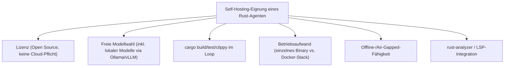
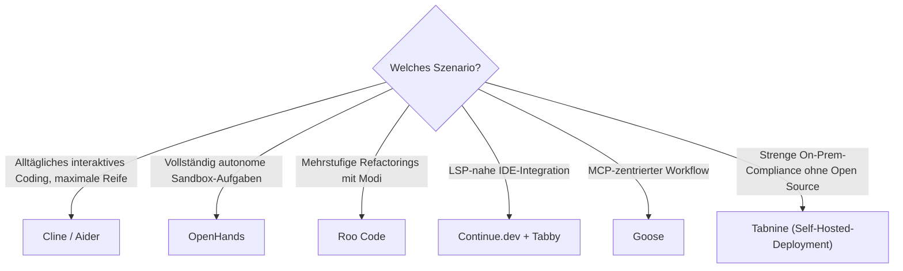

# Beste KI-Coding-Agenten für Rust-Programmierung (Self-Hosting) — Top-20-Topliste

Die [Agenten-Topliste für Rust](ki-agenten-rust-topliste.md) bewertet Werkzeuge unabhängig davon, ob Anbieter, Lizenz oder Modellbindung eine Rolle spielen. Diese Seite geht tiefer in genau eine Kategorie: **KI-Coding-Agenten, die sich vollständig selbst betreiben lassen** — Open-Source-Lizenz, freie Modellwahl (inklusive lokaler Modelle über [Ollama](lokales-rag-ollama.md) oder [vLLM](vllm-high-throughput-serving.md)) und keine Pflicht, Code oder Prompts an einen Cloud-Dienst zu senden. Relevant für Rust-Projekte mit Datenschutz-/Compliance-Anforderungen (Embedded, Kryptographie, Behörden, Air-Gapped-Umgebungen) oder für Teams, die Agenten-Kosten über eigene Hardware statt Token-Abrechnung steuern wollen.

!!! note "Hinweis: Self-Hosting-Agent ≠ selbst gehostetes Modell"
    Diese Liste bewertet die **Agenten-Werkzeuge** selbst — ob sie quelloffen sind, lokal laufen und frei an ein Modell angebunden werden können. Welches Modell dahinter idealerweise läuft, klärt die [Topliste lokaler Sprachmodelle für Rust](lokale-sprachmodelle-rust-topliste.md). Beide Listen ergänzen sich: ein Self-Hosting-Agent ohne starkes lokales Modell bringt wenig, und umgekehrt.

---

## Bewertungskriterien

!!! warning "Achtung: Ökosystem verändert sich schnell"
    Wie bei den verwandten Toplisten gibt es keine offizielle, herstellerübergreifende Rust-Benchmark-Suite für Self-Hosting-Agenten. Die Einordnung stützt sich auf Lizenzmodell, Community-Aktivität und Praxis-Feedback zur Build-Schleife. **Stand: Juli 2026.**

---

## Top 20 im Überblick

| Rang | Agent | Typ | Lizenz | Rust-Einschätzung | Besondere Stärke | Schwäche |
|---|---|---|---|---|---|---|
| 1 | **Cline** | VS-Code-Erweiterung | MIT | Sehr stark | Voller Terminal-/Diff-Zugriff, größte Community unter den Self-Hosting-Agenten, freie Modellwahl inkl. lokaler Modelle | Kein natives rust-analyzer-Deep-Linking wie eine dedizierte Rust-IDE |
| 2 | **Aider** | CLI (Git-nativ) | Apache-2.0 | Sehr stark | Git-Awareness von Grund auf, liest `cargo`-Fehlerausgaben direkt, sehr geringer Ressourcenbedarf | Reine Terminal-Bedienung, kein grafisches Interface |
| 3 | **OpenHands** (ehem. OpenDevin) | Autonomer Software-Agent | MIT | Stark | Voll autonome Sandbox inkl. Build-/Test-Loop, quelloffen und komplett selbst betreibbar | Docker-basierter Betrieb ressourcenintensiver als reine CLI-Tools |
| 4 | **Roo Code** | VS-Code-Erweiterung (Cline-Fork) | Apache-2.0 | Stark | Zusätzliche Modi (Architect/Debug) hilfreich bei komplexen Trait-Hierarchien | Kleinere Community als Cline selbst |
| 5 | **Continue.dev** | IDE-Plugin | Apache-2.0 | Stark | Direkte LSP-Anbindung an rust-analyzer, sehr einfache Selbst-Konfiguration (siehe [Setup](continue-dev-setup.md)) | Agentic-Loop-Funktionen weniger ausgereift als bei dedizierten CLI-Agenten |
| 6 | **Goose** | CLI (Extensible via MCP) | Apache-2.0 | Stark | Von Block quelloffen entwickelt, MCP-nativ, läuft vollständig lokal ohne Cloud-Anbindung | Jüngeres Projekt, Rust-spezifische Extensions noch überschaubar |
| 7 | **Tabby** | Self-Hosted Completion-/Chat-Server | Apache-2.0 | Solide bis stark | Dediziert für Self-Hosting konzipiert, eigener Inferenz-Server, gute IDE-Anbindung (siehe [Setup](continue-dev-setup.md)) | Eher Vervollständigung/Chat als voller Agentic-Build-Loop |
| 8 | **Zed AI** | Editor (nativ, Open Source) | GPL-3.0/Apache-2.0 (Core) | Solide bis stark | Editor selbst in Rust geschrieben, native Performance, Anbindung lokaler Modelle über Ollama | Agentic-Modus jünger/weniger ausgereift als bei Cline/Aider |
| 9 | **Void** | IDE (Fork, Open Source) | Apache-2.0 | Solide | Quelloffene Cursor-Alternative, volle Datenhoheit, keinerlei Cloud-Pflicht | Jüngeres Projekt, Rust-Feinschliff noch im Aufbau |
| 10 | **OpenCode** | CLI (Open Ecosystem) | MIT | Solide bis stark | Bindet 75+ Modell-Anbieter einheitlich an, auch komplett lokale Modelle | Setup pro Anbieter (`/connect`) nötig |
| 11 | **Plandex** | CLI (Terminal-Agent) | Apache-2.0/MIT | Solide | Plan-basierter Ansatz mit expliziter Freigabe vor Dateiänderungen, gut für sicherheitskritischen Rust-Code | Kleinere Nutzerbasis als etablierte CLI-Agenten |
| 12 | **SWE-agent** | Autonomer Forschungs-Agent | MIT | Solide | Aus der Forschung (Princeton) entstanden, transparente Agent-Computer-Interface-Architektur | Eher auf Benchmark-/Forschungsszenarien ausgelegt als Alltagsnutzung |
| 13 | **Open Interpreter** | Lokaler Ausführungs-Agent | AGPL-3.0 | Solide | Natürlichsprachliche Code-Ausführung direkt auf dem lokalen System, keine Cloud-Abhängigkeit | AGPL-Lizenz bei kommerziellem Einsatz beachten |
| 14 | **AutoCodeRover** | Autonomer Bugfix-Agent | MIT | Solide | Spezialisiert auf Issue-zu-Patch-Workflows, Codebase-Struktur-Analyse vor Änderung | Weniger als interaktiver Alltags-Coding-Agent gedacht |
| 15 | **Sweep AI** (Self-Hosted-Variante) | Autonomer PR-Agent | MIT (Kernkomponenten) | Ausreichend bis solide | Issue-zu-PR-Automatisierung, Self-Hosted-Deployment via Docker möglich | Self-Hosted-Setup aufwendiger als bei reinen CLI-Tools |
| 16 | **Devika** | Autonomer Software-Agent | MIT | Ausreichend bis solide | Planungs-/Recherche-Schritt vor Codeänderung, quelloffen | Rust-Feinschliff und Aktivität hinter etablierteren Tools |
| 17 | **gpt-engineer** | CLI (Projekt-Generator) | MIT | Ausreichend | Guter Einstieg für Rust-Projekte „von Null", generiert komplette Projektstruktur | Weniger auf iterative Weiterentwicklung bestehender Codebasen ausgelegt |
| 18 | **CodeGPT** | IDE-Plugin (Open Source) | MIT | Ausreichend | Einfache Anbindung lokaler Modelle über Ollama direkt aus der IDE | Agentic-Fähigkeiten schmaler als bei Cline/Roo Code |
| 19 | **Smol Developer** | CLI (Minimal-Agent) | MIT | Ausreichend | Sehr einfaches, gut verständliches Grundprinzip für eigene Experimente/Forks | Kaum produktionsreife Funktionen „ab Werk" |
| 20 | **Tabnine (Self-Hosted-Deployment)** | IDE-Plugin | Proprietär (On-Prem-Lizenz) | Ausreichend | On-Premises-Deployment für strenge Compliance-Vorgaben, private Modelle | Kein Open-Source-Kern, Lizenzkosten für On-Prem-Betrieb |

!!! tip "Tipp: Rang ≠ einzige Entscheidungsgröße"
    Für **produktive Multi-Crate-Rust-Workspaces mit hohen Datenschutzanforderungen** liefern Cline und Aider aktuell die verlässlichste Kombination aus Reife und Selbst-Kontrolle. Für **vollständig autonome Aufgaben in einer eigenen Sandbox** ist OpenHands die konsequenteste Wahl. Wer bereits in MCP investiert, sollte Goose gegen Cline abwägen.

---

## Die Top 5 im Detail

### 1. Cline

Der quelloffene Vorreiter der VS-Code-Agenten-Erweiterungen: voller Zugriff auf Terminal und Diff-Ansicht vor jeder Änderung, dazu freie Wahl des zugrundeliegenden Modells — inklusive lokal gehosteter Modelle wie GLM-5.1 oder Qwen3-Coder über [Ollama](lokales-rag-ollama.md). Die MIT-Lizenz und die größte aktive Community unter den Self-Hosting-Agenten machen Cline zum naheliegendsten Einstieg, wenn Code und Prompts die eigene Infrastruktur nicht verlassen sollen.

### 2. Aider

Reiner Terminal-Agent mit Git als zentralem Konzept — jede Änderung wird automatisch sauber committet, was bei iterativen Borrow-Checker-Korrekturen einen lückenlosen Verlauf ergibt. Läuft mit minimalem Ressourcenbedarf und arbeitet vollständig modellagnostisch, dadurch gut mit lokalen Modellen aus der [Sprachmodell-Topliste](lokale-sprachmodelle-rust-topliste.md) kombinierbar.

### 3. OpenHands

Anders als die übrigen Top-5-Einträge kein Editor-Plugin, sondern ein voll autonomer Agent mit eigener, selbst betreibbarer Sandbox (Docker). Führt `cargo build`/`test`/`clippy` eigenständig in einer isolierten Umgebung aus und eignet sich dadurch besonders für längere, unbeaufsichtigte Refactoring-Aufgaben in einem selbst kontrollierten Netz.

### 4. Roo Code

Fork von Cline mit zusätzlichen Modi (Architect, Debug, Ask), die sich gut auf komplexe Trait-Hierarchien und mehrstufige Rust-Refactorings zuschneiden lassen. Teilt die Lizenz- und Self-Hosting-Vorteile des Ursprungsprojekts, bei einer aktuell kleineren, aber sehr aktiven Community.

### 5. Continue.dev

Direkte LSP-Anbindung an rust-analyzer macht Continue.dev zum unkompliziertesten Weg, ein lokal laufendes Modell mit vollem Sprachserver-Kontext in der IDE zu nutzen. Setup und Modellwahl sind vollständig selbst konfigurierbar, siehe [Continue.dev & Tabby AI](continue-dev-setup.md) für eine kombinierte Self-Hosting-Installation mit Tabby als eigenem Inferenz-Server.

---

## Empfehlung nach Einsatzszenario

!!! warning "Achtung: Self-Hosting entbindet nicht von Review-Pflicht"
    Auch bei vollständig selbst betriebenen Agenten gilt dieselbe Regel wie bei Cloud-Agenten: `unsafe`-Blöcke, FFI-Grenzen und kryptographischer Code sollten niemals ungeprüft aus einer automatisierten Schleife übernommen werden. Self-Hosting löst das Datenschutzproblem, nicht das Korrektheitsproblem.

---

## 🔗 Verwandte Themen

- [Startseite](../../index.md) — zurück zur Dokumentations-Zentrale
- [Beste KI-Coding-Agenten für Rust-Programmierung (Top 20)](ki-agenten-rust-topliste.md) — Gesamtliste unabhängig von Lizenz/Hosting
- [Beste Cloud-Agenten für Rust-Programmierung (Top 20)](cloud-agenten-rust-topliste.md) — asynchrones Gegenstück in fremder Cloud-Sandbox
- [Beste lokale Sprachmodelle für Rust-Programmierung (Self-Hosting, Top 20)](lokale-sprachmodelle-rust-topliste.md) — welches Modell hinter diesen Agenten laufen sollte
- [Beste Self-Hosting-KI-Agenten (Allgemein, Top 20)](selbsthosting-ki-agenten-topliste.md) — dieselbe Idee ohne Rust-Fokus, inklusive Multi-Agenten-Frameworks
- [Beste Cloud-Provider für GPU-Hosting eigener Rust-Coding-Modelle (Top 20)](cloud-gpu-provider-rust-topliste.md) — Hardware-Basis für Self-Hosting-Agenten
- [Continue.dev & Tabby AI](continue-dev-setup.md) — vertiefender Setup-Guide zu Rang 5 und 7
- [Lokales RAG & LLM-Serving](lokales-rag-ollama.md) — Ollama-Setup als Modell-Backend für alle hier gelisteten Agenten
- [vLLM High-Throughput Serving](vllm-high-throughput-serving.md) — produktionsreifes Self-Hosting bei hohem Agenten-Durchsatz im Team
- [Beste KI-Agent-CLIs (Allgemein, Top 20)](ki-agent-cli-topliste.md) — dieselbe Werkzeug-Kategorie ohne Rust-Fokus
- [Claude Code Praxis-Handbuch](claude-code-praxis.md) — Kontrastbeispiel für einen nicht selbst hostbaren, aber sehr ausgereiften Agenten
