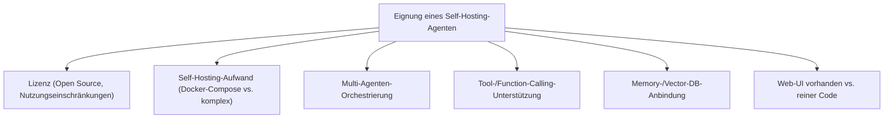
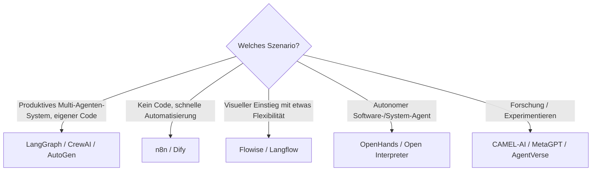

# Beste Self-Hosting-KI-Agenten (Allgemein) — Top-20-Topliste

Nach den zwölf Rust-spezifischen KI-Toplisten dieser Serie geht es hier allgemein zu: Welche **selbst hostbaren KI-Agenten-Frameworks und -Plattformen** eignen sich für beliebige Automatisierungs-, Recherche- und Multi-Agenten-Aufgaben — unabhängig von einer bestimmten Programmiersprache? Bewertet werden Open-Source-Frameworks und selbst betreibbare Plattformen, bei denen Orchestrierung, Daten und Prompts vollständig in eigener Infrastruktur bleiben.

!!! note "Hinweis: Framework ≠ fertiges Produkt"
    Ein Teil dieser Liste sind Code-Bibliotheken (LangGraph, AutoGen, CAMEL-AI), die eigene Entwicklungsarbeit erfordern; ein anderer Teil sind fertige Plattformen mit Weboberfläche (Dify, n8n, Flowise), die ohne eigenen Code startklar sind. Diese Einordnung fließt als Kriterium mit ein.

---

## Bewertungskriterien

!!! warning "Achtung: Ökosystem verändert sich schnell"
    Agenten-Frameworks zählen zu den am schnellsten weiterentwickelten Bereichen im KI-Ökosystem — APIs und Best Practices ändern sich häufig zwischen Minor-Versionen. **Stand: Juli 2026.**

---

## Top 20 im Überblick

| Rang | Framework/Plattform | Typ | Lizenz | Einschätzung | Besondere Stärke | Schwäche |
|---|---|---|---|---|---|---|
| 1 | **LangGraph** | Code-Framework | MIT | Sehr stark | Produktionsreife, graphbasierte Orchestrierung, größtes Ökosystem an Integrationen, siehe [Praxis-Guide](agentic-workflows-langgraph.md) | Erfordert Python-/Entwicklungskenntnisse |
| 2 | **CrewAI** | Code-Framework | MIT | Sehr stark | Rollenbasierte Multi-Agenten-Orchestrierung, sehr verständliches Programmiermodell | Für sehr komplexe Graphen weniger flexibel als LangGraph |
| 3 | **n8n** | Workflow-Plattform (Self-Hosted) | Fair-Code (Sustainable Use License) | Sehr stark | Riesiges Ökosystem an Integrationen/Connectoren, KI-Agent-Knoten direkt im Workflow-Editor | Lizenz schränkt bestimmte kommerzielle Weiterverbreitung ein |
| 4 | **Dify** | Agenten-/LLM-App-Plattform | Apache-2.0 (mit Zusatzklauseln) | Stark | Vollständige Weboberfläche für Agenten, RAG und Workflows ohne eigenen Code | Sehr große Deployments benötigen mehr Ressourcen als reine Frameworks |
| 5 | **AutoGen** | Code-Framework | MIT | Stark | Ausgereiftes Konversationsmodell zwischen mehreren Agenten, siehe [Praxis-Guide](autogen-multiagent-framework.md) | Setup für komplexe Multi-Agenten-Szenarien aufwendiger als CrewAI |
| 6 | **Flowise** | Visueller Flow-Builder | Apache-2.0 | Stark | Drag-and-Drop-Oberfläche auf LangChain-Basis, schneller Einstieg ohne viel Code | Bei sehr komplexer Logik unübersichtlicher als reiner Code |
| 7 | **Langflow** | Visueller Flow-Builder | MIT | Stark | Ähnliches Konzept wie Flowise, aktive Weiterentwicklung, gute Komponentenbibliothek | Überschneidung mit Flowise — Auswahl oft Geschmackssache |
| 8 | **OpenHands (ehem. OpenDevin)** | Autonomer Software-Agent | MIT | Stark | Voll autonomer Coding-/Automatisierungs-Agent mit eigener Sandbox, quelloffen | Ressourcenintensiver als reine Chat-/Workflow-Agenten |
| 9 | **MetaGPT** | Multi-Agenten-Framework | MIT | Solide bis stark | Simuliert komplette Softwarefirma (PM, Architekt, Entwickler) als Agenten-Rollen | Eher für Demonstrations-/Forschungszwecke als Produktivbetrieb |
| 10 | **Haystack Agents (deepset)** | Code-Framework | Apache-2.0 | Solide bis stark | Sehr gute RAG-Integration, produktionserprobt bei Suchsystemen | Agenten-Funktionen sekundär zum ursprünglichen RAG-Fokus |
| 11 | **Letta (MemGPT)** | Code-Framework | Apache-2.0 | Solide | Spezialisiert auf langfristiges Gedächtnis über viele Sitzungen hinweg | Kein eigenständiges Multi-Agenten-Orchestrierungsmodell wie CrewAI |
| 12 | **CAMEL-AI** | Code-Framework | Apache-2.0 | Solide | Forschungsnahes Rollenspiel-Framework für Multi-Agenten-Kommunikation | Kleinere Produktions-Community als LangGraph/AutoGen |
| 13 | **SuperAGI** | Agenten-Plattform mit GUI | MIT | Solide | Grafische Oberfläche plus Marktplatz für Agenten-Tools | Entwicklungstempo/Community-Aktivität schwankend |
| 14 | **XAgent** | Autonomer Agent | Apache-2.0 | Solide | Zweistufige Planer-/Ausführer-Architektur für komplexe Aufgaben | Kleinere Nutzerbasis als etablierte Frameworks |
| 15 | **Open Interpreter** | Lokaler Ausführungs-Agent | AGPL-3.0 | Solide | Natürlichsprachliche Code-Ausführung direkt auf dem lokalen System | AGPL-Lizenz bei kommerziellem Einsatz beachten |
| 16 | **ChatDev** | Multi-Agenten-Simulation | Apache-2.0 | Ausreichend bis solide | Anschauliches Modell einer virtuellen Software-Firma mit mehreren Rollen | Eher Lehr-/Demo-Charakter als Produktionswerkzeug |
| 17 | **AgentVerse** | Multi-Agenten-Simulation | Apache-2.0 | Ausreichend bis solide | Gut für Forschung zu Agenten-Interaktion und -Kooperation | Weniger auf konkrete Business-Automatisierung ausgelegt |
| 18 | **Rasa (Open Source)** | Konversations-Agent-Framework | Apache-2.0 | Ausreichend bis solide | Ausgereiftes NLU/Dialogmanagement für klassische Chatbot-Agenten | Moderne LLM-Agenten-Patterns weniger im Zentrum als bei neueren Frameworks |
| 19 | **BabyAGI** | Minimaler Task-Agent | MIT | Ausreichend | Sehr einfaches, gut verständliches Grundprinzip für eigene Experimente | Kaum produktionsreife Funktionen „ab Werk" |
| 20 | **AutoGPT** | Autonomer Agent (Pionier) | MIT | Ausreichend | Historisch prägend, große Community, viele Tutorials verfügbar | Im direkten Vergleich zu neueren Frameworks technisch überholt |

!!! tip "Tipp: Rang ≠ einzige Entscheidungsgröße"
    Für **produktive Multi-Agenten-Systeme mit eigenem Code** sind LangGraph, CrewAI und AutoGen aktuell die verlässlichste Wahl. Für **Teams ohne eigene Entwicklungsressourcen** liefern n8n und Dify den schnellsten Weg zu einem lauffähigen Agenten ohne Programmieraufwand.

---

## Empfehlung nach Einsatzszenario

---

## 🔗 Verwandte Themen

- [Startseite](../../index.md) — zurück zur Dokumentations-Zentrale
- [Beste Cloud-KI-Agenten (Allgemein, Top 20)](cloud-ki-agenten-topliste.md) — das gehostete Gegenstück ohne eigenen Betrieb
- [Beste lokale Computer-KI-Agenten (Allgemein, Top 20)](../automatisierung/lokale-ki-agenten-topliste.md) — Agenten mit direkter Bildschirm-/Maus-/Tastatursteuerung statt reiner Text-/API-Orchestrierung
- [Beste KI-Agent-CLIs (Allgemein, Top 20)](ki-agent-cli-topliste.md) — terminalbasierte Agenten statt Code-Frameworks
- [AI Agents Praxis-Handbuch](ai-agents-praxis.md) — Architektur-Grundlagen für eigene Agenten
- [Agentic Workflows (LangGraph)](agentic-workflows-langgraph.md) — vertiefender Praxis-Guide zu Rang 1
- [AutoGen Multi-Agent Framework](autogen-multiagent-framework.md) — vertiefender Praxis-Guide zu Rang 5
- [Open-WebUI Pipelines](open-webui-pipelines.md) — passende Chat-Oberfläche für selbst gehostete Agenten
- [Lokales RAG & LLM-Serving](lokales-rag-ollama.md) — Modell-Grundlage für alle hier gelisteten Frameworks
- [Beste KI-Coding-Agenten für Rust-Programmierung (Top 20)](ki-agenten-rust-topliste.md) — spezialisierte Variante für Rust-Coding
- [Beste KI-Coding-Agenten für Rust-Programmierung (Self-Hosting, Top 20)](selbsthosting-ki-agenten-rust-topliste.md) — dieselbe Self-Hosting-Idee, spezifisch für Rust-Coding-Agenten statt allgemeiner Frameworks
