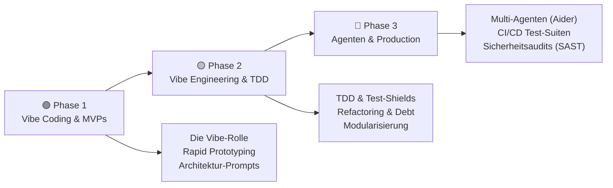
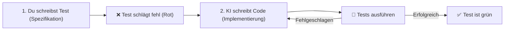
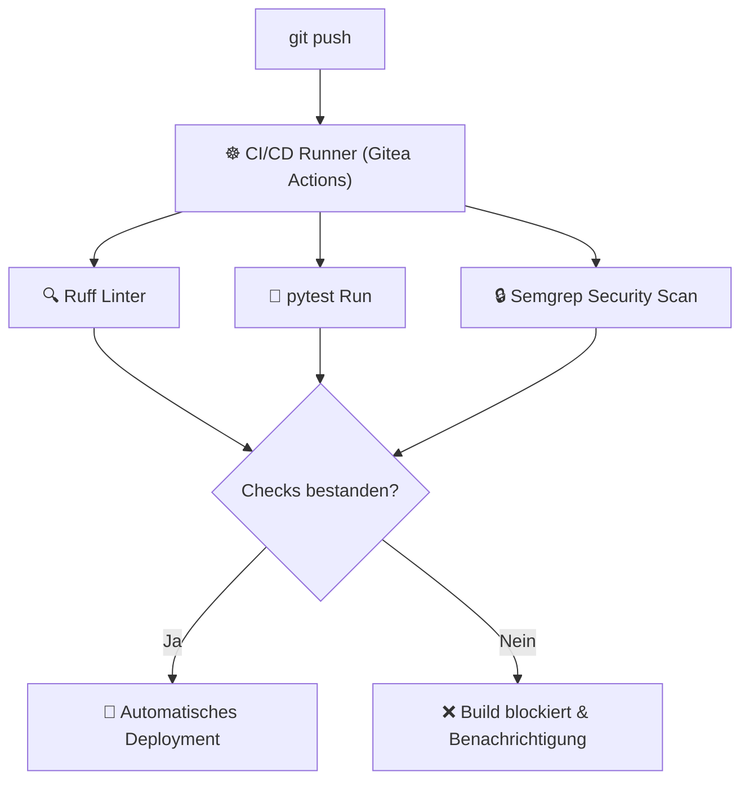
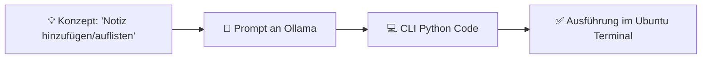
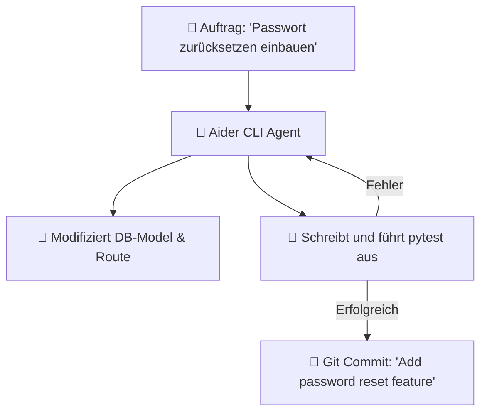

# Vibe Coding & Vibe Engineering

> **Hinweis zur Software-Auswahl:**  
> Diese Dokumentation priorisiert **Open-Source-Software**, die lokal unter Ubuntu installiert und betrieben werden kann, um absolute Kontrolle über den Quellcode und die Pipelines zu behalten.  
> Bei proprietären Cloud-Lösungen und kommerziellen Agenten wird stets eine **Open-Source-Alternative** gegenübergestellt.  
> **LLM-Modelle** und APIs werden unabhängig vom Preis gelistet, da sie das Fundament für generative Code-Erstellung und autonome Agenten bilden.

---

## Legende

| Symbol | Bedeutung |
|---|---|
| 🟩 | Open Source – kostenlos, lokal / Ubuntu-kompatibel |
| 💰 | Kostenpflichtig |
| 🤖 | LLM-Modell / API – bleibt immer gelistet |
| 🐧 | Linux / Ubuntu nativ |
| 🌐 | Nur Web-Browser |

---

## Lernpfad-Übersicht



---

## Inhaltsverzeichnis

- [🟢 Phase 1 – Vibe Coding Einstieg & Rapid Prototyping](#phase-1-vibe-coding-einstieg-rapid-prototyping)
    - [1.1 Konzept: Was ist Vibe Coding?](#11-konzept-was-ist-vibe-coding)
    - [1.2 Konzept: Die neue Rolle des Software-Architekten](#12-konzept-die-neue-rolle-des-software-architekten)
    - [1.3 Thema: Rapid Prototyping mit Chat-LLMs](#13-thema-rapid-prototyping-mit-chat-llms)
    - [1.4 Thema: Prompting-Strategien für vollständige Architekturen](#14-thema-prompting-strategien-fur-vollstandige-architekturen)
- [🟡 Phase 2 – Vibe Engineering: Robustheit & Qualität](#phase-2-vibe-engineering-robustheit-qualitat)
    - [2.1 Konzept: Von Vibe Coding zu Vibe Engineering](#21-konzept-von-vibe-coding-zu-vibe-engineering)
    - [2.2 Thema: Test-Driven Development (TDD) als Sicherheitsnetz](#22-thema-test-driven-development-tdd-als-sicherheitsnetz)
    - [2.3 Thema: Vermeidung und Reduzierung von Technical Debt](#23-thema-vermeidung-und-reduzierung-von-technical-debt)
    - [2.4 Thema: Modulare Codebasen & Schnittstellen-Definition](#24-thema-modulare-codebasen-schnittstellen-definition)
- [🔴 Phase 3 – Autonome Agenten & Production-Grade Pipelines](#phase-3-autonome-agenten-production-grade-pipelines)
    - [3.1 Konzept: Autonome Agenten vs. Chat-Assistenten](#31-konzept-autonome-agenten-vs-chat-assistenten)
    - [3.2 Thema: Multi-Agenten-Systeme im Software-Engineering](#32-thema-multi-agenten-systeme-im-software-engineering)
    - [3.3 Thema: Automatisierte Test- und Review-Pipelines in CI/CD](#33-thema-automatisierte-test-und-review-pipelines-in-cicd)
    - [3.4 Thema: Sicherheitsaudits & Langzeit-Wartbarkeit von KI-Code](#34-thema-sicherheitsaudits-langzeit-wartbarkeit-von-ki-code)
- [📋 Praxisprojekte](#praxisprojekte)
- [📦 Vollständige Softwareübersicht & Vergleich](#vollstandige-softwareubersicht-vergleich)

---

## 🟢 Phase 1 – Vibe Coding Einstieg & Rapid Prototyping

> **Was lerne ich hier?**  
> Wie du Software entwirfst, indem du dich rein auf Konzepte und Beschreibungen konzentrierst (Vibe Coding), Prototypen erstellst und Architekturen vorgibst.  
> **Voraussetzungen:** Grundlegendes Verständnis von Softwarestrukturen.

---

### 1.1 Konzept: Was ist Vibe Coding?

#### Der Programmierer als Dirigent

Beim **Vibe Coding** schreibt der Entwickler den eigentlichen Code (Syntax) nicht mehr manuell. Stattdessen beschreibt er die logischen Anforderungen, Schnittstellen und das Verhalten der Software in natürlicher Sprache. Die KI generiert, ergänzt und korrigiert den Code im Hintergrund.

```
Klassisch:  Entwickler (Syntax schreiben) -----------> [ Code ] -----------> Compiler/Interpreter
Vibe-Weg:   Entwickler (Anforderung beschreiben) ----> [ KI (Syntax) ] ----> [ Code ]
```

---

### 1.2 Konzept: Die neue Rolle des Software-Architekten

#### Vom Coder zum Reviewer und Kurator

Der Fokus verschiebt sich von der **Implementierung** hin zu:
- **System-Design:** Wie spielen Module zusammen?
- **Spezifikation:** Anforderungen so präzise formulieren, dass die KI keine Fehlinterpretationen macht.
- **Kuration:** Den generierten Code lesen, verstehen, auf Sicherheit prüfen und integrieren.

---

### 1.3 Thema: Rapid Prototyping mit Chat-LLMs

#### Konzept: MVPs (Minimum Viable Products) in Rekordzeit

Dank KI-Assistenten können funktionale Prototypen innerhalb weniger Stunden erstellt werden. Wichtig ist dabei, die Anwendung schrittweise aufzubauen, statt die KI auf einmal eine Riesen-App schreiben zu lassen.

#### Software – Open Source / LLM:

| Software | Typ | Funktion | Ubuntu | Link |
|---|---|---|---|---|
| 🤖 [Claude](https://claude.ai) | LLM Cloud | Führend im Verständnis komplexer logischer Programmierung | 🌐 Web | claude.ai |
| 🤖 [ChatGPT](https://chat.openai.com) | LLM Cloud | Schnelle Generierung von Code-Snippets | 🌐 Web | openai.com |
| 🟩 🤖 [Ollama](https://ollama.com) | LLM lokal | Komplett private Inferenz für sensible Code-Prototypen | 🐧 Ja | ollama.com |

---

### 1.4 Thema: Prompting-Strategien für vollständige Architekturen

#### Konzept: System-Design vor Code-Generierung einfordern

Lass dir von der KI zuerst die Architektur erklären, bevor sie Code generiert:

```
Prompt-Schema:
1. "Ich möchte eine Anwendung bauen, die [Zweck] erfüllt."
2. "Schreibe noch keinen Code."
3. "Entwirf zuerst eine Liste der benötigten Module und deren Schnittstellen."
4. "Erstelle ein Mermaid-Diagramm des Datenflusses."
```

---

## 🟡 Phase 2 – Vibe Engineering: Robustheit & Qualität

> **Was lerne ich hier?**  
> Wie du den Übergang vom bloßen „Viben" hin zu solider, produktionsreifer Softwaregestaltung (Vibe Engineering) meisterst.  
> **Voraussetzungen:** Phase 1 abgeschlossen.

---

### 2.1 Konzept: Von Vibe Coding zu Vibe Engineering

#### Warum Vibe Coding allein im produktiven Umfeld scheitert

Wer sich blind auf den „Vibe" (die KI-Generierung) verlässt, erzeugt schnell:
- **Technical Debt:** Unstrukturierter Spaghetti-Code, der schwer zu warten ist.
- **Dependency Bloat:** Unnötige Bibliotheken, die Sicherheitsrisiken bergen.
- **Wartungshölle:** Code, den kein Entwickler im Team mehr versteht, weil ihn niemand geschrieben hat.

**Vibe Engineering** wendet klassische Software-Engineering-Prinzipien (TDD, Modularität, Code-Reviews, Sicherheits-Scans) auf KI-generierten Code an.

---

### 2.2 Thema: Test-Driven Development (TDD) als Sicherheitsnetz

#### Das Test-Schild (Test Shield)

Wenn die KI den Code schreibt, müssen **Spezifikation und Tests** deine absoluten Kontrollwerkzeuge sein. Wenn deine Test-Suite (Unit-, Integrations-, E2E-Tests) 100% abdeckt und grün ist, kannst du sicher sein, dass die KI-Generierung das gewünschte Verhalten liefert.



#### Software – alle Open Source:

| Software | Typ | Funktion | Ubuntu | Link |
|---|---|---|---|---|
| 🟩 [pytest](https://pytest.org) | Test-Framework | Test-Suite für Python-Projekte | 🐧 Ja | pytest.org |
| 🟩 [Playwright](https://playwright.dev) | E2E-Testing | Automatisiertes Testen von Web-Oberflächen im Browser | 🐧 Ja | playwright.dev |

---

### 2.3 Thema: Vermeidung und Reduzierung von Technical Debt

#### Konzept: Automatisches Refactoring & Linter-Ketten

Lass KI-generierten Code nicht ungeprüft. Erzwinge automatische Formatierung und Code-Qualitätsprüfungen über lokale Linter.

#### Software – alle Open Source:

| Software | Typ | Funktion | Ubuntu | Link |
|---|---|---|---|---|
| 🟩 [Ruff](https://github.com/astral-sh/ruff) | Linter / Formatter | Prüft und formatiert Python-Code blitzschnell | 🐧 Ja | github.com/astral-sh |
| 🟩 [SonarQube (Community)](https://www.sonarqube.org) | Code-Qualität | Findet Code-Smells, Bugs und Schwachstellen | 🐧 Ja | sonarqube.org |

---

### 2.4 Thema: Modulare Codebasen & Schnittstellen-Definition

#### Konzept: Lose Kopplung (Loose Coupling)

Modulgrenzen müssen scharf definiert sein. Jedes Modul sollte über standardisierte Schnittstellen (z. B. abstrakte Klassen oder definierte JSON-APIs) kommunizieren. Dadurch kann die KI einzelne Module austauschen, ohne das Gesamtsystem zu beschädigen.

---

## 🔴 Phase 3 – Autonome Agenten & Production-Grade Pipelines

> **Was lerne ich hier?**  
> Wie du autonome Agenten im Terminal nutzt, um komplexe Features über mehrere Dateien hinweg zu programmieren und deine CI/CD-Pipeline vollautomatisch absicherst.  
> **Voraussetzungen:** Phase 1 & 2 abgeschlossen. Git-Kenntnisse.

---

### 3.1 Konzept: Autonome Agenten vs. Chat-Assistenten

#### Der Unterschied der Interaktion

| System-Typ | Interaktion | Arbeitsweise |
|---|---|---|
| **Chat-Assistent** (z. B. ChatGPT) | Du kopierst Code hin und her | Reagiert nur auf direkte Fragen |
| **Autonomer Agent** (z. B. Aider) | Du erteilst Arbeitsauftrag im Terminal | Analysiert Dateien, liest Git-History, schreibt selbstständig Code |

---

### 3.2 Thema: Multi-Agenten-Systeme im Software-Engineering

#### Konzept: Agenten mit verteilten Rollen

In komplexen Projekten arbeiten spezialisierte Agenten zusammen. Ein „Architekt-Agent" plant, ein „Entwickler-Agent" codiert und ein „Tester-Agent" validiert.

#### Software – alle Open Source:

| Software | Typ | Funktion | Ubuntu | Link |
|---|---|---|---|---|
| 🟩 [Aider](https://aider.chat) | KI-Agent | Git-integrierter CLI-Coding-Agent für das Terminal | 🐧 Ja | aider.chat |
| 🟩 [LangGraph](https://www.langchain.com/langgraph) | Framework | Framework zum Aufbau zyklischer Multi-Agenten-Systeme | 🐧 Ja | langchain.com/langgraph |

---

### 3.3 Thema: Automatisierte Test- und Review-Pipelines in CI/CD

#### Konzept: Die Zero-Trust-Pipeline

Jeder Commit, der durch Vibe Coding entsteht, muss eine harte Pipeline durchlaufen:



#### Software – alle Open Source:

| Software | Typ | Funktion | Ubuntu | Link |
|---|---|---|---|---|
| 🟩 [Gitea Actions](https://gitea.io/de-de/) | CI/CD | GitHub-Actions-kompatibles lokales CI-System | 🐧 Ja | gitea.io |
| 🟩 [reviewdog](https://github.com/reviewdog/reviewdog) | Code-Review | Kommentiert Pull Requests vollautomatisch mit KI-Tipps | 🐧 Ja | github.com/reviewdog |

---

### 3.4 Thema: Sicherheitsaudits & Langzeit-Wartbarkeit von KI-Code

#### Konzept: SAST & Dependency Scans

Weil KIs Code generieren, der veraltete oder fehlerhafte Bibliotheken nutzen könnte, sind automatisierte Dependency-Scans (SCA) zwingend erforderlich.

#### Software – alle Open Source:

| Software | Typ | Funktion | Ubuntu | Link |
|---|---|---|---|---|
| 🟩 [Semgrep](https://semgrep.dev) | SAST | Findet Sicherheitslücken (SQL-Injection, XSS) | 🐧 Ja | semgrep.dev |
| 🟩 [Trivy](https://github.com/aquasecurity/trivy) | Security-Scan | Scant Container-Images und Softwarepakete auf Schwachstellen | 🐧 Ja | github.com/aquasecurity |

---

## 📋 Praxisprojekte

### 🟢 Einsteiger: Rapid Prototyping einer CLI-Anwendung

Wir erstellen eine funktionale Notiz-App für die Kommandozeile in Python, indem wir der KI (Ollama/ChatGPT) nur das gewünschte Verhalten beschreiben.



**Software (alle Open Source):** Python · Ollama

---

### 🟡 Fortgeschritten: Testgetriebene Web-API (Vibe Engineering)

Wir entwerfen eine API zur Benutzerverwaltung. Wir schreiben zuerst die Tests mit `pytest`. Danach lassen wir die Implementierung von der KI generieren, bis alle Tests bestanden sind.

**Software (alle Open Source):** FastAPI · pytest · VSCodium · Continue.dev

---

### 🔴 Experte: Autonome Feature-Entwicklung mit Aider

Wir erteilen dem Agenten Aider den Auftrag, unserer bestehenden FastAPI-Benutzerverwaltung ein Passwort-Zurücksetzen-Feature hinzuzufügen inklusive Datenbank-Migration (Alembic) und pytest-Tests.



**Software (alle Open Source):** Aider · Ollama (DeepSeek-Coder) · pytest · Alembic

---

## 📦 Vollständige Softwareübersicht & Vergleich

### KI-Coding-Werkzeuge & Agenten

| Funktion | Open Source 🟩 (Ubuntu / Lokal) | Kommerziell 💰 |
|---|---|---|
| Lokaler Editor-Copilot | Continue.dev + Ollama 🐧 | GitHub Copilot, Cursor |
| Autonomer Coding-Agent | Aider 🐧, SWE-agent 🐧 | Devin, GitHub Copilot Workspace |
| Multi-Agenten-Framework | LangGraph 🐧, CrewAI 🐧 | — |

### Code-Qualität, Testing & CI/CD

| Funktion | Open Source 🟩 (Ubuntu) | Kommerziell 💰 |
|---|---|---|
| Unit-Testing | pytest 🐧, Vitest 🐧 | — |
| E2E-Testing | Playwright 🐧, Cypress 🐧 | TestComplete |
| Code-Qualitätsanalyse | SonarQube Community 🐧, Ruff 🐧 | SonarQube Cloud, DeepSource |
| CI/CD-Plattform | Gitea Actions 🐧, Woodpecker CI 🐧 | GitHub Actions, CircleCI |

### Sicherheits-Auditing (SAST)

| Funktion | Open Source 🟩 (Ubuntu) | Kommerziell 💰 |
|---|---|---|
| Code-Sicherheits-Scan | Semgrep 🐧, Trivy 🐧 | Snyk Pro |
| Secrets-Detection | truffleHog 🐧, gitleaks 🐧 | GitGuardian |

---

## Weiterführende Ressourcen

- **[Aider documentation](https://aider.chat/docs/)** – CLI-Steuerung für Agenten 🟩
- **[LangGraph Docs](https://www.langchain.com/langgraph)** – Multi-Agenten-Pfade entwerfen 🟩
- **[Ruff Linter & Formatter](https://docs.astral.sh/ruff/)** – PEP 8 Einhaltung prüfen 🟩
- **[Semgrep Registry](https://semgrep.dev/r)** – Sicherheitsregeln für CI/CD 🟩
- **[Playwright Testing](https://playwright.dev/docs/intro)** – E2E-Tests automatisieren 🟩

---

*Letzte Aktualisierung: Juli 2026*
