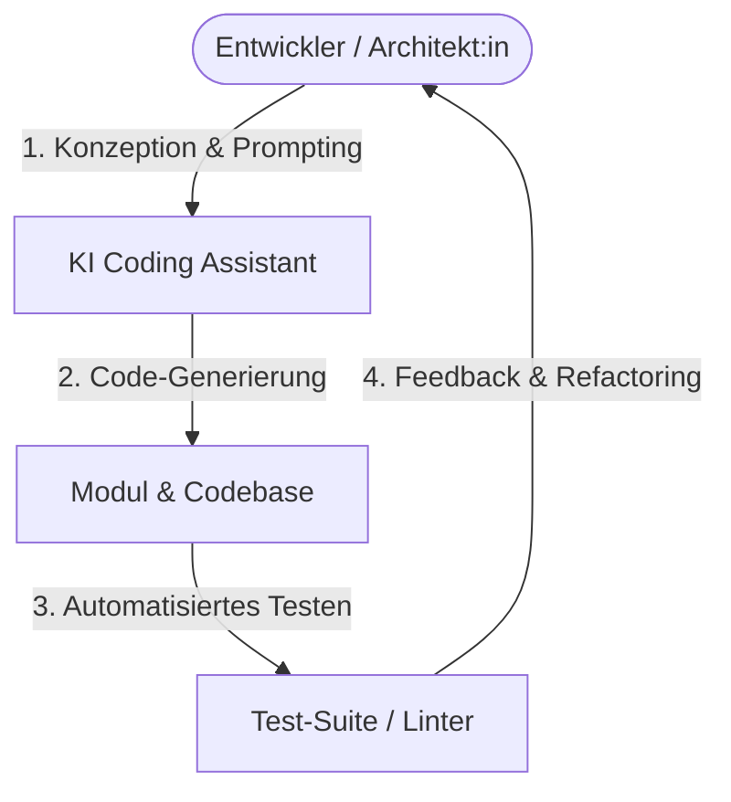
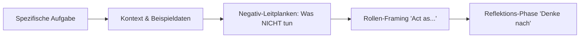

# Vibe Coding – Das Praxis-Handbuch & Prompting-Leitfaden

**Vibe Coding** bezeichnet eine moderne, KI-gestützte Art der Softwareentwicklung, bei der Entwickler:innen primär als Architekt:innen, Reviewer:innen und Prompt-Engineers agieren. Anstatt jede Zeile Quellcode manuell zu tippen, lenken Sie spezialisierte KI-Systeme (wie Claude Code, Cursor, Windsurf oder ChatGPT) durch gezieltes Prompting, kontextbezogene Dokumente und iterative Testschleifen.

Dieses Handbuch fasst die wichtigsten Prinzipien, Best Practices, Context-Management-Strategien, Debugging-Techniken und Sicherheitsregeln für erfolgreiches Vibe Coding zusammen.

---

## 🚀 1. Das Vibe-Coder Mindset & Tools

### Was ist Vibe Coding?
Vibe Coding verschiebt den Fokus der Softwareentwicklung: Weg von der Syntax-Eingabe, hin zur **Konzeption, Modularisierung und Qualitätskontrolle**. Der Entwickler definiert das *Was* und *Warum*, während die KI das *Wie* umsetzt.

### KI-Tools im Überblick

| Kategorie | Tools | Hauptanwendungsfall |
|---|---|---|
| **Terminal-Agenten** | Claude Code, Antigravity CLI, Aider | Autonome Datei-Edits, Refactoring, Git-Workflows |
| **KI-Native IDEs** | Cursor, Windsurf | In-Context Auto-Complete, Repo-weites Prompting |
| **Frontend & UI Generator** | v0 (Vercel), Lovable, Replit | Blitzschnelles Prototyping von Benutzeroberflächen |
| **Generische LLMs** | ChatGPT (GPT-4o), Gemini 1.5 Pro | Brainstorming, Konzeptentwürfe, Dokumentation |

---

## 📋 2. Vor dem Coden: Planung & Architektur

!!! tip "Planung verhindert Technical Debt"
    LLMs neigen dazu, den Weg des geringsten Widerstands zu wählen. Ohne klaren Plan wird Code schnell unübersichtlich.

### Best Practices für die Planungsphase
1. **MVP in Phasen unterteilen**: Entwickeln Sie ein Minimum Viable Product (MVP) Schritt für Schritt in kleinen, überschaubaren Iterationen.
2. **Beispiele bereitstellen**: Illustrieren Sie Ihre Anforderungen mit Mockups, UI-Skizzen, Beispiel-JSONs oder Architekturdiagrammen.
3. **Plan-Dokumente erstellen**: Bitten Sie das Werkzeug (z. B. via `/plan`), die Idee zu verfeinern und die Phasen in einem zentralen Dokument festzuhalten.

---

## 🏗️ 3. Tech Stack & Standards etablieren

### Wählen Sie etablierte Technologien
* Bevorzugen Sie populäre, weit verbreitete Stacks (z. B. TypeScript, Python, React, PostgreSQL) gegenüber Nischen-Frameworks. Je mehr Trainingsdaten das LLM für den Stack besitzt, desto qualitativ hochwertiger sind die Ergebnisse.

### Standards frühzeitig durchsetzen
* **Frühes Review**: Prüfen Sie die ersten Ausgaben der KI akribisch auf Architekturentscheidungen und Code-Stil. Schchte Habits der KI summieren sich sonst schnell.
* **Modularität einfordern**: Anweisen, Dateien klein und modular zu halten (Single Responsibility Principle).
* **Refactoring-Sessions erzwingen**: KI lagert Code gerne in bestehende Riesendateien an. Bitten Sie die KI regelmäßig: *"Refaktoriere dieses Modul, entferne toten Code und spalte es in kleinere Dateien auf."*

---

## ✍️ 4. Prompting Best Practices

Die Qualität der Code-Generierung steht in direktem Zusammenhang mit der Präzision der Instruktionen.

### Die goldenen Prompting-Regeln

* **Eine Aufgabe pro Prompt**: Stellen Sie nie 5 Fragen auf einmal. Konzentrieren Sie sich auf eine spezifische Funktion per Iteration.
* **Negativ-Instruktionen nutzen**: Sagen Sie der KI explizit, was sie *nicht* tun soll (z. B. *"Verwende keine externen Bibliotheken für dieses Modul"*).
* **Rollen-Framing ("Act as")**: Versetzen Sie die KI in eine Rolle (z. B. *"Agieren Sie als erfahrener Senior Security Engineer..."*).
* **Brainstorming vor der Umsetzung**: Bitten Sie die KI bei komplexen Problemen: *"Analysiere erst 3 Lösungsansätze und schlage den besten vor, bevor du Code schreibst."*
* **Kontext-Dokumente pflegen (`CLAUDE.md`)**: Wiederkehrende Anweisungen direkt in der zentralen Konfigurationsdatei verankern.

---

## 🧠 5. Kontext-Management

Das Token-Kontextfenster ist die wertvollste Ressource beim Vibe Coding.

### Kontext-Hygiene
* **Kontext regelmäßig leeren (`/clear`)**: Starten Sie für ein neues Feature oder unzusammenhängende Aufgaben immer eine frische Session.
* **Die 3-Prompt-Regel**: Wenn die KI eine Fehlermeldung nach 3 Versuchen nicht lösen kann, **stoppen Sie**. Leeren Sie den Kontext und formulieren Sie die Problemstellung grundlegend neu.
* **Subagenten einsetzen**: Lagern Sie Teilaufgaben (wie Recherche oder Tests) an Subagenten aus, um den Hauptkontext sauber zu halten.

---

## 🐞 6. Systematisches Debugging

Lassen Sie die KI Fehler beheben, aber **verstehen Sie die Ursache**.

=== "Fehlerbehebung Schritt-für-Schritt"
    1. **Logs & Stacktrace übergeben**: Kopieren Sie die exakte Fehlermeldung in den Prompt.
    2. **Erklärung einfordern**: Bitten Sie die KI: *"Erkläre mir in einfachen Worten, warum dieser Fehler auftritt."*
    3. **Hypothesen aufstellen**: Bei hartnäckigen Fehlern die KI auffordern, 3 mögliche Ursachen aufzulisten.
    4. **Logging einbauen**: Befehlen Sie der KI, `console.log` oder `logging.debug` einzufügen, um Datenströme zu isolieren.
    5. **MCP Browser-Debugging**: Nutzen Sie MCP-Tools (z. B. Playwright), damit die KI Fehler im Browser selbstständig nachvollziehen kann.

---

## 🔄 7. Version Control & Git-Workflows

Git ist das Sicherheitsnetz beim Vibe Coding.

* **Sauberer Git-State**: Starten Sie jedes neue Feature auf einem frischen Branch.
* **Frequente Commits**: Nach jedem erfolgreichen KI-Schritt sofort committen (`git commit`).
* **Klar strukturierte Commit-Messages**: Lassen Sie die KI Commit-Nachrichten generieren (`git commit -m "feat: add user authentication validation"`).
* **Git für Reverts nutzen**: Verwenden Sie bei Fehlentwicklungen `git reset` oder `git checkout` statt plattformspezifischer Undo-Funktionen.

---

## 🧪 8. Testing & Test-Driven Development (TDD)

!!! warning "Standard-Verhalten von KI-Tools"
    KI-Tools tendieren dazu, funktionalen Code ohne Tests zu generieren. Zwingen Sie die KI von Anfang an zum Testen!

* **Test-Driven Development (TDD)**: Bitten Sie die KI, zuerst den Unit-Test zu schreiben. Dieser muss fehlschlagen, bevor der eigentliche Code implementiert wird.
* **Bugfix mit Breaking Tests**: Wenn ein Bug auftritt, verlangen Sie erst einen Test, der den Bug reproduziert (und fehlschlägt), und anschließend die Behebung.
* **End-to-End Tests (E2E)**: Bauen Sie automatisierte E2E-Tests für kritische Klickpfade.

---

## 🛡️ 9. Security Best Practices beim Vibe Coding

1. **Niemals Secrets hardcoden**: Passwörter, API-Schlüssel oder Tokens dürfen NIEMALS im Code landen. Weisen Sie die KI an, ausschließlich Umgebungsvariablen (`.env`) zu nutzen.
2. **Sicherheits-Audits anfordern**: Bitten Sie die KI regelmäßig explizit: *"Führe ein Sicherheits-Audit für dieses Modul durch (Prüfe auf OWASP Top 10, Injection, XSS)."*
3. **Code-Reviews vor Produktion**: Überprüfen Sie alle KI-generierten Zeilen vor dem Deployment auf Sicherheitslücken.

---

## 🔗 10. Verwandte Themen & Weiterführende Links
* [Zurück zur KI-Coding Übersicht](index.md)
* [Vibe Coding & Engineering Übersicht](vibe-coding-engineering.md)
* [Claude Code Praxis-Handbuch](claude-code-praxis.md)
* [AI Agents Praxis-Handbuch](ai-agents-praxis.md)
