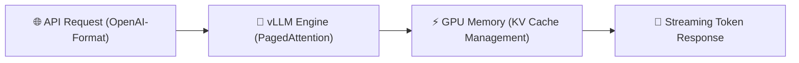

# Praxis-Guide: vLLM High-Throughput Serving & OpenAI-API

**vLLM** ist eine extrem schnelle Bibliothek zum Servieren von Large Language Models (LLMs) mit **PagedAttention**, die bis zu 14-mal höheren Durchsatz als Standard-HuggingFace-Pipelines bietet.

---



---

## 🛠️ 1. Installation

```bash
pip install vllm
```

---

## 🚀 2. vLLM Server starten (OpenAI-kompatible Schnittstelle)

```bash
python3 -m vllm.entrypoints.openai.api_server \
    --model Qwen/Qwen2.5-Coder-7B-Instruct \
    --port 8000 \
    --gpu-memory-utilization 0.9 \
    --max-model-len 8192
```

---

## 🐍 3. Nutzung mit dem Standard OpenAI Python SDK

Da vLLM die OpenAI API 1:1 nachbildet, kann jedes OpenAI-kompatible SDK direkt verwendet werden:

```python
from openai import OpenAI

# Verbinde zum lokalen vLLM Server
client = OpenAI(
    base_url="http://localhost:8000/v1",
    api_key="EMPTY" # Kein Key benötigt für lokale Instanz
)

response = client.chat.completions.create(
    model="Qwen/Qwen2.5-Coder-7B-Instruct",
    messages=[
        {"role": "system", "content": "Du bist ein präziser Python-Entwickler."},
        {"role": "user", "content": "Schreibe eine Funktion zum Invertieren eines Binärbaums."}
    ],
    temperature=0.2,
    stream=True # Streaming Token Aktiviert
)

for chunk in response:
    if chunk.choices[0].delta.content:
        print(chunk.choices[0].delta.content, end="", flush=True)
print()
```

---

## 🔗 Verwandte Themen
* [Lokales RAG & LLM-Serving](lokales-rag-ollama.md) – Ollama vs vLLM
* [Skalierbare KI/ML-Infrastrukturen](../../entwicklung/infrastruktur/ki-ml-infrastrukturen.md) – Server-Infrastrukturen
