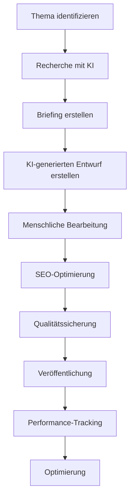

# Content-Strategie mit KI: Planung, Erstellung & Optimierung

Ein umfassender Leitfaden zur Entwicklung einer datengetriebenen, KI-gestützten Content-Strategie – von der Planung über die Erstellung bis zur kontinuierlichen Optimierung.

---

## 🎯 Einführung: Warum eine KI-gestützte Content-Strategie?

### Traditionelle vs. KI-gestützte Content-Strategie

| Aspekt | Traditionell | Mit KI |
|--------|-------------|-------|
| **Planung** | Intuition & Erfahrung | Datengetrieben & prädiktiv |
| **Recherche** | Manuell, zeitaufwendig | Automatisiert, umfassend |
| **Erstellung** | Menschlich, langsam | KI-gestützt, skalierbar |
| **Optimierung** | Rückwärtsgerichtet | Echtzeit & kontinuierlich |
| **Personalisierung** | Segmente | Individuelle Nutzer |
| **Skalierung** | Begrenzt | Theoretisch unbegrenzt |

### Vorteile einer KI-gestützten Content-Strategie

✅ **Effizienzsteigerung** – Bis zu 80% Zeitersparnis bei Content-Produktion
✅ **Qualitätsverbesserung** – Datengetriebene Entscheidungen für bessere Ergebnisse
✅ **Kostensenkung** – Reduzierung der Produktionskosten um 40-60%
✅ **Personalisierung** – Individuelle Inhalte für jede Zielgruppe
✅ **Skalierbarkeit** – Content-Produktion im großen Maßstab
✅ **Echtzeit-Optimierung** – Anpassung an aktuelle Trends und Nutzerverhalten
✅ **Wettbewerbsvorteil** – Schnellerer Time-to-Market als Mitbewerber

---

## 📊 Strategische Planung mit KI

### Schritt 1: Zieldefinition

#### SMART-Ziele für Content-Marketing

| Ziel | Spezifisch | Messbar | Erreichbar | Relevant | Zeitgebunden |
|------|-----------|----------|------------|-----------|--------------|
| **Brand Awareness** | Bekanntheitsgrad erhöhen | Reichweite, Impressions | +20% in 6 Monaten | Ja | 6 Monate |
| **Lead-Generierung** | 100 qualifizierte Leads/Monat | Conversion Rate | +15% | Ja | Monatlich |
| **Kundengewinnung** | 10 neue Kunden/Monat | Sales Attribution | +10% | Ja | Monatlich |
| **Engagement** | Engagement Rate erhöhen | Likes, Kommentare, Shares | +25% | Ja | Quartalsweise |
| **Thought Leadership** | Expertenstatus aufbauen | Backlinks, Shares | +30% | Ja | 12 Monate |

#### KI-gestützte Zielsetzung

```python
import numpy as np
from sklearn.linear_model import LinearRegression

# Historische Daten (Beispiel)
# [Monat, Investition, Leads, Kunden]
historical_data = np.array([
    [1, 5000, 50, 5],
    [2, 5500, 60, 6],
    [3, 6000, 75, 8],
    [4, 6500, 80, 9],
    [5, 7000, 90, 10],
    [6, 7500, 100, 12]
])

# Zielvariablen
X = historical_data[:, [1, 2]]  # Investition, Leads
Y = historical_data[:, 3]      # Kunden

# Modell trainieren
model = LinearRegression()
model.fit(X, Y)

# Vorhersage für nächstes Quartal
next_quarter = np.array([[8000, 110]])  # Investition: 8000, erwartete Leads: 110
predicted_customers = model.predict(next_quarter)

print(f"Vorhergesagte Kunden: {predicted_customers[0]:.0f}")
```

### Schritt 2: Zielgruppenanalyse mit KI

#### KI-gestützte Persona-Erstellung

```python
import pandas as pd
from sklearn.cluster import KMeans
from sklearn.preprocessing import StandardScaler

# Beispiel-Daten
customer_data = pd.DataFrame({
    'Age': [25, 35, 45, 22, 30, 40, 28, 38],
    'Income': [50000, 80000, 120000, 45000, 60000, 90000, 55000, 85000],
    'Engagement': [0.8, 0.6, 0.4, 0.9, 0.7, 0.5, 0.85, 0.65],
    'Purchase_Frequency': [5, 3, 1, 8, 4, 2, 6, 3]
})

# Normalisierung
scaler = StandardScaler()
scaled_data = scaler.fit_transform(customer_data)

# Clustering
kmeans = KMeans(n_clusters=3)
customer_data['Cluster'] = kmeans.fit_predict(scaled_data)

print("Personas basierend auf Clustering:")
for cluster in customer_data['Cluster'].unique():
    cluster_data = customer_data[customer_data['Cluster'] == cluster]
    print(f"\nPersona {cluster + 1}:")
    print(f"  Durchschnittsalter: {cluster_data['Age'].mean():.1f}")
    print(f"  Durchschnittseinkommen: ${cluster_data['Income'].mean():.0f}")
    print(f"  Durchschnitts-Engagement: {cluster_data['Engagement'].mean():.2f}")
```

#### Persona-Beispiel

**Persona 1: Der junge Tech-Enthusiast**
- **Demografie**: 20-30 Jahre, männlich/weiblich, urban
- **Beruf**: IT, Startups, Digital Natives
- **Interessen**: KI, Blockchain, SaaS, Produktivität
- **Content-Präferenzen**: Technische Tutorials, Case Studies, Produktvergleiche
- **Kanäle**: LinkedIn, Twitter, Tech-Blogs, YouTube
- **Kaufverhalten**: Impulsiv, informationsgetrieben

**Persona 2: Der erfahrene Entscheidungs-Träger**
- **Demografie**: 35-50 Jahre, Führungskraft
- **Beruf**: C-Level, Management, Consulting
- **Interessen**: ROI, Business Strategy, Scalability
- **Content-Präferenzen**: Whitepapers, ROI-Analysen, Best Practices
- **Kanäle**: LinkedIn, E-Mail-Newsletter, Webinare
- **Kaufverhalten**: Analytisch, langfristig

**Persona 3: Der praktische Anwender**
- **Demografie**: 25-45 Jahre, Fachkräfte
- **Beruf**: Entwicklung, Marketing, Operations
- **Interessen**: How-To Guides, Praxisbeispiele, Tipps & Tricks
- **Content-Präferenzen**: Tutorials, Schritt-für-Schritt-Anleitungen, Tools
- **Kanäle**: YouTube, Blogs, Foren, Social Media
- **Kaufverhalten**: Praktisch, lösungsorientiert

### Schritt 3: Wettbewerbsanalyse mit KI

#### Content-Gap-Analyse

```python
import requests
from bs4 import BeautifulSoup
from collections import Counter

# Wettbewerber-Websites analysieren
def analyze_competitor_content(url):
    response = requests.get(url)
    soup = BeautifulSoup(response.text, 'html.parser')
    
    # Themen extrahieren
    headings = [h.get_text().lower() for h in soup.find_all(['h1', 'h2', 'h3'])]
    
    # Keywords extrahieren
    words = [word.lower() for text in soup.stripped_strings 
             for word in text.split() if len(word) > 4]
    
    return {
        'headings': Counter(headings),
        'keywords': Counter(words)
    }

# Beispiel: Content-Gap-Analyse
competitors = [
    'https://competitor1.com/blog',
    'https://competitor2.com/resources',
    'https://competitor3.com/insights'
]

all_topics = Counter()
for url in competitors:
    analysis = analyze_competitor_content(url)
    all_topics.update(analysis['headings'])
    all_topics.update(analysis['keywords'])

print("Top Themen bei Wettbewerbern:")
for topic, count in all_topics.most_common(10):
    print(f"  {topic}: {count}")
```

#### KI-Tools für Wettbewerbsanalyse

| Tool | Funktion | Preis |
|------|----------|-------|
| **SEMrush** | Content-Gap-Analyse, Keyword-Analyse | Ab $129/Monat |
| **Ahrefs** | Backlink-Analyse, Content-Explorer | Ab $99/Monat |
| **BuzzSumo** | Virale Inhalte identifizieren | Ab $99/Monat |
| **SpyFu** | Wettbewerbsforschung | Ab $39/Monat |
| **SimilarWeb** | Traffic-Analyse | Ab $199/Monat |
| **Crayon** | Echtzeit-Wettbewerbsmonitoring | individuell |

---

## 📝 Content-Planung mit KI

### Content-Themenfindung

#### KI-gestützte Themenrecherche

**Methoden:**
1. **Google Trends** – Aufstrebende Suchanfragen identifizieren
2. **AnswerThePublic** – Fragen der Nutzer verstehen
3. **BuzzSumo** – Virale Inhalte analysieren
4. **Reddit & Foren** – Community-Fragen und Diskussionen
5. **Social Media** – Trendende Themen und Hashtags
6. **Kundenfeedback** – Häufige Fragen und Probleme

**KI-Tool-Empfehlungen:**
- **Google Trends API** – Suchtrends analysieren
- **AlsoAsked** – Semantische Suchanfragen
- **SparkToro** – Zielgruppenforschung
- **Clearscope** – Content-Recherche
- **MarketMuse** – Themen-Clusterung

#### Themen-Clusterung mit KI

```python
from sklearn.feature_extraction.text import TfidfVectorizer
from sklearn.cluster import KMeans

# Beispiel-Themen
topics = [
    "KI in der Content-Erstellung",
    "Wie man mit KI Blog-Posts schreibt",
    "KI-Tools für Social Media Marketing",
    "Automatisierte Übersetzungen mit KI",
    "KI für SEO-Optimierung",
    "Chatbots und Kundenservice",
    "KI in der Bildbearbeitung",
    "Video-Generierung mit KI",
    "KI für E-Mail-Marketing",
    "Personalisierung mit KI"
]

# TF-IDF Vektorisierung
vectorizer = TfidfVectorizer()
X = vectorizer.fit_transform(topics)

# Clustering
kmeans = KMeans(n_clusters=3)
clusters = kmeans.fit_predict(X)

# Themen nach Clustern gruppieren
clustered_topics = {}
for i, cluster in enumerate(clusters):
    if cluster not in clustered_topics:
        clustered_topics[cluster] = []
    clustered_topics[cluster].append(topics[i])

print("Themen-Cluster:")
for cluster, topics in clustered_topics.items():
    print(f"\nCluster {cluster + 1}:")
    for topic in topics:
        print(f"  - {topic}")
```

### Content-Kalender mit KI

#### Automatisierte Kalendergenerierung

```python
import pandas as pd
from datetime import datetime, timedelta
import random

# Content-Typen und ihre Häufigkeit
content_types = {
    'Blog-Post': {'frequency': 2, 'effort': 'high', 'impact': 'high'},
    'Social Media Post': {'frequency': 10, 'effort': 'low', 'impact': 'medium'},
    'Video': {'frequency': 1, 'effort': 'very high', 'impact': 'very high'},
    'Infografik': {'frequency': 1, 'effort': 'high', 'impact': 'high'},
    'E-Mail-Newsletter': {'frequency': 4, 'effort': 'medium', 'impact': 'high'},
    'Case Study': {'frequency': 1, 'effort': 'very high', 'impact': 'very high'},
    'Webinar': {'frequency': 1, 'effort': 'very high', 'impact': 'very high'}
}

# Kalender erstellen
def generate_content_calendar(start_date, weeks=12):
    calendar = []
    current_date = start_date
    
    for week in range(weeks):
        for day in range(7):  # Montag bis Sonntag
            date = current_date + timedelta(days=day)
            
            # Wochenende überspringen (optional)
            if date.weekday() >= 5:  # Samstag = 5, Sonntag = 6
                continue
            
            # Content-Typ basierend auf Häufigkeit auswählen
            # Einfachere Version: Zufällige Auswahl
            content_type = random.choice(list(content_types.keys()))
            
            calendar.append({
                'Date': date.strftime('%Y-%m-%d'),
                'Day': date.strftime('%A'),
                'Content Type': content_type,
                'Effort': content_types[content_type]['effort'],
                'Impact': content_types[content_type]['impact']
            })
        
        current_date += timedelta(weeks=1)
    
    return pd.DataFrame(calendar)

# Kalender generieren
start_date = datetime.today()
calendar = generate_content_calendar(start_date)
print(calendar.head(10))
```

#### KI-gestützte Kalender-Optimierung

**Faktoren für optimale Planung:**
1. **Saisonale Trends** – Feiertage, Events, Jahreszeiten
2. **Nutzerverhalten** – Wann ist die Zielgruppe am aktivsten?
3. **Content-Lebenszyklus** – Wie lange bleibt Content relevant?
4. **Ressourcenverfügbarkeit** – Team-Kapazitäten berücksichtigen
5. **Wettbewerbsaktivität** – Wann posten Wettbewerber?

### Content-Mix bestimmen

| Content-Typ | Anteil | Ziel | KPI |
|-------------|--------|------|-----|
| **Blog-Posts** | 30% | Traffic, SEO | Seitenaufrufe, Backlinks |
| **Social Media** | 25% | Engagement, Brand Awareness | Likes, Shares, Kommentare |
| **Videos** | 15% | Engagement, Conversion | Views, Watch Time, CTR |
| **E-Mails** | 10% | Lead-Generierung, Conversion | Open Rate, Click Rate |
| **Whitepapers/Guides** | 10% | Thought Leadership | Downloads, Leads |
| **Case Studies** | 5% | Vertrauen, Social Proof | Shares, Backlinks |
| **Webinare/Events** | 5% | Lead-Generierung, Authority | Registrierungen, Teilnehmer |

---

## ✍️ Content-Erstellung mit KI

### KI-gestützte Content-Produktion

#### Workflow für KI-generierten Content



#### KI-Tools für verschiedene Content-Typen

| Content-Typ | KI-Tool | Funktion |
|-------------|---------|----------|
| **Blog-Posts** | Jasper, Copy.ai, Writesonic | Textgenerierung |
| **Social Media** | Canva Magic Write, Hootsuite | Post-Generierung |
| **Videos** | Synthesia, Pictory, Runway ML | Video-Erstellung |
| **Bilder** | Midjourney, DALL·E, Stable Diffusion | Bildgenerierung |
| **E-Mails** | Lavender, Crystal | E-Mail-Optimierung |
| **Technische Docs** | GitHub Copilot, Notion AI | Dokumentation |
| **Übersetzungen** | DeepL, Google Translate | Mehrsprachigkeit |

### Content-Briefing mit KI

**Elemente eines guten Content-Briefings:**

1. **Ziel** – Was soll der Content erreichen?
2. **Zielgruppe** – Für wen ist der Content?
3. **Haupt-Keyword** – Primäres SEO-Keyword
4. **Sekundäre Keywords** – Unterstützende Keywords
5. **Tonfall & Stil** – Formell, informell, technisch, etc.
6. **Länge** – Wortanzahl oder Dauer
7. **Struktur** – Überschriften, Abschnitte, CTA
8. **Referenzen** – Beispiele, Links, Quellen
9. **Deadline** – Frist für Fertigstellung
10. **Verantwortlicher** – Wer ist zuständig?

**KI-generiertes Briefing-Beispiel:**
```markdown
# Content-Briefing: KI in der Content-Erstellung

## Ziel
- Zielgruppe über KI-Tools für Content-Erstellung informieren
- Leads für KI-Beratungsdienstleistung generieren
- Thought Leadership in KI & Marketing aufbauen

## Zielgruppe
- Content-Marketing-Manager
- Digital Marketing Specialists
- Startup-Gründer
- Agentur-Inhaber

## Keywords
- Primär: "KI Content Erstellung"
- Sekundär: "KI Tools für Marketing", "Content Automatisierung", "KI Blog schreiben"

## Tonfall & Stil
- Professionell, aber zugänglich
- Praktische Beispiele einbauen
- Daten und Statistiken einbeziehen

## Länge
- 1.500-2.000 Wörter

## Struktur
1. Einführung (200 Wörter)
2. Vorteile von KI in der Content-Erstellung (400 Wörter)
3. Top KI-Tools für Content-Marketing (600 Wörter)
4. Praktische Anwendungsbeispiele (400 Wörter)
5. Herausforderungen und Lösungen (300 Wörter)
6. Fazit mit CTA (100 Wörter)

## Referenzen
- [State of AI in Marketing Report 2024](link)
- [Case Study: KI bei Unternehmen X](link)

## Deadline
- 14 Tage ab heute
```

### KI-gestützte Content-Optimierung

#### SEO-Optimierung mit KI

**KI-Tools:**
- **SurferSEO** – Content-Scoring und Optimierung
- **Clearscope** – Keyword-Recherche und Content-Briefings
- **MarketMuse** – Themenrecherche und Content-Strategie
- **Frase** – SEO-Optimierung und Content-Analyse

**Beispiel: Content-Scoring mit SurferSEO**
1. Keyword eingeben
2. Wettbewerber analysieren
3. Content-Score erhalten (0-100)
4. Optimierungsempfehlungen umsetzen

#### Lesbarkeits-Optimierung mit KI

```python
import textstat

def analyze_readability(text):
    metrics = {
        'Flesch Reading Ease': textstat.flesch_reading_ease(text),
        'Flesch-Kincaid Grade': textstat.flesch_kincaid_grade(text),
        'SMOG Index': textstat.smog_index(text),
        'Coleman-Liau Index': textstat.coleman_liau_index(text),
        'Automated Readability Index': textstat.automated_readability_index(text),
        'Dale-Chall Readability Score': textstat.dale_chall_readability_score(text),
        'Difficult Words': textstat.difficult_words(text),
        'Linsear Write Formula': textstat.linsear_write_formula(text),
        'Gunning Fog': textstat.gunning_fog(text)
    }
    return metrics

# Beispiel
text = """
KI revolutioniert die Content-Erstellung. Mit modernen Tools können Marketer 
hochwertige Inhalte in einem Bruchteil der Zeit erstellen. Diese Technologien 
nutzen maschinelles Lernen, um Texte zu generieren, die kaum von menschlichen 
Autoren zu unterscheiden sind.
"""

readability = analyze_readability(text)
for metric, value in readability.items():
    print(f"{metric}: {value:.2f}")
```

---

## 📊 Content-Verteilung & Promotion mit KI

### KI-gestützte Verteilungsstrategie

#### Optimaler Veröffentlichungszeitpunkt

**Datengetriebene Empfehlungen:**

| Plattform | Beste Zeiten | KI-Optimierung |
|-----------|-------------|---------------|
| **Blog** | Dienstag, 10 Uhr | Nutzerverhalten analysieren |
| **E-Mail** | Dienstag/Mittwoch, 10-11 Uhr | A/B-Tests durchführen |
| **Facebook** | Mittwoch, 11-12 Uhr | Engagement-Daten |
| **Instagram** | Donnerstag, 19-20 Uhr | Algorithmus-Anpassung |
| **LinkedIn** | Dienstag, 8-10 Uhr | Business-Zeiten |
| **Twitter** | Freitag, 9 Uhr | Echtzeit-Trends |
| **YouTube** | Donnerstag/Freitag, 14-16 Uhr | Viewer-Analytics |

**KI-Tools für Timing-Optimierung:**
- **Hootsuite Insights** – KI-gestützte Zeitplanung
- **Buffer Analyze** – Beste Posting-Zeiten
- **Sprout Social** – Optimale Zeitslots
- **CoSchedule** – Content-Kalender mit KI

### KI-gestützte Channel-Auswahl

```python
import pandas as pd
from sklearn.ensemble import RandomForestClassifier

# Trainingsdaten (Beispiel)
data = pd.DataFrame({
    'Content_Type': ['Blog', 'Video', 'Infografik', 'Blog', 'Video'],
    'Topic': ['KI', 'Tutorial', 'KI', 'Marketing', 'KI'],
    'Length': [1500, 500, 200, 2000, 800],
    'Channel': ['LinkedIn', 'YouTube', 'Instagram', 'Blog', 'YouTube'],
    'Engagement': [150, 300, 200, 180, 250]
})

# Feature-Engineering
data['Content_Length'] = data['Length'] / 1000  # Normalisiert

# Modell trainieren
X = pd.get_dummies(data[['Content_Type', 'Topic', 'Content_Length']])
y = data['Channel']

model = RandomForestClassifier()
model.fit(X, y)

# Vorhersage für neuen Content
def predict_best_channel(content_type, topic, length):
    new_data = pd.DataFrame({
        'Content_Type': [content_type],
        'Topic': [topic],
        'Content_Length': [length / 1000]
    })
    new_data = pd.get_dummies(new_data)
    # Spalten anpassen
    for col in X.columns:
        if col not in new_data.columns:
            new_data[col] = 0
    new_data = new_data[X.columns]
    
    prediction = model.predict(new_data)
    return prediction[0]

# Beispiel
best_channel = predict_best_channel('Blog', 'KI', 1500)
print(f"Bester Kanal für Blog über KI mit 1500 Wörtern: {best_channel}")
```

### Automatisierte Content-Verteilung

**KI-Tools für Distribution:**
- **Hootsuite** – Multi-Plattform-Posting
- **Buffer** – Automatisches Scheduling
- **MeetEdgar** – Content-Recycling
- **SocialBee** – Evergreen Content-Verteilung
- **CoSchedule** – All-in-One Marketing-Kalender

**Beispiel: Automatisierte Verteilung mit Hootsuite**
```python
# Pseudocode für automatisierte Verteilung
import hootsuite_api

def distribute_content(content, platforms):
    for platform in platforms:
        # Content für Plattform anpassen
        adapted_content = adapt_for_platform(content, platform)
        
        # Beste Zeit berechnen
        best_time = get_optimal_time(platform)
        
        # Post erstellen und planen
        hootsuite_api.create_scheduled_post(
            platform=platform,
            content=adapted_content,
            schedule_time=best_time
        )
```

---

## 📈 Performance-Tracking & Optimierung

### KI-gestützte Content-Analyse

#### Content-Performance-Metriken

| Metrik | Beschreibung | Zielwert | Optimierungsansatz |
|--------|--------------|-----------|-------------------|
| **Seitenaufrufe** | Anzahl der Views | Steigend | SEO, Promotion |
| **Durchschnittliche Verweildauer** | Zeit auf der Seite | > 3 Minuten | Content-Qualität |
| **Bounce Rate** | Prozent der sofortigen Abgänge | < 50% | Relevanz, Ladezeit |
| **Social Shares** | Anzahl der Teilungen | Steigend | Viralität |
| **Backlinks** | Externe Verlinkungen | Steigend | Qualität, Netzwerk |
| **Conversion Rate** | Prozent der gewünschten Aktionen | > 2% | CTA, Targeting |
| **Engagement Rate** | Interaktionen pro View | > 3% | Content-Qualität |
| **ROI** | Return on Investment | > 100% | Effizienz |

#### Prädiktive Content-Analyse

```python
from sklearn.ensemble import RandomForestRegressor
import pandas as pd

# Historische Content-Daten
data = pd.DataFrame({
    'Word_Count': [1000, 1500, 2000, 800, 1200],
    'Images': [3, 5, 2, 1, 4],
    'Videos': [0, 1, 0, 0, 1],
    'Keywords': [5, 8, 10, 3, 6],
    'Promotion_Spend': [100, 200, 150, 50, 180],
    'Views': [5000, 8000, 12000, 3000, 7000],
    'Shares': [50, 120, 80, 20, 90],
    'Conversions': [20, 45, 35, 10, 30]
})

# Modell trainieren
X = data[['Word_Count', 'Images', 'Videos', 'Keywords', 'Promotion_Spend']]
y_views = data['Views']
y_shares = data['Shares']
y_conversions = data['Conversions']

model_views = RandomForestRegressor()
model_views.fit(X, y_views)

model_shares = RandomForestRegressor()
model_shares.fit(X, y_shares)

# Vorhersage für neuen Content
def predict_performance(word_count, images, videos, keywords, spend):
    new_content = pd.DataFrame({
        'Word_Count': [word_count],
        'Images': [images],
        'Videos': [videos],
        'Keywords': [keywords],
        'Promotion_Spend': [spend]
    })
    
    predicted_views = model_views.predict(new_content)[0]
    predicted_shares = model_shares.predict(new_content)[0]
    
    return {
        'Views': int(predicted_views),
        'Shares': int(predicted_shares)
    }

# Beispiel
prediction = predict_performance(1500, 5, 1, 8, 200)
print(f"Vorhergesagte Performance: {prediction['Views']} Views, {prediction['Shares']} Shares")
```

### A/B-Testing mit KI

**KI-gestütztes A/B-Testing:**
1. **Automatische Varianten-Generierung** – KI erstellt multiple Versionen
2. **Echtzeit-Analyse** – KI bewertet Performance in Echtzeit
3. **Automatische Optimierung** – KI wählt die beste Variante aus
4. **Personalisierung** – KI passt Inhalte an einzelne Nutzer an

**KI-Tools für A/B-Testing:**
- **Google Optimize** – Website-Experimente
- **Optimizely** – Feature-Experimente
- **VWO** – Visual Website Optimizer
- **AdEspresso** – Facebook Ads A/B-Testing
- **Unbounce** – Landing Page Testing

**Beispiel: A/B-Test für E-Mail-Betreffzeilen**
```python
# A/B-Test für Betreffzeilen
subject_variants = [
    "Entdecken Sie die Zukunft der Content-Erstellung",
    "Wie KI Ihre Content-Strategie revolutioniert",
    "5 KI-Tools, die jeder Marketer kennen sollte",
    "Sparen Sie Zeit mit KI-gestützter Content-Erstellung"
]

# KI-gestützte Vorhersage der Open Rates
def predict_open_rate(subject):
    # Vereinfachtes Modell
    keywords = ['Zukunft', 'revolutioniert', 'Tools', 'Zeit sparen', 'KI']
    score = sum(1 for kw in keywords if kw.lower() in subject.lower())
    return min(score * 5 + 20, 80)  # 20-80%

for subject in subject_variants:
    open_rate = predict_open_rate(subject)
    print(f"'{subject}': Vorhergesagte Open Rate: {open_rate}%")
```

---

## 🔄 Kontinuierliche Optimierung

### Content-Audit mit KI

**Schritte für ein KI-gestütztes Content-Audit:**

1. **Inventar erstellen** – Alle Inhalte erfassen
2. **Performance analysieren** – Metriken für jeden Inhalt
3. **Content-Qualität bewerten** – KI-gestützte Qualitätsscores
4. **Lücken identifizieren** – Themen, die fehlen
5. **Optimierungspotenziale** – Inhalte mit Verbesserungspotenzial
6. **Archive/Löschen** – Veraltete oder schlecht performende Inhalte

**KI-Tools für Content-Audits:**
- **Google Analytics** – Performance-Daten
- **SEMrush** – SEO-Audit
- **Ahrefs** – Backlink-Analyse
- **SurferSEO** – Content-Qualität
- **MarketMuse** – Themenlücken

### Evergreen Content Identifikation

**KI-gestützte Evergreen-Erkennung:**

```python
import pandas as pd
from sklearn.cluster import KMeans

# Content-Daten (Beispiel)
data = pd.DataFrame({
    'Title': ['KI Grundlagen', 'Neues Feature X', 'Content-Strategie 2024', 'SEO-Tipps'],
    'Views': [5000, 1000, 2000, 3000],
    'Age_Days': [365, 30, 60, 180],
    'Shares': [50, 5, 10, 30],
    'Backlinks': [20, 2, 5, 15],
    'Bounce_Rate': [0.4, 0.7, 0.5, 0.45]
})

# Normalisierung
data_normalized = (data[['Views', 'Age_Days', 'Shares', 'Backlinks', 'Bounce_Rate']] -
                   data[['Views', 'Age_Days', 'Shares', 'Backlinks', 'Bounce_Rate']].min()) / \
                  (data[['Views', 'Age_Days', 'Shares', 'Backlinks', 'Bounce_Rate']].max() -
                   data[['Views', 'Age_Days', 'Shares', 'Backlinks', 'Bounce_Rate']].min())

# Clustering
kmeans = KMeans(n_clusters=2)
data['Cluster'] = kmeans.fit_predict(data_normalized)

# Evergreen Content identifizieren (Cluster mit hoher Performance & Alter)
evergreen_content = data[data['Cluster'] == 0]  # Annahme: Cluster 0 = Evergreen
print("Evergreen Content:")
print(evergreen_content[['Title', 'Views', 'Age_Days', 'Shares']])
```

### Content-Recycling-Strategien

| Strategie | Beschreibung | KI-Unterstützung |
|-----------|--------------|-----------------|
| **Aktualisierung** | Veraltete Inhalte aktualisieren | Themen-Trends analysieren |
| **Neuformatierung** | Blog → Video, Infografik → Karussell | Automatische Umwandlung |
| **Zusammenschluss** | Ähnliche Inhalte zu umfassendem Guide kombinieren | Themen-Clusterung |
| **Repurposing** | Inhalte für neue Plattformen anpassen | Format-Optimierung |
| **Saisonale Anpassung** | Inhalte für Feiertage/Events aktualisieren | Kalender-Analyse |

---

## 🎓 Best Practices für KI-gestützte Content-Strategie

### ✅ DO's

1. **Klar definierte Ziele** – SMART-Ziele für messbaren Erfolg
2. **Zielgruppen verstehen** – KI-gestützte Personas erstellen
3. **Daten nutzen** – Entscheidungen auf Daten basieren
4. **Qualität vor Quantität** – Hochwertiger Content zuerst
5. **KI als Werkzeug** – Menschliche Expertise bleibt essenziell
6. **Kontinuierlich testen** – A/B-Tests und Optimierungen
7. **Performance tracken** – Regelmäßige Analysen durchführen
8. **Agil bleiben** – Anpassung an neue Daten und Trends

### ❌ DON'Ts

1. **Blind auf KI vertrauen** – Immer menschliche Überprüfung
2. **Qualität für Quantität opfern** – Massenerstellung ohne Qualität
3. **Zielgruppe ignorieren** – Content ohne Relevanz
4. **SEO vergessen** – Content ohne Suchmaschinenoptimierung
5. **Daten ignorieren** – Entscheidungen ohne Analyse
6. **KI als Ersatz sehen** – Menschliche Kreativität bleibt wichtig
7. **Stagnieren** – Keine kontinuierliche Optimierung

---

## 🔮 Zukunft der Content-Strategie mit KI

### Aufstrebende KI-Trends in Content-Marketing

| Trend | Beschreibung | Zeitrahmen | Impact |
|-------|--------------|------------|--------|
| **Hyper-Personalisierung** | Individuelle Inhalte für jeden Nutzer | 2024-2025 | Hoch |
| **Echtzeit-Content** | Dynamische Anpassung in Echtzeit | 2025-2026 | Hoch |
| **Multimodaler Content** | Kombination von Text, Bild, Audio, Video | 2024+ | Hoch |
| **Generative KI** | Vollständige Content-Erstellung durch KI | Jetzt | Hoch |
| **KI-Avatare** | Digitale Content-Creator | 2025+ | Mittel |
| **AR/VR Content** | Augmented & Virtual Reality Inhalte | 2026+ | Mittel |
| **Voice Content** | Sprachbasierte Inhalte | 2025+ | Hoch |
| **Interaktiver Content** | KI-gestützte Chatbots & Quizze | 2024+ | Hoch |

### KI-Technologien der Zukunft

1. **LLMs (Large Language Models)** – Noch bessere Textgenerierung
2. **Multimodale Modelle** – Kombination verschiedener Content-Typen
3. **Diffusion Models** – Hochwertige Bild- und Video-Generierung
4. **Reinforcement Learning** – Kontinuierliche Verbesserung durch Feedback
5. **Neuro-Symbolische KI** – Kombination von Lernen und logischem Denken
6. **Edge AI** – KI auf lokalen Geräten für Echtzeit-Verarbeitung

---

## 📚 Ressourcen & Weiterbildung

### Kostenlose Tools & Ressourcen

- [Google Analytics](https://analytics.google.com/) – Performance-Tracking
- [Google Search Console](https://search.google.com/search-console) – SEO-Analyse
- [Google Trends](https://trends.google.com/) – Suchtrends
- [AnswerThePublic](https://answerthepublic.com/) – Nutzerfragen
- [Ubersuggest](https://neilpatel.com/ubersuggest/) – Keyword-Recherche
- [Canva](https://www.canva.com/) – Grafikdesign mit KI

### Bezahlte Tools

- [SEMrush](https://www.semrush.com/) – SEO & Content-Marketing
- [Ahrefs](https://ahrefs.com/) – Backlink-Analyse & Content-Recherche
- [SurferSEO](https://surferseo.com/) – Content-Optimierung
- [Clearscope](https://www.clearscope.io/) – Content-Strategie
- [MarketMuse](https://www.marketmuse.com/) – Themenrecherche
- [Hootsuite](https://hootsuite.com/) – Social Media Management
- [Buffer](https://buffer.com/) – Content-Scheduling

### Lernressourcen

- [HubSpot Academy](https://academy.hubspot.com/) – Content-Marketing-Kurse
- [Content Marketing Institute](https://contentmarketinginstitute.com/) – Best Practices & Trends
- [Moz Academy](https://academy.moz.com/) – SEO & Content-Marketing
- [Coursera: Content Strategy](https://www.coursera.org/) – Universitätskurse
- [Copyblogger](https://copyblogger.com/) – Blog mit Tipps & Guides

### Bücher

- "Content Strategy for the Web" – Kristina Halvorson, Melissa Rach
- "Everybody Writes" – Ann Handley
- "The Content Formula" – Michael Brenner, Liz Bedor
- "Building a StoryBrand" – Donald Miller
- "AI for Marketing" – Christopher Penn

### Communities & Netzwerke

- [r/content_marketing](https://www.reddit.com/r/content_marketing/) – Content-Marketing Subreddit
- [r/SEO](https://www.reddit.com/r/SEO/) – Suchmaschinenoptimierung
- [Content Marketing Institute Community](https://contentmarketinginstitute.com/community/) – Fachcommunity
- [Inbound.org](https://www.inbound.org/) – Marketing-Community
- [GrowthHackers](https://growthhackers.com/) – Growth Marketing

---

## 🔗 Verwandte Themen

* [Content/KI Content Creation](ki-content-creation.md) – KI-gestützte Inhaltserstellung
* [Content/KI SEO-Optimierung](ki-seo-optimierung.md) – Suchmaschinenoptimierung mit KI
* [Content/Mehrsprachige Inhalte](multilinguale-inhalte.md) – Internationale Content-Strategie
* [Content/Social Media mit KI](social-media-ki.md) – Social Media Marketing mit KI
* [Webentwicklung/Frontend mit KI](../../entwicklung/webentwicklung/ki-webentwicklung.md) – KI in der Webentwicklung
* [Tools/index](../../wissen/tools/index.md) – Content-Marketing-Tools