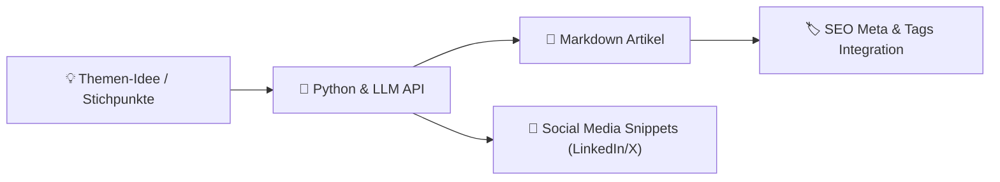

# Praxis-Guide: KI-Content-Pipeline mit Python & LLMs

In diesem Leitfaden bauen wir eine automatische Pipeline, die aus Stichpunkten oder Themen-Ideen strukturierte, SEO-optimierte Markdown-Artikel sowie Social-Media-Posts generiert.

---



---

## 🐍 1. Python Skript (`content_generator.py`)

```python
import os
import json
from langchain_ollama import ChatOllama
from langchain_core.prompts import ChatPromptTemplate

# Initialize local LLM or API
llm = ChatOllama(model="llama3.2", temperature=0.7)

prompt_template = ChatPromptTemplate.from_messages([
    ("system", "Du bist ein erfahrener Fachredakteur und SEO-Spezialist."),
    ("human", """
Erstelle zu folgendem Thema einen strukturierte Markdown-Artikel auf Deutsch:

Thema: {thema}
Zielgruppe: {zielgruppe}

Der Artikel muss Folgendes enthalten:
1. Einen prägnanten Titel (H1)
2. Einleitung mit Problemstellung
3. 2-3 Hauptabschnitte mit H2-Überschriften
4. Praktische Code- oder Ausführungsbeispiele
5. Zusammenfassung / Fazit
""")
])

def generate_article(thema: str, zielgruppe: str = "Entwickler & DevOps"):
    prompt = prompt_template.format_messages(thema=thema, zielgruppe=zielgruppe)
    response = llm.invoke(prompt)
    return response.content

# Beispielaufruf
if __name__ == "__main__":
    thema = "Einsatz von Vektordatenbanken für semantische Dokumentensuche"
    artikel_content = generate_article(thema)
    
    dateiname = "generated_article.md"
    with open(dateiname, "w", encoding="utf-8") as f:
        f.write(artikel_content)
        
    print(f"✅ Artikel erfolgreich unter '{dateiname}' gespeichert.")
```

---

## 🚀 2. Automatisches Frontmatter- & SEO-Tagger

```python
def add_seo_metadata(markdown_text: str, tags: list) -> str:
    frontmatter = f"""---
title: "{markdown_text.splitlines()[0].replace('# ', '')}"
date: "{os.popen('date +%Y-%m-%d').read().strip()}"
tags: {json.dumps(tags)}
description: "Automatisch generierter Fachartikel"
---

"""
    return frontmatter + markdown_text
```

---

## 🔗 Verwandte Themen
* [KI Content Creation](ki-content-creation.md) – Grundlagen der KI-Texterstellung
* [KI-gestützte SEO-Optimierung](ki-seo-optimierung.md) – SEO-Strategien
* [Social Media Automatisierung](social-media-ki.md) – Automatischer Social Media Export
