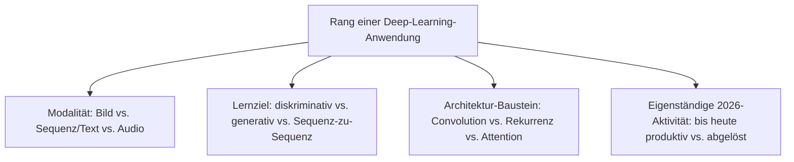
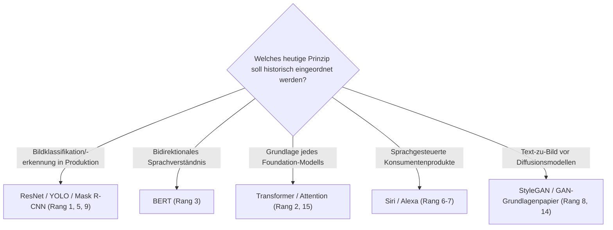

# Beste Deep-Learning-Anwendungen — Top-15-Topliste

Die [Evolution und Architekturen digitaler Deep-Learning-Anwendungen](evolution-digitaler-deep-learning-anwendungen.md) ordnet diese Architekturlinie chronologisch — vom ImageNet-Durchbruch über Sequenzmodelle, frühe Sprachassistenten und Generative Adversarial Networks bis zu Objekterkennung und dem Attention-Mechanismus, der den Übergang zu Foundation-Modellen einleitet. Diese Seite übersetzt die Chronologie in eine **nach architektonischer Bedeutung gerankte Top-15-Liste** — mehrere Bausteine dieser Zeitachse (ResNet, YOLO, BERT) sind 2026 weiterhin aktive Fundamente, keine reine Historie.

!!! note "Hinweis: aufgabenspezifisches Modell statt Foundation-Model"
    Alle hier gelisteten Systeme trainieren ein eigenes Modell pro Aufgabe — der Gegenentwurf zum promptbaren Generalisten aus [Generation 4 der KI-Anwendungen](evolution-digitaler-ki-anwendungen.md#generation-4-generative-ki-llm-gestutzte-anwendungen-ab-ca-2020). Diese Liste rankt nach **architektonischem Einfluss und aktueller Nutzung gemeinsam**.

---

## Bewertungskriterien

---

## Top 15 im Überblick

| Rang | System/Baustein | Generation | Status 2026 | Historische/aktuelle Bedeutung |
|---|---|---|---|---|
| 1 | **ResNet** | 1c (Residual Learning) | Aktiv | Skip Connections als Standard-Bauweise praktisch jeder folgenden Bildklassifikations-Architektur |
| 2 | **„Attention is All You Need"** (Vaswani et al.) | 6 (Attention-Mechanismus & Transformer-Vorabend) | Aktiv (als Fundament) | Ersetzt Rekurrenz vollständig durch Self-Attention, Grundlage aller Foundation-Modelle |
| 3 | **BERT** | 6 (Attention-Mechanismus & Transformer-Vorabend) | Aktiv | Erstes breit adoptiertes bidirektionales Transformer-Sprachmodell, markiert den Übergang zur nächsten Generation |
| 4 | **AlexNet** | 1a (ImageNet-Moment) | Historisch | Löst 2012 den gesamten Deep-Learning-Boom aus, halbiert die ImageNet-Fehlerrate |
| 5 | **YOLO** | 5 (Objekterkennung & Segmentierung) | Aktiv | Echtzeitfähige Objekterkennung in einem Netzdurchlauf, Grundlage vieler Vision-Produktionssysteme |
| 6 | **Amazon Alexa** | 3 (Sprachassistenten) | Aktiv | Etablierte Smart-Speaker als eigene Produktkategorie |
| 7 | **Siri** | 3 (Sprachassistenten) | Aktiv | Erster massentauglicher Sprachassistent, 2011 |
| 8 | **StyleGAN** | 4 (GANs & frühe generative Bildmodelle) | Aktiv (Nische) | Fotorealistische Gesichtsgenerierung, Vorläufer heutiger Diffusionsmodelle |
| 9 | **Mask R-CNN** | 5 (Objekterkennung & Segmentierung) | Aktiv | Pixelgenaue Segmentierungsmasken statt nur Begrenzungsrahmen |
| 10 | **Faster R-CNN** | 5 (Objekterkennung & Segmentierung) | Aktiv (Nische) | Zweistufiger, hochgenauer Ansatz als Gegenpol zur Echtzeit-Architektur von YOLO |
| 11 | **Google Neural Machine Translation** | 2 (Sequenz-Modelle & frühe neuronale Übersetzung) | Historisch | Produktions-Umstieg von statistischer auf neuronale Übersetzung |
| 12 | **Tiefere CNN-Architekturen** (VGGNet/GoogLeNet) | 1b (Tiefere CNNs) | Historisch | Etablierten Tiefe als Haupt-Stellschraube für Genauigkeit, bevor ResNet das Trainingsproblem löste |
| 13 | **Seq2Seq-Architektur** | 2 (Sequenz-Modelle & frühe neuronale Übersetzung) | Historisch | Encoder-Decoder-Grundmuster für maschinelle Übersetzung |
| 14 | **GAN-Grundlagenpapier** (Goodfellow et al.) | 4 (GANs & frühe generative Bildmodelle) | Historisch | Formalisiert das Generator-Diskriminator-Prinzip generativer Bildmodelle |
| 15 | **Attention-Mechanismus** (Bahdanau et al.) | 6 (Attention-Mechanismus & Transformer-Vorabend) | Historisch | Löst das Engpassproblem fester Seq2Seq-Kontextvektoren, direkte Vorstufe zum Transformer |

---

## Highlights im Detail

### Rang 1–3: die bis heute tragenden Architektur-Fundamente
ResNet, der Transformer und BERT sind keine historischen Fußnoten, sondern laufen 2026 als Bauteile praktisch jedes produktiven Vision- oder Sprachsystems weiter — Skip Connections und Self-Attention lösten je ein hartes Trainingsproblem, das jede folgende Generation direkt erbte, siehe [Generation 1c und 6](evolution-digitaler-deep-learning-anwendungen.md#generation-6-attention-mechanismus-der-transformer-vorabend-2015-2018).

### Rang 5, 9–10: Objekterkennung als Produktionsreife-Kategorie
YOLO, Mask R-CNN und Faster R-CNN bilden bis heute die technische Grundlage für autonome Fahrzeuge, Videoüberwachung und Qualitätskontrolle — Echtzeitfähigkeit (YOLO) und Genauigkeit (Faster/Mask R-CNN) bleiben ein Zielkonflikt, siehe [Generation 5](evolution-digitaler-deep-learning-anwendungen.md#generation-5-objekterkennung-segmentierung-als-produktionsreife-kategorie-2015-2018).

### Rang 2, 15: der direkte Weg zum Foundation-Model
Bahdanau-Attention und der Transformer markieren gemeinsam den entscheidenden Architekturbruch, der Generation 2 dieser Zeitachse ablöst und direkt in [Generation 4 der KI-Anwendungen](evolution-digitaler-ki-anwendungen.md#generation-4-generative-ki-llm-gestutzte-anwendungen-ab-ca-2020) mündet.

---

## Wegweiser: von Deep-Learning-Baustein zu heutiger Anwendung

!!! tip "Tipp: die KI-Haupt-Zeitachse separat prüfen"
    Diese Liste vertieft Generation 2 der übergeordneten Chronologie — für den vollständigen Sechs-Generationen-Überblick siehe [Beste KI-Anwendungen 2026](ki-anwendungen-2026-topliste.md).

---

## 🔗 Verwandte Themen

- [Startseite](../index.md) — zurück zur Dokumentations-Zentrale
- [Evolution und Architekturen digitaler Deep-Learning-Anwendungen](evolution-digitaler-deep-learning-anwendungen.md) — chronologisches Generationenmodell, dessen aktuellen Stand diese Topliste zusammenfasst
- [Beste KI-Anwendungen 2026 (Top 20)](ki-anwendungen-2026-topliste.md) — Gesamtmarkt-Topliste über alle sechs KI-Generationen hinweg
- [Beste Cloud-KI-APIs 2026 (Top 15)](cloud-ki-apis-2026-topliste.md) — Folge-Generation, die diese Modelle hinter REST-APIs verfügbar macht
- [Multimodale Vision-Pipelines](coding/multimodale-vision-pipelines.md) — praktische Umsetzung CNN-/Attention-basierter Bildverarbeitung
- [KI-Modelle & Frameworks: Übersicht](index.md) — Gesamtübersicht Modell-Kategorien und Frameworks
