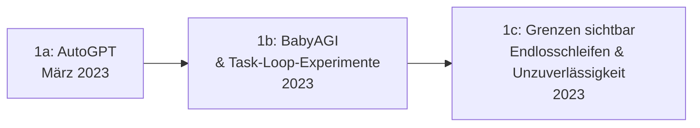

# Evolution und Architekturen digitaler Autonomer KI-Agenten

Autonome KI-Agenten und Multi-Agenten-Ökosysteme bilden Generation 6 — die aktuelle und letzte Generation — der [Evolution digitaler KI-Anwendungen](evolution-digitaler-ki-anwendungen.md). Diese eigenständige Zeitachse verfolgt die **allgemeine Agenten-Produktkategorie**: vom autonomen Einzel-Agenten über Orchestrierungs-Frameworks, Coding- und Computer-Use-Agenten bis zu herstellerseitigen Agenten-Baukästen und Multi-Agenten-Ökosystemen. Dieselbe Orchestrierungslinie speziell für **Wissenspflege** (Wikis, Dokumentation) behandelt [Evolution und Architekturen digitaler Multi-Agenten-Wissensökosysteme](../wissen/dokumentation/evolution-digitaler-multiagenten-wissensoekosysteme.md), die praktische Umsetzung [AI Agents – Das Praxis-Handbuch](coding/ai-agents-praxis.md).

!!! note "Hinweis: Generationen überlappen sich"
    Die Zeiträume sind grobe Orientierung, keine scharfen Grenzen — Einzel-Agenten-Loops (Generation 1) laufen bis heute in einfacheren Anwendungsfällen parallel zu koordinierten Multi-Agenten-Ökosystemen (Generation 6). Entscheidend ist die **Architektur der Autonomie** (wie viele Schritte ohne menschliche Bestätigung, wie viele Akteure), nicht allein das Erscheinungsjahr.

---

## Generation 1: Der autonome Einzel-Agent — Hype und Ernüchterung, 2023

Die Gründergeneration eint drei Prinzipien: **selbstständige Zielverfolgung über mehrere Schritte**, **Zugriff auf Werkzeuge** und **fehlende Aufgabenteilung** — ein einzelner Agent übernimmt Planung, Ausführung und Bewertung gleichzeitig. Sie lässt sich in drei technologische Entwicklungsstufen unterteilen:

### 1a. AutoGPT, März 2023

- **Architektur:** ein einzelner GPT-4-Agent zerlegt ein grob formuliertes Ziel selbstständig in Teilaufgaben und führt sie nacheinander aus, ohne Bestätigung pro Schritt.
- **Bedeutung:** erster breit bekannter autonomer Agent, löste eine Welle an Experimenten mit offener Aufgabenerledigung aus.

### 1b. BabyAGI & Task-Loop-Experimente, 2023

- **Architektur:** eine Aufgabenliste wird kontinuierlich neu priorisiert und um vom Agenten selbst generierte Folgeaufgaben ergänzt.
- **Fokus:** minimalistische Referenzimplementierung des „Plan → Ausführen → Neue Aufgaben generieren"-Musters.

### 1c. Grenzen sichtbar — Endlosschleifen & Unzuverlässigkeit, 2023

- **Beobachtung:** ohne prüfende zweite Instanz neigen Einzel-Agenten zu Endlosschleifen, wiederholten Fehlversuchen und Zielabdrift — die direkte Motivation für die Rollenteilung in Generation 2.

---

## Generation 2: Orchestrierungs-Frameworks etablieren sich, 2023 – 2024

Statt eines überforderten Generalisten koordinieren mehrere spezialisierte Agenten ihre Arbeit — dieselbe Architektur-Antwort wie in [Generation 3 der Multi-Agenten-Wissensökosysteme](../wissen/dokumentation/evolution-digitaler-multiagenten-wissensoekosysteme.md#generation-3-koordinierte-multi-agenten-frameworks-2023-2024), hier für allgemeine statt wissenspflege-spezifische Aufgaben.

| Framework | Prinzip |
|---|---|
| **LangGraph** | Zustandsgraph-basierte Orchestrierung arbeitsteiliger Agenten, siehe [Agentic Workflows (LangGraph)](coding/agentic-workflows-langgraph.md). |
| **CrewAI** | Rollenbasierte „Crews" aus Agenten mit fest zugewiesenen Aufgaben. |
| **AutoGen** | Konversationsbasierte Multi-Agenten-Koordination, siehe [AutoGen Multi-Agent Framework](coding/autogen-multiagent-framework.md). |

---

## Generation 3: Autonome Coding-Agenten, 2023 – 2025

Coding wird zur ersten Domäne, in der autonome Agenten produktionsreif eigenständig arbeiten — von Mehrschritt-Refactorings bis zu vollständigen Feature-Implementierungen mit Datei-, Terminal- und Testzugriff.

| System | Jahr | Fähigkeit |
|---|---|---|
| **Devin** | 2024 | Als „erster KI-Software-Ingenieur" vermarktet — plant, schreibt und testet Code über längere Aufgaben hinweg. |
| **Claude Code** | 2025 | Agentisches Coding-Werkzeug mit vollem Datei-, Werkzeug- und Ausführungszugriff, siehe [Claude Code in der Praxis](coding/claude-code-praxis.md) und [AI Agents Praxis-Handbuch](coding/ai-agents-praxis.md). |

---

## Generation 4: Computer-Use- & Browser-Agenten, ab 2024

Agenten steuern nicht mehr nur APIs und Dateien, sondern die **grafische Benutzeroberfläche selbst** — Mausklicks, Tastatureingaben und Bildschirmanalyse statt strukturierter Werkzeugaufrufe.

| System | Jahr | Prinzip |
|---|---|---|
| **Anthropic Computer Use** | 2024 | Modell analysiert Screenshots und steuert Maus/Tastatur direkt — für Anwendungen ohne API. |
| **OpenAI Operator** | 2025 | Browsergesteuerter Agent für webbasierte Mehrschrittaufgaben (Buchungen, Formulare). |

---

## Generation 5: Herstellerseitige Agenten-Baukästen, 2024 – 2025

Statt Agenten von Grund auf zu programmieren, bieten Modellhersteller selbst standardisierte SDKs und Baukästen für eigene Agenten-Anwendungen.

| System | Anbieter | Rolle |
|---|---|---|
| **OpenAI AgentKit** | OpenAI | Herstellerseitiges Framework zum Bau eigener Agenten-Anwendungen. |
| **Anthropic Agent SDK** | Anthropic | SDK für agentische Coding-Werkzeuge, siehe [Beste KI-Agent-SDKs nach Programmiersprachen](coding/ki-agent-sdk-sprachen-topliste.md). |
| **Agent Client Protocol (ACP)** | — | Standardisierte Schnittstelle zwischen Agenten und Editor-/Client-Umgebungen, siehe [Agent Client Protocol](coding/agent-client-protocol-acp.md) und [ACP-Alternativen](coding/agent-client-protocol-alternativen-topliste.md). |

---

## Generation 6: Multi-Agenten-Ökosysteme & Cloud-Agenten-Plattformen, ab 2025

Die aktuelle Generation verbindet mehrere zuvor getrennte Bausteine — standardisierter Werkzeugzugriff, Agent-zu-Agent-Kommunikation und Cloud-Hosting — zu vollständigen Ökosystemen statt Einzelwerkzeugen.

| Baustein | Rolle |
|---|---|
| **Model Context Protocol (MCP)** | Standardisierter Werkzeugzugriff für Agenten, siehe [Beste MCP-Server (Top 20)](coding/mcp-server-topliste.md). |
| **Cloud-KI-Agenten-Plattformen** | Gehostete Agenten-Ausführungsumgebungen statt lokalem Betrieb, siehe [Cloud-KI-Agenten-Topliste](coding/cloud-ki-agenten-topliste.md). |
| **Selfhosting-Alternativen** | Self-gehostete Agenten-Infrastruktur für Teams mit eigenen Datenschutzanforderungen, siehe [Selbsthosting-KI-Agenten-Topliste](coding/selbsthosting-ki-agenten-topliste.md). |

!!! tip "Bezug zu diesem Repository"
    Dieses Repository nutzt Generation 3 und 6 dieser Zeitachse aktiv: Claude Code als Coding-Agent pflegt die eigene Dokumentation direkt im Git-Repository nach dem [LLM-Wiki-Pattern (Karpathy-Muster)](../wissen/dokumentation/llm-wiki-pattern-karpathy.md), MCP-Server erweitern den Werkzeugzugriff nach Bedarf.

---

## Alternative Sortier- & Klassifikationskriterien für autonome KI-Agenten

### 1. Akteurszahl

- **Einzelner Agent** — keine Rollenteilung (Generation 1).
- **Koordiniertes Team** — mehrere spezialisierte Agenten (Generation 2).
- **Ökosystem** — Agenten, Werkzeuge und Plattformen vieler Anbieter interoperieren (Generation 6).

### 2. Interaktionsfläche

- **API/Funktionsaufruf** — strukturierte Werkzeugaufrufe (Generation 2, 3, 5).
- **Grafische Oberfläche** — Maus-/Tastatursteuerung wie ein Mensch (Generation 4).

### 3. Betriebsmodell

- **Lokal/selbst betrieben** — eigene Infrastruktur (frühe AutoGPT-Experimente).
- **Cloud-gehostet** — Anbieter betreibt die Ausführungsumgebung (Generation 6).
- **Selfhosting-Alternative** — eigene Infrastruktur mit modernem Tooling (Generation 6).

---

## Verwandte Themen

- [Evolution und Architekturen digitaler KI-Anwendungen](evolution-digitaler-ki-anwendungen.md) — übergeordnetes Generationenmodell, Generation 6 dort entspricht diesem Artikel im Ganzen
- [Evolution und Architekturen digitaler Multi-Agenten-Wissensökosysteme](../wissen/dokumentation/evolution-digitaler-multiagenten-wissensoekosysteme.md) — analoge Orchestrierungs-Zeitachse speziell für Wissenspflege
- [Evolution und Architekturen digitaler RAG- & Werkzeug-Anwendungen](evolution-digitaler-rag-werkzeug-anwendungen.md) — vorausgehende Generation, Function Calling als Grundbaustein dieser Zeitachse
- [AI Agents – Das Praxis-Handbuch & Architektur-Leitfaden](coding/ai-agents-praxis.md) — praktische Vertiefung
- [Claude Code in der Praxis](coding/claude-code-praxis.md) — Vertiefung zu Generation 3
- [Beste MCP-Server (Top 20)](coding/mcp-server-topliste.md) — Vertiefung zu Generation 6
- [LLM-Wiki-Pattern (Karpathy-Muster)](../wissen/dokumentation/llm-wiki-pattern-karpathy.md) — agentisches Pflegeprinzip, das dieses Repository selbst nutzt
- [Evolution und Architekturen digitaler Interpreter](../entwicklung/system/evolution-digitaler-interpreter.md) — Sandbox-Interpreter-Architektur hinter den Code-Sandboxes aus Generation 3 dieser Zeitachse
- [Evolution und Architekturen digitaler Debugger](../entwicklung/system/evolution-digitaler-debugger.md) — KI-gestützte Root-Cause-Analyse aus Generation 6 dieses Artikels als Vertiefung zu Generation 3 dieser Zeitachse
