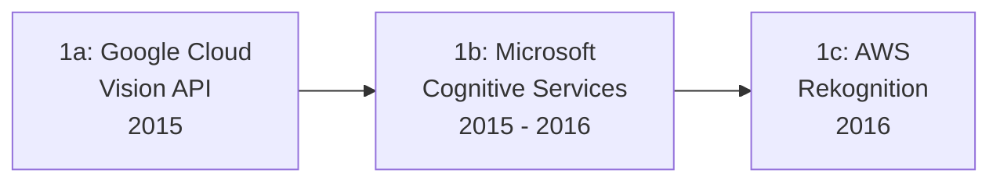

# Evolution und Architekturen digitaler Cloud-KI-APIs

Cloud-KI-APIs und ML-as-a-Service bilden Generation 3 der [Evolution digitaler KI-Anwendungen](evolution-digitaler-ki-anwendungen.md). Diese eigenständige Zeitachse zoomt in genau diese Architekturlinie hinein: von den ersten Vision-APIs großer Cloud-Anbieter über Sprach-/Text-APIs, Konversations-Plattformen und Enterprise-AutoML bis zu MLOps-Plattformen, die schließlich von generalisierten Foundation-Model-APIs abgelöst werden. Aktuelle, konkrete Cloud-Anbieter für LLM-Zugriff vergleicht [Multi-LLM- & Sprachmodell-Anbieter im Vergleich](coding/llm-anbieter-vergleich.md).

!!! note "Hinweis: Generationen überlappen sich"
    Die Zeiträume sind grobe Orientierung, keine scharfen Grenzen — Cloud-Vision-APIs laufen bis heute produktiv, parallel zu Foundation-Model-APIs. Entscheidend ist die **Architektur** (eine spezialisierte API pro Aufgabe vs. ein generalisiertes, promptbares Modell), nicht allein das Erscheinungsjahr.

---

## Generation 1: Die ersten Cloud-Vision-APIs, 2015 – 2016

Die Gründergeneration eint drei Prinzipien: **vortrainierte Modelle** hinter einer **REST-API**, **Pay-per-Use-Abrechnung** statt Lizenzkauf und **kein eigenes GPU-Betrieb** beim Anwendungsentwickler. Sie lässt sich in drei technologische Entwicklungsstufen unterteilen:

### 1a. Google Cloud Vision API, 2015

- **Architektur:** REST-API für Label-Erkennung, Texterkennung (OCR) und Gesichtsmerkmal-Analyse — kein eigenes Modelltraining nötig.
- **Bedeutung:** einer der ersten breit verfügbaren Cloud-Dienste, der vortrainierte Deep-Learning-Modelle (vgl. [Generation 2 der KI-Anwendungen](evolution-digitaler-deep-learning-anwendungen.md)) als reine API-Funktion anbietet.

### 1b. Microsoft Cognitive Services, 2015 – 2016

- **Architektur:** Sammlung getrennter APIs für Vision, Sprache und Sprachverarbeitung unter einer gemeinsamen Marke (später in Azure AI Services aufgegangen).
- **Fokus:** Bündelung mehrerer KI-Funktionen unter einem Abrechnungsmodell statt einzelner Speziallösungen.

### 1c. AWS Rekognition, 2016

- **Architektur:** Gesichtserkennung und Objekterkennung in Bildern und Videos, tief in die übrige AWS-Infrastruktur integriert (S3, Lambda).
- **Fokus:** nahtlose Integration in bestehende Cloud-Workflows statt eigenständiger API-Nutzung.

---

## Generation 2: Sprach- und Textverarbeitungs-APIs, 2016 – 2017

Nach Bild-APIs folgen spezialisierte Text-/Sprach-APIs — Sentiment-Analyse, Entitätserkennung und Sprachidentifikation werden per API-Aufruf statt eigenem NLP-Modell verfügbar.

| System | Anbieter | Funktion |
|---|---|---|
| **Google Cloud Natural Language** | Google | Sentiment-Analyse, Entitätserkennung, Syntaxanalyse. |
| **AWS Comprehend** | Amazon | Textklassifikation, Schlüsselwort-Extraktion, Sprachidentifikation. |
| **Azure Text Analytics** | Microsoft | Sentiment- und Themenanalyse als Teil der Cognitive-Services-Familie. |

---

## Generation 3: Konversations-Plattformen-as-a-Service, 2016 – 2017

Statt einzelner NLP-Funktionen liefern diese Dienste vollständige **Chatbot-Baukästen** — Intent-Erkennung, Entity-Extraktion und Dialog-Management in einer verwalteten Plattform.

| System | Jahr | Anbieter |
|---|---|---|
| **Dialogflow** (vormals API.ai) | 2016 | Google — Intent-basierte Konversationsdesign-Plattform. |
| **Microsoft Bot Framework** | 2016 | Microsoft — Framework plus verwaltete Hosting-Infrastruktur für Bots. |
| **Amazon Lex** | 2017 | Amazon — dieselbe Technologie, die Alexa antreibt, als eigenständige API verfügbar. |

---

## Generation 4: Enterprise-KI-Plattformen & AutoML, 2016 – 2019

Cloud-Anbieter erweitern ihr Angebot von Einzel-APIs zu **umfassenden Enterprise-Plattformen** — inklusive der Möglichkeit, eigene Modelle ohne tiefes ML-Fachwissen zu trainieren (AutoML).

| System | Anbieter | Prinzip |
|---|---|---|
| **IBM Watson** | IBM | Frühe Enterprise-KI-Plattform, bekannt durch den Jeopardy!-Auftritt 2011, ab dieser Generation breit in Unternehmenslösungen ausgebaut. |
| **Google Cloud AutoML** | Google | Training eigener Modelle über eine grafische Oberfläche statt Code. |
| **Azure Machine Learning Studio** | Microsoft | Drag-and-Drop-ML-Pipeline-Erstellung für Fachanwender ohne Data-Science-Hintergrund. |

---

## Generation 5: MLOps & Modell-Deployment-as-a-Service, 2017 – 2020

Der Fokus verschiebt sich von einzelnen APIs zu **End-to-End-Pipelines** für Training, Versionierung und Deployment eigener Modelle — MLOps wird zur eigenen Disziplin.

| System | Jahr | Rolle |
|---|---|---|
| **Amazon SageMaker** | 2017 | Vollständige Pipeline von Datenaufbereitung über Training bis Deployment in einer verwalteten Umgebung. |
| **MLflow** | 2018 | Open-Source-Plattform für Experiment-Tracking und Modell-Versionierung, cloud-unabhängig einsetzbar. |
| **Vertex AI** (Vorläufer-Dienste) | 2018/2019 | Googles Konsolidierung mehrerer ML-Dienste zu einer einheitlichen Plattform. |

---

## Generation 6: Foundation-Model-APIs lösen Einzel-APIs ab, ab 2020

Der entscheidende Architekturbruch: Ein einziges, generalisiertes **Foundation-Modell** hinter einer API ersetzt viele der spezialisierten Einzel-APIs aus Generation 1–3 — Vision, Textverständnis und Konversation laufen zunehmend über dasselbe Modell statt getrennter Dienste.

| Meilenstein | Jahr | Bedeutung |
|---|---|---|
| **GPT-3-API** | 2020 | Erstes breit zugängliches Foundation-Modell per API — ein einziger Endpunkt deckt Aufgaben ab, für die zuvor mehrere Generation-1–3-APIs nötig waren. |
| **OpenAI API / Anthropic API / Google AI-APIs** | ab 2020 | Etablieren „Prompting" statt Einzel-API-Auswahl als neues Interaktionsmodell, siehe [Generation 4 der KI-Anwendungen](evolution-digitaler-ki-anwendungen.md#generation-4-generative-ki-llm-gestutzte-anwendungen-ab-ca-2020). |

!!! tip "Übergang zur nächsten Generation"
    Die Konsolidierung vieler Einzel-APIs zu einem generalisierten Foundation-Modell markiert den direkten Übergang zu [Generation 4 der KI-Anwendungen](evolution-digitaler-ki-anwendungen.md#generation-4-generative-ki-llm-gestutzte-anwendungen-ab-ca-2020) — aktuelle Anbieter im Detail vergleicht [Multi-LLM- & Sprachmodell-Anbieter im Vergleich](coding/llm-anbieter-vergleich.md).

---

## Alternative Sortier- & Klassifikationskriterien für Cloud-KI-APIs

### 1. Spezialisierungsgrad

- **Aufgabenspezifische API** — eine Funktion pro Endpunkt (Vision-API, Sentiment-API) — Generation 1–3.
- **Plattform mit mehreren Diensten** — mehrere spezialisierte APIs unter gemeinsamer Verwaltung (Cognitive Services, Watson) — Generation 4.
- **Generalisierte Foundation-Model-API** — ein Endpunkt für viele Aufgaben per Prompt — Generation 6.

### 2. Anpassbarkeit

- **Fixfertig, nicht trainierbar** — Nutzung des vortrainierten Modells ohne Anpassung (frühe Vision-APIs).
- **AutoML/No-Code-Training** — eigenes Modell ohne Code trainierbar (Generation 4).
- **Vollständige MLOps-Pipeline** — eigenes Modell mit voller Kontrolle über Training/Deployment (Generation 5).

### 3. Abrechnungsmodell

- **Pay-per-Request** — Abrechnung pro API-Aufruf (klassisches Modell aller Generationen).
- **Kompute-Zeit-Abrechnung** — Abrechnung nach Trainings-/Inferenz-Rechenzeit (Generation 5, 6 bei eigenem Fine-Tuning).

---

## Verwandte Themen

- [Evolution und Architekturen digitaler KI-Anwendungen](evolution-digitaler-ki-anwendungen.md) — übergeordnetes Generationenmodell, Generation 3 dort entspricht diesem Artikel im Ganzen
- [Evolution und Architekturen digitaler Deep-Learning-Anwendungen](evolution-digitaler-deep-learning-anwendungen.md) — die Modelle, die hinter Generation 1–3 dieser Zeitachse laufen
- [Multi-LLM- & Sprachmodell-Anbieter im Vergleich](coding/llm-anbieter-vergleich.md) — aktuelle Foundation-Model-API-Anbieter im Detail
- [KI-Modelle & Frameworks: Übersicht](index.md) — Gesamtübersicht Modell-Kategorien und Frameworks
