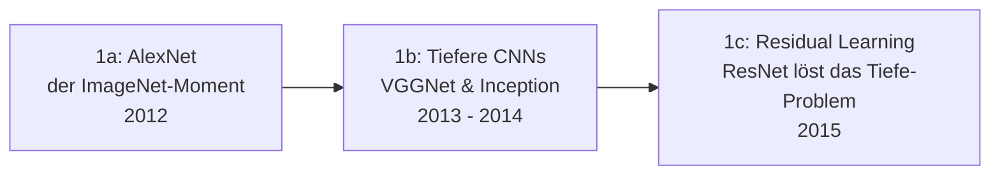

# Evolution und Architekturen digitaler Deep-Learning-Anwendungen

Deep-Learning-Anwendungen mit aufgabenspezifischen neuronalen Netzen bilden Generation 2 der [Evolution digitaler KI-Anwendungen](evolution-digitaler-ki-anwendungen.md). Diese eigenständige Zeitachse zoomt in genau diese Architekturlinie hinein: vom ImageNet-Durchbruch über Sequenzmodelle, frühe Sprachassistenten und generative Adversarial Networks bis zum Attention-Mechanismus, der den Übergang zur nächsten, Foundation-Model-geprägten Generation einleitet. Die multimodalen Pipelines, die auf diesen Architekturen aufbauen, behandelt praktisch [Multimodale Vision-Pipelines](coding/multimodale-vision-pipelines.md).

!!! note "Hinweis: Generationen überlappen sich"
    Die Zeiträume sind grobe Orientierung, keine scharfen Grenzen — CNN-basierte Bildklassifikation läuft bis heute produktiv parallel zu Foundation-Modellen. Entscheidend ist die **Architektur** (ein trainiertes Modell pro Aufgabe statt eines generalisierten, promptbaren Modells), nicht allein das Erscheinungsjahr.

---

## Generation 1: Der ImageNet-Durchbruch & CNN-Grundlagen, 2012 – 2015

Die Gründergeneration eint drei Prinzipien: **GPU-beschleunigtes Training**, **Convolutional Neural Networks (CNN)** als dominante Architektur für Bildaufgaben und ein **aufgabenspezifisches Modell pro Anwendungsfall**. Sie lässt sich in drei technologische Entwicklungsstufen unterteilen:

### 1a. AlexNet & der ImageNet-Moment, 2012

- **Architektur:** achtschichtiges CNN, trainiert auf zwei GPUs statt CPU-Clustern — der entscheidende Performance-Sprung.
- **Bedeutung:** halbiert nahezu die Fehlerrate beim ImageNet-Wettbewerb gegenüber allen bisherigen Verfahren und löst damit direkt den Deep-Learning-Boom aus.

### 1b. Tiefere CNN-Architekturen, 2013 – 2014

- **Architektur:** **VGGNet** (2014) zeigt, dass einfache, sehr tiefe Stapel kleiner Filter die Genauigkeit weiter steigern; **GoogLeNet/Inception** (2014) führt parallele Filtergrößen pro Schicht ein, um Rechenaufwand bei gleicher Tiefe zu senken.
- **Fokus:** Tiefe als Haupt-Stellschraube für Genauigkeit — mit wachsenden Trainingsproblemen (verschwindende Gradienten) als Kehrseite.

### 1c. Residual Learning löst das Tiefe-Problem, 2015

- **Architektur:** **ResNet** führt „Skip Connections" ein, die Gradienten direkt um mehrere Schichten herumleiten — Netze mit über 150 Schichten werden dadurch erstmals trainierbar.
- **Bedeutung:** wird zur Standard-Bauweise für praktisch jede folgende Bildklassifikations-Architektur.

---

## Generation 2: Sequenz-Modelle & frühe neuronale Übersetzung, 2014 – 2016

Neuronale Netze wandern von Einzelbildern zu Sequenzen — Sprache, Zeitreihen und Übersetzung werden zur zweiten großen Deep-Learning-Anwendungsdomäne.

**Architektur:** Recurrent Neural Networks (RNN) und **LSTM**-Zellen gegen das Kurzzeitgedächtnis-Problem klassischer RNNs, **Encoder-Decoder**-Architektur (Seq2Seq) für Übersetzung.

| Meilenstein | Jahr | Bedeutung |
|---|---|---|
| **Seq2Seq-Architektur** | 2014 | Encoder komprimiert eine Eingabesequenz, Decoder erzeugt daraus eine Ausgabesequenz beliebiger Länge — Grundmuster für maschinelle Übersetzung. |
| **Google Neural Machine Translation** | 2016 | Produktions-Umstieg von statistischer auf neuronale Übersetzung, spürbar flüssigere Ergebnisse gegenüber [Generation 1c der KI-Anwendungen](evolution-digitaler-ki-anwendungen.md#1c-statistisches-maschinelles-lernen-fruhe-anwendungen-1990-2010). |

---

## Generation 3: Sprachassistenten mit spezialisierten Intent-Modellen, 2011 – 2016

Erste massentaugliche Sprachassistenten kombinieren Spracherkennung mit fest definierten Kommando-Kategorien — Konversation bleibt auf vordefinierte Intents beschränkt statt frei zu sein.

**Architektur:** separate Modelle für Spracherkennung (STT), Intent-Klassifikation und Antwortgenerierung, keine durchgängige End-to-End-Architektur.

| System | Jahr | Anbieter |
|---|---|---|
| **Siri** | 2011 | Apple — erster massentauglicher Sprachassistent. |
| **Google Now / Assistant** | 2012/2016 | Google. |
| **Amazon Alexa** | 2014 | Amazon — etabliert Smart-Speaker als eigene Produktkategorie. |

---

## Generation 4: Generative Adversarial Networks & frühe generative Bildmodelle, 2014 – 2018

Vor Diffusionsmodellen (vgl. [Generation 4 der KI-Anwendungen](evolution-digitaler-ki-anwendungen.md#generation-4-generative-ki-llm-gestutzte-anwendungen-ab-ca-2020)) sind **GANs** die dominante Architektur für generative Bildaufgaben — zwei konkurrierende Netze (Generator und Diskriminator) treiben sich gegenseitig zu besseren Ergebnissen.

**Architektur:** Generator erzeugt Kandidatenbilder, Diskriminator unterscheidet echte von generierten Bildern, beide werden im Wechsel trainiert.

| Meilenstein | Jahr | Bedeutung |
|---|---|---|
| **GAN-Grundlagenpapier** (Goodfellow et al.) | 2014 | Formalisiert das Generator-Diskriminator-Prinzip. |
| **StyleGAN** | 2018/2019 | Fotorealistische Gesichtsgenerierung, populär u. a. durch „This Person Does Not Exist". |

---

## Generation 5: Objekterkennung & Segmentierung als Produktionsreife-Kategorie, 2015 – 2018

Über reine Klassifikation hinaus lokalisieren und begrenzen neuronale Netze jetzt Objekte innerhalb eines Bildes — die technische Grundlage für autonome Fahrzeuge, Videoüberwachung und Qualitätskontrolle.

| System | Jahr | Prinzip |
|---|---|---|
| **YOLO** (You Only Look Once) | 2015 | Objekterkennung in einem einzigen Netzdurchlauf statt mehrstufiger Kandidaten-Generierung — Echtzeitfähigkeit als Hauptvorteil. |
| **Faster R-CNN** | 2015 | Zweistufiger Ansatz (Regionsvorschlag + Klassifikation) mit höherer Genauigkeit bei geringerer Geschwindigkeit als YOLO. |
| **Mask R-CNN** | 2017 | Erweitert Faster R-CNN um pixelgenaue Segmentierungsmasken statt nur Begrenzungsrahmen. |

---

## Generation 6: Attention-Mechanismus & der Transformer-Vorabend, 2015 – 2018

Der entscheidende Architekturbruch, der Generation 2 dieser Zeitachse ablöst: Statt eine ganze Sequenz in einen einzigen Vektor zu komprimieren, lernt ein Netz, bei jedem Ausgabeschritt selektiv auf relevante Teile der Eingabe zu „achten" — die direkte Vorstufe zum Transformer und damit zu [Generation 4 der übergeordneten KI-Anwendungen-Zeitachse](evolution-digitaler-ki-anwendungen.md#generation-4-generative-ki-llm-gestutzte-anwendungen-ab-ca-2020).

| Meilenstein | Jahr | Bedeutung |
|---|---|---|
| **Attention-Mechanismus** (Bahdanau et al.) | 2014/2015 | Löst das Engpassproblem fester Seq2Seq-Kontextvektoren, indem der Decoder selektiv auf Encoder-Zustände zugreift. |
| **„Attention is All You Need"** (Vaswani et al.) | 2017 | Ersetzt Rekurrenz vollständig durch Self-Attention — die Transformer-Architektur, Grundlage aller folgenden Foundation-Modelle. |
| **BERT** | 2018 | Erstes breit adoptiertes bidirektionales Transformer-Sprachmodell, markiert den Übergang zur nächsten Generation. |

!!! tip "Übergang zur nächsten Generation"
    Mit dem Transformer endet der Ansatz „ein trainiertes Modell pro Aufgabe" dieser Zeitachse — [Generation 4 der KI-Anwendungen](evolution-digitaler-ki-anwendungen.md#generation-4-generative-ki-llm-gestutzte-anwendungen-ab-ca-2020) beschreibt, wie ein einziges, generalisiertes Foundation-Modell viele der hier genannten Einzelmodelle ersetzt.

---

## Alternative Sortier- & Klassifikationskriterien für Deep-Learning-Anwendungen

### 1. Eingabemodalität

- **Bild** — CNNs, YOLO, Mask R-CNN (Generation 1, 5).
- **Sequenz/Text** — RNN/LSTM, Seq2Seq, Attention (Generation 2, 6).
- **Sprache (Audio)** — Spracherkennungs-Komponente der Sprachassistenten (Generation 3).

### 2. Lernziel

- **Diskriminativ** — klassifiziert oder lokalisiert vorhandene Eingaben (CNNs, Objekterkennung).
- **Generativ** — erzeugt neue, plausible Ausgaben (GANs).
- **Sequenz-zu-Sequenz** — transformiert eine Eingabesequenz in eine andere (Übersetzung).

### 3. Architektur-Baustein

- **Convolution** — lokale, ortsinvariante Filter (CNN-Familie).
- **Rekurrenz** — Zustand wird Schritt für Schritt weitergereicht (RNN/LSTM).
- **Attention** — gewichteter, globaler Zugriff auf alle Eingabepositionen gleichzeitig (Transformer-Vorstufe).

---

## Verwandte Themen

- [Beste Deep-Learning-Anwendungen 2026 (Top 15)](deep-learning-anwendungen-2026-topliste.md) — Momentaufnahme 2026, die diese Chronologie in eine gerankte Topliste übersetzt
- [Produktionsreife Deep-Learning-Anwendungen nach Generation (Top 3)](produktionsreife-deep-learning-anwendungen-generationen-2026-topliste.md) — dieses Generationenmodell durch das konservative Fünf-Filter-Sieb; die Produkte (Siri, Alexa, GNMT) fallen an Lizenz oder Kontinuität, aber die Architekturen bestehen als Bausteine: ResNet (torchvision), YOLO (Ultralytics), Transformer/BERT (transformers)
- [Evolution und Architekturen digitaler KI-Anwendungen](evolution-digitaler-ki-anwendungen.md) — übergeordnetes Generationenmodell, Generation 2 dort entspricht diesem Artikel im Ganzen
- [Evolution und Architekturen digitaler Expertensysteme](evolution-digitaler-expertensysteme.md) — vertiefendes Generationenmodell für Generation 1 der KI-Anwendungen
- [Multimodale Vision-Pipelines](coding/multimodale-vision-pipelines.md) — praktische Umsetzung CNN-/Attention-basierter Bildverarbeitung
- [KI-Modelle & Frameworks: Übersicht](index.md) — Gesamtübersicht Modell-Kategorien und Frameworks
