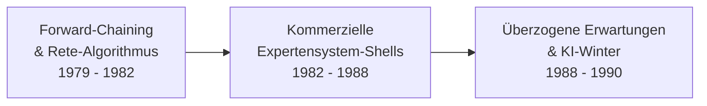

# Evolution und Architekturen digitaler Expertensysteme

Expertensysteme sind der historische Ursprung von Generation 1 der [Evolution digitaler KI-Anwendungen](evolution-digitaler-ki-anwendungen.md) — verdienen als eigenständige Architekturlinie aber eine genauere Betrachtung, weil sie nicht mit dem KI-Winter endeten, sondern sich über Regel-Engines und Business-Rule-Management-Systeme bis in heutige LLM-gestützte, neuro-symbolische Architekturen fortsetzen. Dieser Artikel ordnet die konkreten Wissensrepräsentations- und Inferenz-Architekturen — Regelbäume, Fuzzy-Logik, Rete-Algorithmus, Bayes'sche Netze, LLM-als-Reasoning-Engine — nach **technologischen Generationen**, analog zu den Generationenmodellen für [Wissenssysteme](../wissen/dokumentation/evolution-digitaler-wissenssysteme.md), [CMS](../wissen/dokumentation/evolution-digitaler-cms.md) und [LMS](../wissen/e-learning/evolution-digitaler-lms.md).

!!! note "Hinweis: Generationen überlappen sich"
    Die Zeiträume sind grobe Orientierung, keine scharfen Grenzen — Regel-Engines wie Drools (Generation 4) laufen bis heute produktiv in Versicherungs- und Kreditentscheidungssystemen, parallel zu LLM-gestützten Reasoning-Architekturen (Generation 6). Entscheidend ist die **Architektur der Wissensrepräsentation und Inferenz** (wie das System aus Wissen zu einer Schlussfolgerung kommt), nicht allein das Erscheinungsjahr.

---

## Generation 1: Symbolische Expertensysteme — Regelbäume & Backward-Chaining, 1965 – 1980

Die Gründergeneration eint drei Prinzipien: **manuell von menschlichen Experten erfasstes Fachwissen**, eine **Wissensbasis getrennt von der Inferenzmaschine** (statt Wissen im Programmcode zu verstecken) und **Backward-Chaining** als dominante Inferenzstrategie — das System arbeitet von einer Hypothese rückwärts zu den Fakten, die sie stützen.

**Architektur:** Wissensbasis als „Wenn-Dann"-Regeln, implementiert meist in LISP oder Prolog; die Trennung von Wissensbasis und Inferenzmaschine (später als „Expertensystem-Shell" verallgemeinert) ist die zentrale architektonische Innovation dieser Generation.

| System | Jahr | Domäne | Bedeutung |
|---|---|---|---|
| **DENDRAL** | 1965 | Molekülstruktur-Analyse | Gilt als erstes Expertensystem — leitet aus Massenspektrometrie-Daten mögliche chemische Strukturen ab. |
| **MYCIN** | 1972 | Medizinische Diagnose (Blutinfektionen) | Führte **Certainty Factors** ein — ein frühes Verfahren zum Umgang mit Unsicherheit in Regeln, Vorläufer probabilistischer Ansätze in Generation 5. |
| **PROSPECTOR** | 1978 | Mineralexploration | Nutzte Bayes'sche Wahrscheinlichkeiten statt reiner Boolean-Regeln — half nachweislich bei der Entdeckung einer Molybdän-Lagerstätte. |

---

## Generation 2: Expertensystem-Boom & kommerzielle Shells, 1980 – 1990

Aus Forschungsprototypen werden kommerzielle Produkte: **Expertensystem-Shells** trennen die Inferenzmaschine vollständig von der Wissensbasis und machen sie für beliebige Domänen wiederverwendbar. Der **Rete-Algorithmus** (Charles Forgy, 1979/1982) löst das Performance-Problem von Regelsystemen mit vielen Regeln und wird zur architektonischen Grundlage nahezu aller nachfolgenden Regel-Engines — bis heute, siehe Generation 4.

- **Rete-Algorithmus (1979/1982):** effizientes Pattern-Matching für Regelsysteme mit vielen Fakten und Regeln — vermeidet, bei jeder Faktenänderung alle Regeln neu zu evaluieren, durch einen persistenten Netzwerk-Graphen bereits geprüfter Teilbedingungen.
- **XCON/R1** (1980, Digital Equipment Corporation): Forward-Chaining-Konfigurationssystem für VAX-Computersysteme, eines der ersten wirtschaftlich erfolgreichen Expertensysteme — sparte DEC schätzungsweise Millionen US-Dollar jährlich an Konfigurationsfehlern.
- **Kommerzielle Shells:** **EMYCIN** (generalisierte MYCIN-Inferenzmaschine ohne medizinische Wissensbasis), **KEE** (Knowledge Engineering Environment), **ART** (Automated Reasoning Tool), **CLIPS** (NASA, C Language Integrated Production System — bis heute als Open-Source-Regel-Engine im Einsatz).
- **KI-Winter (ab Ende 1980er):** die Kosten der manuellen Wissensakquise („Knowledge Engineering") und die mangelnde Skalierbarkeit starrer Regelbasen auf neue Domänen führen zur Ernüchterung und zum Rückgang der Forschungsförderung.

---

## Generation 3: Fuzzy-Logik, Hybrid- & Case-Based-Reasoning-Systeme, Ende 1980er – 1990er

Als Reaktion auf die Sprödigkeit rein binärer Regelsysteme (eine Regel greift oder greift nicht) etablieren sich Architekturen, die mit **Unschärfe** und **Ähnlichkeit statt exakter Regelübereinstimmung** arbeiten.

**Architektur:** Fuzzy-Mengen und Zugehörigkeitsfunktionen statt scharfer Wenn-Dann-Bedingungen (Mamdani- und Sugeno-Inferenzmodelle), alternativ **Case-Based Reasoning (CBR)** — Problemlösung durch Rückgriff auf ähnliche, bereits gelöste Fälle statt durch explizite Regeln.

| Ansatz | Prinzip | Typische Anwendung |
|---|---|---|
| **Fuzzy-Logik-Expertensysteme** | Regeln mit graduellen Wahrheitswerten (z. B. „ziemlich heiß") statt wahr/falsch | Industrielle Regelungstechnik, Waschmaschinen- und Klimasteuerungen (Sendai-U-Bahn-Steuerung, 1987, als bekanntes Fuzzy-Control-Beispiel) |
| **Neuro-Fuzzy-Hybride** | neuronales Netz lernt Fuzzy-Regeln/Zugehörigkeitsfunktionen aus Daten statt manueller Definition | Prozesssteuerung mit begrenzten Trainingsdaten |
| **Case-Based Reasoning (CBR)** | Retrieval ähnlicher Vorfälle aus einer Fallbasis, Anpassung der Lösung statt Neuherleitung | Helpdesk-Systeme, juristische Entscheidungsunterstützung |

!!! note "Hinweis: Vorläufer von RAG"
    Case-Based Reasoning nimmt das Grundprinzip von **Retrieval-Augmented Generation** (Generation 5 der [KI-Anwendungen](evolution-digitaler-ki-anwendungen.md#generation-5-rag-werkzeugnutzende-ki-anwendungen-ab-ca-2023)) architektonisch vorweg: eine Wissensbasis wird zur Laufzeit nach Ähnlichkeit durchsucht, statt starrer Regeln fest verdrahtet zu sein — nur der Ähnlichkeitsmaßstab wechselt von symbolischen Fallmerkmalen zu Vektor-Embeddings.

---

## Generation 4: Business-Rule-Management-Systeme (BRMS) & produktive Regel-Engines, 1990er – 2010er

Expertensysteme verlieren als Marketingbegriff an Bedeutung, ihre Kernarchitektur — Rete-basiertes Forward-Chaining mit getrennter Regelbasis — lebt jedoch als **Business-Rule-Management-System** in der Unternehmenssoftware weiter, entkoppelt vom KI-Diskurs und als reguläres Software-Engineering-Werkzeug etabliert.

**Architektur:** Rete-/Rete-II-/Rete-OO-Algorithmus als Inferenzkern, Regeln über grafische Editoren oder DSLs von Fachabteilungen statt Entwicklern gepflegt, Integration als Bibliothek/Service in bestehende Enterprise-Java- oder .NET-Anwendungen statt als eigenständiges System.

| System | Anbieter/Ursprung | Einsatzgebiet |
|---|---|---|
| **Drools** | Red Hat / JBoss (Open Source) | Java-Ökosystem, Kreditvergabe, Versicherungs-Tarifierung, Compliance-Prüfungen |
| **ILOG JRules** (heute IBM ODM) | IBM | Enterprise-Entscheidungsautomatisierung |
| **CLIPS** | NASA (Fortführung aus Generation 2) | Eingebettete Diagnosesysteme, Lehre |
| **SAP BRFplus** | SAP | Regelbasierte Geschäftslogik in SAP-Landschaften |

**Fokus:** Trennung von **Geschäftslogik** (von Fachabteilungen änderbar) und **Anwendungscode** (von Entwicklern gepflegt) als Hauptversprechen — nicht mehr „künstliche Intelligenz", sondern Wartbarkeit und Auditierbarkeit regelbasierter Entscheidungen in regulierten Branchen.

---

## Generation 5: Probabilistische & hybride Entscheidungsunterstützungssysteme, 2000er – 2010er

Reine Regeln stoßen bei Unsicherheit und unvollständigen Daten an Grenzen — **Bayes'sche Netze** und die Kombination von Regeln mit statistischem maschinellem Lernen (vgl. [Generation 1c der KI-Anwendungen](evolution-digitaler-ki-anwendungen.md#1c-statistisches-maschinelles-lernen-fruhe-anwendungen-1990-2010)) liefern robustere Diagnose- und Entscheidungsunterstützung.

**Architektur:** gerichtete azyklische Graphen (Bayes'sche Netze) modellieren bedingte Wahrscheinlichkeiten zwischen Variablen; hybride Systeme kombinieren einen regelbasierten Kern für harte Constraints (z. B. Kontraindikationen) mit einem probabilistischen Modell für Wahrscheinlichkeitsschätzungen.

- **Clinical Decision Support Systems (CDSS):** kombinieren Leitlinien-Regeln mit Bayes'schen Risikoscores, z. B. zur Sepsis-Früherkennung oder Medikamenten-Interaktionsprüfung.
- **Kreditscoring-Systeme:** regelbasierte Ausschlusskriterien (harte Constraints) plus statistisches Scoring-Modell (vgl. [Generation 1c](evolution-digitaler-ki-anwendungen.md#1c-statistisches-maschinelles-lernen-fruhe-anwendungen-1990-2010)) für die Feinabstufung.
- **Bayes'sche Netzwerk-Toolkits:** Microsoft **MSBNx**, **Netica**, **GeNIe/SMILE** — verbreitete Werkzeuge zur Modellierung probabilistischer Expertensysteme in dieser Generation.

---

## Generation 6: LLM-gestützte & neuro-symbolische Reasoning-Architekturen, ab ca. 2023

Große Sprachmodelle übernehmen die Rolle der Inferenzmaschine der ersten Generation — mit einem fundamentalen Unterschied: Das „Regelwerk" ist nicht mehr explizit kodiert, sondern implizit in den Modellgewichten enthalten und wird per **Prompt** statt per Regel-Editor angesprochen. Wo Zuverlässigkeit und Nachvollziehbarkeit zählen, kombinieren aktuelle Architekturen das LLM wieder mit expliziten symbolischen Komponenten — ein **neuro-symbolischer** Rückgriff auf die Architekturprinzipien der Generationen 1–4.

**Architektur:** LLM als generalisierte Reasoning-Engine statt domänenspezifischer Regelbasis; **Guardrails** und **strukturierte Ausgaben** (JSON-Schemata, Function Calling) fungieren als das moderne Äquivalent der Wissensbasis-Constraints; **Retrieval** ersetzt die manuelle Wissensakquise der Generation 1/2.

| Baustein | Rolle | Analogie zu früheren Generationen |
|---|---|---|
| **LLM-als-Reasoning-Engine** (Chain-of-Thought, Prompt-Engineering) | Ersetzt handkodierte Wenn-Dann-Regeln durch gelerntes, promptbares Wissen | Generation 1: Backward-Chaining über implizites statt explizites Wissen |
| **Guardrails-Frameworks** (z. B. NeMo Guardrails, strukturierte Outputs) | Erzwingen harte Constraints über LLM-Antworten, ähnlich regelbasierter Validierung | Generation 4: Business-Rules als Kontrollschicht über einer generischen Engine |
| **Neuro-symbolische Hybride** (LLM + Regel-Engine/Knowledge Graph) | LLM erzeugt Kandidatenlösungen, ein symbolischer Prüfer/eine Regel-Engine validiert sie gegen harte Fakten | Direkte Fortsetzung von Generation 4/5 — Regelwerk und probabilistisches Modell bleiben als Kontrollinstanz erhalten |
| **RAG-gestützte Diagnose-/Beratungssysteme** | Retrieval aktueller Fachdokumente statt statischer, manuell gepflegter Wissensbasis | Generation 1/3: Wissensbasis-Prinzip von MYCIN/CBR, nur mit Vektorsuche statt Regeln/Fällen — siehe [Praxis-Guide: Lokales RAG](coding/lokales-rag-ollama.md) |

!!! tip "Bezug zu diesem Repository"
    Die [AI Agents Praxis-Handbuch](coding/ai-agents-praxis.md)-Architekturen und der [Beste-MCP-Server-Vergleich](coding/mcp-server-topliste.md) dieses Repositories setzen genau an diesem Punkt an: Werkzeuge/Function Calling übernehmen die Rolle harter Constraints, die frühere Expertensystem-Generationen über explizite Regeln durchsetzten.

---

## Alternative Sortier- & Klassifikationskriterien für Expertensysteme

Neben dem chronologischen/technologischen Generationenmodell lassen sich Expertensystem-Architekturen nach folgenden Dimensionen einordnen:

### 1. Inferenzrichtung

- **Backward-Chaining** — arbeitet von einer Hypothese rückwärts zu stützenden Fakten (MYCIN, klassische Diagnosesysteme).
- **Forward-Chaining** — leitet aus vorhandenen Fakten schrittweise neue Schlussfolgerungen ab (XCON/R1, Rete-basierte Regel-Engines).
- **Gemischt/gesteuert** — moderne Regel-Engines und LLM-Agenten wählen die Strategie dynamisch je Teilaufgabe.

### 2. Umgang mit Unsicherheit

- **Binär/exakt** — eine Regel trifft zu oder nicht (frühe Generation 1/2-Systeme).
- **Certainty Factors** — numerische Konfidenzwerte pro Regel, ohne strenge Wahrscheinlichkeitstheorie (MYCIN).
- **Fuzzy-Logik** — graduelle Zugehörigkeit statt scharfer Schwellenwerte (Generation 3).
- **Bayes'sche Wahrscheinlichkeit** — formal fundierte bedingte Wahrscheinlichkeiten (PROSPECTOR, Generation 5).
- **Gelernte Konfidenz** — Modell-interne, aus Trainingsdaten gelernte Unsicherheitsschätzung (LLM-Logits/Sampling, Generation 6).

### 3. Herkunft der Wissensbasis

- **Manuell durch Knowledge Engineering** — Experten-Interviews, von Wissensingenieuren in Regeln übersetzt (Generation 1–2).
- **Aus Fällen/Erfahrung** — Fallbasis statt abstrahierter Regeln (CBR, Generation 3).
- **Aus Trainingsdaten gelernt** — statistisches oder tiefes Lernen ersetzt manuelle Regelformulierung (Generation 5/Deep Learning).
- **Aus Vortraining plus Laufzeit-Retrieval** — LLM-Weltwissen ergänzt um aktuelle Fachdokumente (Generation 6/RAG).

### 4. Kopplung von Wissen und Ausführung

- **Wissensbasis fest im Code** — kein Trennungsprinzip, seltene Übergangsform.
- **Shell-Architektur** — Inferenzmaschine strikt von austauschbarer Wissensbasis getrennt (EMYCIN, CLIPS, das architektonische Grundprinzip aller Expertensysteme).
- **Regel-Engine als Service** — Regelwerk läuft entkoppelt hinter einer API in bestehenden Anwendungslandschaften (Drools, ODM, Generation 4).
- **Prompt als Wissensschnittstelle** — Wissen wird zur Laufzeit über natürlichsprachige Anweisungen statt Regel-Syntax injiziert (Generation 6).

---

## Verwandte Themen

- [Evolution und Architekturen digitaler KI-Anwendungen](evolution-digitaler-ki-anwendungen.md) — übergeordnetes Generationenmodell, Generation 1 dieses Artikels entspricht Generation 1a/1b dort
- [KI-Modelle & Frameworks: Übersicht](index.md) — Gesamtübersicht Modell-Kategorien und Frameworks
- [AI Agents – Das Praxis-Handbuch & Architektur-Leitfaden](coding/ai-agents-praxis.md) — moderne Agenten-Architekturen als Fortsetzung von Generation 6
- [Praxis-Guide: Lokales RAG & LLM-Serving mit Ollama & ChromaDB](coding/lokales-rag-ollama.md) — Retrieval-Architektur hinter Generation 6
- [Beste MCP-Server (Top 20)](coding/mcp-server-topliste.md) — Werkzeugzugriff als moderne Entsprechung expliziter Constraints
- [Evolution und Architekturen digitaler Wissenssysteme](../wissen/dokumentation/evolution-digitaler-wissenssysteme.md) — analoges Generationenmodell für Wikis & PKM-Systeme
- [Evolution und Architekturen digitaler Content-Management-Systeme](../wissen/dokumentation/evolution-digitaler-cms.md) — analoges Generationenmodell für CMS
- [Evolution und Architekturen digitaler LMS](../wissen/e-learning/evolution-digitaler-lms.md) — analoges Generationenmodell für Lernmanagement-Systeme
- [Evolution und Architekturen digitaler Web-Frameworks](../entwicklung/webentwicklung/evolution-digitaler-webframeworks.md) — analoges Generationenmodell für Web-Frameworks
- [Evolution und Architekturen digitaler Programmierparadigmen](../entwicklung/evolution-digitaler-programmierparadigmen.md) — Prolog als prägende Sprache dieser Generation, vertieft als deklaratives/logisches Paradigma (Generation 2 dort)
