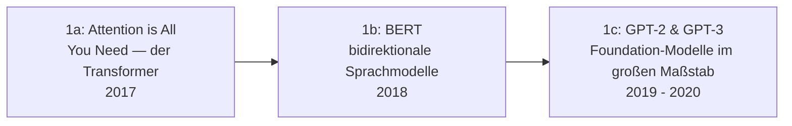

# Evolution und Architekturen digitaler Generativer KI-Anwendungen

Generative KI und LLM-gestützte Anwendungen bilden Generation 4 der [Evolution digitaler KI-Anwendungen](evolution-digitaler-ki-anwendungen.md). Diese eigenständige Zeitachse zoomt in genau diese Architekturlinie hinein: vom Transformer-Durchbruch über den ChatGPT-Massenmarkt-Moment, multimodale Foundation-Modelle und Bild-/Video-Generierung bis zu anwendungsspezifischen Custom-Assistenten und lokal betriebenen, offenen LLMs. Konkrete Anbieter und Modelle vergleicht [Multi-LLM- & Sprachmodell-Anbieter im Vergleich](coding/llm-anbieter-vergleich.md), praktische Custom-Assistenten-Konfiguration [Custom Chat-Assistenten im Anbieter-Vergleich](coding/custom-chat-assistenten-anbieter-vergleich.md).

!!! note "Hinweis: Generationen überlappen sich"
    Die Zeiträume sind grobe Orientierung, keine scharfen Grenzen — GPT-3-Ära-Modelle liefen parallel zu multimodalen Nachfolgern weiter im Einsatz. Entscheidend ist die **Architektur** (Transformer-basiertes Foundation-Modell, gesteuert per Prompt statt erneutem Training), nicht allein das Erscheinungsjahr.

---

## Generation 1: Der Transformer-Durchbruch & erste Foundation-Modelle, 2017 – 2020

Die Gründergeneration eint drei Prinzipien: **Self-Attention statt Rekurrenz**, **Vortraining auf riesigen Textkorpora** und **ein generalisiertes Modell statt eines aufgabenspezifischen Netzes**. Sie lässt sich in drei technologische Entwicklungsstufen unterteilen:

### 1a. „Attention is All You Need" — der Transformer, 2017

- **Architektur:** ersetzt Rekurrenz vollständig durch **Self-Attention** — jedes Token kann direkt auf jedes andere Token der Sequenz zugreifen, parallelisierbar statt sequenziell wie RNNs.
- **Bedeutung:** direkte Fortsetzung von [Generation 6 der Deep-Learning-Anwendungen](evolution-digitaler-deep-learning-anwendungen.md#generation-6-attention-mechanismus-der-transformer-vorabend-2015-2018), technische Grundlage aller folgenden Foundation-Modelle.

### 1b. BERT & bidirektionale Sprachmodelle, 2018

- **Architektur:** liest Text in beide Richtungen gleichzeitig statt nur von links nach rechts — verbessert Aufgaben, die vollständiges Kontextverständnis erfordern (Frage-Antwort, Klassifikation).
- **Fokus:** Vortraining plus Fine-Tuning pro Aufgabe — noch kein reines Prompting.

### 1c. GPT-2 & GPT-3 — Foundation-Modelle im großen Maßstab, 2019 – 2020

- **Architektur:** rein autoregressive (links-nach-rechts) Transformer, massiv skaliert in Parameterzahl und Trainingsdatenmenge.
- **Bedeutung:** **GPT-3** (2020) etabliert „Prompting" statt Fine-Tuning als Haupt-Interaktionsmodus — der entscheidende Wendepunkt zur eigentlichen Generation-4-Architektur.

---

## Generation 2: ChatGPT & der Massenmarkt-Durchbruch, 2022

Aus einem Entwickler-API-Produkt wird ein Konsumenten-Massenprodukt — **Reinforcement Learning from Human Feedback (RLHF)** macht das rohe Foundation-Modell aus Generation 1c erstmals zuverlässig dialogfähig.

**Architektur:** Foundation-Modell aus Generation 1 plus RLHF-Ausrichtung (Supervised Fine-Tuning + Belohnungsmodell + Reinforcement Learning), Konversationsinterface statt reinem Text-Vervollständigungs-Prompt.

| Meilenstein | Jahr | Bedeutung |
|---|---|---|
| **RLHF-Verfahren** | 2022 | Trainiert das Modell darauf, hilfreiche, sichere Antworten menschlichen Präferenzen entsprechend zu bevorzugen. |
| **ChatGPT** | 2022 | Massenmarkt-Durchbruch generativer KI — siehe [KI-Modell-Landschaft](index.md#modell-kategorien-im-uberblick) für die dahinterliegenden Modellfamilien. |

---

## Generation 3: Multimodale Foundation-Modelle, ab 2023

Text-only-Modelle werden um weitere Modalitäten erweitert — ein einziges Modell verarbeitet Text, Bild und teils Audio/Video gemeinsam statt getrennter Einzelmodelle.

| System | Jahr | Modalitäten |
|---|---|---|
| **GPT-4 Vision** | 2023 | Text + Bild, später + Audio. |
| **Gemini 1.5** | 2024 | Text + Bild + Audio + Video im selben Modell. |
| **Claude 3** | 2024 | Text + Bild, hohe Genauigkeit bei visuellem Dokumentenverständnis. |

---

## Generation 4: Bild-/Video-Generierung als eigenständige Produktkategorie, 2022 – 2024

Parallel zu Text-Foundation-Modellen etabliert sich generative Bild- und Video-Erzeugung als eigene Produktlinie, meist auf Diffusionsmodellen statt Transformer-Architekturen aufbauend.

| System | Jahr | Kategorie |
|---|---|---|
| **Stable Diffusion** | 2022 | Text-zu-Bild, offenes Modell mit großem Community-Ökosystem. |
| **Midjourney** | 2022 | Text-zu-Bild, geschlossen, hohe künstlerische Qualität. |
| **DALL-E** | 2021/2022 | Text-zu-Bild, direkt in ChatGPT integriert. |
| **Sora** | 2024 | Text-zu-Video, deutlich längere und kohärentere Videosequenzen als frühere Ansätze. |

---

## Generation 5: Custom-Chat-Assistenten & anwendungsspezifische Konfigurationen, 2023 – 2024

Statt eines generischen Chat-Interfaces konfigurieren Nutzer und Unternehmen eigene, auf einen Anwendungsfall zugeschnittene Assistenten — mit eigenem Kontext, eigenen Werkzeugen und eigener Persona, ohne selbst ein Modell zu trainieren.

| System | Anbieter | Prinzip |
|---|---|---|
| **Custom GPTs** | OpenAI | Nutzerdefinierte ChatGPT-Konfigurationen mit eigenen Anweisungen, Dateien und Aktionen. |
| **Claude Projects** | Anthropic | Persistenter Projekt-Kontext über mehrere Konversationen hinweg. |

Ein detaillierter Anbieter-Vergleich findet sich in [Custom Chat-Assistenten im Anbieter-Vergleich](coding/custom-chat-assistenten-anbieter-vergleich.md).

---

## Generation 6: Lokale & selbst gehostete LLM-Anwendungen, ab 2023

Offene Modellgewichte machen es möglich, Foundation-Modelle vollständig **ohne Cloud-Anbieter** auf eigener Hardware zu betreiben — Datenhoheit und Offline-Fähigkeit als Hauptmotivation gegenüber den API-basierten Generationen 2–5.

| Baustein | Rolle |
|---|---|
| **Llama-Familie** (Meta) | Offene Modellgewichte als Grundlage eines großen Ökosystems eigener Fine-Tunes. |
| **Ollama** | Vereinfacht lokale Modellausführung auf Consumer-Hardware, siehe [Praxis-Guide: Lokales RAG & LLM-Serving mit Ollama & ChromaDB](coding/lokales-rag-ollama.md). |
| **Quantisierung** (GGUF, GPTQ, AWQ) | Reduziert Speicherbedarf großer Modelle, macht sie auf Consumer-GPUs statt Rechenzentren lauffähig. |

---

## Alternative Sortier- & Klassifikationskriterien für generative KI-Anwendungen

### 1. Modalität

- **Text-only** — GPT-3, frühes ChatGPT (Generation 1, 2).
- **Multimodal** — GPT-4 Vision, Gemini, Claude 3 (Generation 3).
- **Bild-/Video-generativ** — Stable Diffusion, Sora (Generation 4).

### 2. Betriebsmodell

- **Cloud-API** — Anbieter betreibt Modell und Skalierung (Generation 1–5 in ihrer üblichen Nutzung).
- **Lokal/selbst gehostet** — eigene Infrastruktur, volle Datenhoheit (Generation 6).

### 3. Anpassungstiefe

- **Reines Prompting** — keine Anpassung über den Prompt hinaus (frühes ChatGPT).
- **Persistenter Kontext/Konfiguration** — eigene Anweisungen und Dateien ohne Modelltraining (Custom GPTs, Claude Projects).
- **Eigenes Fine-Tuning** — Modellgewichte selbst angepasst (lokale Llama-Fine-Tunes).

---

## Verwandte Themen

- [Beste generative KI-Anwendungen 2026 (Top 20)](generative-ki-anwendungen-2026-topliste.md) — Momentaufnahme 2026, die diese Chronologie in eine gerankte Topliste übersetzt
- [Evolution und Architekturen digitaler KI-Anwendungen](evolution-digitaler-ki-anwendungen.md) — übergeordnetes Generationenmodell, Generation 4 dort entspricht diesem Artikel im Ganzen
- [Evolution und Architekturen digitaler Deep-Learning-Anwendungen](evolution-digitaler-deep-learning-anwendungen.md) — Vorgänger-Architekturen, aus denen der Transformer hervorging
- [Evolution und Architekturen digitaler Cloud-KI-APIs](evolution-digitaler-cloud-ki-apis.md) — Vorgänger-Generation, die von Foundation-Model-APIs abgelöst wurde
- [Multi-LLM- & Sprachmodell-Anbieter im Vergleich](coding/llm-anbieter-vergleich.md) — aktuelle Modelle und Anbieter im Detail
- [Custom Chat-Assistenten im Anbieter-Vergleich](coding/custom-chat-assistenten-anbieter-vergleich.md) — Vertiefung zu Generation 5
- [Praxis-Guide: Lokales RAG & LLM-Serving mit Ollama & ChromaDB](coding/lokales-rag-ollama.md) — Vertiefung zu Generation 6
- [KI-Modelle & Frameworks: Übersicht](index.md) — Gesamtübersicht Modell-Kategorien und Frameworks
