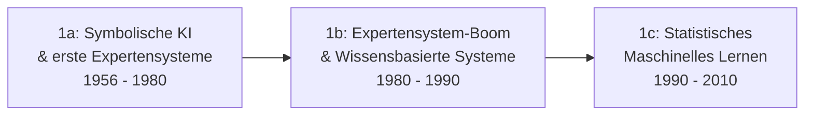

# Evolution und Architekturen digitaler KI-Anwendungen

KI-Anwendungen lassen sich — analog zu den Generationenmodellen für [Wissenssysteme](../wissen/dokumentation/evolution-digitaler-wissenssysteme.md), [Content-Management-Systeme](../wissen/dokumentation/evolution-digitaler-cms.md), [Lernmanagement-Systeme](../wissen/e-learning/evolution-digitaler-lms.md) und [Web-Frameworks](../entwicklung/webentwicklung/evolution-digitaler-webframeworks.md) — nach **technologischen Generationen** ordnen: von regelbasierten Expertensystemen über statistisches maschinelles Lernen, aufgabenspezifische Deep-Learning-Modelle und Cloud-KI-APIs bis zu generativen LLM-Anwendungen, RAG-Systemen und schließlich autonomen Multi-Agenten-Ökosystemen. Die konkreten Modelle und Frameworks je Kategorie behandelt [KI-Modelle & Frameworks: Übersicht](index.md), praktische Agenten-Architekturen [AI Agents – Das Praxis-Handbuch](coding/ai-agents-praxis.md).

!!! note "Hinweis: Generationen überlappen sich"
    Die Zeiträume sind grobe Orientierung, keine scharfen Grenzen — statistisches maschinelles Lernen (Generation 1c) läuft bis heute produktiv in Spam-Filtern und Kreditscoring, parallel zu generativen LLM-Anwendungen (Generation 4). Entscheidend ist die **Architektur** (wie das System zu seinem Verhalten kommt), nicht allein das Erscheinungsjahr.

---

## Generation 1: Regelbasierte & statistische KI-Anwendungen — Wissensbasen, Inferenzmaschinen

Die erste Generation eint drei Prinzipien: **manuell erfasstes oder statistisch erlerntes Wissen**, eine **feste Inferenzlogik** (Regeln oder ein trainiertes Modell) und **kein kontinuierliches Lernen** zur Laufzeit. Sie lässt sich in drei technologische Entwicklungsstufen unterteilen — eine tiefergehende Betrachtung speziell der Expertensystem-Architekturen (1a/1b) über ihre Fortsetzung in Regel-Engines bis zu heutigen neuro-symbolischen LLM-Hybriden bietet [Evolution und Architekturen digitaler Expertensysteme](evolution-digitaler-expertensysteme.md):

### 1a. Symbolische KI & erste Expertensysteme, 1956 – 1980

- **Architektur:** symbolische Logik, Wissensrepräsentation als Regelbäume und Fakten, implementiert meist in LISP oder Prolog.
- **Fokus:** „Wenn-Dann"-Regeln, von Experten manuell kuratierte Wissensbasis, kein Lernen aus Daten.
- **Vertreter:** **ELIZA** (1966, Joseph Weizenbaum — gilt als erster Chatbot), **DENDRAL** (1965, erstes Expertensystem, Molekülstruktur-Analyse), **MYCIN** (1972, medizinische Diagnoseunterstützung).

### 1b. Expertensystem-Boom & Wissensbasierte Systeme, 1980 – 1990

- **Architektur:** dedizierte Inferenzmaschinen mit Forward- und Backward-Chaining, kommerzielle Expertensystem-Shells.
- **Fokus:** unternehmensweiter Einsatz wissensbasierter Systeme, überzogene Erwartungen führen ab Ende der 1980er zum sogenannten „KI-Winter".
- **Vertreter:** **XCON/R1** (1980, Digital Equipment Corporation — Konfigurationssystem für Computersysteme, eines der ersten wirtschaftlich erfolgreichen Expertensysteme), **CLIPS** (NASA-Inferenzmaschine).

### 1c. Statistisches maschinelles Lernen & frühe Anwendungen, 1990 – 2010

- **Architektur:** statistische Modelle (Support Vector Machines, Entscheidungsbäume, Naive Bayes, Hidden-Markov-Modelle) lernen Muster aus Trainingsdaten statt handgeschriebener Regeln.
- **Fokus:** Data Mining, Klassifikation und Vorhersage als eigenständige Produktfunktion statt Forschungsprototyp.
- **Vertreter:** Bayes'sche **Spam-Filter** (ab ca. 1998), Netflix-**Empfehlungsalgorithmus** (2006), IBM **Deep Blue** (1997 — primär regelbasierte Suche mit statistischer Bewertungsfunktion, kein Deep Learning im heutigen Sinn).

---

## Generation 2: Deep-Learning-Anwendungen & spezialisierte neuronale Netze, ca. 2012 – 2018

GPU-beschleunigtes Training macht tiefe neuronale Netze praxistauglich — jede Anwendung erhält jedoch weiterhin ein **eigens trainiertes, aufgabenspezifisches Modell** statt eines universellen Sprachmodells. Eine eigene, tiefergehende Generationen-Zeitachse speziell für diese Architekturlinie bietet [Evolution und Architekturen digitaler Deep-Learning-Anwendungen](evolution-digitaler-deep-learning-anwendungen.md).

**Architektur:** Convolutional Neural Networks (CNN) für Bildaufgaben, Recurrent Neural Networks (RNN/LSTM) für Sequenzen, ein Modell pro Anwendungsfall.

| Meilenstein | Architektur | Bedeutung |
|---|---|---|
| **AlexNet** (2012) | CNN | Durchbruch beim ImageNet-Wettbewerb, löste den Deep-Learning-Boom aus. |
| **Google Übersetzer** (Umstieg 2016) | RNN/Encoder-Decoder | Wechsel von statistischer zu neuronaler maschineller Übersetzung, deutlich flüssigere Ergebnisse. |
| **Siri, Google Assistant, Alexa** (2011–2014) | spezialisierte Spracherkennungs- und Intent-Modelle | Erste massentaugliche Sprachassistenten, jeweils mit fest verdrahteten Kommando-Kategorien statt freier Konversation. |

---

## Generation 3: Cloud-KI-APIs & ML-as-a-Service, ca. 2015 – 2020

Vortrainierte Modelle wandern hinter **REST-APIs großer Cloud-Anbieter** — App-Entwickler nutzen Bilderkennung, Sprachverarbeitung oder Übersetzung per API-Aufruf, ohne selbst ein Modell zu trainieren. Eine eigene, tiefergehende Generationen-Zeitachse speziell für diese Architekturlinie bietet [Evolution und Architekturen digitaler Cloud-KI-APIs](evolution-digitaler-cloud-ki-apis.md).

**Architektur:** zentrale Cloud-Modelle, Pay-per-Use-Abrechnung, keine eigene GPU-Infrastruktur beim Anwendungsentwickler nötig.

| System | Anbieter | Funktion |
|---|---|---|
| **Google Cloud Vision API** | Google | Bilderkennung, Texterkennung (OCR), Label-Erkennung. |
| **AWS Rekognition** | Amazon | Gesichtserkennung, Objekterkennung in Bildern und Videos. |
| **Azure Cognitive Services** | Microsoft | Sammlung von Sprach-, Vision- und Sprachverarbeitungs-APIs. |
| **IBM Watson** | IBM | Frühe Enterprise-KI-Plattform, u. a. bekannt durch den Jeopardy!-Auftritt 2011. |

---

## Generation 4: Generative KI & LLM-gestützte Anwendungen, ab ca. 2020

Der Transformer-Architektur-Durchbruch (2017) und darauf trainierte **Foundation-Modelle** ersetzen viele aufgabenspezifische Modelle aus Generation 2/3 durch ein einziges, generalisiertes Modell — gesteuert per Prompt statt per erneutem Training. Eine eigene, tiefergehende Generationen-Zeitachse speziell für diese Architekturlinie bietet [Evolution und Architekturen digitaler Generativer KI-Anwendungen](evolution-digitaler-generative-ki-anwendungen.md).

**Architektur:** Transformer-basierte Foundation-Modelle, Konversationsinterface als neues UI-Paradigma, API-first-Konsum statt Self-Hosting.

| System | Kategorie | Bedeutung |
|---|---|---|
| **GPT-3** (2020, OpenAI) | LLM | Erstes breit zugängliches Foundation-Modell, das „Prompting" statt Fine-Tuning als Haupt-Interaktionsmodus etablierte. |
| **ChatGPT** (2022, OpenAI) | Chat-Anwendung | Massenmarkt-Durchbruch generativer KI — siehe [KI-Modell-Landschaft](index.md#modell-kategorien-im-uberblick) für die dahinterliegenden Modellfamilien. |
| **Stable Diffusion / Midjourney** | Bildgenerierung | Text-zu-Bild-Generierung als eigenständige Produktkategorie. |
| **GitHub Copilot** (2021) | Code-Vervollständigung | Erste breit adoptierte LLM-Integration direkt im Entwickler-Editor. |

---

## Generation 5: RAG & werkzeugnutzende KI-Anwendungen, ab ca. 2023

Reines Prompting stößt an Grenzen, sobald aktuelle oder unternehmensinterne Daten gebraucht werden. Die Antwort: **Retrieval-Augmented Generation (RAG)** kombiniert eine Vektordatenbank mit dem LLM, **Tool/Function Calling** erlaubt kontrollierte Aktionen über definierte Schnittstellen statt freiem Text. Eine eigene, tiefergehende Generationen-Zeitachse speziell für diese Anwendungskategorie bietet [Evolution und Architekturen digitaler RAG- & Werkzeug-Anwendungen](evolution-digitaler-rag-werkzeug-anwendungen.md).

**Architektur:** Vektordatenbank + LLM-Retrieval-Schleife, strukturierte Ausgaben (JSON-Schemata) statt freiem Fließtext, definierte Werkzeuge statt impliziter Fähigkeiten.

| Baustein | Rolle |
|---|---|
| **Retrieval-Augmented Generation (RAG)** | Bindet das LLM an eigene, aktuelle Dokumente statt an eingefrorenes Trainingswissen — siehe [Praxis-Guide: Lokales RAG & LLM-Serving mit Ollama & ChromaDB](coding/lokales-rag-ollama.md). |
| **Function/Tool Calling** | Definiert, welche konkreten Aktionen (Suche, Datenbank-Query, API-Aufruf) das Modell auslösen darf. |
| **Perplexity AI** | RAG-basierte Suchmaschine als eigenständiges Produkt statt Chat-Assistent. |
| **Custom GPTs, Claude Projects** | Anwendungsspezifische LLM-Konfigurationen mit eigenem Kontext und Werkzeugen, siehe [Custom Chat-Assistenten im Anbieter-Vergleich](coding/custom-chat-assistenten-anbieter-vergleich.md). |

---

## Generation 6: Autonome KI-Agenten & Multi-Agenten-Ökosysteme, ab ca. 2024

Statt eines einzelnen Prompt-Antwort-Zyklus planen, handeln und reflektieren KI-Agenten über mehrere Schritte hinweg selbstständig — mit Zugriff auf standardisierte Werkzeuge über das **Model Context Protocol (MCP)** und teils in koordinierten Multi-Agenten-Teams. Eine eigene, tiefergehende Generationen-Zeitachse speziell für diese Architekturlinie bietet [Evolution und Architekturen digitaler Autonomer KI-Agenten](evolution-digitaler-autonome-ki-agenten.md).

**Architektur:** Agent-Loops (Planen → Ausführen → Reflektieren), Supervisor/Worker-Orchestrierung mehrerer spezialisierter Agenten, MCP für standardisierten Werkzeugzugriff statt proprietärer Integrationen.

| System | Prinzip |
|---|---|
| **AutoGPT** (2023) | Früher Meilenstein autonomer Aufgabenerledigung ohne menschliche Zwischenschritte — zeigte sowohl Potenzial als auch Grenzen unbeaufsichtigter Agenten-Loops. |
| **Claude Code / Anthropic Agent SDK** | Agentische Coding-Werkzeuge mit Dateisystem-, Werkzeug- und Ausführungszugriff, ausführlich behandelt im [AI Agents Praxis-Handbuch](coding/ai-agents-praxis.md). |
| **OpenAI AgentKit** | Herstellerseitiges Framework zum Bau eigener Agenten-Anwendungen. |
| **LangGraph, CrewAI, AutoGen** | Multi-Agenten-Orchestrierungs-Frameworks für arbeitsteilige Agenten-Teams, siehe [Agentic Workflows (LangGraph)](coding/agentic-workflows-langgraph.md) und [AutoGen Multi-Agent Framework](coding/autogen-multiagent-framework.md). |
| **Model Context Protocol (MCP)** | Offener Standard für Werkzeugzugriff, siehe [Beste MCP-Server (Top 20)](coding/mcp-server-topliste.md). |

!!! tip "Bezug zu diesem Repository"
    Dieses Repository dokumentiert Generation 6 nicht nur, sondern nutzt sie aktiv: Die eigene Doku-Pflege folgt dem [LLM-Wiki-Pattern (Karpathy-Muster)](../wissen/dokumentation/llm-wiki-pattern-karpathy.md), und Claude Code als Agent erstellt und pflegt Artikel wie diesen direkt im Git-Repository.

!!! note "Rust als quer liegende Implementierungsachse"
    Quer zu allen sechs Generationen dieser Zeitachse liegt eine eigene Rust-Implementierungsachse — von Framework-Bindings über pure-Rust-LLM-Inferenz bis zum Model Context Protocol. Details in [Evolution und Architekturen digitaler Rust-KI-Anwendungen](evolution-digitaler-rust-ki-anwendungen.md).

!!! note "KI-Modell-Generatoren als quer liegende Architekturlinie"
    Quer zu Generation 2 (Deep-Learning) und Generation 4 (Generative KI) liegt die Architekturlinie der generativen Modell-Generatoren selbst — vom Variational Autoencoder über GANs und Diffusionsmodelle bis zu heutigen, auf Geschwindigkeit destillierten Hybrid-Generatoren. Details in [Evolution und Architekturen digitaler KI-Modell-Generatoren](evolution-digitaler-ki-modell-generatoren.md).

---

## Alternative Sortier- & Klassifikationskriterien für KI-Anwendungen

Neben dem chronologischen/technologischen Generationenmodell lassen sich KI-Anwendungen nach folgenden Dimensionen einordnen:

### 1. Lernparadigma

- **Regelbasiert/symbolisch** — manuell erfasstes Wissen, kein Lernen aus Daten (ELIZA, MYCIN).
- **Überwachtes klassisches ML** — statistisches Lernen aus gelabelten Trainingsdaten (Spam-Filter, Kreditscoring).
- **Deep Learning (aufgabenspezifisch)** — ein trainiertes neuronales Netz pro Anwendungsfall (AlexNet, frühe Sprachassistenten).
- **Foundation-Model (generalisiert, promptbar)** — ein Modell für viele Aufgaben, gesteuert per Prompt statt erneutem Training (GPT, Claude).

### 2. Interaktionsmodell

- **Batch-Verarbeitung** — Eingabe wird offline verarbeitet, Ergebnis später abgerufen (klassisches Data Mining).
- **API-Aufruf pro Anfrage** — zustandslose Einzelanfrage an ein Cloud-Modell (Generation 3).
- **Konversationsinterface** — mehrstufiger Dialog mit Kontext über mehrere Turns (ChatGPT, Claude).
- **Autonomer Agent** — mehrschrittige, selbstständige Aufgabenerledigung ohne Bestätigung pro Schritt (Generation 6).

### 3. Wissensquelle

- **Statisch einprogrammiert** — Regeln direkt im Code (Generation 1a/1b).
- **Trainierte Gewichte (eingefroren)** — Wissen liegt ausschließlich in den Modellparametern (klassische Deep-Learning-Modelle).
- **Retrieval zur Laufzeit (RAG)** — externe Dokumente ergänzen das Modellwissen live (Generation 5).
- **Tool-Aufruf zur Laufzeit** — aktuelle Daten oder Aktionen über definierte Werkzeuge statt gespeichertem Wissen (Generation 5/6).

### 4. Betriebsmodell

- **On-Premise/lokal** — eigene Infrastruktur, volle Datenhoheit (Ollama, lokale RAG-Pipelines).
- **Cloud-API** — Anbieter betreibt Modell und Skalierung (OpenAI-, Anthropic-, Google-APIs).
- **Hybrid** — lokales Modell für sensible Daten kombiniert mit Cloud-Werkzeugen für Spezialaufgaben.

---

## Verwandte Themen

- [Beste KI-Anwendungen 2026 (Top 20)](ki-anwendungen-2026-topliste.md) — Momentaufnahme 2026, die diese Chronologie in eine gerankte Topliste übersetzt
- [KI-Modelle & Frameworks: Übersicht](index.md) — Gesamtübersicht Modell-Kategorien und Frameworks
- [Evolution und Architekturen digitaler Expertensysteme](evolution-digitaler-expertensysteme.md) — vertiefendes Generationenmodell speziell für Generation 1 dieses Artikels
- [Evolution und Architekturen digitaler Deep-Learning-Anwendungen](evolution-digitaler-deep-learning-anwendungen.md) — vertiefendes Generationenmodell speziell für Generation 2 dieses Artikels
- [Evolution und Architekturen digitaler Cloud-KI-APIs](evolution-digitaler-cloud-ki-apis.md) — vertiefendes Generationenmodell speziell für Generation 3 dieses Artikels
- [Evolution und Architekturen digitaler Generativer KI-Anwendungen](evolution-digitaler-generative-ki-anwendungen.md) — vertiefendes Generationenmodell speziell für Generation 4 dieses Artikels
- [Evolution und Architekturen digitaler RAG- & Werkzeug-Anwendungen](evolution-digitaler-rag-werkzeug-anwendungen.md) — vertiefendes Generationenmodell speziell für Generation 5 dieses Artikels
- [Evolution und Architekturen digitaler Autonomer KI-Agenten](evolution-digitaler-autonome-ki-agenten.md) — vertiefendes Generationenmodell speziell für Generation 6 dieses Artikels
- [Evolution und Architekturen digitaler Rust-KI-Anwendungen](evolution-digitaler-rust-ki-anwendungen.md) — quer zu allen sechs Generationen liegende Implementierungsachse (Rust-Kerne hinter Framework-Bindings, Serving-Stacks, Inferenz-Engines und dem Model Context Protocol)
- [Evolution und Architekturen digitaler Wissenssysteme](../wissen/dokumentation/evolution-digitaler-wissenssysteme.md) — analoges Generationenmodell für Wikis & PKM-Systeme
- [Evolution und Architekturen digitaler Content-Management-Systeme](../wissen/dokumentation/evolution-digitaler-cms.md) — analoges Generationenmodell für CMS
- [Evolution und Architekturen digitaler LMS](../wissen/e-learning/evolution-digitaler-lms.md) — analoges Generationenmodell für Lernmanagement-Systeme
- [Evolution und Architekturen digitaler Web-Frameworks](../entwicklung/webentwicklung/evolution-digitaler-webframeworks.md) — analoges Generationenmodell für Web-Frameworks
- [AI Agents – Das Praxis-Handbuch & Architektur-Leitfaden](coding/ai-agents-praxis.md) — Vertiefung zu Generation 6
- [Praxis-Guide: Lokales RAG & LLM-Serving mit Ollama & ChromaDB](coding/lokales-rag-ollama.md) — Vertiefung zu Generation 5
- [LLM-Wiki-Pattern (Karpathy-Muster)](../wissen/dokumentation/llm-wiki-pattern-karpathy.md) — agentisches Pflegeprinzip, das dieses Repository selbst nutzt
