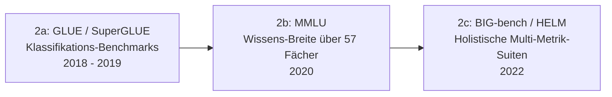

# Evolution und Architekturen digitaler KI-Evaluationswerkzeuge

Quer zu den Produkt- und Architekturgenerationen der [Evolution digitaler KI-Anwendungen](evolution-digitaler-ki-anwendungen.md) liegt eine eigene, meist übersehene Werkzeuglinie: die der **Evaluation** — der Frage, wie überhaupt gemessen wird, ob ein Modell, eine RAG-Pipeline oder ein Agent gut genug für den Produktionseinsatz ist. Diese Zeitachse ordnet die Evaluationswerkzeuge chronologisch: von manueller Begutachtung über statische Benchmark-Datensätze, LLM-als-Richter-Verfahren und RAG-spezifische Metriken bis zu den heutigen, in Observability-Plattformen integrierten und agentischen Continuous-Eval-Pipelines.

!!! note "Hinweis: Generationen überlappen sich"
    Statische Benchmarks (Generation 2) werden bis heute parallel zu LLM-as-Judge-Verfahren (Generation 3) eingesetzt — viele Teams kombinieren mehrere Generationen gleichzeitig. Entscheidend für die Einordnung ist das **Messprinzip**, nicht allein das Erscheinungsjahr des Werkzeugs.

---

## Generation 1: Manuelle Evaluation & statische Overlap-Metriken, bis 2018

- **Prinzip:** menschliche Gutachter bewerten Modellausgaben nach Kriterienkatalog (Flüssigkeit, Korrektheit, Relevanz), ergänzt um automatisierte **Overlap-Metriken** wie BLEU (2002) und ROUGE (2004), die generierten Text gegen eine Referenzantwort auf Wortüberlappung prüfen.
- **Bedeutung:** einziger verfügbarer Maßstab vor dem Aufkommen leistungsfähiger Sprachmodelle als „Richter" — bis heute Referenz für Übersetzungs- und Zusammenfassungsaufgaben.
- **Grenzen:** menschliche Evaluation skaliert nicht (teuer, langsam, inkonsistent zwischen Gutachtern); Overlap-Metriken korrelieren schwach mit tatsächlicher Antwortqualität, da sie Bedeutung nicht erfassen, nur Wortüberlappung.

---

## Generation 2: Standardisierte Benchmark-Suiten, 2018 – 2022

### 2a. GLUE / SuperGLUE — Klassifikations-Benchmarks, 2018 – 2019
- **Prinzip:** feste Aufgabenbatterie (Textklassifikation, Ähnlichkeit, Inferenz) mit öffentlichem Leaderboard — ein einzelner Score pro Modell.
- **Bedeutung:** etabliert das Leaderboard-Paradigma, das die Modellentwicklung bis heute prägt.

### 2b. MMLU — Wissens-Breite, 2020
- **Prinzip:** Multiple-Choice-Fragen über 57 Fachgebiete (Recht, Medizin, Mathematik, Geschichte) — misst breites Faktenwissen statt einer engen Aufgabe.
- **Bedeutung:** wird zum meistzitierten Einzelbenchmark für generelle LLM-Fähigkeit, trotz bekannter Kontamination durch Trainingsdaten in späteren Modellgenerationen.

### 2c. BIG-bench / HELM — holistische Multi-Metrik-Suiten, 2022
- **Prinzip:** Hunderte Einzelaufgaben (BIG-bench) bzw. ein standardisiertes Multi-Metrik-Framework über Genauigkeit, Kalibrierung, Fairness, Robustheit und Effizienz gleichzeitig (HELM, Stanford CRFM).
- **Bedeutung:** erste Abkehr vom Ein-Zahl-Leaderboard hin zu mehrdimensionaler Bewertung — direkter Vorläufer heutiger Multi-Metrik-Eval-Frameworks.
- **Grenzen:** statische Datensätze veralten schnell (Trainingsdaten-Kontamination) und bilden reale Produktionsanfragen nur unvollständig ab.

---

## Generation 3: LLM-as-Judge & automatisierte Qualitätsbewertung, 2022 – 2023

- **Prinzip:** ein starkes Sprachmodell bewertet die Ausgabe eines anderen Modells anhand eines Kriterien-Prompts — ersetzt oder ergänzt menschliche Gutachter bei offenen, nicht multiple-choice-fähigen Aufgaben (Dialogqualität, Hilfsbereitschaft, Stil).
- **Beispiele:** **MT-Bench** und **AlpacaEval** (Vergleichsurteile zwischen zwei Modellantworten), **OpenAI Evals** (2023, deklaratives Framework zum Definieren eigener Custom-Evals inklusive Modell-als-Richter-Grader).
- **Bedeutung:** macht Evaluation offener, generativer Aufgaben erstmals skalierbar, ohne für jede Aufgabe menschliche Gutachter zu benötigen.
- **Grenzen:** „Judge"-Modelle zeigen bekannte Verzerrungen (Bevorzugung längerer Antworten, Selbstbevorzugung des eigenen Modell-Anbieters) — erfordert sorgfältiges Prompt-Design und regelmäßige Kalibrierung gegen menschliche Stichproben.

---

## Generation 4: RAG- & Retrieval-Evaluation, 2023 – 2024

- **Prinzip:** zerlegt die Bewertung einer RAG-Pipeline in separate Teilmetriken statt eines einzigen Gesamturteils — typischerweise **Context Precision/Recall** (wurden die richtigen Dokumente abgerufen?), **Faithfulness** (stützt sich die Antwort ausschließlich auf den abgerufenen Kontext, ohne zu halluzinieren?) und **Answer Relevance** (beantwortet die Ausgabe tatsächlich die gestellte Frage?).
- **Beispiele:** **Ragas** (2023, dedizierte RAG-Metrik-Bibliothek), **TruLens** (RAG-Triade aus Groundedness, Context Relevance, Answer Relevance).
- **Bedeutung:** erste Evaluationsgeneration, die Retrieval- und Generierungsqualität getrennt sichtbar macht — entscheidend, weil ein RAG-System aus zwei unabhängig fehlschlagenden Teilkomponenten besteht.

---

## Generation 5: Observability-integrierte Continuous Evals, 2023 – 2025

- **Prinzip:** Evaluation läuft nicht mehr als isolierter Offline-Batch-Lauf, sondern direkt eingebettet in Tracing/Observability der Produktionsanwendung — jede reale Anfrage kann automatisch bewertet werden, Regressionen werden als Dashboard-Alarm statt erst im nächsten Release sichtbar.
- **Beispiele:** **Langfuse**, **Arize Phoenix**, **Opik** (Comet), **Weights & Biases Weave** — kombinieren Tracing, Prompt-Versionierung und Eval-Scores in einer Oberfläche.
- **Bedeutung:** verschiebt Evaluation von „vor dem Release einmalig geprüft" zu „kontinuierlich in Produktion überwacht" — Voraussetzung für schnelle Iteration bei häufigen Prompt-/Modelländerungen.

---

## Generation 6: Agentische & Tool-Use-Evaluation, 2024 – 2025

- **Prinzip:** bewertet nicht mehr nur eine einzelne Textausgabe, sondern eine ganze **Handlungssequenz** — welche Werkzeuge wurden in welcher Reihenfolge korrekt aufgerufen, wurde ein mehrstufiges Ziel tatsächlich erreicht, wie viele Schritte/Tokens hat der Agent dafür benötigt.
- **Beispiele:** **Inspect AI** (UK AI Safety Institute, Referenzframework für Task- und Agenten-Evals), aufgabenbasierte Benchmarks wie SWE-bench (Code-Fixes), WebArena und GAIA (mehrstufige Werkzeugnutzung).
- **Bedeutung:** notwendige Erweiterung, sobald Systeme von reiner Textgenerierung zu autonomem Werkzeugeinsatz übergehen, siehe [Evolution digitaler autonomer KI-Agenten](evolution-digitaler-autonome-ki-agenten.md).

---

## Generation 7: Sicherheits-, Red-Teaming- & Guardrail-Evaluation, 2024 – 2026

- **Prinzip:** testet ein System aktiv auf Schwachstellen statt nur auf Korrektheit — automatisiertes Prompt-Injection-Testing, Jailbreak-Versuche, Datenleck-Erkennung und Bias-Scans laufen als fester CI-Gate-Schritt vor jedem Deployment.
- **Beispiele:** **garak** (NVIDIA-gesponserter LLM-Vulnerability-Scanner), **PyRIT** (Microsofts Python Risk Identification Toolkit), Red-Teaming-Module in **promptfoo** und **Giskard**.
- **Bedeutung:** aktuellste Generation — reagiert auf den Produktionseinsatz von Agenten mit realen Werkzeugrechten, bei denen ein unentdeckter Jailbreak nicht mehr nur eine peinliche Textausgabe, sondern eine reale Handlung (Datei löschen, API-Aufruf) auslösen kann.

---

## Alternative Sortier- & Klassifikationskriterien für KI-Evaluationswerkzeuge

### 1. Messprinzip
- **Referenzbasiert** — Vergleich gegen eine bekannte richtige Antwort (BLEU/ROUGE, Multiple-Choice-Benchmarks).
- **Modell-als-Richter** — ein LLM bewertet ohne feste Referenzantwort (MT-Bench, viele RAG-Metriken).
- **Regelbasiert/programmatisch** — deterministische Prüfungen wie JSON-Schema-Validität, Tool-Call-Korrektheit oder Substring-Match.

### 2. Betriebsmodus
- **Offline/Batch** — fester Evaluationsdatensatz, vor dem Release einmalig durchlaufen (klassische Benchmark-Suiten).
- **Online/Continuous** — jede Produktionsanfrage wird laufend bewertet, direkt in die Observability-Pipeline integriert (Generation 5).

### 3. Bewertungsgegenstand
- **Einzelantwort** — Textqualität einer isolierten Modellausgabe.
- **RAG-Pipeline** — Retrieval- und Generierungsqualität getrennt (Generation 4).
- **Agentische Handlungssequenz** — mehrstufige Werkzeugnutzung und Zielerreichung (Generation 6).
- **Sicherheit/Robustheit** — Verhalten unter adversarialen Eingaben statt normaler Nutzung (Generation 7).

---

## Verwandte Themen

- [Beste KI-Evaluationswerkzeuge 2026 (Top 15)](ki-evaluation-2026-topliste.md) — Momentaufnahme 2026, die diese Chronologie in eine gerankte Topliste übersetzt
- [Beste Software 2026: Wissenssysteme, Evaluation & Generatoren (Top-20-Meta-Topliste)](../wissen/dokumentation/beste-software-wissenssysteme-evaluation-generatoren-2026-topliste.md) — führt diese Kategorie mit Wissenssystemen und Generatoren nach denselben Reife-/Aktivitäts-/Lizenzkriterien zusammen
- [Evolution und Architekturen digitaler autonomer KI-Agenten](evolution-digitaler-autonome-ki-agenten.md) — Produktgeneration, deren Handlungssequenzen Generation 6 bewertet
- [Evolution und Architekturen digitaler RAG- & Werkzeug-Anwendungen](evolution-digitaler-rag-werkzeug-anwendungen.md) — Produktgeneration, deren Pipelines Generation 4 bewertet
- [Prompt Engineering Praxis-Handbuch](coding/prompt-engineering-praxis.md) — praktischer Kontext, in dem Eval-Werkzeuge iterativ eingesetzt werden
- [KI-Modelle & Frameworks: Übersicht](index.md) — Gesamtübersicht Modell-Kategorien und Frameworks
