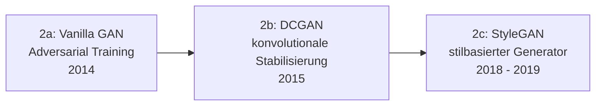

# Evolution und Architekturen digitaler KI-Modell-Generatoren

Quer zu Generation 2 (Deep-Learning-Anwendungen) und Generation 4 (Generative KI-Anwendungen) der [Evolution digitaler KI-Anwendungen](evolution-digitaler-ki-anwendungen.md) liegt eine eigene Architekturlinie: die der **Generatoren** selbst — die Modellklassen, die aus einer Verteilung neue, plausible Daten erzeugen (Bild, Text, Audio, Video). Während [Evolution und Architekturen digitaler Generativer KI-Anwendungen](evolution-digitaler-generative-ki-anwendungen.md) die **Produkt-/Anwendungsgeneration** dieser Systeme chronologisch einordnet (ChatGPT, Custom-Assistenten, lokale LLMs), zoomt diese Zeitachse in die darunterliegende **Modell-Architektur** hinein: vom Variational Autoencoder über Generative Adversarial Networks, autoregressive Pixel-/Wave-Modelle und Normalizing Flows bis zu Diffusionsmodellen und den heutigen, auf Geschwindigkeit destillierten Hybrid-Generatoren.

!!! note "Hinweis: Generationen überlappen sich"
    Die Zeiträume sind grobe Orientierung, keine scharfen Grenzen — GANs werden bis heute produktiv eingesetzt (z. B. StyleGAN-Varianten für Gesichtssynthese), parallel zu Diffusionsmodellen. Entscheidend ist das **Erzeugungsprinzip** (wie das Modell aus Rauschen/Latentraum eine Ausgabe konstruiert), nicht allein das Erscheinungsjahr.

---

## Generation 1: Variational Autoencoder (VAE) — probabilistische Grundlage, 2013 – 2014

- **Architektur:** Encoder komprimiert die Eingabe auf eine Verteilung im Latentraum (statt eines einzelnen Punkts wie beim klassischen Autoencoder), Decoder rekonstruiert daraus neue Samples — trainiert über eine Kombination aus Rekonstruktionsfehler und einem Regularisierungsterm (KL-Divergenz), der den Latentraum glatt und sampelbar hält.
- **Bedeutung:** erster Deep-Learning-Generator, der **neue** Daten aus dem Latentraum erzeugen kann statt nur bestehende zu klassifizieren oder zu rekonstruieren — Grundprinzip (Encoder → Latentraum → Decoder) taucht in praktisch allen späteren Bild-Generatoren wieder auf.
- **Grenzen:** erzeugte Bilder wirken oft unscharf/verwaschen, da der Rekonstruktionsfehler pixelweise gemittelte, statt scharfe Lösungen begünstigt.

---

## Generation 2: Generative Adversarial Networks (GANs), 2014 – 2019

Zwei Netze treten gegeneinander an: ein **Generator**, der aus Zufallsrauschen Daten erzeugt, und ein **Diskriminator**, der zwischen echten und generierten Daten unterscheiden soll. Beide werden gemeinsam trainiert, bis der Generator den Diskriminator zuverlässig täuscht.

### 2a. Vanilla GAN — Adversarial Training, 2014

- **Architektur:** Generator und Diskriminator als einfache vollvernetzte Netze, Min-Max-Spiel zwischen beiden als Trainingsziel.
- **Bedeutung:** löst das Unschärfe-Problem der VAE — der Diskriminator zwingt den Generator zu scharfen, realistischen Ausgaben statt gemittelten Kompromissen.
- **Grenzen:** instabiles Training (Mode Collapse, verschwindende Gradienten), schwer reproduzierbar.

### 2b. DCGAN — konvolutionale Stabilisierung, 2015

- **Architektur:** ersetzt vollvernetzte Schichten durch **transponierte Faltungen** im Generator und Faltungsschichten im Diskriminator — deutlich stabileres Training, etabliert die bis heute übliche GAN-Grundarchitektur für Bilddaten.

### 2c. StyleGAN — stilbasierter Generator, 2018 – 2019

- **Architektur:** trennt Latentraum-Steuerung (Stil pro Auflösungsebene) von der eigentlichen Bildsynthese — erlaubt gezielte Kontrolle über einzelne visuelle Merkmale (Pose, Textur, Farbe) statt eines einzigen undurchsichtigen Latentvektors.
- **Bedeutung:** bis heute Referenzarchitektur für hochauflösende, kontrollierbare Gesichts- und Objektsynthese.

---

## Generation 3: Autoregressive Pixel- & Wave-Generatoren, 2016

- **Architektur:** erzeugt eine Ausgabe **Element für Element** (Pixel für Pixel, Audio-Sample für Audio-Sample), jedes neue Element bedingt auf alle vorherigen — kein Adversarial-Training, sondern direkte Maximum-Likelihood-Optimierung.
- **Beispiele:** **PixelRNN/PixelCNN** (Bildgenerierung Pixel für Pixel), **WaveNet** (Audiogenerierung Sample für Sample, Grundlage für spätere Text-zu-Sprache-Systeme).
- **Grenzen:** sequenzielle Generierung ist bei hoher Auflösung/Länge sehr langsam — dieselbe Grundidee (autoregressive, Token für Token) wird später von Transformer-Textgeneratoren übernommen, dort aber durch parallelisierbares Training kompensiert.

---

## Generation 4: Normalizing-Flow-Generatoren, 2016 – 2018

- **Architektur:** eine Kette **invertierbarer** Transformationen überführt eine einfache Verteilung (z. B. Gauß-Rauschen) exakt in die Zieldatenverteilung — im Gegensatz zu VAE/GAN lässt sich die exakte Likelihood eines Datenpunkts berechnen statt nur schätzen.
- **Beispiele:** **RealNVP** (2016), **Glow** (2018).
- **Bedeutung:** Nischenarchitektur mit exakter Likelihood-Berechnung, wird aber in der Praxis von den qualitativ überlegenen Diffusionsmodellen (Generation 5) verdrängt — liefert diesen jedoch mathematische Grundlagen (kontinuierliche Transformationen, siehe Flow Matching in Generation 7).

---

## Generation 5: Diffusionsmodelle, 2020 – 2022

- **Architektur:** trainiert ein Netz darauf, in vielen kleinen Schritten Rauschen aus einem verrauschten Bild zu entfernen (**Denoising**) — Generierung läuft rückwärts: aus reinem Rauschen wird schrittweise ein Bild „herausgeschält". Stabileres Training als GANs, keine Adversarial-Dynamik.
- **Bedeutung:** löst GANs als Stand der Technik für Bildgenerierung ab — bessere Ausgabevielfalt (kein Mode Collapse) und höhere Bildqualität bei ausreichend Rechenleistung.

| System | Jahr | Beitrag |
|---|---|---|
| **DDPM** (Denoising Diffusion Probabilistic Models) | 2020 | Formalisiert das moderne Diffusions-Trainingsziel, Grundlage aller folgenden Systeme. |
| **Stable Diffusion** | 2022 | Rechnet im komprimierten Latentraum statt im Pixelraum — macht Diffusion auf Consumer-Hardware praktikabel, offenes Modell. |
| **DALL-E 2, Imagen** | 2022 | Text-zu-Bild-Diffusion mit starker Sprachmodell-Konditionierung, geschlossene Anbieter-Systeme. |

Konkrete Produkte auf dieser Architektur behandelt [Evolution und Architekturen digitaler Generativer KI-Anwendungen](evolution-digitaler-generative-ki-anwendungen.md#generation-4-bild-video-generierung-als-eigenstandige-produktkategorie-2022-2024).

---

## Generation 6: Multimodale & Video-Diffusionsgeneratoren, 2023 – 2024

- **Architektur:** überträgt das Diffusionsprinzip von Einzelbildern auf **zeitlich kohärente Sequenzen** — zusätzliche zeitliche Schichten/Attention über Frames hinweg verhindern Flackern und Inkonsistenzen zwischen Einzelbildern.
- **Beispiele:** **Sora** (2024, Text-zu-Video), latente Video-Diffusionsmodelle mit deutlich verbesserter zeitlicher Kohärenz gegenüber frühen Frame-für-Frame-Ansätzen.
- **Bedeutung:** erste Generatorklasse, die Video als eigenständige Ausgabemodalität statt einer Aneinanderreihung von Einzelbildern behandelt.

---

## Generation 7: Distillations- & Hybrid-Generatoren, 2023 – 2026

Diffusionsmodelle sind qualitativ stark, aber langsam (typischerweise 20–1000 Sampling-Schritte). Die aktuelle Generatoren-Generation destilliert dieses iterative Verfahren auf wenige oder einen einzigen Schritt, ohne die Qualität vollständig zu opfern.

| Ansatz | Prinzip |
|---|---|
| **Consistency Models** | Trainiert direkt darauf, von jedem beliebigen Rauschpunkt der Diffusionstrajektorie in einem einzigen Schritt zum Endergebnis zu springen. |
| **Latent Consistency Models (LCM)** | Wendet das Consistency-Prinzip auf latente Diffusionsmodelle (z. B. Stable-Diffusion-Basis) an — Bildgenerierung in 2–4 statt 20+ Schritten. |
| **Flow Matching / Rectified Flow** | Ersetzt den stochastischen Diffusionspfad durch möglichst gerade Transformationspfade zwischen Rausch- und Datenverteilung — schnelleres Sampling bei vergleichbarer Qualität, direkte Verwandtschaft zu Normalizing Flows (Generation 4). |

**Bedeutung:** verschiebt den Fokus von reiner Ausgabequalität hin zu **Sampling-Effizienz** — Voraussetzung für Echtzeit- und interaktive Generierungsanwendungen.

---

## Alternative Sortier- & Klassifikationskriterien für KI-Modell-Generatoren

### 1. Trainingsparadigma

- **Adversarial** — Generator vs. Diskriminator im Wettstreit (Generation 2).
- **Likelihood-basiert** — direkte Maximierung der Datenwahrscheinlichkeit (VAE, autoregressive Modelle, Normalizing Flows).
- **Score-/Diffusion-basiert** — schrittweises Entrauschen statt einzelnem Vorwärtsdurchlauf (Generation 5, 6).
- **Distillation-basiert** — von einem trainierten Diffusionsmodell auf wenige Schritte komprimiert (Generation 7).

### 2. Sampling-Geschwindigkeit

- **Einzelschritt** — ein Vorwärtsdurchlauf erzeugt die vollständige Ausgabe (VAE, GAN, Consistency Models).
- **Sequenziell/autoregressiv** — Element für Element, Geschwindigkeit skaliert mit Ausgabelänge (PixelCNN, WaveNet, Text-Transformer).
- **Iterativ/mehrschrittig** — viele kleine Verbesserungsschritte auf derselben Ausgabe (klassische Diffusion, Normalizing Flows).

### 3. Ausgabemodalität

- **Bild** — GAN, Diffusionsmodelle (Stable Diffusion, DALL-E).
- **Audio** — WaveNet und autoregressive Nachfolger.
- **Text** — autoregressive Transformer, siehe [Evolution und Architekturen digitaler Generativer KI-Anwendungen](evolution-digitaler-generative-ki-anwendungen.md).
- **Video** — Sora und latente Video-Diffusionsmodelle (Generation 6).

### 4. Latentraum-Struktur

- **Niedrigdimensional/komprimiert** — Encoder-Decoder-Bottleneck (VAE, GAN-Latentvektor).
- **Gleiche Dimensionalität wie die Ausgabe** — Rauschen wird direkt im (latenten) Ausgaberaum verarbeitet (Diffusionsmodelle, Normalizing Flows).

---

## Verwandte Themen

- [Evolution und Architekturen digitaler Generativer KI-Anwendungen](evolution-digitaler-generative-ki-anwendungen.md) — Produkt-/Anwendungsgeneration, die auf diesen Modell-Architekturen aufbaut
- [Beste generative KI-Anwendungen 2026 (Top 20)](generative-ki-anwendungen-2026-topliste.md) — konkrete Produkte, gerankte Momentaufnahme 2026
- [Evolution und Architekturen digitaler Deep-Learning-Anwendungen](evolution-digitaler-deep-learning-anwendungen.md) — übergeordnete Deep-Learning-Zeitachse, aus der GANs (Generation 2 dort) hervorgingen
- [Evolution und Architekturen digitaler KI-Anwendungen](evolution-digitaler-ki-anwendungen.md) — Gesamt-Generationenmodell, dem diese Architekturlinie quer liegt
- [Multimodale Vision-Pipelines](coding/multimodale-vision-pipelines.md) — praktischer Einsatz multimodaler Bild-/Video-Generatoren
- [KI-Modelle & Frameworks: Übersicht](index.md) — Gesamtübersicht Modell-Kategorien und Frameworks
