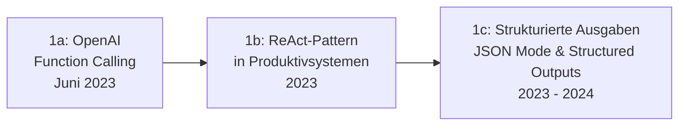

# Evolution und Architekturen digitaler RAG- & Werkzeug-Anwendungen

RAG- und werkzeugnutzende KI-Anwendungen bilden Generation 5 der [Evolution digitaler KI-Anwendungen](evolution-digitaler-ki-anwendungen.md). Diese eigenständige Zeitachse verfolgt die **Anwendungsseite**: konkrete Produktkategorien, die Retrieval und Tool-Calling nutzen — Suchmaschinen, Coding-Assistenten, Enterprise-Chatbots. Die zugrundeliegende **Technologie** (Embeddings, Vektordatenbanken, RAG-Pipeline-Mechanik) behandelt vertieft [Evolution und Architekturen digitaler Semantischer & RAG-Wissenssysteme](../wissen/dokumentation/evolution-digitaler-semantische-rag-wissenssysteme.md) — dieser Artikel setzt diese Technologie als gegeben voraus und ordnet stattdessen die **Anwendungskategorien**, die darauf aufbauen.

!!! note "Hinweis: Generationen überlappen sich"
    Die Zeiträume sind grobe Orientierung, keine scharfen Grenzen — Function Calling (Generation 1) ist bis heute Grundbaustein aller folgenden Generationen. Entscheidend ist die **Architektur** (wie Werkzeugzugriff und Retrieval in die Anwendung integriert sind), nicht allein das Erscheinungsjahr.

---

## Generation 1: Vom Prompt zum Tool-Aufruf — Function Calling wird Standard, 2023

Die Gründergeneration eint drei Prinzipien: **strukturierte statt freier Textausgabe**, **definierte Werkzeuge** statt impliziter Modellfähigkeiten und eine **Schleife aus Denken und Handeln** statt einmaliger Antwortgenerierung. Sie lässt sich in drei technologische Entwicklungsstufen unterteilen:

### 1a. OpenAI Function Calling, Juni 2023

- **Architektur:** das Modell entscheidet selbst, ob und welche vordefinierte Funktion mit welchen Parametern aufgerufen werden soll — die Anwendung führt die Funktion aus und gibt das Ergebnis zurück in den Kontext.
- **Bedeutung:** erste standardisierte, herstellerseitige Lösung für kontrolliertes Werkzeug-Handling statt fragilem Prompt-Parsing.

### 1b. ReAct-Pattern in Produktivsystemen, 2023

- **Architektur:** verschränkt Denkschritte („Reasoning") und Werkzeugaufrufe („Acting") in einer wiederholten Schleife, siehe auch [Generation 2 der Multi-Agenten-Wissensökosysteme](../wissen/dokumentation/evolution-digitaler-multiagenten-wissensoekosysteme.md#generation-2-der-autonome-einzel-agent-2022-2023).
- **Fokus:** mehrstufige Aufgaben statt Einzelaufrufen — das Modell plant den nächsten Schritt basierend auf dem Ergebnis des vorherigen.

### 1c. Strukturierte Ausgaben — JSON Mode & Structured Outputs, 2023 – 2024

- **Architektur:** das Modell garantiert syntaktisch valides JSON nach einem vorgegebenen Schema statt freiem Text mit Parsing-Risiko, siehe [Structured Outputs mit Pydantic](coding/structured-outputs-pydantic.md).
- **Fokus:** Zuverlässigkeit der Schnittstelle zwischen LLM und nachgelagertem Code — eine Voraussetzung für produktionsreife Tool-Integration.

---

## Generation 2: RAG-native Such- und Recherche-Anwendungen, ab 2023

Retrieval wird zum **eigenständigen Produkt** statt einer Zusatzfunktion im Chat — die Anwendung ist von Grund auf als Such-/Rechercheprodukt konzipiert.

| System | Prinzip |
|---|---|
| **Perplexity AI** | RAG-basierte Suchmaschine mit Quellenangaben als Kernprodukt statt allgemeinem Chat-Assistenten. |
| **Bing Chat / Copilot** (Websuche-Modus) | Kombiniert klassische Websuche mit LLM-Zusammenfassung der Ergebnisse. |

---

## Generation 3: KI-gestützte Coding-Assistenten mit Werkzeugzugriff, 2021 – 2023

Coding-Assistenten entwickeln sich von reiner Code-Vervollständigung zu Werkzeugen mit direktem Zugriff auf Dateisystem, Terminal und Testausführung.

| System | Jahr | Fähigkeit |
|---|---|---|
| **GitHub Copilot** | 2021 | Erste breit adoptierte Code-Vervollständigung, noch ohne eigenständigen Werkzeugzugriff. |
| **Cursor, Windsurf** | 2023 | Editor-integrierte Agenten mit Datei- und Terminalzugriff, Mehrschritt-Refactorings. |
| **Aider** | 2023 | Terminal-natives Werkzeug, das direkt Git-Commits aus KI-Änderungen erzeugt. |
| **Claude Code** | 2025 | Agentisches Coding-Werkzeug mit vollem Datei-, Werkzeug- und Ausführungszugriff, siehe [Claude Code in der Praxis](coding/claude-code-praxis.md). |

---

## Generation 4: Unternehmensweite RAG-Assistenten & Wissensdatenbank-Chatbots, 2023 – 2024

Unternehmen setzen RAG ein, um firmeninterne Dokumente statt öffentlicher Trainingsdaten durchsuchbar zu machen — meist als selbst hostbare All-in-One-Plattform.

| System | Prinzip |
|---|---|
| **AnythingLLM** | All-in-One-Desktop-/Docker-Anwendung für lokale Dokumente in privaten Chat-Kontexten, siehe [AnythingLLM](../wissen/dokumentation/anythingllm-rag-plattform.md). |
| **Onyx (ehem. Danswer)** | Verbindet sich mit bestehenden Datenquellen (Slack, Google Drive, Wikis), siehe [Onyx](../wissen/dokumentation/onyx-danswer-rag-plattform.md). |
| **Open WebUI** | Web-Frontend für LLMs mit integriertem, konfigurierbarem RAG-System, siehe [Open WebUI](../wissen/dokumentation/open-webui-rag-agenten-plattform.md). |

---

## Generation 5: Model Context Protocol standardisiert Werkzeugzugriff, ab November 2024

Statt proprietärer Integrationen pro Anwendung entsteht ein **offener Standard** für Werkzeugzugriff — ein MCP-Server lässt sich mit jedem MCP-fähigen Client verwenden, unabhängig vom Hersteller.

| Baustein | Rolle |
|---|---|
| **Model Context Protocol (MCP)** | Offener Standard von Anthropic für standardisierten Werkzeug- und Datenzugriff, siehe [Beste MCP-Server (Top 20)](coding/mcp-server-topliste.md). |
| **MCP-Clients** | Anwendungen, die MCP-Server ansprechen, siehe [MCP-Client-Topliste](coding/mcp-client-topliste.md). |
| **MCP-Gateways & Sicherheit** | Vermittlungsschicht und Best Practices für produktiven MCP-Einsatz, siehe [MCP-Gateway-Topliste](coding/mcp-gateway-topliste.md) und [MCP-Sicherheit Best Practices](coding/mcp-sicherheit-best-practices-topliste.md). |

---

## Generation 6: Agentische RAG mit mehrstufigem Retrieval, ab 2024

Statt eines einzelnen Retrieval-Schritts bewertet die Anwendung Zwischenergebnisse und stellt bei Bedarf weitere, verfeinerte Suchanfragen — die technische Grundlage liefert [GraphRAG aus der Semantische-&-RAG-Wissenssysteme-Zeitachse](../wissen/dokumentation/evolution-digitaler-semantische-rag-wissenssysteme.md#generation-6-graphrag-agentische-multi-hop-wissenssysteme-ab-2024), hier im Anwendungskontext.

| Baustein | Rolle |
|---|---|
| **Selbstkorrigierende Retrieval-Schleifen** | Ein Agent bewertet, ob die gefundenen Chunks die Frage tatsächlich beantworten, und sucht sonst erneut, siehe [AI Agents Praxis-Handbuch](coding/ai-agents-praxis.md). |
| **Multi-Hop-RAG-Anwendungen** | Kombinieren mehrere Teilantworten aus unterschiedlichen Dokumenten zu einer zusammengesetzten Antwort statt eines einzelnen Retrieval-Treffers. |

---

## Alternative Sortier- & Klassifikationskriterien für RAG- & Werkzeug-Anwendungen

### 1. Werkzeugumfang

- **Kein Werkzeug, reines Prompting** — vor Generation 1.
- **Feste, vordefinierte Funktionen** — Function Calling (Generation 1).
- **Standardisierter, herstellerübergreifender Zugriff** — MCP (Generation 5).

### 2. Retrieval-Tiefe

- **Einmaliges Retrieval** — ein Suchschritt pro Anfrage (Generation 2, 4).
- **Iteratives/agentisches Retrieval** — mehrere, sich verfeinernde Suchschritte (Generation 6).

### 3. Einsatzkontext

- **Konsumentenprodukt** — Perplexity, Custom GPTs (Generation 2).
- **Entwicklerwerkzeug** — Cursor, Claude Code (Generation 3).
- **Unternehmensinterne Wissensbasis** — AnythingLLM, Onyx (Generation 4).

---

## Verwandte Themen

- [Evolution und Architekturen digitaler KI-Anwendungen](evolution-digitaler-ki-anwendungen.md) — übergeordnetes Generationenmodell, Generation 5 dort entspricht diesem Artikel im Ganzen
- [Evolution und Architekturen digitaler Semantischer & RAG-Wissenssysteme](../wissen/dokumentation/evolution-digitaler-semantische-rag-wissenssysteme.md) — technische Grundlage (Embeddings, Vektordatenbanken) hinter dieser Anwendungs-Zeitachse
- [Evolution und Architekturen digitaler Multi-Agenten-Wissensökosysteme](../wissen/dokumentation/evolution-digitaler-multiagenten-wissensoekosysteme.md) — verwandtes Orchestrierungsprinzip für Wissenspflege statt allgemeiner Anwendungen
- [AI Agents – Das Praxis-Handbuch & Architektur-Leitfaden](coding/ai-agents-praxis.md) — Vertiefung zu Generation 6
- [Beste MCP-Server (Top 20)](coding/mcp-server-topliste.md) — Vertiefung zu Generation 5
- [Claude Code in der Praxis](coding/claude-code-praxis.md) — Vertiefung zu Generation 3
- [Structured Outputs mit Pydantic](coding/structured-outputs-pydantic.md) — Vertiefung zu Generation 1c
