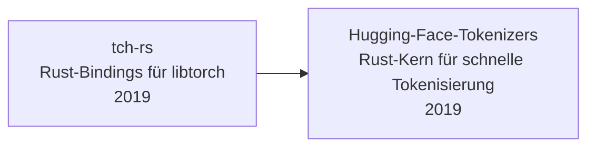

# Evolution und Architekturen digitaler Rust-KI-Anwendungen

Eigenständige KI-Anwendungen entstehen bislang selten vollständig in Rust — stattdessen etabliert sich Rust seit 2019 als **quer zu allen sechs Generationen von [Evolution digitaler KI-Anwendungen](evolution-digitaler-ki-anwendungen.md) liegende Implementierungsachse**: Bindings zu bestehenden Frameworks, Produktions-Serving-Stacks, pure-Rust-Inferenz-Engines, Tokenisierung, kontrollierte Generierung und zuletzt das Model Context Protocol wandern zunehmend auf einen Rust-Kern — meist unsichtbar hinter einer Python-API oder einem Chat-Interface. Dieser Artikel ordnet diese Rust-Bausteine chronologisch nach **technologischen Generationen** — die allgemeine Rust-Werkzeuglandschaft jenseits von KI-Anwendungen behandelt [Rust in der Praxis](../entwicklung/system/rust-praxis.md).

!!! note "Hinweis: Eine Implementierungsachse, keine Konkurrenz-Zeitachse"
    Anders als eine eigenständige KI-Anwendung entspricht diese Zeitachse keiner einzelnen Generation von [Evolution digitaler KI-Anwendungen](evolution-digitaler-ki-anwendungen.md), sondern schneidet quer durch alle sechs — der Hugging-Face-`tokenizers`-Kern aus Generation 1 läuft z. B. bis heute unter praktisch jedem Generative-KI-Modell aus [Generation 4 der KI-Anwendungen-Zeitachse](evolution-digitaler-ki-anwendungen.md#generation-4-generative-ki-llm-gestutzte-anwendungen-ab-ca-2020). Die Zeiträume sind grobe Orientierung, keine scharfen Grenzen.

---

## Generation 1: Rust-Bindings zu bestehenden ML-Frameworks, 2019 – 2020

Bevor ein eigenständiges Rust-ML-Ökosystem existiert, entstehen zunächst Brücken zu etablierten Python-Frameworks — Rust übernimmt performancekritische Einzelbausteine, statt das gesamte Framework zu ersetzen.

- **tch-rs** (2019) — von Laurent Mazare entwickelte Rust-Bindings für libtorch (den C++-Kern von PyTorch), erlaubt das Laden und Ausführen von PyTorch-Modellen direkt aus Rust-Code.
- **Hugging Face `tokenizers`** (2019) — Rust-Kern für Byte-Pair-Encoding und andere Tokenisierungsalgorithmen, über Python-Bindings praktisch in jeder `transformers`-basierten Pipeline im Einsatz — für die meisten Nutzer unsichtbar hinter `AutoTokenizer.from_pretrained(...)`.

**Bedeutung:** Beide Bausteine etablieren das Muster „Rust-Kern hinter Python-API", das die folgenden Generationen wiederholt aufgreifen — und liefern mit Laurent Mazare bereits den späteren Autor von Candle (Generation 3) als personelle Kontinuität.

---

## Generation 2: Rust im Produktions-Serving-Stack für LLMs, 2022

Mit dem wachsenden Bedarf an Hochlast-fähigem Modell-Serving wandert die Anfrage-Orchestrierung — nicht die Modellausführung selbst — auf einen Rust-Kern, während gleichzeitig das erste eigenständige Rust-native Deep-Learning-Framework entsteht.

**Architektur:** Rust-Router/-Scheduler übernimmt Batching, Queueing und Streaming-Ausgabe, die eigentliche Tensor-Berechnung bleibt zunächst in Python/PyTorch (hybrides Muster) — parallel dazu ein vollständig eigenständiges Rust-Framework mit mehreren austauschbaren Backends.

| System | Jahr | Rolle |
|---|---|---|
| **Text Generation Inference (TGI)**, Hugging Face | 2022 | Rust-Router für kontinuierliches Batching und Token-Streaming, Modellausführung weiterhin über Python/PyTorch — dasselbe Hybrid-Muster wie später bei Zensical (vgl. [Generation 6 der Rust-Wissenssysteme-Zeitachse](../wissen/dokumentation/evolution-digitaler-rust-wissenssysteme.md#generation-6-rust-im-kern-ki-nativer-docs-as-code-plattformen-ab-2025)). |
| **Burn**, Tracel AI | 2022 | Erstes umfassendes, eigenständiges Rust-natives Deep-Learning-Framework mit austauschbaren Backends (WGPU, CUDA, LibTorch, ndarray) statt einer einzelnen festen Laufzeit. |

---

## Generation 3: Pure-Rust lokale LLM-Inferenz ohne Python, 2023

Zwei parallele Projekte lösen sich vollständig von Python — Sprachmodelle laufen erstmals als eigenständige Rust-Binärdatei, ohne PyTorch-Laufzeit im Hintergrund.

| System | Jahr | Rolle |
|---|---|---|
| **rustformers/llm** (`llama-rs`) | März 2023 | Einer der ersten pure-Rust-Inferenz-Runner für LLaMA-Modelle, historisch bedeutsam als früher Beleg, dass LLM-Inferenz ganz ohne Python-Laufzeit läuft — parallel zur C/C++-Alternative `llama.cpp`. |
| **Candle**, Hugging Face | August 2023 | Von Laurent Mazare (vgl. Generation 1, `tch-rs`) entwickeltes, schlankes Rust-ML-Framework — ausführlich behandelt in [Generation 5 der Rust-Wissenssysteme-Zeitachse](../wissen/dokumentation/evolution-digitaler-rust-wissenssysteme.md#generation-5-rust-gestutzte-ki-rag-inferenz-fur-wissenssysteme-2023-2024), dort primär im RAG-Kontext, hier als allgemeine LLM-/Modell-Inferenz-Engine. |

!!! tip "Bezug zur übergeordneten Zeitachse"
    Diese Generation fällt zeitlich mit [Generation 4 der KI-Anwendungen](evolution-digitaler-ki-anwendungen.md#generation-4-generative-ki-llm-gestutzte-anwendungen-ab-ca-2020) zusammen — Foundation-Modelle werden gerade massentauglich, während parallel die Frage „wie führe ich sie ohne Cloud-API oder Python aus?" eine eigene Rust-Antwort erhält.

---

## Generation 4: Tokenisierungs- & Prompt-Kompatibilitäts-Tooling, 2023

Mit der Vielzahl konkurrierender LLM-APIs entsteht Bedarf an Werkzeugen, die Tokenverbrauch modellgenau vorab berechnen — ohne die jeweilige Modell-Laufzeit selbst zu laden.

| Werkzeug | Jahr | Rolle |
|---|---|---|
| **tiktoken-rs** | 2023 | Rust-Portierung von OpenAIs `tiktoken`-Tokenizer, erlaubt exaktes Token-Counting für Kosten-/Kontextfenster-Kalkulation, ohne die eigentliche Modell-API aufzurufen. |

---

## Generation 5: Kontrollierte Generierung & Constrained Decoding, 2023

Reines Prompting garantiert kein strukturell gültiges Ausgabeformat — diese Generation setzt die Kontrolle direkt auf Token-Ebene an, parallel zu den werkzeugnutzenden Ansätzen aus [Generation 5 der KI-Anwendungen](evolution-digitaler-ki-anwendungen.md#generation-5-rag-werkzeugnutzende-ki-anwendungen-ab-ca-2023).

**Architektur:** WebAssembly-Controller-Module (potenziell in jeder zu WASM kompilierbaren Sprache, in der Praxis meist Rust) greifen während der Token-Generierung selbst ein — feingranularer als nachträgliches Prompt-Engineering oder Output-Parsing.

| System | Jahr | Rolle |
|---|---|---|
| **AICI** (AI Controller Interface), Microsoft Research | 2023 | Forschungsprojekt für WASM-basierte Constrained-Decoding-Controller, die Token-für-Token in die Generierung eingreifen — steuert z. B. strikt valides JSON oder Grammatik-konforme Ausgaben, statt sie nachträglich zu validieren. |

---

## Generation 6: Rust im Model-Context-Protocol- & Agenten-Ökosystem, ab 2024

Die jüngste Generation bringt Rust in den Werkzeugzugriffs-Layer autonomer Agenten selbst — deckungsgleich mit [Generation 6 der Autonomen-KI-Agenten-Zeitachse](evolution-digitaler-autonome-ki-agenten.md#generation-6-multi-agenten-okosysteme-cloud-agenten-plattformen-ab-2025), in der das Model Context Protocol (MCP) als Standard für Werkzeugzugriff etabliert wird.

**Architektur:** Rust-SDKs implementieren MCP-Server/-Clients für hohen Durchsatz bei geringem Ressourcenverbrauch, parallel dazu vollständig Rust-native Serving-Backends für die Modell-Seite derselben Agenten-Pipelines.

| System | Jahr | Rolle |
|---|---|---|
| **rmcp** — offizielles Rust-SDK für das Model Context Protocol | ab 2024 | Erlaubt den Bau von MCP-Servern und -Clients direkt in Rust, siehe [Beste MCP-Server (Top 20)](coding/mcp-server-topliste.md) für konkrete Implementierungen. |
| **mistral.rs** | 2024 | Vollständig Rust-natives LLM-Serving-Backend mit Quantisierungs-Unterstützung, direkte Weiterentwicklung des Pure-Rust-Inferenz-Ansatzes aus Generation 3. |
| **Rig** | 2024 | Rust-natives Agenten-/RAG-Framework, ausführlich behandelt in [Generation 6 der Rust-Webframeworks-Zeitachse](../entwicklung/webentwicklung/evolution-digitaler-rust-webframeworks.md#generation-6-ki-native-rust-web-backends-ab-2023). |

---

## Alternative Sortier- & Klassifikationskriterien für Rust-KI-Anwendungen

Neben dem chronologischen Generationenmodell lassen sich diese Rust-Bausteine nach folgenden Dimensionen einordnen:

### 1. Rolle im Gesamtsystem

- **Framework-Bindings** — tch-rs (Generation 1).
- **Tokenisierung** — Hugging-Face-`tokenizers`, tiktoken-rs (Generation 1, 4).
- **Serving-Infrastruktur** — TGI, mistral.rs (Generation 2, 6).
- **Eigenständiges ML-Framework** — Burn, Candle (Generation 2, 3).
- **Generierungssteuerung** — AICI (Generation 5).
- **Agenten-/Protokoll-Layer** — rmcp, Rig (Generation 6).

### 2. Sichtbarkeit für Entwickler

- **Vollständig Rust, sichtbar als Werkzeug** — mistral.rs, rmcp-basierte MCP-Server (Nutzer wählt sie bewusst).
- **Rust-Kern hinter Python-API** — tch-rs, Hugging-Face-`tokenizers`, TGI-Router — für die meisten Anwender unsichtbar hinter `transformers` oder einer Chat-Oberfläche.

### 3. Python-Abhängigkeit

- **Bindings/Ergänzung zu Python** — tch-rs, Hugging-Face-`tokenizers`, TGI (Router in Rust, Modellausführung in Python).
- **Vollständig unabhängig von Python** — rustformers/llm, Candle, Burn, mistral.rs, rmcp.

### 4. Migrationsmuster

- **Von Grund auf Rust** — Burn, AICI, rmcp.
- **Bindings zu bestehendem C++-/Python-Kern** — tch-rs (libtorch).
- **Personelle Kontinuität zwischen Generationen** — Laurent Mazare entwickelt zunächst tch-rs (Generation 1), später Candle (Generation 3) — derselbe Architekt, zwei Generationen des „Rust trifft Tensor-Berechnung"-Musters.

---

## Verwandte Themen

- [Evolution und Architekturen digitaler KI-Anwendungen](evolution-digitaler-ki-anwendungen.md) — übergeordnetes Generationenmodell, das diese Rust-Implementierungsachse quer durchzieht
- [Evolution und Architekturen digitaler Autonomer KI-Agenten](evolution-digitaler-autonome-ki-agenten.md) — vertiefendes Generationenmodell zu Generation 6, in dem MCP primär zum Einsatz kommt
- [Evolution und Architekturen digitaler Rust-Wissenssysteme](../wissen/dokumentation/evolution-digitaler-rust-wissenssysteme.md) — Candle als geteilter Baustein, analoge Rust-Implementierungsachse für Wissenssysteme
- [Evolution und Architekturen digitaler Rust-Webframeworks](../entwicklung/webentwicklung/evolution-digitaler-rust-webframeworks.md) — Rig als geteilter Baustein, analoge Rust-Implementierungsachse für Web-Frameworks
- [Evolution und Architekturen digitaler Rust-CMS](../wissen/dokumentation/evolution-digitaler-rust-cms.md) — analoge Rust-Implementierungsachse für CMS
- [Evolution und Architekturen digitaler Rust-LMS](../wissen/e-learning/evolution-digitaler-rust-lms.md) — Candle als geteilter Baustein, analoge Rust-Implementierungsachse für LMS
- [Evolution und Architekturen digitaler Rust-Notebooks](../wissen/dokumentation/evolution-digitaler-rust-notebooks.md) — Candle/fastembed-rs als geteilter Baustein, analoge Rust-Implementierungsachse für Notebook-Systeme
- [Beste MCP-Server (Top 20)](coding/mcp-server-topliste.md) — konkrete MCP-Server-Implementierungen, teils auf rmcp basierend
- [Beste Rust-Bibliotheken & Frameworks für ein eigenes KI-Agent-SDK (Top 20)](coding/ki-agent-sdk-rust-bibliotheken-topliste.md) — Ranking konkreter Bibliotheken statt chronologischer Einordnung
- [Rust in der Praxis](../entwicklung/system/rust-praxis.md) — allgemeine Rust-Werkzeuglandschaft jenseits von KI-Anwendungen
