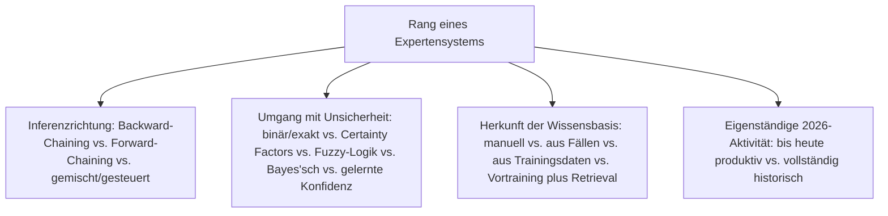
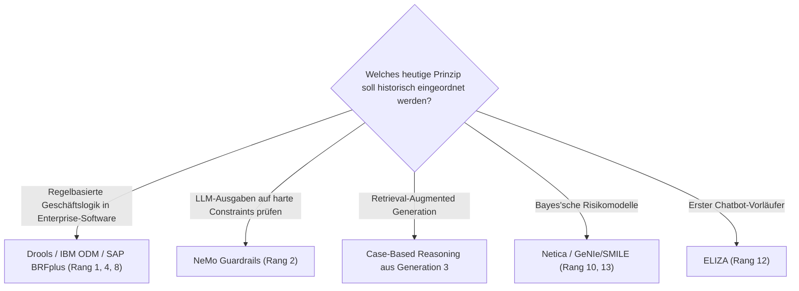

# Beste Expertensysteme — Top-15-Topliste

Die [Evolution und Architekturen digitaler Expertensysteme](evolution-digitaler-expertensysteme.md) ordnet diese Kategorie chronologisch nach Architektur-Generation — von symbolischen Regelbäumen mit Backward-Chaining über kommerzielle Shells und den Rete-Algorithmus, Fuzzy-Logik und Case-Based Reasoning bis zu Business-Rule-Management-Systemen, probabilistischen Entscheidungsunterstützungssystemen und LLM-gestützten neuro-symbolischen Reasoning-Architekturen. Diese Seite übersetzt die Chronologie in eine **nach architektonischer Bedeutung gerankte Top-15-Liste** — anders als bei rein historischen Kategorien sind mehrere Generationen dieser Zeitachse (Regel-Engines, LLM-Reasoning) 2026 weiterhin aktiv im Einsatz.

!!! note "Hinweis: Expertensysteme endeten nicht mit dem KI-Winter"
    Wie die Quellchronologie selbst festhält, lebt die Kernarchitektur — Wissensbasis getrennt von Inferenzmaschine — bis heute in Business-Rule-Management-Systemen und neuro-symbolischen LLM-Hybriden fort. Diese Liste rankt daher nach **architektonischem Einfluss und aktueller Relevanz gemeinsam**, nicht nach reiner Marktgröße.

---

## Bewertungskriterien

---

## Top 15 im Überblick

| Rang | System/Baustein | Generation | Status 2026 | Historische/aktuelle Bedeutung |
|---|---|---|---|---|
| 1 | **Drools** | 4 (Business-Rule-Management-Systeme) | Aktiv | Meistgenutzte Open-Source-Regel-Engine im Java-Ökosystem, produktiv in Kreditvergabe und Versicherungs-Tarifierung |
| 2 | **NeMo Guardrails** | 6 (LLM-gestützte neuro-symbolische Reasoning-Architekturen) | Aktiv | Erzwingt harte Constraints über LLM-Antworten, modernes Äquivalent regelbasierter Validierung |
| 3 | **CLIPS** | 2/4 (Expertensystem-Boom / BRMS) | Aktiv | NASA-Inferenzmaschine, seit den 1980ern bis heute als Open-Source-Regel-Engine im Einsatz |
| 4 | **IBM ODM** (ehem. ILOG JRules) | 4 (Business-Rule-Management-Systeme) | Aktiv | Führende kommerzielle Enterprise-Entscheidungsautomatisierung |
| 5 | **Rete-Algorithmus** | 2 (Forward-Chaining & Rete-Algorithmus) | Aktiv (als Fundament) | Löste das Performance-Problem großer Regelsysteme, architektonische Grundlage nahezu aller heutigen Regel-Engines |
| 6 | **MYCIN** | 1 (Symbolische Expertensysteme) | Historisch | Führte Certainty Factors ein — frühes Verfahren zum Umgang mit Unsicherheit, Vorläufer probabilistischer Ansätze |
| 7 | **DENDRAL** | 1 (Symbolische Expertensysteme) | Historisch | Gilt als erstes Expertensystem überhaupt, leitete chemische Strukturen aus Massenspektrometrie-Daten ab |
| 8 | **SAP BRFplus** | 4 (Business-Rule-Management-Systeme) | Aktiv | Regelbasierte Geschäftslogik direkt in SAP-Landschaften |
| 9 | **XCON/R1** | 1/2 (Symbolische Expertensysteme / Expertensystem-Boom) | Historisch | Eines der ersten wirtschaftlich erfolgreichen Expertensysteme, sparte DEC Millionen an Konfigurationsfehlern |
| 10 | **Netica** | 5 (Probabilistische Entscheidungsunterstützungssysteme) | Aktiv | Verbreitetes Werkzeug zur Modellierung Bayes'scher Netze in Diagnose-/Risikosystemen |
| 11 | **PROSPECTOR** | 1 (Symbolische Expertensysteme) | Historisch | Nutzte Bayes'sche Wahrscheinlichkeiten, half nachweislich bei der Entdeckung einer Molybdän-Lagerstätte |
| 12 | **ELIZA** | 1 (Symbolische Expertensysteme) | Historisch | Gilt als erster Chatbot, prägte die Erwartung an dialogfähige Systeme lange vor LLMs |
| 13 | **GeNIe/SMILE** | 5 (Probabilistische Entscheidungsunterstützungssysteme) | Aktiv (Nische) | Akademisch verbreitetes Bayes'sches-Netzwerk-Modellierungswerkzeug |
| 14 | **EMYCIN** | 2 (Expertensystem-Boom & kommerzielle Shells) | Historisch | Generalisierte MYCIN-Inferenzmaschine ohne medizinische Wissensbasis, Vorbild des Shell-Architekturprinzips |
| 15 | **Fuzzy-Logik-Expertensysteme** | 3 (Fuzzy-Logik, Hybrid- & CBR-Systeme) | Aktiv (Nische) | Graduelle statt scharfer Regel-Zugehörigkeit, bekanntestes Beispiel die Sendai-U-Bahn-Steuerung 1987 |

---

## Highlights im Detail

### Rang 1–4, 8: die bis heute produktiven Regel-Engines
Drools, NeMo Guardrails, CLIPS, IBM ODM und SAP BRFplus zeigen, dass die Kernarchitektur der Expertensysteme — Wissensbasis getrennt von Inferenzmaschine — 2026 keineswegs Geschichte ist, sondern reguläres Software-Engineering-Werkzeug in regulierten Branchen, siehe [Generation 4](evolution-digitaler-expertensysteme.md#generation-4-business-rule-management-systeme-brms-produktive-regel-engines-1990er-2010er).

### Rang 6–7, 9, 11–12, 14: die Gründergeneration bleibt konzeptionell prägend
MYCIN, DENDRAL, XCON/R1, PROSPECTOR, ELIZA und EMYCIN etablierten die Grundprinzipien — Certainty Factors, Shell-Architektur, Bayes'sche Inferenz —, die jede spätere Generation direkt fortsetzt, siehe [Generation 1–2](evolution-digitaler-expertensysteme.md#generation-1-symbolische-expertensysteme-regelbaume-backward-chaining-1965-1980).

### Rang 2: der direkteste Bezug zu heutigen LLM-Architekturen
NeMo Guardrails zeigt am deutlichsten, wie Generation 6 explizit auf die Kontrollschicht-Idee aus Generation 4 zurückgreift — ein neuro-symbolischer Rückgriff, bei dem das LLM die Reasoning-Engine der Generation 1 ersetzt, aber Guardrails weiterhin die Rolle expliziter Constraints übernehmen, siehe [Generation 6](evolution-digitaler-expertensysteme.md#generation-6-llm-gestutzte-neuro-symbolische-reasoning-architekturen-ab-ca-2023).

---

## Wegweiser: von Expertensystem-Prinzip zu heutiger Anwendung

!!! tip "Tipp: die KI-Haupt-Zeitachse separat prüfen"
    Diese Liste vertieft Generation 1 der übergeordneten Chronologie — für den vollständigen Sechs-Generationen-Überblick siehe [Beste KI-Anwendungen 2026](ki-anwendungen-2026-topliste.md).

---

## 🔗 Verwandte Themen

- [Startseite](../index.md) — zurück zur Dokumentations-Zentrale
- [Evolution und Architekturen digitaler Expertensysteme](evolution-digitaler-expertensysteme.md) — chronologisches Generationenmodell, dessen aktuellen Stand diese Topliste zusammenfasst
- [Beste KI-Anwendungen 2026 (Top 20)](ki-anwendungen-2026-topliste.md) — Gesamtmarkt-Topliste über alle sechs KI-Generationen hinweg
- [AI Agents – Das Praxis-Handbuch & Architektur-Leitfaden](coding/ai-agents-praxis.md) — moderne Agenten-Architekturen als Fortsetzung von Generation 6
- [Beste MCP-Server (Top 20)](coding/mcp-server-topliste.md) — Werkzeugzugriff als moderne Entsprechung expliziter Constraints
