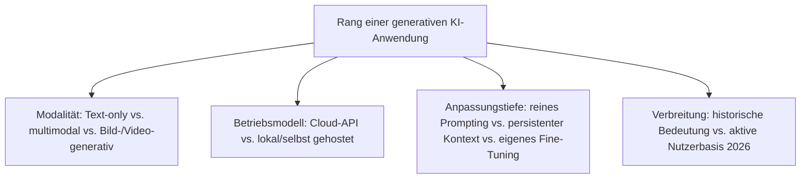
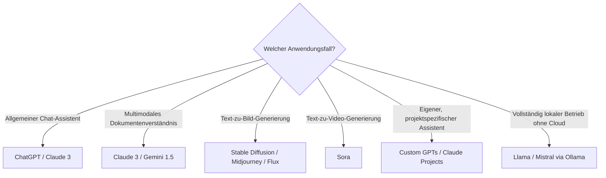

# Beste generative KI-Anwendungen 2026 — Top-20-Topliste

Die [Evolution und Architekturen digitaler Generativer KI-Anwendungen](evolution-digitaler-generative-ki-anwendungen.md) ordnet diese Architekturlinie chronologisch — vom Transformer-Durchbruch über den ChatGPT-Massenmarkt-Moment, multimodale Foundation-Modelle und Bild-/Video-Generierung bis zu Custom-Assistenten und lokal betriebenen, offenen LLMs. Diese Seite übersetzt die Chronologie in eine **Momentaufnahme 2026**: 20 Systeme und Modelle, die 2026 tatsächlich prägend sind.

!!! note "Hinweis: Cloud-API und lokaler Betrieb koexistieren"
    Diese Liste mischt bewusst API-basierte Cloud-Modelle (ChatGPT, Claude 3) mit lokal betreibbaren offenen Gewichten (Llama, Mistral) — beide Betriebsmodelle sind 2026 gleichermaßen relevant, siehe Generation 6 der Quellchronologie.

---

## Bewertungskriterien

---

## Top 20 im Überblick

| Rang | System | Generation | Besondere Stärke |
|---|---|---|---|
| 1 | **ChatGPT** | 2 (ChatGPT & der Massenmarkt-Durchbruch) | Massenmarkt-Durchbruch generativer KI durch RLHF-Ausrichtung |
| 2 | **GPT-3** | 1c (Foundation-Modelle im großen Maßstab) | Etabliert „Prompting" statt Fine-Tuning als Haupt-Interaktionsmodus |
| 3 | **Transformer** („Attention is All You Need") | 1a (Der Transformer-Durchbruch) | Ersetzt Rekurrenz vollständig durch Self-Attention, Grundlage aller Foundation-Modelle |
| 4 | **RLHF-Verfahren** | 2 (ChatGPT & der Massenmarkt-Durchbruch) | Macht das rohe Foundation-Modell erstmals zuverlässig dialogfähig |
| 5 | **BERT** | 1b (bidirektionale Sprachmodelle) | Erstes breit adoptiertes bidirektionales Transformer-Sprachmodell |
| 6 | **Stable Diffusion** | 4 (Bild-/Video-Generierung) | Offenes Text-zu-Bild-Modell mit größtem Community-Ökosystem |
| 7 | **Midjourney** | 4 (Bild-/Video-Generierung) | Geschlossenes Text-zu-Bild-Modell mit hoher künstlerischer Qualität |
| 8 | **DALL-E** | 4 (Bild-/Video-Generierung) | Text-zu-Bild direkt in ChatGPT integriert |
| 9 | **Sora** | 4 (Bild-/Video-Generierung) | Text-zu-Video mit deutlich längeren, kohärenteren Sequenzen als frühere Ansätze |
| 10 | **Flux** (Black Forest Labs) | 4 (Bild-/Video-Generierung) | Offenes Bildgenerierungsmodell der Entwickler des ursprünglichen Stable-Diffusion-Kerns |
| 11 | **GPT-4 Vision** | 3 (Multimodale Foundation-Modelle) | Erweitert Text-only-Modelle erstmals breit um Bild-, später Audioverständnis |
| 12 | **Gemini 1.5** | 3 (Multimodale Foundation-Modelle) | Text, Bild, Audio und Video im selben Modell |
| 13 | **Claude 3** | 3 (Multimodale Foundation-Modelle) | Hohe Genauigkeit bei visuellem Dokumentenverständnis |
| 14 | **GPT-4o** | 3 (Multimodale Foundation-Modelle) | Nativ multimodales Modell mit Echtzeit-Sprachinteraktion |
| 15 | **Custom GPTs** | 5 (Custom-Chat-Assistenten) | Nutzerdefinierte ChatGPT-Konfigurationen mit eigenen Anweisungen, Dateien und Aktionen |
| 16 | **Claude Projects** | 5 (Custom-Chat-Assistenten) | Persistenter Projekt-Kontext über mehrere Konversationen hinweg |
| 17 | **Llama-Familie** (Meta) | 6 (Lokale & selbst gehostete LLM-Anwendungen) | Offene Modellgewichte als Grundlage eines großen Fine-Tuning-Ökosystems |
| 18 | **Mistral** | 6 (Lokale & selbst gehostete LLM-Anwendungen) | Offene europäische Modellgewichte als Alternative zur Llama-Familie |
| 19 | **Ollama** | 6 (Lokale & selbst gehostete LLM-Anwendungen) | Vereinfacht lokale Modellausführung auf Consumer-Hardware |
| 20 | **Quantisierung** (GGUF, GPTQ, AWQ) | 6 (Lokale & selbst gehostete LLM-Anwendungen) | Reduziert Speicherbedarf großer Modelle für Consumer-GPUs statt Rechenzentren |

---

## Highlights im Detail

### Rang 1–5: der Weg zum konversationsfähigen Foundation-Modell
Transformer, BERT, GPT-3, RLHF und ChatGPT bilden zusammen die Kausalkette, die aus einem reinen Textvervollständigungs-Modell ein Massenmarktprodukt macht, siehe [Generation 1–2](evolution-digitaler-generative-ki-anwendungen.md#generation-2-chatgpt-der-massenmarkt-durchbruch-2022).

### Rang 6–10: Bild-/Video-Generierung als eigenständige Produktlinie
Stable Diffusion, Midjourney, DALL-E, Sora und Flux bauen mehrheitlich auf Diffusionsmodellen statt Transformer-Architekturen auf — eine parallele Entwicklungslinie zu den Text-Foundation-Modellen, siehe [Generation 4](evolution-digitaler-generative-ki-anwendungen.md#generation-4-bild-video-generierung-als-eigenstandige-produktkategorie-2022-2024).

### Rang 17–20: Datenhoheit als Hauptmotivation der lokalen Generation
Llama, Mistral, Ollama und Quantisierungsverfahren erlauben den Betrieb vollständig ohne Cloud-Anbieter — Offline-Fähigkeit und Datenhoheit stehen hier klar vor reiner Modellqualität, siehe [Praxis-Guide: Lokales RAG & LLM-Serving mit Ollama & ChromaDB](coding/lokales-rag-ollama.md).

---

## Entscheidungshilfe nach Anwendungsfall

!!! tip "Tipp: die KI-Haupt-Zeitachse separat prüfen"
    Diese Liste vertieft Generation 4 der übergeordneten Chronologie — für den vollständigen Sechs-Generationen-Überblick siehe [Beste KI-Anwendungen 2026](ki-anwendungen-2026-topliste.md).

---

## 🔗 Verwandte Themen

- [Startseite](../index.md) — zurück zur Dokumentations-Zentrale
- [Evolution und Architekturen digitaler Generativer KI-Anwendungen](evolution-digitaler-generative-ki-anwendungen.md) — chronologisches Generationenmodell, dessen aktuellen Stand diese Topliste zusammenfasst
- [Beste KI-Anwendungen 2026 (Top 20)](ki-anwendungen-2026-topliste.md) — Gesamtmarkt-Topliste über alle sechs KI-Generationen hinweg
- [Multi-LLM- & Sprachmodell-Anbieter im Vergleich](coding/llm-anbieter-vergleich.md) — aktuelle Modelle und Anbieter im Detail
- [Custom Chat-Assistenten im Anbieter-Vergleich](coding/custom-chat-assistenten-anbieter-vergleich.md) — Vertiefung zu Rang 15–16
- [Praxis-Guide: Lokales RAG & LLM-Serving mit Ollama & ChromaDB](coding/lokales-rag-ollama.md) — Vertiefung zu Rang 19
- [KI-Modelle & Frameworks: Übersicht](index.md) — Gesamtübersicht Modell-Kategorien und Frameworks
