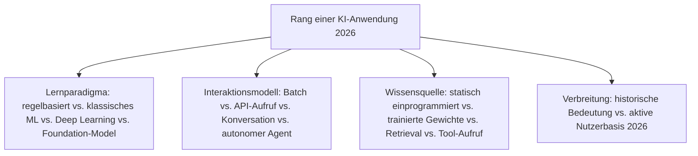
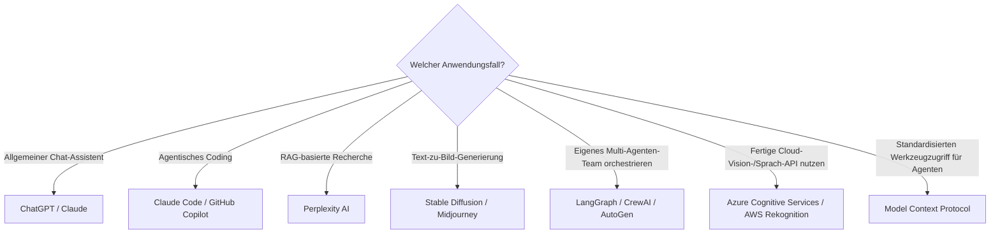

# Beste KI-Anwendungen 2026 — Top-20-Topliste

Die [Evolution und Architekturen digitaler KI-Anwendungen](evolution-digitaler-ki-anwendungen.md) bündelt sechs Generationen — von regelbasierten Expertensystemen über statistisches maschinelles Lernen, aufgabenspezifische Deep-Learning-Modelle und Cloud-KI-APIs bis zu generativen LLM-Anwendungen, RAG-Systemen und autonomen Multi-Agenten-Ökosystemen — plus eine quer liegende Rust-Implementierungsachse. Diese Seite übersetzt den gesamten Cluster in eine **Momentaufnahme 2026**: 20 Systeme und Produkte, die 2026 tatsächlich prägend sind, quer über alle sechs Generationen hinweg.

!!! note "Hinweis: sechs Generationen, ein gemeinsames Ranking"
    Diese Seite mischt bewusst alle Generationen gleichberechtigt — MYCIN (Generation 1) erscheint hier neben Claude Code (Generation 6), obwohl beide durch Jahrzehnte technologischer Entwicklung getrennt sind. Für die Tiefenperspektive je Generation siehe die sechs verlinkten Sub-Toplisten unter „Verwandte Themen".

---

## Bewertungskriterien

---

## Top 20 im Überblick

| Rang | System | Generation | Besondere Stärke |
|---|---|---|---|
| 1 | **ChatGPT** | 4 (Generative KI & LLM-Anwendungen) | Massenmarkt-Durchbruch generativer KI, weiterhin größte Consumer-Reichweite |
| 2 | **Claude Code** | 6 (Autonome KI-Agenten) | Agentisches Coding-Werkzeug mit vollem Datei-, Werkzeug- und Ausführungszugriff, auch der Stack hinter diesem Repository |
| 3 | **GitHub Copilot** | 4 (Generative KI & LLM-Anwendungen) | Erste breit adoptierte LLM-Integration direkt im Entwickler-Editor |
| 4 | **Model Context Protocol (MCP)** | 6 (Autonome KI-Agenten) | Offener Standard für Werkzeugzugriff, herstellerübergreifend statt proprietärer Integrationen |
| 5 | **Perplexity AI** | 5 (RAG & werkzeugnutzende KI) | RAG-basierte Suchmaschine als eigenständiges Produkt statt Chat-Assistent |
| 6 | **Stable Diffusion** | 4 (Generative KI & LLM-Anwendungen) | Offenes Text-zu-Bild-Modell mit größtem Community-Ökosystem |
| 7 | **Midjourney** | 4 (Generative KI & LLM-Anwendungen) | Geschlossenes Text-zu-Bild-Modell mit höchster künstlerischer Qualität dieser Liste |
| 8 | **LangGraph / CrewAI / AutoGen** | 6 (Autonome KI-Agenten) | Verbreitetste Orchestrierungs-Frameworks für arbeitsteilige Multi-Agenten-Teams |
| 9 | **AutoGPT** | 6 (Autonome KI-Agenten) | Erster breit bekannter autonomer Agent, löste die gesamte Agenten-Experimentierwelle aus |
| 10 | **Custom GPTs / Claude Projects** | 5 (RAG & werkzeugnutzende KI) | Anwendungsspezifische LLM-Konfigurationen mit eigenem Kontext ohne eigenes Modelltraining |
| 11 | **Azure Cognitive Services** | 3 (Cloud-KI-APIs) | Breiteste Sammlung von Sprach-, Vision- und Sprachverarbeitungs-APIs unter einer Marke |
| 12 | **AWS Rekognition** | 3 (Cloud-KI-APIs) | Gesichts-/Objekterkennung tief in die übrige AWS-Infrastruktur integriert |
| 13 | **Google Cloud Vision API** | 3 (Cloud-KI-APIs) | Eine der ersten breit verfügbaren Cloud-APIs für vortrainierte Bilderkennung |
| 14 | **IBM Watson** | 3 (Cloud-KI-APIs) | Frühe Enterprise-KI-Plattform, bekannt durch den Jeopardy!-Auftritt 2011 |
| 15 | **Siri / Google Assistant / Alexa** | 2 (Deep-Learning-Anwendungen) | Erste massentaugliche Sprachassistenten, etablierten Smart-Speaker als eigene Produktkategorie |
| 16 | **AlexNet** | 2 (Deep-Learning-Anwendungen) | Löste beim ImageNet-Wettbewerb 2012 den gesamten Deep-Learning-Boom aus |
| 17 | **GPT-3** | 4 (Generative KI & LLM-Anwendungen) | Erstes breit zugängliches Foundation-Modell, etablierte „Prompting" als Haupt-Interaktionsmodus |
| 18 | **OpenAI AgentKit** | 6 (Autonome KI-Agenten) | Herstellerseitiges Framework zum Bau eigener Agenten-Anwendungen |
| 19 | **Netflix-Empfehlungsalgorithmus** | 1 (Regelbasierte & statistische KI) | Frühes, wirtschaftlich einflussreiches Beispiel statistischen maschinellen Lernens in der Praxis |
| 20 | **MYCIN** | 1 (Regelbasierte & statistische KI) | Frühes Expertensystem für medizinische Diagnose, führte Certainty Factors als Umgang mit Unsicherheit ein |

---

## Highlights im Detail

### Rang 1–4, 8–10, 18: die dominante generative und agentische Ebene
ChatGPT, Claude Code, GitHub Copilot, MCP, LangGraph/CrewAI/AutoGen, AutoGPT, Custom GPTs/Claude Projects und OpenAI AgentKit belegen zusammen acht der zwanzig Plätze — Generation 4–6 prägt 2026 die tatsächliche Nutzererfahrung stärker als jede frühere Generation, siehe [Generation 4–6](evolution-digitaler-ki-anwendungen.md#generation-4-generative-ki-llm-gestutzte-anwendungen-ab-ca-2020).

### Rang 11–14: Cloud-KI-APIs bleiben Enterprise-Fundament
Azure Cognitive Services, AWS Rekognition, Google Cloud Vision API und IBM Watson zeigen, dass die API-first-Architektur aus Generation 3 trotz Foundation-Model-Konsolidierung nicht verschwunden ist — viele Enterprise-Workloads nutzen weiterhin spezialisierte Einzel-APIs statt eines generalisierten Modells, siehe [Beste Cloud-KI-APIs 2026](cloud-ki-apis-2026-topliste.md).

### Rang 15–16, 19–20: die Gründer- und Deep-Learning-Generation bleibt architektonisch prägend
Siri/Alexa/Google Assistant, AlexNet, der Netflix-Algorithmus und MYCIN etablierten die Grundmuster — aufgabenspezifisches Training, statistisches Lernen aus Daten, Wissensbasis-getrennte Inferenz —, auf denen jede spätere Generation direkt aufbaut.

---

## Entscheidungshilfe nach Anwendungsfall

!!! tip "Tipp: Vertiefung je Generation"
    Diese Liste rankt generationenübergreifend — für die tieferen Toplisten je Architekturlinie siehe die sechs Sub-Toplisten unter „Verwandte Themen".

---

## 🔗 Verwandte Themen

- [Startseite](../index.md) — zurück zur Dokumentations-Zentrale
- [Evolution und Architekturen digitaler KI-Anwendungen](evolution-digitaler-ki-anwendungen.md) — übergeordnetes Generationenmodell, dessen aktuellen Stand diese Topliste zusammenfasst
- [Beste Expertensysteme (Top 15)](expertensysteme-topliste.md) — vertiefend zu Rang 20
- [Beste Deep-Learning-Anwendungen 2026 (Top 15)](deep-learning-anwendungen-2026-topliste.md) — vertiefend zu Rang 15–16
- [Beste Cloud-KI-APIs 2026 (Top 15)](cloud-ki-apis-2026-topliste.md) — vertiefend zu Rang 11–14
- [Beste generative KI-Anwendungen 2026 (Top 20)](generative-ki-anwendungen-2026-topliste.md) — vertiefend zu Rang 1, 3, 6–7, 17
- [Beste RAG- & Werkzeug-Anwendungen 2026 (Top 15)](rag-werkzeug-anwendungen-2026-topliste.md) — vertiefend zu Rang 5, 10
- [Beste autonome KI-Agenten 2026 (Top 20)](autonome-ki-agenten-2026-topliste.md) — vertiefend zu Rang 2, 4, 8–9, 18
- [Beste Rust-Bausteine für KI-Anwendungen 2026 (Top 10)](rust-ki-anwendungen-2026-topliste.md) — quer zu allen sechs Generationen liegende Implementierungsachse
- [KI-Modelle & Frameworks: Übersicht](index.md) — Gesamtübersicht Modell-Kategorien und Frameworks
