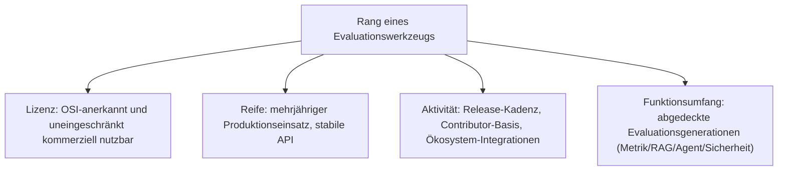
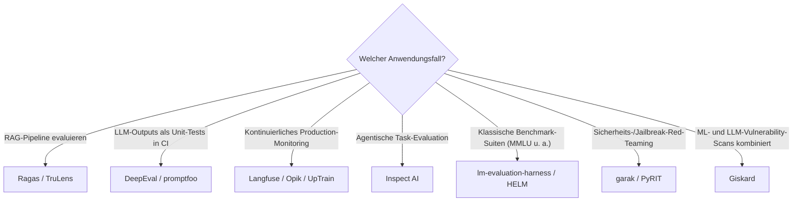

# Beste KI-Evaluationswerkzeuge 2026 — Top-15-Topliste

Die [Evolution und Architekturen digitaler KI-Evaluationswerkzeuge](evolution-digitaler-ki-evaluation.md) ordnet diese Werkzeuglinie chronologisch — von manueller Begutachtung über statische Benchmark-Suiten, LLM-als-Richter-Verfahren und RAG-spezifische Metriken bis zu agentischen und sicherheitsfokussierten Continuous-Eval-Pipelines. Diese Seite übersetzt die Chronologie in eine **Momentaufnahme 2026**: 15 Werkzeuge, mit denen LLM-, RAG- und Agenten-Systeme 2026 tatsächlich produktiv evaluiert werden — sortiert nach Reifegrad, aktiver Weiterentwicklung, Funktionsumfang und, wo abweichend, expliziter Lizenz-Einordnung für den kommerziellen Einsatz.

!!! note "Hinweis: Nur OSI-anerkannte Lizenzen in Rang 1–14"
    Wie in den [Wissenssysteme-Toplisten](../wissen/dokumentation/fuehrende-opensource-wissenssysteme-2026-topliste.md) zählen Rang 1–14 ausschließlich Werkzeuge unter einer OSI-anerkannten Open-Source-Lizenz (MIT, Apache-2.0). Rang 15 ist ein source-available Sonderfall (Arize Phoenix, Elastic License 2.0), explizit als solcher gekennzeichnet — Details im [Lizenz-Sonderfall-Abschnitt](#lizenz-sonderfall-arize-phoenix).

---

## Bewertungskriterien

!!! warning "Achtung: Momentaufnahme, Stand August 2026"
    Dieses Marktsegment verändert sich sehr schnell — insbesondere bei den agentischen (Rang 7) und sicherheitsfokussierten Werkzeugen (Rang 10–11). Vor einer strategischen Entscheidung aktuelle Release-Historie, Metrik-Abdeckung und Lizenztext direkt im jeweiligen Repository prüfen.

---

## Top 15 im Überblick

| Rang | Werkzeug | Lizenz | Kommerziell nutzbar | Seit | Schwerpunkt |
|---|---|---|---|---|---|
| 1 | **Ragas** | Apache-2.0 | Ja, uneingeschränkt | 2023 | Dedizierte RAG-Metrik-Bibliothek (Faithfulness, Context Precision/Recall), De-facto-Standard |
| 2 | **DeepEval** | Apache-2.0 | Ja, uneingeschränkt | 2023 | Pytest-artige Unit-Tests für LLM-Outputs, sehr breite Metrik-Bibliothek, aktive CI-Integration |
| 3 | **promptfoo** | MIT | Ja, uneingeschränkt | 2023 | CLI-first Eval direkt in CI/CD, eingebautes Red-Teaming-Modul, sehr niedrige Einstiegshürde |
| 4 | **Langfuse** | MIT (Self-Host-Kern) | Ja, uneingeschränkt (Self-Host) | 2022 | Observability + Continuous Eval kombiniert, mit Abstand größte Community dieser Liste |
| 5 | **TruLens** | MIT | Ja, uneingeschränkt | 2023 | RAG-Triade (Groundedness, Context Relevance, Answer Relevance), TruEra-Ursprung |
| 6 | **Giskard** | Apache-2.0 | Ja, uneingeschränkt | 2021 | Testing plus automatisierte Vulnerability-Scans für klassische ML- und LLM-Modelle |
| 7 | **Inspect AI** | MIT | Ja, uneingeschränkt | 2024 | UK-AI-Safety-Institute-Referenzframework für agentische und Task-basierte Evals |
| 8 | **lm-evaluation-harness** | MIT | Ja, uneingeschränkt | 2020 | EleutherAI-Standardharness für klassische Benchmark-Suiten (MMLU, BIG-bench u. a.) |
| 9 | **OpenAI Evals** | MIT | Ja, uneingeschränkt | 2023 | Ur-Framework für deklarative Custom-Evals, breite Community-Eval-Registry |
| 10 | **garak** | Apache-2.0 | Ja, uneingeschränkt | 2023 | NVIDIA-gesponserter LLM-Vulnerability- und Jailbreak-Scanner |
| 11 | **PyRIT** | MIT | Ja, uneingeschränkt | 2024 | Microsofts Python Risk Identification Toolkit für strukturiertes Red-Teaming |
| 12 | **Opik** | Apache-2.0 | Ja, uneingeschränkt | 2024 | Comet-Projekt: Tracing, Eval und Guardrails in einer Oberfläche |
| 13 | **HELM** | Apache-2.0 | Ja, uneingeschränkt | 2022 | Stanford-CRFM-Referenzsuite: holistische Multi-Metrik-Bewertung über viele Modelle |
| 14 | **UpTrain** | Apache-2.0 | Ja, uneingeschränkt | 2023 | Eval plus Guardrails mit starkem Fokus auf Production-Monitoring |
| 15 | **Arize Phoenix** | Elastic License 2.0 (Lizenz-Sonderfall) | Eingeschränkt, siehe unten | 2022 | Sehr verbreitetes Tracing- und Eval-Tool, sehr breite Framework-Integrationen |

---

## Highlights im Detail

### Rang 1–2: RAG- und Unit-Test-Evaluation als Einstiegsstandard
Ragas und DeepEval decken 2026 den größten Teil aller produktiven RAG-Evaluationen ab — beide lassen sich direkt in bestehende Python-Testpipelines (pytest) einhängen, siehe [Generation 4](evolution-digitaler-ki-evaluation.md#generation-4-rag-retrieval-evaluation-2023-2024).

### Rang 4: Langfuse als Community-Schwergewicht
Langfuse verbindet als einziges Werkzeug dieser Top 5 Tracing, Prompt-Versionierung und Eval-Scores in einer durchgängigen Oberfläche — die mit Abstand größte Contributor- und Nutzerbasis dieser Liste, siehe [Generation 5](evolution-digitaler-ki-evaluation.md#generation-5-observability-integrierte-continuous-evals-2023-2025).

### Rang 7, 10–11: die jüngsten, am schnellsten wachsenden Kategorien
Inspect AI (agentische Evaluation) sowie garak und PyRIT (Sicherheits-/Red-Teaming-Evaluation) bilden 2026 die aktivsten Weiterentwicklungsfronten dieser Liste — direkte Reaktion auf den Produktionseinsatz von Agenten mit realen Werkzeugrechten, siehe [Generation 6](evolution-digitaler-ki-evaluation.md#generation-6-agentische-tool-use-evaluation-2024-2025) und [Generation 7](evolution-digitaler-ki-evaluation.md#generation-7-sicherheits-red-teaming-guardrail-evaluation-2024-2026).

---

## Lizenz-Sonderfall: Arize Phoenix

!!! warning "Achtung: Quellcode einsehbar ≠ uneingeschränkt kommerziell nutzbar"
    **Arize Phoenix** (Rang 15) ist eines der verbreitetsten Tracing- und Eval-Werkzeuge dieses Marktsegments, steht aber unter der **Elastic License 2.0** — nicht OSI-anerkannt. Der Quellcode ist einsehbar und selbst hostbar, ein Anbieter darf Phoenix jedoch nicht als eigenständigen, konkurrierenden Managed-Service weiterverkaufen. Für den internen Produktionseinsatz im eigenen Unternehmen ist das in der Praxis meist unkritisch — vor einem SaaS-Angebot auf Phoenix-Basis den aktuellen Lizenztext im Repository prüfen. Konsistent mit der Handhabung von Outline (BSL) und Open WebUI in den [Wissenssysteme-Toplisten](../wissen/dokumentation/fuehrende-opensource-wissenssysteme-2026-topliste.md#lizenz-sonderfalle-technisch-stark-aber-nicht-osi-open-source).

---

## Entscheidungshilfe nach Anwendungsfall

!!! tip "Tipp: die Werkzeug-Chronologie separat prüfen"
    Diese Liste übersetzt alle sieben Generationen der Quell-Chronologie in eine gemeinsame 2026-Momentaufnahme — für das vollständige Generationenmodell siehe [Evolution und Architekturen digitaler KI-Evaluationswerkzeuge](evolution-digitaler-ki-evaluation.md).

---

## Verwandte Themen

- [Evolution und Architekturen digitaler KI-Evaluationswerkzeuge](evolution-digitaler-ki-evaluation.md) — chronologisches Generationenmodell, dessen aktuellen Stand diese Topliste zusammenfasst
- [Beste Software 2026: Wissenssysteme, Evaluation & Generatoren (Top-20-Meta-Topliste)](../wissen/dokumentation/beste-software-wissenssysteme-evaluation-generatoren-2026-topliste.md) — führt diese Kategorie mit Wissenssystemen und Generatoren nach denselben Reife-/Aktivitäts-/Lizenzkriterien zusammen
- [Beste KI-Modell-Generatoren 2026 (Top 15)](ki-modell-generatoren-2026-topliste.md) — Schwester-Topliste für die Generatoren-Seite derselben Meta-Topliste
- [Beste autonome KI-Agenten 2026 (Top 20)](autonome-ki-agenten-2026-topliste.md) — Produktebene, deren Handlungssequenzen von Rang 7 (Inspect AI) evaluiert werden
- [Beste RAG- & Werkzeug-Anwendungen 2026 (Top 15)](rag-werkzeug-anwendungen-2026-topliste.md) — Produktebene, deren Pipelines von Rang 1–2, 5 evaluiert werden
- [Prompt Engineering Praxis-Handbuch](coding/prompt-engineering-praxis.md) — praktischer Einsatzkontext für iterative Prompt-Evaluation
- [KI-Modelle & Frameworks: Übersicht](index.md) — Gesamtübersicht Modell-Kategorien und Frameworks
