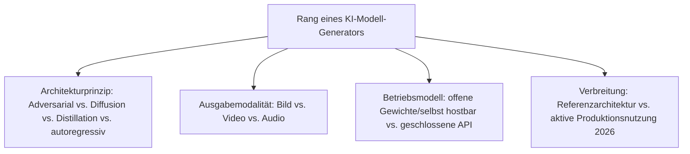
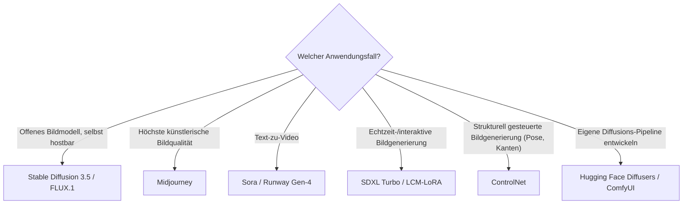

# Beste KI-Modell-Generatoren 2026 — Top-15-Topliste

Die [Evolution und Architekturen digitaler KI-Modell-Generatoren](evolution-digitaler-ki-modell-generatoren.md) ordnet diese Architekturlinie chronologisch — vom Variational Autoencoder über GANs, autoregressive Pixel-/Wave-Modelle und Normalizing Flows bis zu Diffusionsmodellen und den heutigen, auf Geschwindigkeit destillierten Hybrid-Generatoren. Diese Seite übersetzt die Chronologie in eine **Momentaufnahme 2026**: 15 konkrete Modelle und Werkzeuge, mit denen diese Architekturen 2026 tatsächlich produktiv eingesetzt werden.

!!! note "Hinweis: Modell und Werkzeug gemeinsam gerankt"
    Diese Liste mischt bewusst konkrete Modell-Checkpoints (Stable Diffusion 3.5, FLUX.1) mit den Bibliotheken und Oberflächen, über die sie tatsächlich betrieben werden (Diffusers, ComfyUI) — weil beide Ebenen gemeinsam bestimmen, ob eine Architektur 2026 praktisch nutzbar ist.

---

## Bewertungskriterien

---

## Top 15 im Überblick

| Rang | System | Generation | Besondere Stärke |
|---|---|---|---|
| 1 | **Stable Diffusion 3.5** | 5 (Diffusionsmodelle) | Offenstes, größtes Community-Ökosystem unter den latenten Diffusionsmodellen |
| 2 | **FLUX.1** (Black Forest Labs) | 5/7 (Diffusion, Rectified-Flow-Architektur) | Offenes State-of-the-Art-Bildmodell der Ex-Stability-Gründer, baut direkt auf Flow Matching auf |
| 3 | **Midjourney** | 5 (Diffusionsmodelle) | Geschlossenes Modell mit weiterhin höchster künstlerischer Bildqualität |
| 4 | **DALL-E 3** | 5 (Diffusionsmodelle) | Tief in ChatGPT integriert, starke Prompt-Treue durch Sprachmodell-Konditionierung |
| 5 | **Sora** | 6 (Multimodale & Video-Diffusionsgeneratoren) | Text-zu-Video mit deutlich längerer, kohärenterer Sequenzdauer als frühere Ansätze |
| 6 | **Runway Gen-4** | 6 (Multimodale & Video-Diffusionsgeneratoren) | Produktionsreife Video-Diffusion mit Fokus auf professionelle Filmproduktion |
| 7 | **Kling / Wan** | 6 (Multimodale & Video-Diffusionsgeneratoren) | Chinesische Video-Diffusionsmodelle mit schnell wachsender Verbreitung außerhalb des US-Marktes |
| 8 | **SDXL Turbo / LCM** (Latent Consistency Models) | 7 (Distillations- & Hybrid-Generatoren) | Einzelschritt-Bildgenerierung nahezu in Echtzeit statt 20+ Diffusionsschritten |
| 9 | **LCM-LoRA** | 7 (Distillations- & Hybrid-Generatoren) | Consistency-Distillation als aufsteckbarer LoRA-Adapter statt eigenständigem Modell |
| 10 | **AnimateDiff** | 6 (Multimodale & Video-Diffusionsgeneratoren) | Motion-Module erzeugen Video aus bestehenden Bild-Diffusionsmodellen, ohne diese neu zu trainieren |
| 11 | **ControlNet** | 5 (Erweiterung der Diffusionsmodelle) | Strukturelle Steuerung (Kanten, Pose, Tiefe) bestehender Diffusionsmodelle statt reinem Text-Prompt |
| 12 | **StyleGAN3** | 2 (Generative Adversarial Networks) | Weiterhin Referenzarchitektur für hochauflösende Gesichtssynthese und Datensatz-Augmentierung |
| 13 | **Hugging Face Diffusers** | Werkzeug | Standard-Python-Bibliothek zum Ausführen und Feintunen praktisch aller offenen Diffusionsmodelle |
| 14 | **ComfyUI** | Werkzeug | Node-basierte Oberfläche für komplexe, verkettete Diffusions-Pipelines statt einzelner Prompt-Eingabe |
| 15 | **Stable Audio** | 5 (Diffusionsmodelle, Modalität Audio) | Überträgt latente Diffusion von Bild auf Musik-/Audiogenerierung |

---

## Highlights im Detail

### Rang 1–4: Diffusion als etablierter Bild-Standard
Stable Diffusion, FLUX.1, Midjourney und DALL-E 3 zeigen, wie vollständig Diffusionsmodelle die Bildgenerierung dominieren — offene und geschlossene Modelle koexistieren dabei gleichberechtigt, siehe [Generation 5](evolution-digitaler-ki-modell-generatoren.md#generation-5-diffusionsmodelle-2020-2022).

### Rang 5–7, 10: Video als jüngste Ausgabemodalität
Sora, Runway Gen-4, Kling/Wan und AnimateDiff übertragen dasselbe Diffusionsprinzip auf zeitlich kohärente Sequenzen — die mit Abstand am schnellsten wachsende Kategorie dieser Topliste, siehe [Generation 6](evolution-digitaler-ki-modell-generatoren.md#generation-6-multimodale-video-diffusionsgeneratoren-2023-2024).

### Rang 8–9: Geschwindigkeit statt reiner Qualität
SDXL Turbo/LCM und LCM-LoRA verzichten bewusst auf einen Teil der Ausgabequalität klassischer Diffusion, um Echtzeit- und interaktive Anwendungen erst möglich zu machen, siehe [Generation 7](evolution-digitaler-ki-modell-generatoren.md#generation-7-distillations-hybrid-generatoren-2023-2026).

### Rang 12: das GAN-Erbe lebt weiter
StyleGAN3 ist die einzige Nicht-Diffusions-Bildarchitektur in dieser Liste — ein Beleg dafür, dass ältere Generationen produktiv weiterlaufen, statt vollständig verdrängt zu werden, siehe [Hinweis zu überlappenden Generationen](evolution-digitaler-ki-modell-generatoren.md).

---

## Entscheidungshilfe nach Anwendungsfall

!!! tip "Tipp: die Architektur-Chronologie separat prüfen"
    Diese Liste übersetzt alle sieben Generationen der Quell-Chronologie in eine gemeinsame 2026-Momentaufnahme — für das vollständige Architekturmodell siehe [Evolution und Architekturen digitaler KI-Modell-Generatoren](evolution-digitaler-ki-modell-generatoren.md).

---

## Verwandte Themen

- [Evolution und Architekturen digitaler KI-Modell-Generatoren](evolution-digitaler-ki-modell-generatoren.md) — chronologisches Generationenmodell, dessen aktuellen Stand diese Topliste zusammenfasst
- [Produktionsreife KI-Modell-Generatoren nach Generation (kein Treffer)](produktionsreife-ki-modell-generatoren-generationen-2026-topliste.md) — dieselben 15 Systeme durch das konservative Fünf-Filter-Sieb; keiner besteht, weil die OSI-lizenzierte Werkzeugschicht noch keine fünf Jahre alt ist
- [Beste generative KI-Anwendungen 2026 (Top 20)](generative-ki-anwendungen-2026-topliste.md) — Produkt-/Anwendungsebene, auf der viele dieser Modelle ausgeliefert werden
- [Evolution und Architekturen digitaler Generativer KI-Anwendungen](evolution-digitaler-generative-ki-anwendungen.md) — übergeordnete Produktgeneration
- [Multimodale Vision-Pipelines](coding/multimodale-vision-pipelines.md) — praktischer Einsatz von Rang 5–11 in eigenen Pipelines
- [KI-Modelle & Frameworks: Übersicht](index.md) — Gesamtübersicht Modell-Kategorien und Frameworks
