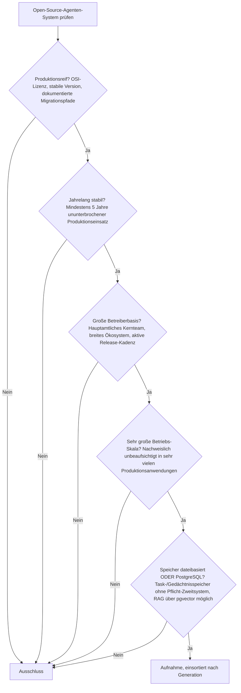
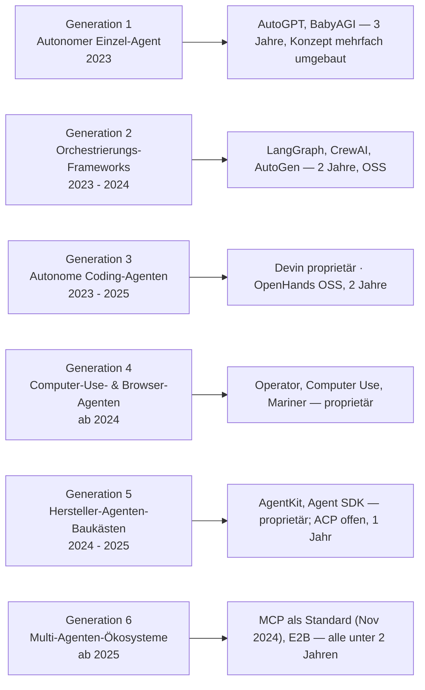

# Produktionsreife autonome Open-Source-KI-Agenten nach Generation — Reifegrad, Evaluation & Betriebs-Skala (noch kein Treffer)

Die [Evolution und Architekturen digitaler Autonomer KI-Agenten](evolution-digitaler-autonome-ki-agenten.md) ordnet die Agenten-Produktkategorie chronologisch in sechs Generationen — sie ist **Generation 6 und damit die aktuelle und letzte** im [übergeordneten KI-Anwendungs-Modell](evolution-digitaler-ki-anwendungen.md). Die [Topliste bester autonomer KI-Agenten 2026](autonome-ki-agenten-2026-topliste.md) rankt die gesamte Kategorie. Diese Seite legt — parallel zu den [KI-nativen Web-Frameworks](../entwicklung/webentwicklung/produktionsreife-ki-native-webframeworks-generationen-2026-topliste.md) und den Schwesterseiten für [Wissenssysteme](../wissen/dokumentation/produktionsreife-wissenssysteme-generationen-2026-topliste.md), [CMS](../wissen/dokumentation/produktionsreife-cms-generationen-2026-topliste.md) und [LMS](../wissen/e-learning/produktionsreife-lms-generationen-2026-topliste.md) — dasselbe bewusst **konservative** Fünf-Filter-Sieb an: produktionsreif · jahrelang stabil · große Betreiberbasis · sehr große Betriebs-Skala · Speicher dateibasiert oder PostgreSQL. Sortiert nach Generation.

!!! warning "Achtung: Kein System besteht das Sieb — und das ist strukturell erwartbar"
    Die Kategorie beginnt mit **AutoGPT im März 2023** — sie ist rund **dreieinhalb Jahre alt**, der zweite Filter verlangt fünf. Kein Agent, kein Framework, kein Standard erreicht die Marke, auch nicht das breit adoptierte [Model Context Protocol](coding/mcp-server-topliste.md) (November 2024). Hinzu kommt: Die prominenteste Riege — **Devin, OpenAI Operator, Anthropic Computer Use, Manus, OpenAI AgentKit** — ist proprietär und fällt schon am Lizenzfilter (Aufstellung unter [Was bewusst nicht auf dieser Liste steht](#was-bewusst-nicht-auf-dieser-liste-steht)). Was heute belastbar ist, ist die Kombination aus **einem stabilisierenden Standard, einem Provider-SDK und einem Orchestrierungs-Framework** — siehe [Der pragmatische Weg](#der-pragmatische-weg-standard-plus-sdk-plus-orchestrierung-plus-mensch).

---

## Die fünf harten Filter

!!! note "Hinweis: Agent, Framework und Protokoll sind drei verschiedene Dinge"
    Die [Basis-Topliste](autonome-ki-agenten-2026-topliste.md) mischt Kategorien, die man trennen muss:

    - **Agenten-Produkte** — AutoGPT, Devin, Manus, OpenHands: laufende Systeme, die Aufgaben abarbeiten.
    - **Orchestrierungs-Frameworks** — LangGraph, CrewAI, AutoGen, Semantic Kernel: Baukästen, mit denen man Agenten *baut*.
    - **Standards & SDKs** — MCP, ACP, die Provider-SDKs: die Schnittstellen dazwischen.

    Nur die ersten beiden sind Kandidaten für dieses Sieb — und keiner davon ist fünf Jahre alt.

---

## Ergebnis: alle sechs Generationen unter der Reifezeit- oder Lizenzschwelle

---

## Kandidaten nach Generation

### Generation 1 — Der autonome Einzel-Agent (2023)

**AutoGPT** (März 2023) löste die gesamte Agenten-Welle aus, wurde seither aber vom Experimentierskript zur „AutoGPT Platform" (Low-Code-Baukasten) umgebaut. **BabyAGI** ist eine minimalistische Referenzimplementierung ohne aktive Weiterentwicklung. Beide sind MIT-lizenziert, aber erst drei Jahre alt — und Generation 1c dieser Zeitachse hält als Lehre fest, dass **unbeaufsichtigte Einzel-Agenten zu Endlosschleifen und Zielabdrift neigen**.

### Generation 2 — Orchestrierungs-Frameworks (2023 – 2024)

| System | Lizenz | Stabil seit | Warum (noch) nicht |
|---|---|---|---|
| **LangGraph** | MIT | 2024 | Das produktionshärteste Framework für zustandsbehaftete Agenten (Postgres-Checkpointer) — aber erst zwei Jahre alt |
| **CrewAI** | MIT | 2024 | Niedrigste Einstiegshürde für rollenbasierte Teams; ~zwei Jahre |
| **AutoGen** | MIT | 2023/24 | Microsoft; wird gerade mit Semantic Kernel zum „Microsoft Agent Framework" zusammengeführt — Richtung im Fluss |
| **Semantic Kernel** | MIT | 2023 | Ebenfalls in der Zusammenführung; ~drei Jahre |

Dies ist die aussichtsreichste Generation für einen künftigen Treffer — **LangGraph** oder **CrewAI** dürften ~2029 die Fünf-Jahres-Marke erreichen, sofern die Ökosysteme stabil bleiben.

### Generation 3 — Autonome Coding-Agenten (2023 – 2025)

- **Devin** (2024, Cognition), **Replit Agent**, **GitHub Copilot Workspace** — proprietär.
- **Claude Code** (2025) — der Coding-Agent hinter diesem Repository, aber ein proprietäres Werkzeug.
- **OpenHands** (ehem. OpenDevin, 2024) — die **offene, selbst hostbare** Referenz: MIT, eigener Sandbox, schreibt/testet/debuggt Code autonom. Zwei Jahre alt. Vertiefung: [Selbsthosting-KI-Agenten-Topliste](coding/selbsthosting-ki-agenten-topliste.md).

### Generation 4 — Computer-Use- & Browser-Agenten (ab 2024)

**Anthropic Computer Use**, **OpenAI Operator**, **Google Project Mariner** — allesamt proprietäre Modell-Funktionen bzw. gehostete Dienste, jünger als zwei Jahre.

### Generation 5 — Herstellerseitige Agenten-Baukästen (2024 – 2025)

**OpenAI AgentKit** und das **Anthropic Agent SDK** sind an den jeweiligen Anbieter gebunden. Offen ist das **Agent Client Protocol (ACP)** (Apache-2.0), die standardisierte Schnittstelle zwischen Agent und Editor — aber erst rund ein Jahr alt. Siehe [Agent Client Protocol](coding/agent-client-protocol-acp.md).

### Generation 6 — Multi-Agenten-Ökosysteme & Cloud-Plattformen (ab 2025)

- **Model Context Protocol (MCP)** (November 2024) — der De-facto-Standard für Werkzeugzugriff: nativ in Claude, ChatGPT, Gemini, Copilot, VS Code und Cursor, rund 41 % der befragten Organisationen im Produktionseinsatz, knapp 10.000 registrierte Server. **Kein Framework, aber der tragende Standard** — und dennoch erst 1,7 Jahre alt.
- **E2B** (Apache-2.0) — Cloud-Sandbox-Infrastruktur für die sichere Ausführung von Agenten-Code; ~zwei Jahre.
- **Manus** — proprietär, cloud-gehostet.

---

## Der pragmatische Weg: Standard plus SDK plus Orchestrierung plus Mensch

Weil kein Agenten-Produkt das Sieb besteht, ist der belastbare Ansatz die **Trennung der Schichten** und ein Mensch als prüfende Instanz:

| Aufgabe | Belastbarer Weg heute |
|---|---|
| Werkzeugzugriff | **MCP** — herstellerübergreifend, spec-governed, breit adoptiert ([Beste MCP-Server](coding/mcp-server-topliste.md)) |
| Modell-Anbindung | Provider-SDK (Anthropic, OpenAI) statt Framework-Abstraktion |
| Orchestrierung mehrerer Schritte/Agenten | **LangGraph** (produktionsreif, zustandsbehaftet, [Vertiefung](coding/agentic-workflows-langgraph.md)) oder **CrewAI** (Prototyping) |
| Selbst gehosteter Coding-Agent | **OpenHands** statt Devin |
| Sichere Code-Ausführung | **E2B** oder eigene Sandbox |
| Kontrolle | Mensch prüft und bestätigt — die Generation-1c-Lehre gilt weiter ([AI Agents Praxis-Handbuch](coding/ai-agents-praxis.md)) |

Dieses Repository nutzt genau diese Kombination: ein Coding-Agent (Generation 3) pflegt die Dokumentation im Git, MCP-Server (Generation 6) erweitern den Werkzeugzugriff nach Bedarf — mit menschlicher Review vor jedem Merge.

---

## Dateibasiert oder PostgreSQL? — PostgreSQL trägt Zustand und Gedächtnis

Ein Agent braucht zwei Arten von Speicher, und **PostgreSQL deckt beide ab**:

- **Task- und Konversationszustand** — relational. **LangGraph** bringt einen Postgres-Checkpointer mit, der jeden Zwischenschritt persistiert (Wiederaufnahme nach Abbruch, Zeitreise, Audit).
- **Langzeitgedächtnis / RAG** — über **[pgvector](../wissen/daten/datenbanken/pgvector-anleitung.md)** liegen Embeddings in derselben Datenbank wie die relationalen Daten; kein separater Vektordienst nötig.
- **Kein Framework erzwingt** ein zweites System. Dedizierte Vektordatenbanken (Qdrant, Weaviate) oder Redis für flüchtigen State sind bewusste Zusatzentscheidungen, keine Anforderung.
- **Cloud-Sandboxes** (E2B) sind bewusst **zustandslos** — der State lebt im Orchestrator, nicht in der Sandbox.

Vertiefung: [PostgreSQL DBA Praxis-Handbuch](../entwicklung/infrastruktur/postgresql-dba-praxis.md).

!!! warning "Achtung: Momentaufnahme, Stand August 2026"
    Diese Kategorie verändert sich im Monatsrhythmus — AutoGen und Semantic Kernel werden gerade zusammengeführt, die MCP-Spezifikation wechselte im Juli 2026 auf ein zustandsloses Kernmodell. Vor einer Architekturentscheidung den aktuellen Stand prüfen.

---

## Was bewusst nicht auf dieser Liste steht

| System(e) | Erfüllt nicht | Anmerkung |
|---|---|---|
| **Devin, Replit Agent, GitHub Copilot Workspace, Claude Code** | Lizenzfilter | Proprietäre Coding-Agenten/-Werkzeuge |
| **OpenAI Operator, Anthropic Computer Use, Google Project Mariner** | Lizenzfilter | Proprietäre Modell-Funktionen bzw. Dienste |
| **OpenAI AgentKit, Anthropic Agent SDK, Manus** | Lizenzfilter | Herstellergebundene Baukästen bzw. Cloud-Dienst |
| **LangGraph, CrewAI, AutoGen, Semantic Kernel** | Reifezeit | OSS und in Produktion, aber erst 2023/24 stabil geworden |
| **AutoGPT, BabyAGI** | Reifezeit / Kontinuität | Drei Jahre alt; Konzept mehrfach umgebaut bzw. inaktiv |
| **OpenHands, E2B** | Reifezeit | OSS-Referenzen ihrer Nische, aber ~zwei Jahre |
| **Model Context Protocol (MCP), ACP** | Kategorie / Reifezeit | Standards, kein Framework; 1–1,7 Jahre alt |

---

## 🔗 Verwandte Themen

- [Evolution und Architekturen digitaler Autonomer KI-Agenten](evolution-digitaler-autonome-ki-agenten.md) — das sechsstufige Generationenmodell, nach dem diese Liste sortiert ist
- [Beste autonome KI-Agenten 2026 (Top 20)](autonome-ki-agenten-2026-topliste.md) — breiteste Basis-Topliste inklusive proprietärer Systeme
- [Produktionsreife Open-Source-KI-native Web-Frameworks nach Generation](../entwicklung/webentwicklung/produktionsreife-ki-native-webframeworks-generationen-2026-topliste.md) — dasselbe „kein Treffer"-Bild in der KI-nativen Web-Framework-Kategorie
- [Produktionsreife Open-Source-RAG- & Werkzeug-Anwendungen nach Generation](produktionsreife-rag-werkzeug-anwendungen-generationen-2026-topliste.md) — die vorausgehende KI-Anwendungs-Generation, ebenfalls kein Treffer bei den Anwendungen
- [Produktionsreife Rust-Bausteine für KI-Anwendungen nach Generation (Top 1)](produktionsreife-rust-ki-anwendungen-generationen-2026-topliste.md) — die Bauteil-Ebene unter rmcp/Rig: nur Hugging Face `tokenizers` besteht, Generation 6 (MCP, Agenten) ist mit ~2 Jahren zu jung
- [AI Agents – Das Praxis-Handbuch](coding/ai-agents-praxis.md) — konkrete Umsetzung des pragmatischen Wegs
- [Agentic Workflows mit LangGraph](coding/agentic-workflows-langgraph.md) — Vertiefung zum aussichtsreichsten Orchestrierungs-Framework
- [Beste MCP-Server (Top 20)](coding/mcp-server-topliste.md) — der Werkzeug-Standard hinter Generation 6
- [PostgreSQL + pgvector](../wissen/daten/datenbanken/pgvector-anleitung.md) — Zustand und Langzeitgedächtnis in einem System
- [PostgreSQL DBA Praxis-Handbuch](../entwicklung/infrastruktur/postgresql-dba-praxis.md) — die Datenbankschicht hinter dem Agenten-Speicher
