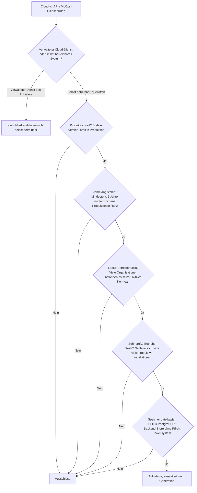
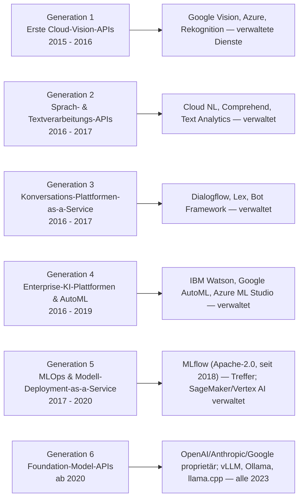
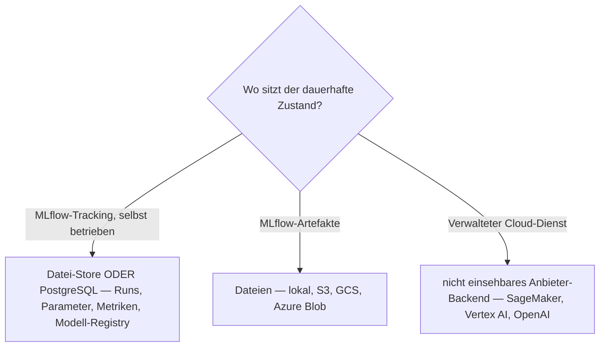

# Produktionsreife Cloud-KI-APIs nach Generation — Reifegrad, Lizenz & Betriebs-Skala (Top 1 — nur die cloud-unabhängige MLOps-Schicht MLflow)

Die [Evolution und Architekturen digitaler Cloud-KI-APIs](evolution-digitaler-cloud-ki-apis.md) ist die vertiefte Zeitachse von Generation 3 der [übergeordneten KI-Anwendungs-Chronologie](evolution-digitaler-ki-anwendungen.md): erste Cloud-Vision-APIs (1), Sprach- & Textverarbeitungs-APIs (2), Konversations-Plattformen-as-a-Service (3), Enterprise-KI-Plattformen & AutoML (4), MLOps & Modell-Deployment-as-a-Service (5), Foundation-Model-APIs lösen Einzel-APIs ab (6). Die [Topliste bester Cloud-KI-APIs 2026](cloud-ki-apis-2026-topliste.md) rankt die gesamte Kategorie. Diese Seite legt das **konservative** Fünf-Filter-Sieb der Familie an — produktionsreif · jahrelang stabil · große Betreiberbasis · sehr große Betriebs-Skala · Speicher dateibasiert oder PostgreSQL — und sortiert nach Generation.

!!! warning "Achtung: Die Kategorie verkauft gehostete Rechenkapazität — sie ist per Geschäftsmodell proprietär"
    Fünf der sechs Generationen bestehen aus **verwalteten Diensten großer Cloud-Anbieter**: Google Cloud Vision, Azure Cognitive Services, AWS Rekognition (Gen 1), die Text-/Sprach-APIs (Gen 2), Dialogflow/Lex (Gen 3), IBM Watson/Google AutoML (Gen 4), SageMaker/Vertex AI (Gen 5), OpenAI-/Anthropic-/Google-APIs (Gen 6). Keiner davon ist selbst betreibbar — dieselbe strukturelle Aussage wie bei den [Cloud-Notebooks](../wissen/dokumentation/produktionsreife-cloud-notebooks-generationen-2026-topliste.md), [Cloud-LMS](../wissen/e-learning/produktionsreife-cloud-lms-generationen-2026-topliste.md) und [BI-Analytics-Tools](../wissen/daten/datenbanken/produktionsreife-bi-analytics-tools-generationen-2026-topliste.md). Der einzige Treffer ist der **cloud-unabhängige Gegenpol** in Generation 5: **MLflow** (Apache-2.0, seit 2018), die selbst hostbare MLOps-Schicht für Experiment-Tracking und Modell-Registry, mit Datei- oder PostgreSQL-Backend. Die quelloffenen Inferenzserver, die im Foundation-Model-Zeitalter dieselbe Rolle spielen — **vLLM**, **Ollama**, **llama.cpp** —, sind alle von 2023 und damit unter fünf Jahre.

---

## Die fünf harten Filter

!!! note "Hinweis: der verwaltete Dienst ist per Definition kein Kandidat"
    Eine Cloud-KI-API ist ein Produkt, dessen Kern der Anbieter betreibt — Modell, GPU-Flotte, Skalierung. Aufgenommen wird nur, was man unter OSI-Lizenz auf eigener Infrastruktur betreiben kann. Das schließt die gesamte Anbieter-Riege aus (Google, AWS, Microsoft, IBM, OpenAI, Anthropic) und lässt nur die cloud-unabhängigen Werkzeuge übrig, die diese Zeitachse selbst als Gegenbewegung führt.

---

## Ergebnis: ein Treffer über sechs Generationsstufen

---

## Systeme nach Generation

### Generation 5 — MLOps & Modell-Deployment-as-a-Service (2017 – 2020)

| # | System | Speicher | Lizenz | Seit | Skala-Nachweis |
|---|---|---|---|---|---|
| 1 | **MLflow** | Datei-Store ODER SQL-Backend (SQLite/PostgreSQL/MySQL) für die Tracking-/Registry-Metadaten; Artefakte als Dateien (lokal/S3/GCS) | Apache-2.0 (seit 2020 Projekt der Linux Foundation) | Juni 2018 | Eines der meistgenutzten MLOps-Werkzeuge überhaupt — Experiment-Tracking und Modell-Registry in sehr breiter produktiver Nutzung, cloud-unabhängig und on-premise betreibbar |

**MLflow** ist der einzige Treffer dieser Seite und ein sauberer: Apache-2.0, seit 2018 ununterbrochen weiterentwickelt, herstellerneutrale Governance unter der Linux Foundation, in gewaltiger Skala im Einsatz. Der Tracking-Server hält seine Metadaten im **Datei-Store oder in einer SQLAlchemy-kompatiblen Datenbank** — PostgreSQL ist die typische Produktionswahl, ein Pflicht-Zweitsystem gibt es nicht. Die Modell-Artefakte selbst sind Dateien. Damit besteht MLflow alle fünf Filter, während der Rest von Generation 5 — **Amazon SageMaker**, **Google Vertex AI** — verwaltete Cloud-Plattformen ohne Selbstbetrieb sind.

**Grenzfälle im Serving-Umfeld:** Der **NVIDIA Triton Inference Server** (BSD-3, als „TensorRT Inference Server" seit 2018) und **BentoML** (Apache-2.0, seit 2019) sind ebenfalls quelloffene, lange gepflegte Modell-Serving-Systeme — Triton mit knapper Fünf-Jahres-Historie nach dem Rename 2019, BentoML mit ~6 Jahren, aber kleinerer Betreiberbasis. Beide sind reine Serving-Infrastruktur (zustandslos, Modell-Dateien rein, Antworten raus), weniger „Cloud-KI-API" im Sinne dieser Zeitachse — Grenzfälle.

### Generation 1 – 4 & 6 — warum hier nichts steht

- **Generation 1 (Cloud-Vision-APIs)**: **Google Cloud Vision API**, **Azure Cognitive Services**, **AWS Rekognition** sind verwaltete Dienste — der Anbieter betreibt Modell und Infrastruktur, Selbstbetrieb ist ausgeschlossen. Die quelloffene Entsprechung — Objekterkennung als Baustein — steht auf der [Deep-Learning-Seite](produktionsreife-deep-learning-anwendungen-generationen-2026-topliste.md) (YOLO via Ultralytics).
- **Generation 2 (Text-/Sprach-APIs)**: **Google Cloud Natural Language**, **AWS Comprehend**, **Azure Text Analytics** — dieselbe verwaltete Dienst-Konstellation. Die quelloffene NLP-Schicht ist Hugging Face `transformers` (siehe [Deep-Learning-Seite](produktionsreife-deep-learning-anwendungen-generationen-2026-topliste.md)).
- **Generation 3 (Konversations-Plattformen)**: **Dialogflow**, **Amazon Lex**, **Microsoft Bot Framework** sind gehostete Chatbot-Baukästen.
- **Generation 4 (Enterprise-Plattformen & AutoML)**: **IBM Watson**, **Google Cloud AutoML**, **Azure Machine Learning Studio** sind kommerzielle Plattformen. Die quelloffene AutoML-Tradition (auto-sklearn, AutoGluon, FLAML) gehört zur Modell-Generatoren-Achse, nicht hierher.
- **Generation 6 (Foundation-Model-APIs)**: **OpenAI API**, **Anthropic API**, **Google AI-APIs** sind per Geschäftsmodell proprietär. Der quelloffene, selbst betreibbare Gegenpol sind lokale Inferenzserver — **vLLM** (Apache-2.0), **Ollama** (MIT), **llama.cpp** (MIT), **LocalAI** — alle von 2023 und damit klar unter der Fünf-Jahres-Marke. Vertiefung: [vLLM High-Throughput-Serving](coding/vllm-high-throughput-serving.md), [Multi-LLM-Anbieter im Vergleich](coding/llm-anbieter-vergleich.md).

---

## Dateibasiert oder PostgreSQL?

Für den einen Treffer ist die Antwort eindeutig — und der Speicherfilter siebt hier sauber, weil MLflows Backend-Wahl explizit ist:

- Kleine Installationen fahren MLflow rein dateibasiert; produktive Mehrbenutzer-Server nutzen **PostgreSQL** als Tracking-Backend — kein MongoDB, kein Pflicht-Cache, kein zweites System.
- Die Modell-Inferenz und das Modell-Training laufen darüber (lokale GPU oder Cloud) — das ist Rechen-, nicht Speicherwahl.

Vertiefung zur Datenbankschicht: [PostgreSQL DBA Praxis-Handbuch](../entwicklung/infrastruktur/postgresql-dba-praxis.md).

!!! warning "Achtung: Momentaufnahme, Stand August 2026"
    Erreicht einer der quelloffenen Inferenzserver — **vLLM**, **Ollama** — 2028 die Fünf-Jahres-Marke mit dann breiter Selbstbetrieb-Basis, bekommt Generation 6 ihren ersten Treffer. Die verwalteten Cloud-Dienste der Generationen 1–4 werden strukturell nie auf dieser Liste stehen.

---

## Was bewusst nicht auf dieser Liste steht

| System | Erfüllt nicht | Anmerkung |
|---|---|---|
| **Google Cloud Vision, Azure Cognitive Services, AWS Rekognition** | Selbstbetrieb / Lizenz | Verwaltete Cloud-Dienste |
| **Google Cloud NL, AWS Comprehend, Azure Text Analytics** | Selbstbetrieb / Lizenz | Verwaltete Text-/Sprach-Dienste |
| **Dialogflow, Amazon Lex, Microsoft Bot Framework** | Selbstbetrieb / Lizenz | Gehostete Chatbot-Baukästen |
| **IBM Watson, Google Cloud AutoML, Azure ML Studio** | Selbstbetrieb / Lizenz | Kommerzielle Enterprise-KI-Plattformen |
| **Amazon SageMaker, Google Vertex AI** | Selbstbetrieb / Lizenz | Verwaltete MLOps-Plattformen |
| **OpenAI API, Anthropic API, Google AI-APIs** | Selbstbetrieb / Lizenz | Foundation-Model-APIs, per Geschäftsmodell proprietär |
| **vLLM, Ollama, llama.cpp, LocalAI** | Reifezeit | Quelloffen und in Produktion, aber alle von 2023 |
| **NVIDIA Triton Inference Server, BentoML** | Reifezeit / Kategorie | BSD-3 bzw. Apache-2.0, lange gepflegt — aber knappe/kleine Fünf-Jahres-Basis und reine Serving-Infrastruktur; Grenzfälle |

---

## 🔗 Verwandte Themen

- [Evolution und Architekturen digitaler Cloud-KI-APIs](evolution-digitaler-cloud-ki-apis.md) — das sechsstufige Generationenmodell, nach dem diese Liste sortiert ist
- [Beste Cloud-KI-APIs 2026 (Top 15)](cloud-ki-apis-2026-topliste.md) — breiteste Basis-Topliste inklusive aller verwalteten Anbieter-Dienste
- [Produktionsreife KI-Anwendungen nach Generation](produktionsreife-ki-anwendungen-generationen-2026-topliste.md) — die übergeordnete Dach-Seite; MLflow erscheint dort als Generation-3-Infrastruktur-Treffer
- [Produktionsreife Cloud-Notebooks nach Generation (Top 1)](../wissen/dokumentation/produktionsreife-cloud-notebooks-generationen-2026-topliste.md) · [Produktionsreife Cloud-LMS nach Generation (Top 1)](../wissen/e-learning/produktionsreife-cloud-lms-generationen-2026-topliste.md) — dieselbe strukturelle Aussage: eine Kategorie, die gehosteten Betrieb verkauft, bleibt fast vollständig proprietär
- [Produktionsreife Deep-Learning-Anwendungen nach Generation (Top 3)](produktionsreife-deep-learning-anwendungen-generationen-2026-topliste.md) — die Modelle, die hinter den Generation-1–3-APIs laufen, als quelloffene Bausteine
- [vLLM High-Throughput-Serving](coding/vllm-high-throughput-serving.md) · [Multi-LLM- & Sprachmodell-Anbieter im Vergleich](coding/llm-anbieter-vergleich.md) — die quelloffene bzw. kommerzielle Foundation-Model-Serving-Schicht im Detail
- [PostgreSQL DBA Praxis-Handbuch](../entwicklung/infrastruktur/postgresql-dba-praxis.md) — PostgreSQL als MLflow-Tracking-Backend
