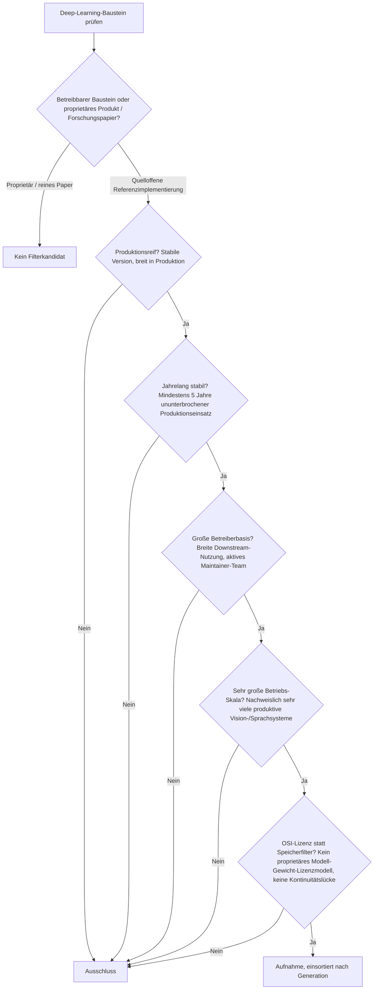
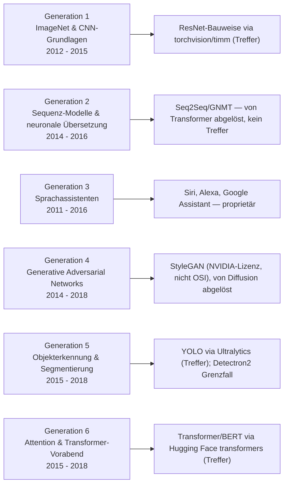
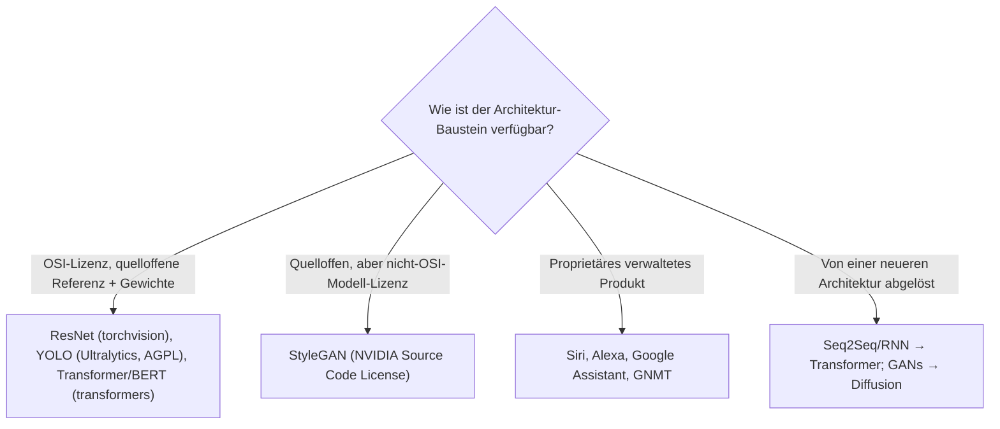

# Produktionsreife Deep-Learning-Anwendungen nach Generation — Reifegrad, Lizenz & Betriebs-Skala (Top 3 — die Architekturen bestehen als Bausteine, die Produkte nicht)

Die [Evolution und Architekturen digitaler Deep-Learning-Anwendungen](evolution-digitaler-deep-learning-anwendungen.md) ordnet die Ära „ein trainiertes Modell pro Aufgabe" nach Generation: ImageNet-Durchbruch & CNN-Grundlagen (1), Sequenz-Modelle & neuronale Übersetzung (2), Sprachassistenten mit Intent-Modellen (3), Generative Adversarial Networks (4), Objekterkennung & Segmentierung (5), Attention-Mechanismus & Transformer-Vorabend (6). Die [Topliste bester Deep-Learning-Anwendungen 2026](deep-learning-anwendungen-2026-topliste.md) rankt nach architektonischem Einfluss. Diese Seite legt das **konservative** Fünf-Filter-Sieb der Familie an — produktionsreif · jahrelang stabil · große Betreiberbasis · sehr große Betriebs-Skala · Speicher dateibasiert oder PostgreSQL — und sortiert nach Generation.

!!! warning "Achtung: Diese Zeitachse besteht aus Forschungs-Architekturen, nicht aus betreibbaren Produkten"
    Die „Anwendungen" dieser Generation sind entweder **proprietär** (Siri, Alexa, Google Neural Machine Translation) oder **abgelöst** (Seq2Seq und GANs durch Transformer bzw. Diffusion). Was das Sieb besteht, sind die **Architekturen** dieser Zeitachse — über ihre quelloffenen Referenzimplementierungen, dieselbe „die Infrastruktur *ist* reif, die Anwendungen nicht"-Struktur wie bei den [semantischen & RAG-Wissenssystemen](../wissen/dokumentation/produktionsreife-semantische-rag-wissenssysteme-generationen-2026-topliste.md). Drei der sechs Generationen haben einen solchen Baustein: **ResNet-Bauweise** (Gen 1, via torchvision/timm), **YOLO** (Gen 5, via Ultralytics — der klarste eigenständige Treffer), **Transformer/BERT** (Gen 6, via Hugging Face `transformers`). Der Speicherfilter läuft für Modell-Bausteine leer (Gewichte sind Dateien) und wird durch **OSI-Lizenz + Kontinuität** ersetzt.

---

## Die fünf harten Filter

!!! note "Hinweis: Architektur ≠ Produkt, aber die Referenzimplementierung zählt"
    Eine Architektur wie ResNet oder der Transformer ist ein Modell-*Entwurf*, kein Betrieb. Zählbar wird sie über die quelloffene Bibliothek, die sie bereitstellt und pflegt — torchvision/timm für CNN-Backbones, Ultralytics für YOLO, Hugging Face `transformers` für BERT & Transformer-Modelle. Die zugrunde liegenden Frameworks (PyTorch, TensorFlow, Keras) tauchen in dieser Chronologie nicht als Generation auf und werden separat betrachtet.

---

## Ergebnis: drei Architektur-Bausteine über sechs Generationsstufen

---

## Bausteine nach Generation

### Generation 1 — ImageNet-Durchbruch & CNN-Grundlagen (2012 – 2015)

| # | Baustein | Bereitstellung | Lizenz | Seit | Skala-Nachweis |
|---|---|---|---|---|---|
| 1 | **[ResNet-Bauweise](evolution-digitaler-deep-learning-anwendungen.md#generation-1-der-imagenet-durchbruch-cnn-grundlagen-2012-2015)** (Skip Connections) | torchvision, `timm` (pytorch-image-models) | BSD-3-Clause / Apache-2.0 | 2015 | Standard-Backbone praktisch jeder produktiven Bildklassifikations- und Feature-Extraktions-Pipeline seit über einem Jahrzehnt |

**ResNet** ist der Treffer der CNN-Generation — nicht als Produkt, sondern als Bauweise, die jede folgende Vision-Architektur erbte und die über torchvision und `timm` als vortrainierte, quelloffene Referenz in gewaltiger Skala verfügbar ist. **AlexNet** und **VGGNet/Inception** sind historisch (von ResNet abgelöst).

### Generation 5 — Objekterkennung & Segmentierung (2015 – 2018)

| # | Baustein | Bereitstellung | Lizenz | Seit | Skala-Nachweis |
|---|---|---|---|---|---|
| 2 | **[YOLO](evolution-digitaler-deep-learning-anwendungen.md#generation-5-objekterkennung-segmentierung-als-produktionsreife-kategorie-2015-2018)** (You Only Look Once) | Ultralytics (YOLOv8/v11), Darknet-Erbe | AGPL-3.0 (OSI-anerkannt) | 2015 (YOLOv1), Ultralytics-Linie seit 2020 | De-facto-Standard für echtzeitfähige Objekterkennung — Fertigungs-Qualitätskontrolle, Videoanalyse, Robotik, Landwirtschaft |

**YOLO** ist der klarste eigenständige Treffer dieser Seite: eine durchgehende, aktiv gepflegte Objekterkennungs-Linie seit 2015, mit Ultralytics als quelloffenem (AGPL-3.0) Framework in sehr breiter industrieller Produktion. Die AGPL-Lizenz verlangt für geschlossene kommerzielle Nutzung einen Lizenzkauf, ist aber OSI-anerkannt — dieselbe Konstellation wie bei Grafana/Canvas LMS in der Familie. **Mask R-CNN** und **Faster R-CNN** leben über **Detectron2** (Meta, Apache-2.0) und torchvision weiter — Detectron2 ist seit 2019 (~7 Jahre), aber die Weiterentwicklung hat spürbar nachgelassen: Grenzfall.

### Generation 6 — Attention-Mechanismus & Transformer-Vorabend (2015 – 2018)

| # | Baustein | Bereitstellung | Lizenz | Seit | Skala-Nachweis |
|---|---|---|---|---|---|
| 3 | **[Transformer / BERT](evolution-digitaler-deep-learning-anwendungen.md#generation-6-attention-mechanismus-der-transformer-vorabend-2015-2018)** | Hugging Face `transformers` | Apache-2.0 | Transformer 2017, BERT 2018, `transformers`-Bibliothek 2019 | Die Standard-Bibliothek für Transformer-Modelle — unter praktisch jeder produktiven NLP-/Embedding-Pipeline; BERT-Varianten weiterhin für Klassifikation und Retrieval im Masseneinsatz |

**Der Transformer** (2017) und **BERT** (2018) bestehen über die Hugging-Face-`transformers`-Bibliothek — dieselbe reife OSS-Schicht, die auch auf der [Rust-KI-Anwendungen-Schwesterseite](produktionsreife-rust-ki-anwendungen-generationen-2026-topliste.md) mit `tokenizers` als einziger Treffer erscheint. `transformers` selbst ist seit 2019 (~7 Jahre), Apache-2.0, in gigantischer Skala.

### Generation 2, 3 & 4 — warum hier nichts steht

- **Generation 2 (Seq2Seq, GNMT)**: Die Encoder-Decoder-RNN-Architektur wurde **vollständig vom Transformer abgelöst** — historisch bedeutsam, aber 2026 kein produktiv gewählter Baustein mehr. **Google Neural Machine Translation** ist zudem proprietär.
- **Generation 3 (Sprachassistenten)**: **Siri**, **Amazon Alexa**, **Google Assistant** sind sämtlich proprietäre Konsumentenprodukte. Die quelloffene Entsprechung — Spracherkennung (Whisper, Vosk) und Wake-Word-Erkennung — gehört zur [Audio-Werkzeug-Achse](../kreativ/audio/evolution-digitaler-ki-audio-werkzeuge.md), nicht hierher.
- **Generation 4 (GANs)**: Das **GAN-Grundlagenpapier** ist ein Paper. **StyleGAN** ist quelloffen, aber unter der **NVIDIA Source Code License** (nicht OSI-anerkannt), und die generative Bildaufgabe ist seit ~2022 fast vollständig zu **Diffusionsmodellen** gewandert — siehe die [Bildgenerierungs-Achse](../kreativ/design/evolution-digitaler-ki-bildgenerierung.md).

---

## OSI-Lizenz statt Speicherbackend

Modell-Gewichte sind Dateien — der Speicherfilter läuft leer. Die trennende Achse ist die Lizenz der Referenzimplementierung *und* der Gewichte:

- Der Speicherfilter greift nicht: Ein trainiertes Modell wird als Datei (`.pt`, `.safetensors`, ONNX) ausgeliefert und geladen — die Anwendung *darüber* hält ihren Zustand relational, siehe [RAG-Werkzeug-Anwendungen nach Generation](produktionsreife-rag-werkzeug-anwendungen-generationen-2026-topliste.md).
- Die ersetzende Lizenz-/Kontinuitäts-Achse siebt real: Sie schließt StyleGAN (nicht-OSI-Gewichte-Lizenz) und die proprietären Assistenten aus und markiert die abgelösten Architekturen (Seq2Seq, GANs) als Nicht-Treffer.

Vertiefung zur Datenbankschicht der Anwendungen: [PostgreSQL DBA Praxis-Handbuch](../entwicklung/infrastruktur/postgresql-dba-praxis.md).

!!! warning "Achtung: Momentaufnahme, Stand August 2026"
    Diese Zeitachse endet architektonisch mit dem Transformer — die aktive Weiterentwicklung findet in [Generation 4 der übergeordneten KI-Anwendungen](evolution-digitaler-ki-anwendungen.md#generation-4-generative-ki-llm-gestutzte-anwendungen-ab-ca-2020) (Foundation-Modelle) statt. Neue Treffer auf *dieser* Seite sind unwahrscheinlich; ResNet, YOLO und `transformers` sind die stabilen Konstanten.

---

## Was bewusst nicht auf dieser Liste steht

| Baustein | Erfüllt nicht | Anmerkung |
|---|---|---|
| **AlexNet, VGGNet, Inception, Seq2Seq** | Kontinuität | Historisch bedeutsam, aber von ResNet bzw. dem Transformer abgelöst |
| **Google Neural Machine Translation** | Lizenz + Kontinuität | Proprietär, Architektur überholt |
| **Siri, Amazon Alexa, Google Assistant** | Lizenzfilter | Proprietäre Konsumentenprodukte |
| **GAN-Grundlagenpapier** | Kategorie | Ein Paper, kein Baustein |
| **StyleGAN** | Lizenzfilter | NVIDIA Source Code License (nicht OSI); generative Bildaufgabe zu Diffusion gewandert |
| **Detectron2** (Mask/Faster R-CNN) | Reifezeit + Aktivität | Apache-2.0, seit 2019 — aber nachlassende Weiterentwicklung; Grenzfall |
| **PyTorch, TensorFlow, Keras** | Kategorie dieser Seite | Die Frameworks unter allen Bausteinen — nicht Teil dieser architektur-orientierten Chronologie |

---

## 🔗 Verwandte Themen

- [Evolution und Architekturen digitaler Deep-Learning-Anwendungen](evolution-digitaler-deep-learning-anwendungen.md) — das Generationenmodell der Architektur-Meilensteine, nach dem diese Liste sortiert ist
- [Produktionsreife KI-Anwendungen nach Generation (Top 9)](produktionsreife-ki-anwendungen-generationen-2026-topliste.md) — die übergeordnete Dach-Seite; ResNet, YOLO und Transformer/BERT erscheinen dort als Generation-2-Treffer
- [Beste Deep-Learning-Anwendungen 2026 (Top 15)](deep-learning-anwendungen-2026-topliste.md) — breitere Basis-Topliste nach architektonischem Einfluss, inklusive historischer Meilensteine
- [Produktionsreife Rust-Bausteine für KI-Anwendungen nach Generation (Top 1)](produktionsreife-rust-ki-anwendungen-generationen-2026-topliste.md) — dieselbe reife OSS-Schicht (Hugging Face) mit `tokenizers` als einzigem Treffer
- [Produktionsreife semantische & RAG-Wissenssysteme nach Generation (Top 7)](../wissen/dokumentation/produktionsreife-semantische-rag-wissenssysteme-generationen-2026-topliste.md) — dieselbe Struktur: die Infrastruktur ist reif, die Anwendungen darüber nicht
- [Produktionsreife RAG- & Werkzeug-Anwendungen nach Generation](produktionsreife-rag-werkzeug-anwendungen-generationen-2026-topliste.md) · [Produktionsreife autonome KI-Agenten nach Generation](produktionsreife-autonome-ki-agenten-generationen-2026-topliste.md) — die Foundation-Model-Generation, die diese Zeitachse ablöst
- [Multimodale Vision-Pipelines](coding/multimodale-vision-pipelines.md) — praktische Umsetzung ResNet-/YOLO-/Attention-basierter Bildverarbeitung
- [PostgreSQL DBA Praxis-Handbuch](../entwicklung/infrastruktur/postgresql-dba-praxis.md) — Datenbankschicht der Anwendung über den Modell-Bausteinen
