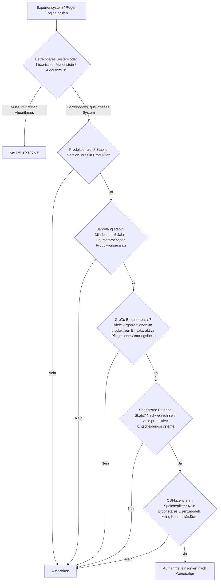
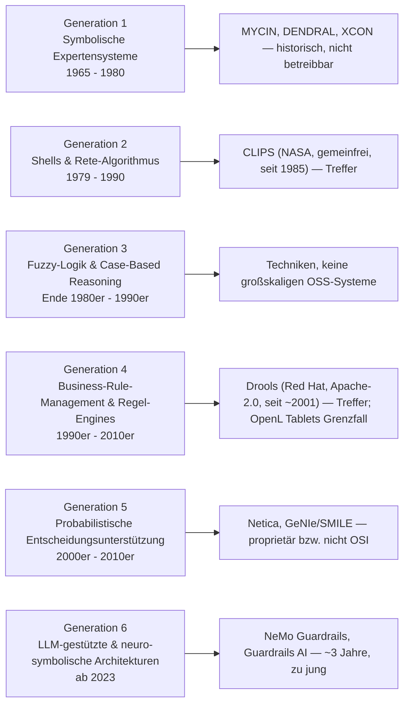
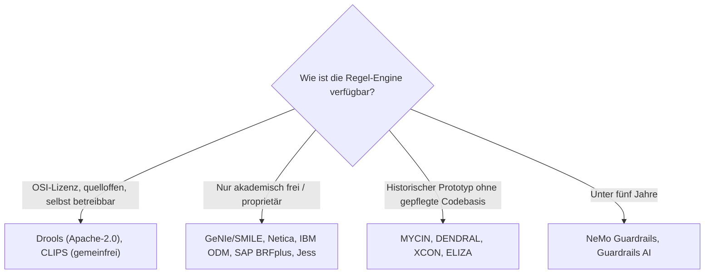

# Produktionsreife Expertensysteme & Regel-Engines nach Generation — Reifegrad, Lizenz & Betriebs-Skala (Top 2 — die Regel-Engines Drools und CLIPS, nicht die KI-Winter-Systeme)

Die [Evolution und Architekturen digitaler Expertensysteme](evolution-digitaler-expertensysteme.md) ist die vertiefte Zeitachse von Generation 1 der [übergeordneten KI-Anwendungs-Chronologie](evolution-digitaler-ki-anwendungen.md): symbolische Expertensysteme mit Backward-Chaining (1), Expertensystem-Boom & kommerzielle Shells + Rete-Algorithmus (2), Fuzzy-Logik & Case-Based Reasoning (3), Business-Rule-Management-Systeme & produktive Regel-Engines (4), probabilistische Entscheidungsunterstützung (5), LLM-gestützte & neuro-symbolische Reasoning-Architekturen (6). Die [Topliste bester Expertensysteme](expertensysteme-topliste.md) rankt die gesamte Kategorie nach architektonischer Bedeutung. Diese Seite legt das **konservative** Fünf-Filter-Sieb der Familie an — produktionsreif · jahrelang stabil · große Betreiberbasis · sehr große Betriebs-Skala · Speicher dateibasiert oder PostgreSQL — und sortiert nach Generation.

!!! warning "Achtung: Die „Gen 0 der KI" hat reifere Open-Source-Substanz als die KI-Ära"
    Die Zeitachse zerfällt in drei Teile. Die **Gründergeneration** (MYCIN, DENDRAL, XCON, ELIZA) ist historisch — kein betreibbares System, nur Konzeptgeschichte. Die **KI-native Generation 6** (NeMo Guardrails, Guardrails AI) ist mit ~3 Jahren zu jung, dieselbe Einordnung wie bei den [autonomen KI-Agenten](produktionsreife-autonome-ki-agenten-generationen-2026-topliste.md). Dazwischen liegt **Generation 4**, in der die Kernarchitektur — Wissensbasis getrennt von der Inferenzmaschine, Rete-basiertes Forward-Chaining — als reguläres Software-Engineering-Werkzeug weiterlebt: **Drools** (Red Hat, Apache-2.0, seit ~2001) in Kreditvergabe- und Versicherungs-Tarifierungssystemen im Masseneinsatz, **CLIPS** (NASA, gemeinfrei, seit 1985) mit ruhiger, aber lückenloser Pflege. Zwei Treffer — und beide älter als jede Generation der aktuellen KI-Welle. Der Speicherfilter ist für Regel-Engines strukturell bedeutungslos („Regeln rein, Entscheidung raus") und wird durch **OSI-Lizenz + Kontinuität** ersetzt.

---

## Die fünf harten Filter

!!! note "Hinweis: nur betreibbare, OSI-lizenzierte Systeme"
    Ein historisches Expertensystem wie MYCIN oder ein Algorithmus wie Rete ist kein Betrieb. Zählbar ist nur, was 2026 als quelloffene, selbst betreibbare Regel-Engine unter OSI-anerkannter Lizenz läuft. Das schließt **IBM ODM** (ehem. ILOG JRules), **SAP BRFplus**, **Netica** und **GeNIe/SMILE** (kommerziell bzw. nur akademisch frei) sowie **Jess** (proprietäre CLIPS-in-Java-Portierung) aus.

---

## Ergebnis: zwei Regel-Engines über sechs Generationsstufen

---

## Systeme nach Generation

### Generation 2 — Expertensystem-Shells & Rete-Algorithmus (1979 – 1990)

| # | System | Speicher | Lizenz | Seit | Skala-Nachweis |
|---|---|---|---|---|---|
| 1 | **CLIPS** (C Language Integrated Production System) | reines Textformat (`.clp`-Konstrukte), Fakten im Arbeitsspeicher | gemeinfrei (US-Regierungsursprung, NASA) | 1985 | Über vier Jahrzehnte durchgehend gepflegte Referenz-Regel-Engine — eingebettete Diagnosesysteme, Raumfahrt-Altbestände, Hochschullehre; die Vorlage für zahllose Klone (Jess, PyKnow, CLIPS.js) |

**CLIPS** ist der Treffer der Shell-Generation: eine quelloffene, gemeinfreie Regel-Engine, die das architektonische Grundprinzip aller Expertensysteme — Inferenzmaschine strikt getrennt von austauschbarer Wissensbasis — seit 1985 ohne Kontinuitätsbruch trägt (aktuelle Serie 6.4.x). Die Betriebs-Skala ist heute moderat, aber die Pflege ist lückenlos und die konzeptionelle Reichweite über die Klon-Familie gewaltig — dieselbe „ruhige statt rasante Pflege"-Auslegung wie bei DokuWiki und TiddlyWiki in den [PKM-Toplisten](../wissen/dokumentation/produktionsreife-pkm-wissensgraphen-generationen-2026-topliste.md). Der **Rete-Algorithmus** selbst (Charles Forgy, 1979/1982) ist die Grundlage praktisch jeder folgenden Regel-Engine — aber ein Algorithmus, kein betreibbares System.

### Generation 4 — Business-Rule-Management-Systeme & produktive Regel-Engines (1990er – 2010er)

| # | System | Speicher | Lizenz | Seit | Skala-Nachweis |
|---|---|---|---|---|---|
| 2 | **Drools** (Teil der KIE-/Drools-Plattform, Red Hat) | keine eigene Persistenz — Regeln als `.drl`-Dateien/DMN, Geschäftsdaten in der PostgreSQL des Host-Systems | Apache-2.0 | ~2001 (Drools 2, JBoss Rules) | Meistgenutzte quelloffene Regel-Engine im Java-Ökosystem — produktiv in Kreditvergabe, Versicherungs-Tarifierung, Compliance-Prüfung und Betrugserkennung bei Banken und Versicherern |

**Drools** ist der klarste Treffer dieser Seite: eine durchgehend von Red Hat gepflegte, Apache-2.0-lizenzierte Rete-OO-Engine mit rund 25 Jahren ununterbrochenem Produktionseinsatz in regulierten Branchen. Die Engine hält keinen eigenen dauerhaften Zustand — Regeln liegen als `.drl`-Dateien oder DMN-Modelle vor, die transaktionalen Geschäftsdaten in der relationalen Datenbank der Anwendung darüber. **OpenL Tablets** (Apache-2.0, seit ~2003, Entscheidungstabellen in Excel) ist ein zweiter langlebiger OSS-BRMS-Kandidat, hat aber eine deutlich kleinere Betreiberbasis — Grenzfall an der Skala.

### Generation 1, 3, 5 & 6 — warum hier nichts steht

- **Generation 1 (symbolische Expertensysteme)**: **MYCIN**, **DENDRAL**, **PROSPECTOR**, **XCON/R1**, **ELIZA**, **EMYCIN** sind konzeptionell prägend (Certainty Factors, Shell-Architektur, Bayes'sche Inferenz), aber allesamt Forschungsprototypen der 1960er–1980er ohne betreibbare, gepflegte Codebasis — Museum, kein Filterkandidat.
- **Generation 3 (Fuzzy-Logik & CBR)**: Fuzzy-Inferenz und Case-Based Reasoning sind **Techniken**, keine Systeme. Quelloffene Fuzzy-Bibliotheken (jFuzzyLogic, scikit-fuzzy) und CBR-Frameworks (myCBR) existieren, haben aber Nischen-Betreiberbasis. CBR nimmt architektonisch [RAG](produktionsreife-rag-werkzeug-anwendungen-generationen-2026-topliste.md) vorweg — die reife Infrastruktur dieser Idee ist heute [pgvector](produktionsreife-rag-werkzeug-anwendungen-generationen-2026-topliste.md), nicht eine CBR-Engine.
- **Generation 5 (probabilistische Entscheidungsunterstützung)**: **Netica** (Norsys) ist proprietär, **GeNIe/SMILE** nur für akademische Nutzung frei (keine OSI-Lizenz — dieselbe Konstellation wie StyleGAN auf der [Deep-Learning-Seite](produktionsreife-deep-learning-anwendungen-generationen-2026-topliste.md)). Quelloffene Bayes-Netz-Bibliotheken (pgmpy, pomegranate) sind Forschungswerkzeuge ohne großskalige produktive Betreiberbasis.
- **Generation 6 (LLM-gestützt & neuro-symbolisch)**: **NeMo Guardrails** (NVIDIA, Apache-2.0) und **Guardrails AI** sind beide von 2023 — unter fünf Jahre. Sie greifen die Kontrollschicht-Idee aus Generation 4 explizit wieder auf, sind aber genauso jung wie die [autonomen KI-Agenten](produktionsreife-autonome-ki-agenten-generationen-2026-topliste.md), mit denen sie die Reifezeit-Sperre teilen.

---

## OSI-Lizenz statt Speicherbackend

Eine Regel-Engine verarbeitet Fakten zu Entscheidungen — sie ist keine Datenhaltung. Der Speicherfilter läuft leer; die trennende Achse ist die Lizenz:

- Der Speicherfilter greift nicht: **Drools** persistiert nichts Eigenes (Regeln als Dateien, Geschäftsdaten in der PostgreSQL der Host-Anwendung), **CLIPS** hält Konstrukte in `.clp`-Textdateien und Fakten im Arbeitsspeicher — beide sind sauber dateibasiert bzw. backend-agnostisch.
- Die ersetzende Lizenz-Achse siebt real: Sie schließt die kommerzielle Enterprise-Riege (IBM ODM, SAP BRFplus) und die nur-akademischen Bayes-Werkzeuge aus.

Vertiefung zur Datenbankschicht der Anwendung über der Engine: [PostgreSQL DBA Praxis-Handbuch](../entwicklung/infrastruktur/postgresql-dba-praxis.md).

!!! warning "Achtung: Momentaufnahme, Stand August 2026"
    Erreicht **NeMo Guardrails** (2028) die Fünf-Jahres-Marke mit dann breiter Betreiberbasis, bekommt Generation 6 ihren ersten Treffer. **Drools** und **CLIPS** sind die stabilen Konstanten — beide älter als das gesamte übrige KI-Anwendungs-Feld dieser Familie.

---

## Was bewusst nicht auf dieser Liste steht

| System | Erfüllt nicht | Anmerkung |
|---|---|---|
| **MYCIN, DENDRAL, PROSPECTOR, XCON/R1, ELIZA, EMYCIN** | Kategorie / Kontinuität | Historische Prototypen ohne betreibbare, gepflegte Codebasis |
| **IBM ODM** (ILOG JRules), **SAP BRFplus** | Lizenzfilter | Kommerzielle Enterprise-Regel-Plattformen |
| **Jess** | Lizenzfilter | Proprietäre CLIPS-in-Java-Portierung (Sandia), nur akademisch frei |
| **Netica, GeNIe/SMILE** | Lizenzfilter | Kommerziell bzw. nur für akademische Nutzung frei — keine OSI-Lizenz |
| **OpenL Tablets** | Betriebs-Skala | Apache-2.0, seit ~2003 — aber deutlich kleinere Betreiberbasis als Drools; Grenzfall |
| **Fuzzy-Logik, Case-Based Reasoning** | Kategorie | Techniken, keine betreibbaren Systeme; OSS-Bibliotheken mit Nischen-Basis |
| **NeMo Guardrails, Guardrails AI** | Reifezeit | Apache-2.0 und in Produktion, aber erst 2023 — unter fünf Jahre |
| **Rete-Algorithmus** | Kategorie | Das Fundament fast aller Regel-Engines — aber ein Algorithmus, kein System |

---

## 🔗 Verwandte Themen

- [Evolution und Architekturen digitaler Expertensysteme](evolution-digitaler-expertensysteme.md) — das sechsstufige Generationenmodell, nach dem diese Liste sortiert ist
- [Beste Expertensysteme (Top 15)](expertensysteme-topliste.md) — breitere Basis-Topliste nach architektonischer Bedeutung, inklusive historischer Meilensteine
- [Produktionsreife KI-Anwendungen nach Generation](produktionsreife-ki-anwendungen-generationen-2026-topliste.md) — die übergeordnete Dach-Seite; Drools und CLIPS erscheinen dort als Generation-1-Treffer
- [Produktionsreife autonome KI-Agenten nach Generation (kein Treffer)](produktionsreife-autonome-ki-agenten-generationen-2026-topliste.md) — Generation 6 dieser Zeitachse teilt mit ihnen die Reifezeit-Sperre
- [Produktionsreife Deep-Learning-Anwendungen nach Generation (Top 3)](produktionsreife-deep-learning-anwendungen-generationen-2026-topliste.md) — die nächste KI-Anwendungs-Generation, dieselbe „Architektur besteht, Produkt nicht"-Struktur
- [Evolution und Architekturen digitaler Programmierparadigmen](../entwicklung/evolution-digitaler-programmierparadigmen.md) — Prolog als prägende Sprache der Gründergeneration, vertieft als logisches Paradigma
- [PostgreSQL DBA Praxis-Handbuch](../entwicklung/infrastruktur/postgresql-dba-praxis.md) — Datenbankschicht der Anwendung über der Regel-Engine
