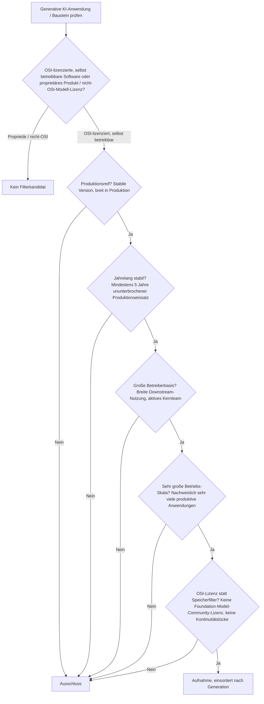
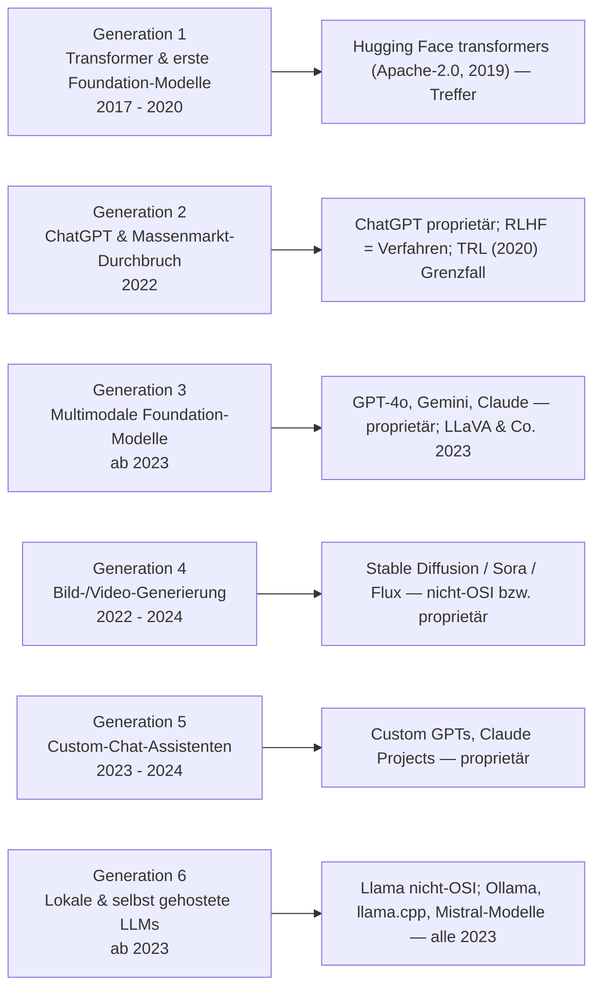
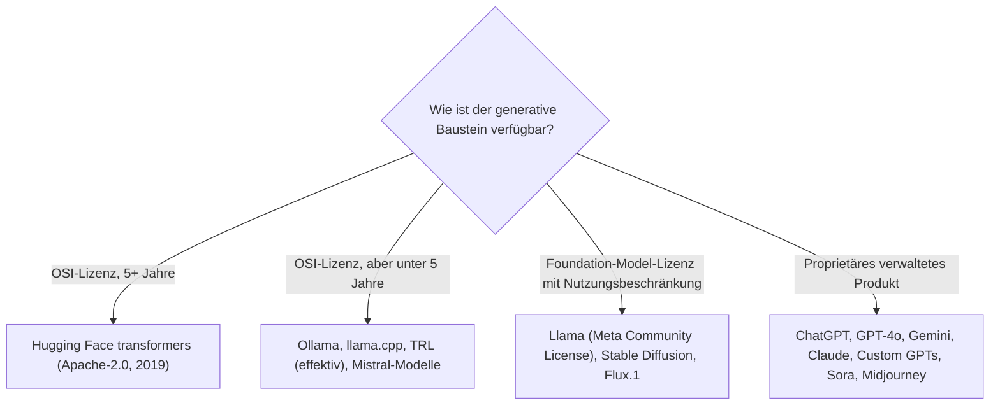

# Produktionsreife generative KI-Anwendungen nach Generation — Reifegrad, Lizenz & Betriebs-Skala (Top 1 — die Bibliotheksschicht besteht, kein Produkt der Generation)

Die [Evolution und Architekturen digitaler Generativer KI-Anwendungen](evolution-digitaler-generative-ki-anwendungen.md) ist die vertiefte Zeitachse von Generation 4 der [übergeordneten KI-Anwendungs-Chronologie](evolution-digitaler-ki-anwendungen.md): der Transformer-Durchbruch & erste Foundation-Modelle (1), ChatGPT & der Massenmarkt-Durchbruch (2), multimodale Foundation-Modelle (3), Bild-/Video-Generierung als eigene Produktkategorie (4), Custom-Chat-Assistenten (5), lokale & selbst gehostete LLM-Anwendungen (6). Die [Topliste bester generativer KI-Anwendungen 2026](generative-ki-anwendungen-2026-topliste.md) rankt die gesamte Kategorie. Diese Seite legt das **konservative** Fünf-Filter-Sieb der Familie an — produktionsreif · jahrelang stabil · große Betreiberbasis · sehr große Betriebs-Skala · Speicher dateibasiert oder PostgreSQL — und sortiert nach Generation.

!!! warning "Achtung: Die gesamte generative Produktgeneration hat keinen quelloffenen, betreibbaren Vertreter — nur die Bibliotheksschicht darunter"
    Dieselbe Struktur wie bei den [Deep-Learning-Anwendungen](produktionsreife-deep-learning-anwendungen-generationen-2026-topliste.md), der [KI-Anwendungs-Dach-Seite](produktionsreife-ki-anwendungen-generationen-2026-topliste.md) und den [KI-Modell-Generatoren](produktionsreife-ki-modell-generatoren-generationen-2026-topliste.md): Der einzige Treffer ist **Hugging Face `transformers`** (Apache-2.0, seit 2019) — die Standard-Bibliothek, mit der Transformer- und Foundation-Modelle geladen und ausgeführt werden. Was **nicht** besteht: **ChatGPT**, **GPT-4o**, **Gemini**, **Claude** (proprietär), **Custom GPTs / Claude Projects** (proprietär), **Stable Diffusion / Sora / Flux** (nicht-OSI-Modell-Lizenzen bzw. proprietär — siehe [KI-Bildgenerierung](../kreativ/design/produktionsreife-ki-bildgenerierung-generationen-2026-topliste.md)), und die lokale LLM-Schicht — **Llama** (Meta „Community License" mit Nutzungsbeschränkungen, nicht OSI-anerkannt), **Ollama**, **llama.cpp** (MIT, aber 2023). Der Speicherfilter läuft leer (Gewichte sind Dateien) und wird durch **OSI-Lizenz + Reifezeit** ersetzt.

---

## Die fünf harten Filter

!!! note "Hinweis: Foundation-Modell, Produkt und Bibliothek sind drei verschiedene Dinge"
    Ein Foundation-Modell (GPT-4, Llama) ist ein trainiertes Gewicht unter einer eigenen Lizenz. Ein Produkt (ChatGPT, Custom GPT) ist ein gehosteter Dienst darüber. Eine Bibliothek (`transformers`) lädt und führt die Modelle aus. Zählbar für dieses Sieb ist nur eine OSI-lizenzierte, fünf Jahre alte, großskalig genutzte Software — die es in dieser Zeitachse nur auf der Bibliotheksebene gibt.

---

## Ergebnis: ein Treffer über sechs Generationen

---

## Systeme nach Generation

### Generation 1 — Transformer & erste Foundation-Modelle (2017 – 2020)

| # | Baustein | Bereitstellung | Lizenz | Seit | Skala-Nachweis |
|---|---|---|---|---|---|
| 1 | **Hugging Face `transformers`** | PyPI-Bibliothek, Modelle als `.safetensors`-Dateien | Apache-2.0 | Transformer 2017, `transformers`-Bibliothek 2019 | Die Standard-Bibliothek für Transformer- und Foundation-Modelle — unter praktisch jeder produktiven generativen NLP-Pipeline, sowohl für Cloud- als auch für lokale Inferenz |

**Hugging Face `transformers`** ist der einzige Treffer — und derselbe wie auf der [Deep-Learning-Seite](produktionsreife-deep-learning-anwendungen-generationen-2026-topliste.md) (dort für Transformer/BERT) und der [KI-Anwendungs-Dach-Seite](produktionsreife-ki-anwendungen-generationen-2026-topliste.md). Apache-2.0, seit 2019 (~7 Jahre), in gigantischer Skala. Die Bibliothek besteht das Sieb; die *Produkte*, die auf ihr oder auf proprietären Modellen aufsetzen, bestehen es nicht.

### Generation 2 – 6 — warum hier nichts steht

- **Generation 2 (ChatGPT & Massenmarkt)**: **ChatGPT** ist ein proprietärer Dienst. **RLHF** ist ein Trainingsverfahren. Die quelloffene RLHF-/DPO-Bibliothek **TRL** (Hugging Face, Apache-2.0) stammt von 2020, wurde aber erst ab 2023 breit genutzt — Grenzfall an der effektiven Reifezeit.
- **Generation 3 (multimodale Foundation-Modelle)**: **GPT-4 Vision**, **GPT-4o**, **Gemini 1.5**, **Claude 3** sind sämtlich proprietär. Die quelloffenen multimodalen Modelle (LLaVA, Qwen-VL, Llama-Vision) sind alle von 2023+.
- **Generation 4 (Bild-/Video-Generierung)**: **Stable Diffusion** und **Flux.1** tragen nicht-OSI-Modell-Lizenzen, **Midjourney**, **DALL-E** und **Sora** sind proprietär — vollständige Begründung auf der [KI-Bildgenerierungs-Seite](../kreativ/design/produktionsreife-ki-bildgenerierung-generationen-2026-topliste.md) und der [KI-Modell-Generatoren-Seite](produktionsreife-ki-modell-generatoren-generationen-2026-topliste.md).
- **Generation 5 (Custom-Chat-Assistenten)**: **Custom GPTs** und **Claude Projects** sind anbietergebundene Konfigurationsschichten. Die quelloffene Entsprechung — RAG-/Assistenten-Frameworks — steht auf der [RAG-Seite](produktionsreife-rag-werkzeug-anwendungen-generationen-2026-topliste.md), ebenfalls ohne Treffer bei den Anwendungen.
- **Generation 6 (lokale LLMs)**: **Llama** steht unter der **Meta Llama Community License** mit Nutzungsbeschränkungen (u. a. die 700-Mio.-MAU-Klausel) — nicht OSI-anerkannt. **Mistral** veröffentlicht einen Teil seiner Modelle unter Apache-2.0, aber ab 2023. **Ollama** (MIT) und **llama.cpp** (MIT) sind die quelloffene lokale Inferenz-Schicht — beide von 2023, dieselbe Einordnung wie auf der [Cloud-KI-APIs-Seite](produktionsreife-cloud-ki-apis-generationen-2026-topliste.md).

---

## OSI-Lizenz statt Speicherbackend

Modell-Gewichte sind Dateien — der Speicherfilter läuft leer. Die trennende Achse ist die Lizenz und die Reifezeit:

- Der Speicherfilter greift nicht: Ein Foundation-Modell wird als Datei (`.safetensors`, GGUF) geladen — die Anwendung darüber hält ihren Zustand relational, siehe [RAG-Werkzeug-Anwendungen](produktionsreife-rag-werkzeug-anwendungen-generationen-2026-topliste.md).
- Die ersetzende Lizenz-Achse siebt real: Sie schließt Llama (nicht-OSI-Community-Lizenz) und alle proprietären Produkte aus.

Vertiefung zur Datenbankschicht: [PostgreSQL DBA Praxis-Handbuch](../entwicklung/infrastruktur/postgresql-dba-praxis.md).

!!! warning "Achtung: Momentaufnahme, Stand August 2026"
    **Ollama** und **llama.cpp** erreichen 2028 die Fünf-Jahres-Marke — dann bekommt Generation 6 ihren ersten Treffer, sofern die Projekte stabil bleiben. Ein OSI-lizenziertes Foundation-Modell mit großer Betreiberbasis hängt von der Lizenzpolitik der Anbieter ab (Meta, Mistral).

---

## Was bewusst nicht auf dieser Liste steht

| System | Erfüllt nicht | Anmerkung |
|---|---|---|
| **ChatGPT, GPT-3, GPT-4o, Gemini, Claude** | Lizenzfilter | Proprietäre Foundation-Modelle und Dienste |
| **Custom GPTs, Claude Projects** | Lizenzfilter | Anbietergebundene Konfigurationsschichten |
| **Stable Diffusion, Flux.1, Midjourney, DALL-E, Sora** | Lizenz + Reifezeit | Nicht-OSI-Modell-Lizenzen bzw. proprietär; siehe Kreativ-Achse |
| **Llama-Familie** | Lizenzfilter | Meta Llama Community License mit Nutzungsbeschränkungen — nicht OSI |
| **Mistral-Modelle** | Reifezeit | Teil-Apache-2.0, aber ab 2023 |
| **Ollama, llama.cpp, TRL, LLaVA** | Reifezeit | MIT bzw. Apache-2.0, aber alle 2023 (TRL effektiv) |
| **RLHF, Quantisierung (GGUF/GPTQ/AWQ)** | Kategorie | Verfahren bzw. Formate, keine betreibbaren Systeme |
| **Transformer, BERT (Architektur)** | Kategorie | Architekturen — zählen über `transformers`, nicht als eigener Eintrag |

---

## 🔗 Verwandte Themen

- [Evolution und Architekturen digitaler Generativer KI-Anwendungen](evolution-digitaler-generative-ki-anwendungen.md) — das sechsstufige Generationenmodell, nach dem diese Liste sortiert ist
- [Beste generative KI-Anwendungen 2026 (Top 20)](generative-ki-anwendungen-2026-topliste.md) — breiteste Basis-Topliste inklusive aller proprietären Produkte und Foundation-Model-Lizenzen
- [Produktionsreife KI-Anwendungen nach Generation (Top 9)](produktionsreife-ki-anwendungen-generationen-2026-topliste.md) — die übergeordnete Dach-Seite; `transformers` erscheint dort als Generation-2/4-Treffer
- [Produktionsreife Deep-Learning-Anwendungen nach Generation (Top 3)](produktionsreife-deep-learning-anwendungen-generationen-2026-topliste.md) — derselbe Bibliotheks-Treffer, aus Architektursicht
- [Produktionsreife KI-Modell-Generatoren nach Generation (kein Treffer)](produktionsreife-ki-modell-generatoren-generationen-2026-topliste.md) · [Produktionsreife KI-Bildgenerierung nach Generation (kein Treffer)](../kreativ/design/produktionsreife-ki-bildgenerierung-generationen-2026-topliste.md) — die Bild-/Video-Hälfte der Generation 4
- [Produktionsreife Cloud-KI-APIs nach Generation (Top 1)](produktionsreife-cloud-ki-apis-generationen-2026-topliste.md) — die lokale Inferenz-Schicht (Ollama, llama.cpp) fällt dort aus demselben Grund
- [PostgreSQL DBA Praxis-Handbuch](../entwicklung/infrastruktur/postgresql-dba-praxis.md) — Datenbankschicht der generativen Anwendung
