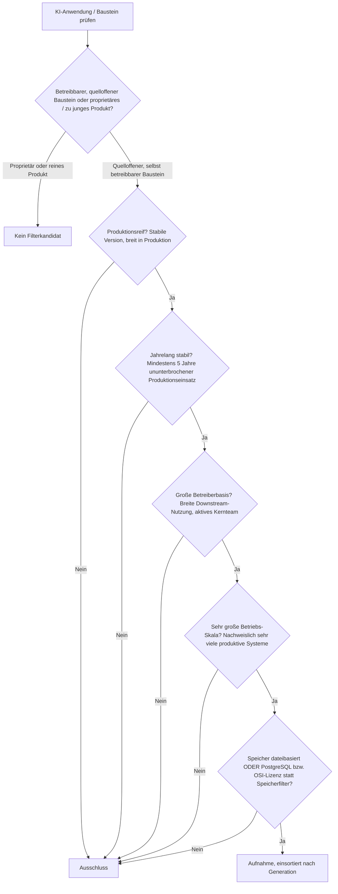
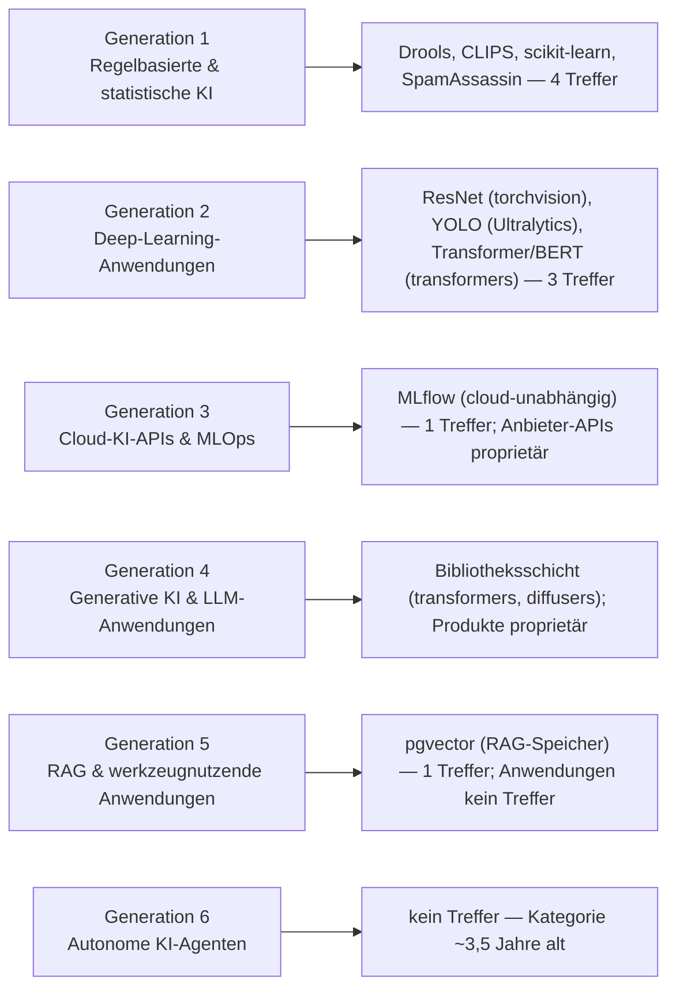
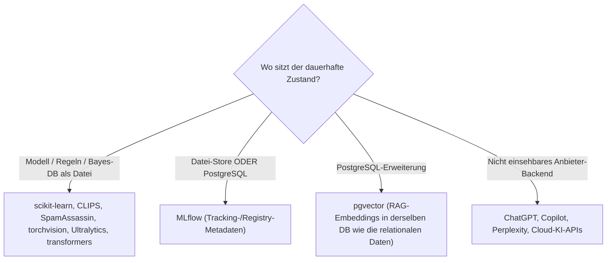

# Produktionsreife KI-Anwendungen nach Generation — Reifegrad, Lizenz & Betriebs-Skala (Top 9 — die Regel-Engines, ML-Referenzbibliotheken und Infrastruktur bestehen, die Anwendungen der KI-Ära nicht)

Die [Evolution und Architekturen digitaler KI-Anwendungen](evolution-digitaler-ki-anwendungen.md) bündelt sechs Generationen: regelbasierte & statistische KI (1), aufgabenspezifische Deep-Learning-Anwendungen (2), Cloud-KI-APIs & ML-as-a-Service (3), generative KI & LLM-gestützte Anwendungen (4), RAG & werkzeugnutzende Anwendungen (5), autonome KI-Agenten & Multi-Agenten-Ökosysteme (6). Die [Topliste bester KI-Anwendungen 2026](ki-anwendungen-2026-topliste.md) rankt den gesamten Cluster. Diese Seite ist die **Dach-Seite** über die sechs Generationen-Deep-Dives der Familie — sie legt das **konservative** Fünf-Filter-Sieb an (produktionsreif · jahrelang stabil · große Betreiberbasis · sehr große Betriebs-Skala · Speicher dateibasiert oder PostgreSQL) und fasst zusammen, was in jeder Generation besteht.

!!! warning "Achtung: Die Infrastruktur ist reif, die Anwendungen der KI-Ära sind es nicht"
    Über sechs Generationen hinweg wiederholt sich dasselbe Muster wie bei den [Deep-Learning-Anwendungen](produktionsreife-deep-learning-anwendungen-generationen-2026-topliste.md) und den [semantischen & RAG-Wissenssystemen](../wissen/dokumentation/produktionsreife-semantische-rag-wissenssysteme-generationen-2026-topliste.md): Die produktiven, quelloffenen, jahrzehntelang stabilen Bausteine liegen in **Generation 1–2** — Regel-Engines (Drools, CLIPS), die Referenzbibliotheken des statistischen ML (scikit-learn) und des Deep Learning (torchvision, Ultralytics, Hugging Face `transformers`), plus die kanonische ausgelieferte ML-Anwendung SpamAssassin. Die **Infrastruktur-Schicht** der Generationen 3 und 5 besteht ebenfalls: **MLflow** (MLOps) und **pgvector** (RAG-Speicher). Was **nicht** besteht, sind die eigentlichen „KI-Anwendungen" der Generationen 4–6: **ChatGPT, GitHub Copilot, Midjourney, Perplexity, AutoGPT, Claude Code** sind proprietär oder mit ~2–4 Jahren zu jung. Neun Treffer — alle Baustein oder Infrastruktur, keiner ein Endprodukt der aktuellen Welle.

---

## Die fünf harten Filter

!!! note "Hinweis: Dies ist die Dach-Seite — jede Generation hat einen eigenen Deep-Dive"
    Für die vollständige Filter-Begründung je Architekturlinie siehe die verlinkten Sub-Seiten: [Expertensysteme](produktionsreife-expertensysteme-generationen-2026-topliste.md) (Gen 1), [Deep-Learning-Anwendungen](produktionsreife-deep-learning-anwendungen-generationen-2026-topliste.md) (Gen 2), [Cloud-KI-APIs](produktionsreife-cloud-ki-apis-generationen-2026-topliste.md) (Gen 3), [RAG- & Werkzeug-Anwendungen](produktionsreife-rag-werkzeug-anwendungen-generationen-2026-topliste.md) (Gen 5), [autonome KI-Agenten](produktionsreife-autonome-ki-agenten-generationen-2026-topliste.md) (Gen 6). Für Gen 1c (statistisches ML) und Gen 4 (generative KI) gibt es noch keinen eigenen Deep-Dive — sie werden hier direkt behandelt.

---

## Ergebnis: neun Bausteine über sechs Generationen

---

## Bausteine nach Generation

### Generation 1 — Regelbasierte & statistische KI (bis ca. 2010)

| # | Baustein | Speicher | Lizenz | Seit | Rolle |
|---|---|---|---|---|---|
| 1 | **[Drools](produktionsreife-expertensysteme-generationen-2026-topliste.md)** | Regeln als Dateien, Geschäftsdaten in PostgreSQL des Host-Systems | Apache-2.0 | ~2001 | Meistgenutzte quelloffene Regel-Engine, Rete-basiert, produktiv in Kredit-/Versicherungsentscheidungen |
| 2 | **[CLIPS](produktionsreife-expertensysteme-generationen-2026-topliste.md)** | `.clp`-Textformat, Fakten im Speicher | gemeinfrei (NASA) | 1985 | Referenz-Regel-Engine, vier Jahrzehnte lückenlose Pflege |
| 3 | **scikit-learn** | Modelle als Dateien (`joblib`/Pickle) | BSD-3-Clause | 2010 | Standard-Referenzbibliothek des klassischen ML — SVM, Entscheidungsbäume, Naive Bayes, Clustering; unter praktisch jeder produktiven Pipeline mit tabellarischen Daten |
| 4 | **SpamAssassin** | Bayes-Datenbank dateibasiert (Berkeley DB), optional SQL | Apache-2.0 | 2001 | Die kanonische ausgelieferte statistische-ML-Anwendung — Bayes'sche Spam-Klassifikation auf einer sehr großen Zahl produktiver Mailserver |

Die Gründergeneration liefert vier saubere Treffer — mehr als jede spätere Generation. **Drools** und **CLIPS** tragen die Expertensystem-Kernarchitektur (Details auf der [Expertensysteme-Deep-Dive-Seite](produktionsreife-expertensysteme-generationen-2026-topliste.md)), **scikit-learn** ist für das statistische ML, was Hugging Face `transformers` für die Transformer-Ära ist, und **SpamAssassin** ist der lebende Beweis, dass Generation 1c produktiv nie aufgehört hat. Die historischen Systeme (MYCIN, DENDRAL, Netflix-Algorithmus, Deep Blue) sind Konzeptgeschichte, kein betreibbarer Code.

### Generation 2 — Deep-Learning-Anwendungen (ca. 2012 – 2018)

Drei Architektur-Bausteine bestehen über ihre quelloffenen Referenzimplementierungen — **ResNet** (torchvision/`timm`), **YOLO** (Ultralytics, AGPL-3.0) und **Transformer/BERT** (Hugging Face `transformers`, Apache-2.0). Vollständige Begründung auf der [Deep-Learning-Deep-Dive-Seite](produktionsreife-deep-learning-anwendungen-generationen-2026-topliste.md). Die Anwendungen der Generation — Siri, Alexa, Google Neural Machine Translation — sind proprietär bzw. abgelöst.

### Generation 3 — Cloud-KI-APIs & MLOps (ca. 2015 – 2020)

Ein Treffer: **MLflow** (Apache-2.0, seit 2018), die cloud-unabhängige MLOps-Schicht mit Datei- oder PostgreSQL-Backend. Die verwalteten Anbieter-Dienste (Google Cloud Vision, AWS Rekognition, Azure Cognitive Services, IBM Watson, SageMaker, Vertex AI) sind per Geschäftsmodell proprietär — Details auf der [Cloud-KI-APIs-Deep-Dive-Seite](produktionsreife-cloud-ki-apis-generationen-2026-topliste.md).

### Generation 4 — Generative KI & LLM-gestützte Anwendungen (ab ca. 2020)

Kein eigenständiger Anwendungs-Treffer. Die Produkte — **ChatGPT**, **GitHub Copilot**, **Midjourney**, **Stable Diffusion** als gehosteter Dienst — sind proprietär; **Stable Diffusions** Gewichte stehen unter der CreativeML-OpenRAIL-M-Lizenz (Nutzungsbeschränkungen, nicht OSI-anerkannt — dieselbe Konstellation wie StyleGAN auf der [Deep-Learning-Seite](produktionsreife-deep-learning-anwendungen-generationen-2026-topliste.md)). Was besteht, ist die **Bibliotheksschicht**: Hugging Face `transformers` (Apache-2.0, 2019, bereits als Generation-2-Treffer gezählt) und `diffusers` (Apache-2.0, 2022, ~4 Jahre — Grenzfall an der Reifezeit). Ein eigener Deep-Dive für diese Generation steht noch aus.

### Generation 5 — RAG & werkzeugnutzende Anwendungen (ab ca. 2023)

Ein Treffer, und der liegt in der Infrastruktur: **pgvector** (PostgreSQL-Erweiterung, seit 2021), der Vektor-Speicher für Retrieval-Augmented Generation ohne separaten Vektordienst. Die Anwendungen selbst (Perplexity, Custom GPTs, AnythingLLM, Onyx) sind proprietär oder von 2023 — Details auf der [RAG-Deep-Dive-Seite](produktionsreife-rag-werkzeug-anwendungen-generationen-2026-topliste.md).

### Generation 6 — Autonome KI-Agenten (ab ca. 2024)

Kein Treffer. Die Kategorie beginnt mit AutoGPT im März 2023 und ist rund dreieinhalb Jahre alt; die prominente Riege (Devin, Operator, Manus) ist proprietär, die quelloffenen Frameworks (LangGraph, CrewAI, AutoGen) sind von 2023/24. Vollständige Begründung auf der [Autonome-KI-Agenten-Deep-Dive-Seite](produktionsreife-autonome-ki-agenten-generationen-2026-topliste.md).

---

## Dateibasiert oder PostgreSQL?

Die Treffer teilen sich sauber in dateibasierte Bausteine und die PostgreSQL-Infrastruktur:

- Die Modell- und Regel-Bausteine sind Dateien (`.safetensors`, `.joblib`, `.drl`, `.clp`) — die Anwendung darüber hält ihren Zustand relational.
- Die einzige Infrastruktur, die den Speicherfilter aktiv besteht statt ihn leerlaufen zu lassen, ist **MLflow** (PostgreSQL-Tracking-Backend) und **pgvector** (Embeddings in PostgreSQL) — beides ohne Pflicht-Zweitsystem.

Vertiefung: [PostgreSQL DBA Praxis-Handbuch](../entwicklung/infrastruktur/postgresql-dba-praxis.md) · [PostgreSQL + pgvector](../wissen/daten/datenbanken/pgvector-anleitung.md).

!!! warning "Achtung: Momentaufnahme, Stand August 2026"
    Die drei jüngsten Generationen verändern sich im Monatsrhythmus. Ein Anwendungs-Treffer in Generation 4–6 entsteht frühestens, wenn ein quelloffenes Produkt (ein Inferenzserver, ein Agenten-Framework, ein RAG-System) fünf Jahre Produktion mit breiter Selbstbetrieb-Basis erreicht — realistisch nicht vor 2028/2029.

---

## Was bewusst nicht auf dieser Liste steht

| System(e) | Erfüllt nicht | Anmerkung |
|---|---|---|
| **ChatGPT, GitHub Copilot, Midjourney, Perplexity, Claude Code** | Lizenzfilter | Proprietäre Endprodukte der Generationen 4–6 |
| **Stable Diffusion** (Gewichte) | Lizenzfilter | CreativeML OpenRAIL-M mit Nutzungsbeschränkungen — nicht OSI-anerkannt |
| **OpenAI/Anthropic/Google-APIs, Cloud-Vision-/Sprach-APIs** | Selbstbetrieb / Lizenz | Verwaltete Dienste, siehe [Cloud-KI-APIs-Seite](produktionsreife-cloud-ki-apis-generationen-2026-topliste.md) |
| **AutoGPT, LangGraph, CrewAI, AutoGen** | Reifezeit | Quelloffene Agenten-Bausteine, alle 2023/24 |
| **AnythingLLM, Onyx, Perplexity** | Reifezeit / Lizenz | RAG-Anwendungen, alle 2023 bzw. proprietär |
| **`diffusers`** | Reifezeit | Apache-2.0, seit 2022 (~4 Jahre) — Grenzfall |
| **MYCIN, DENDRAL, Netflix-Algorithmus, Deep Blue, AlexNet** | Kategorie / Kontinuität | Historische Meilensteine ohne betreibbare, gepflegte Codebasis |

---

## 🔗 Verwandte Themen

- [Evolution und Architekturen digitaler KI-Anwendungen](evolution-digitaler-ki-anwendungen.md) — das sechsstufige Generationenmodell, nach dem diese Dach-Seite sortiert ist
- [Beste KI-Anwendungen 2026 (Top 20)](ki-anwendungen-2026-topliste.md) — breiteste Basis-Topliste über alle sechs Generationen, inklusive proprietärer Produkte
- [Produktionsreife Expertensysteme & Regel-Engines nach Generation (Top 2)](produktionsreife-expertensysteme-generationen-2026-topliste.md) — Deep-Dive Generation 1
- [Produktionsreife Deep-Learning-Anwendungen nach Generation (Top 3)](produktionsreife-deep-learning-anwendungen-generationen-2026-topliste.md) — Deep-Dive Generation 2
- [Produktionsreife Cloud-KI-APIs nach Generation (Top 1)](produktionsreife-cloud-ki-apis-generationen-2026-topliste.md) — Deep-Dive Generation 3
- [Produktionsreife RAG- & Werkzeug-Anwendungen nach Generation](produktionsreife-rag-werkzeug-anwendungen-generationen-2026-topliste.md) — Deep-Dive Generation 5
- [Produktionsreife autonome KI-Agenten nach Generation (kein Treffer)](produktionsreife-autonome-ki-agenten-generationen-2026-topliste.md) — Deep-Dive Generation 6
- [Produktionsreife Rust-Bausteine für KI-Anwendungen nach Generation (Top 1)](produktionsreife-rust-ki-anwendungen-generationen-2026-topliste.md) — die quer liegende Rust-Implementierungsachse
- [Produktionsreife KI-Evaluationswerkzeuge nach Generation (Top 1)](produktionsreife-ki-evaluation-generationen-2026-topliste.md) · [Produktionsreife KI-Modell-Generatoren nach Generation (kein Treffer)](produktionsreife-ki-modell-generatoren-generationen-2026-topliste.md) — die beiden quer liegenden Werkzeug- bzw. Architektur-Achsen
- [Produktionsreife semantische & RAG-Wissenssysteme nach Generation (Top 7)](../wissen/dokumentation/produktionsreife-semantische-rag-wissenssysteme-generationen-2026-topliste.md) — dieselbe „Infrastruktur reif, Anwendungen nicht"-Struktur
- [PostgreSQL DBA Praxis-Handbuch](../entwicklung/infrastruktur/postgresql-dba-praxis.md) · [PostgreSQL + pgvector](../wissen/daten/datenbanken/pgvector-anleitung.md) — die Datenbankschicht der Infrastruktur-Treffer
