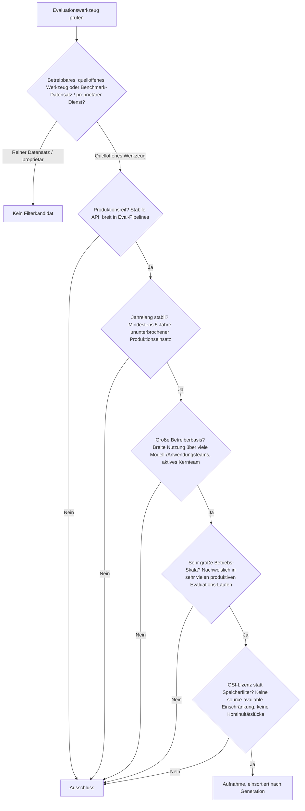
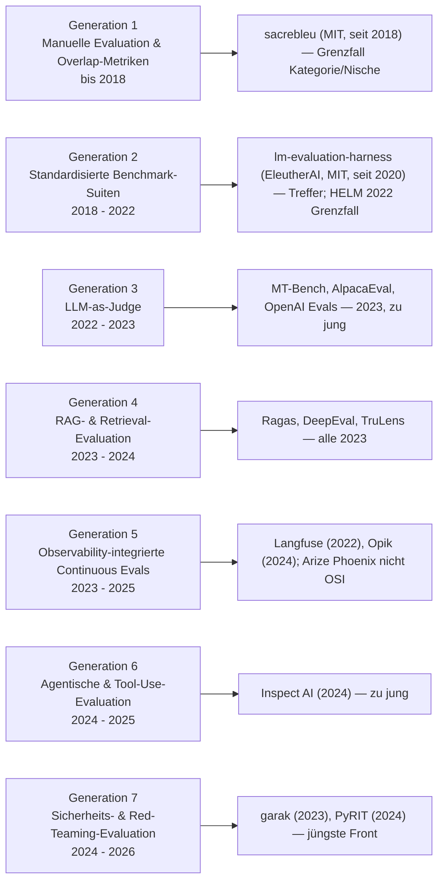
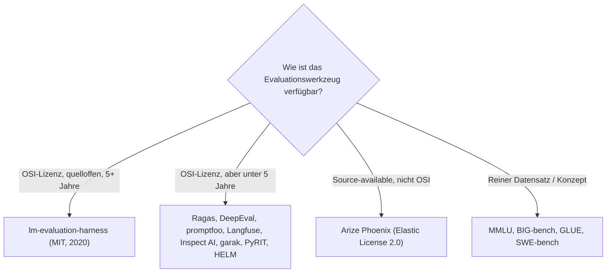

# Produktionsreife KI-Evaluationswerkzeuge nach Generation — Reifegrad, Lizenz & Betriebs-Skala (Top 1 — nur das Benchmark-Harness von EleutherAI)

Die [Evolution und Architekturen digitaler KI-Evaluationswerkzeuge](evolution-digitaler-ki-evaluation.md) ordnet die Mess-Werkzeuglinie chronologisch in sieben Generationen: manuelle Evaluation & Overlap-Metriken (1), standardisierte Benchmark-Suiten (2), LLM-as-Judge (3), RAG- & Retrieval-Evaluation (4), observability-integrierte Continuous Evals (5), agentische & Tool-Use-Evaluation (6), Sicherheits- & Red-Teaming-Evaluation (7). Die [Topliste bester KI-Evaluationswerkzeuge 2026](ki-evaluation-2026-topliste.md) rankt die gesamte Kategorie. Diese Seite legt das **konservative** Fünf-Filter-Sieb der Familie an — produktionsreif · jahrelang stabil · große Betreiberbasis · sehr große Betriebs-Skala · Speicher dateibasiert oder PostgreSQL — und sortiert nach Generation.

!!! warning "Achtung: Die Benchmark-Infrastruktur ist reif, die LLM-/RAG-/Agenten-Eval-Werkzeuge sind es nicht"
    Dieselbe „Infrastruktur reif, Werkzeuge nicht"-Struktur wie bei den [Deep-Learning-Anwendungen](produktionsreife-deep-learning-anwendungen-generationen-2026-topliste.md) und der [KI-Anwendungs-Dach-Seite](produktionsreife-ki-anwendungen-generationen-2026-topliste.md): Der eine Treffer ist das **lm-evaluation-harness** von EleutherAI (MIT, seit 2020) — der De-facto-Standard, mit dem klassische Benchmark-Suiten (MMLU, BIG-bench, HellaSwag) gefahren werden, unter anderem als Motor des Hugging Face Open LLM Leaderboard. Alles, was die eigentlich moderne LLM-Bewertung ausmacht — **Ragas, DeepEval, promptfoo** (Gen 4), **Langfuse, Opik** (Gen 5), **Inspect AI** (Gen 6), **garak, PyRIT** (Gen 7) — ist von 2022–2024 und reißt die Fünf-Jahres-Marke. **Arize Phoenix** fällt zusätzlich an der Lizenz (Elastic License 2.0, nicht OSI). Der Speicherfilter läuft für Eval-Werkzeuge leer („Testfall rein, Score raus") und wird durch **OSI-Lizenz + Kontinuität** ersetzt.

---

## Die fünf harten Filter

!!! note "Hinweis: Benchmark-Datensatz ≠ Evaluationswerkzeug"
    MMLU, BIG-bench, GLUE oder SWE-bench sind **Datensätze** — Testfragen mit erwarteten Antworten, kein betreibbares Werkzeug. Zählbar ist nur die quelloffene Software, die solche Datensätze ausführt, auswertet und reproduzierbar macht. Overlap-Metriken wie BLEU/ROUGE zählen über ihre Referenzimplementierung (sacrebleu), nicht als Konzept.

---

## Ergebnis: ein Treffer über sieben Generationen

---

## Systeme nach Generation

### Generation 2 — Standardisierte Benchmark-Suiten (2018 – 2022)

| # | Werkzeug | Speicher | Lizenz | Seit | Skala-Nachweis |
|---|---|---|---|---|---|
| 1 | **lm-evaluation-harness** (EleutherAI) | Ergebnisse als JSON-/Log-Dateien | MIT | 2020 | Standard-Harness für klassische LLM-Benchmarks — Motor des Hugging Face Open LLM Leaderboard, in praktisch jedem Modell-Trainingslauf großer Labore zur Regressionsmessung eingesetzt |

**Das lm-evaluation-harness** ist der einzige Treffer: seit 2020 die quelloffene Referenz, um ein Sprachmodell reproduzierbar gegen hunderte standardisierte Aufgaben laufen zu lassen (MMLU, HellaSwag, ARC, TruthfulQA, BIG-bench-Teilmengen). MIT-lizenziert, dateibasiert, in gigantischer Skala — jedes größere Modell-Release nennt Zahlen, die mit diesem Harness erzeugt wurden. **HELM** (Stanford CRFM, Apache-2.0) ist die zweite Referenzsuite derselben Generation, aber erst von 2022 (~4 Jahre) — Grenzfall an der Reifezeit.

### Generation 1 & 3 – 7 — warum hier nichts steht

- **Generation 1 (manuelle Evaluation & Overlap-Metriken)**: Menschliche Begutachtung ist kein Werkzeug. **BLEU** und **ROUGE** bestehen über ihre Referenzimplementierung **sacrebleu** (Matt Post, MIT, seit 2018) — der Standard jeder Übersetzungs-Evaluation seit acht Jahren, aber eine schmale Metrik-Bibliothek in der Nische maschinelle Übersetzung, nicht ein Werkzeug für die breite „KI-Evaluation" dieser Zeitachse: Grenzfall an Kategorie und Skala.
- **Generation 3 (LLM-as-Judge)**: **MT-Bench**, **AlpacaEval** und **OpenAI Evals** stammen alle aus 2023; OpenAI Evals hat seither zudem an Entwicklungstempo verloren.
- **Generation 4 (RAG-Evaluation)**: **Ragas**, **DeepEval**, **TruLens**, **promptfoo** sind der 2026er Einstiegsstandard für RAG- und Unit-Test-Evaluation — aber alle von 2023, unter fünf Jahre.
- **Generation 5 (Continuous Evals)**: **Langfuse** (2022, MIT-Self-Host-Kern, größte Community der Kategorie) und **Opik** (2024) sind quelloffen, aber ~4 bzw. ~2 Jahre alt. **Arize Phoenix** (2022) fällt zusätzlich an der **Elastic License 2.0** — nicht OSI-anerkannt, dieselbe Handhabung wie Outline und SurrealDB in der Familie.
- **Generation 6 (agentische Evaluation)**: **Inspect AI** (UK AI Safety Institute, MIT) ist das Referenzframework für Agenten-Evals — von 2024.
- **Generation 7 (Sicherheits- & Red-Teaming-Evaluation)**: **garak** (NVIDIA-gesponsert, 2023) und **PyRIT** (Microsoft, 2024) sind die jüngste, am schnellsten wachsende Front — per Definition zu jung für ein Sieb, das fünf Jahre verlangt.

---

## OSI-Lizenz statt Speicherbackend

Ein Evaluationswerkzeug nimmt Testfälle entgegen und gibt Scores aus — es ist keine Datenhaltung. Der Speicherfilter läuft leer; die trennende Achse ist die Lizenz und die Reifezeit:

- Das lm-evaluation-harness schreibt seine Ergebnisse als JSON- und Log-Dateien — dateibasiert, kein Backend.
- Die observability-integrierten Werkzeuge der Generation 5 nutzen typischerweise **PostgreSQL** (Langfuse) oder ClickHouse — sie scheitern hier aber an der Reifezeit, nicht am Speicher.

Vertiefung: [PostgreSQL DBA Praxis-Handbuch](../entwicklung/infrastruktur/postgresql-dba-praxis.md).

!!! warning "Achtung: Momentaufnahme, Stand August 2026"
    Dieses Marktsegment verändert sich sehr schnell. **Langfuse** und **HELM** dürften ~2027 die Fünf-Jahres-Marke erreichen, **Ragas** und **DeepEval** ~2028 — dann wächst diese Liste. Das **lm-evaluation-harness** ist die stabile Konstante.

---

## Was bewusst nicht auf dieser Liste steht

| Werkzeug | Erfüllt nicht | Anmerkung |
|---|---|---|
| **HELM** | Reifezeit | Apache-2.0, Stanford CRFM — aber erst 2022 (~4 Jahre); Grenzfall |
| **Langfuse** | Reifezeit | MIT-Self-Host-Kern, größte Community der Kategorie — aber erst 2022 |
| **Ragas, DeepEval, TruLens, promptfoo, UpTrain** | Reifezeit | OSI-lizenziert und 2026er Standard, aber alle von 2023 |
| **OpenAI Evals** | Reifezeit / Aktivität | MIT, aber 2023 und nachlassendes Entwicklungstempo |
| **Inspect AI, Opik** | Reifezeit | MIT bzw. Apache-2.0, aber 2024 |
| **garak, PyRIT, Giskard** | Reifezeit | Sicherheits-/Testing-Werkzeuge, 2021–2024 — Giskards LLM-Fokus ist jung |
| **sacrebleu** | Kategorie / Skala | MIT, seit 2018 — aber schmale Metrik-Bibliothek in der MT-Nische; Grenzfall |
| **Arize Phoenix** | Lizenzfilter | Elastic License 2.0 — source-available, nicht OSI |
| **MMLU, BIG-bench, GLUE, SWE-bench, HELM-Szenarien** | Kategorie | Benchmark-Datensätze, keine betreibbaren Werkzeuge |

---

## 🔗 Verwandte Themen

- [Evolution und Architekturen digitaler KI-Evaluationswerkzeuge](evolution-digitaler-ki-evaluation.md) — das siebenstufige Generationenmodell, nach dem diese Liste sortiert ist
- [Beste KI-Evaluationswerkzeuge 2026 (Top 15)](ki-evaluation-2026-topliste.md) — breiteste Basis-Topliste inklusive aller jungen und source-available Werkzeuge
- [Produktionsreife KI-Anwendungen nach Generation (Top 9)](produktionsreife-ki-anwendungen-generationen-2026-topliste.md) — die übergeordnete Dach-Seite; dieselbe „Infrastruktur reif, Anwendungen nicht"-Struktur
- [Produktionsreife Deep-Learning-Anwendungen nach Generation (Top 3)](produktionsreife-deep-learning-anwendungen-generationen-2026-topliste.md) — die Bausteine, deren Benchmarks das lm-evaluation-harness fährt
- [Produktionsreife autonome KI-Agenten nach Generation (kein Treffer)](produktionsreife-autonome-ki-agenten-generationen-2026-topliste.md) — die Produktebene, deren Handlungssequenzen Generation 6 dieser Zeitachse bewertet
- [Beste Software 2026: Wissenssysteme, Evaluation & Generatoren](../wissen/dokumentation/beste-software-wissenssysteme-evaluation-generatoren-2026-topliste.md) — Meta-Topliste, die Evaluation, Generatoren und Wissenssysteme nach denselben Kriterien zusammenführt
- [PostgreSQL DBA Praxis-Handbuch](../entwicklung/infrastruktur/postgresql-dba-praxis.md) — Datenbankschicht der observability-integrierten Eval-Werkzeuge
