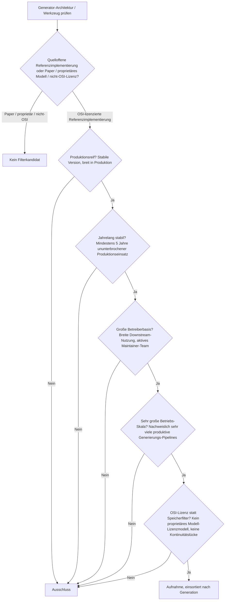
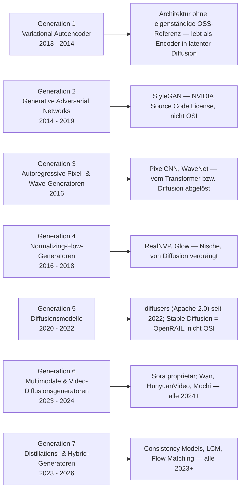
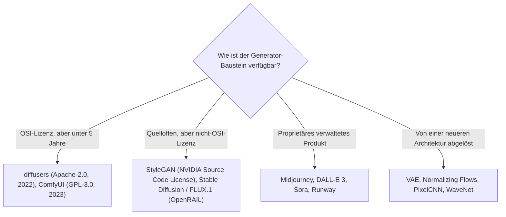

# Produktionsreife KI-Modell-Generatoren nach Generation — Reifegrad, Lizenz & Betriebs-Skala (kein Treffer — StyleGAN ist nicht OSI-lizenziert, die Diffusions-Bibliotheksschicht ist von 2022)

Die [Evolution und Architekturen digitaler KI-Modell-Generatoren](evolution-digitaler-ki-modell-generatoren.md) ordnet die Generator-Architekturlinie chronologisch in sieben Generationen: Variational Autoencoder (1), Generative Adversarial Networks (2), autoregressive Pixel- & Wave-Generatoren (3), Normalizing-Flow-Generatoren (4), Diffusionsmodelle (5), multimodale & Video-Diffusionsgeneratoren (6), Distillations- & Hybrid-Generatoren (7). Die [Topliste bester KI-Modell-Generatoren 2026](ki-modell-generatoren-2026-topliste.md) rankt die gesamte Kategorie nach architektonischer Bedeutung. Diese Seite legt das **konservative** Fünf-Filter-Sieb der Familie an — produktionsreif · jahrelang stabil · große Betreiberbasis · sehr große Betriebs-Skala · Speicher dateibasiert oder PostgreSQL — und sortiert nach Generation.

!!! warning "Achtung: Kein Treffer — genau dieselbe Konstellation wie bei den Deep-Learning-GANs, nur drei Jahre jünger"
    Auf der [Deep-Learning-Seite](produktionsreife-deep-learning-anwendungen-generationen-2026-topliste.md) bestehen **ResNet**, **YOLO** und **Transformer/BERT** über ihre quelloffenen Referenzimplementierungen (torchvision, Ultralytics, Hugging Face `transformers`) — weil diese Bibliotheken von 2015–2019 stammen. Die Generator-Zeitachse hat kein Gegenstück, das die Fünf-Jahres-Marke erreicht: Die **GAN-Referenz StyleGAN** steht unter der **NVIDIA Source Code License** (nicht OSI-anerkannt — derselbe Ausschlussgrund wie dort). **VAE**, **Normalizing Flows** und **autoregressive Pixel-Generatoren** sind Architekturen ohne eigenständige, großskalige OSS-Referenz — sie leben als Bausteine in anderen Bibliotheken weiter. Und die **Diffusions-Bibliotheksschicht** — Hugging Face `diffusers`, `ComfyUI` — ist von 2022/2023 und damit unter fünf Jahre. Die konkreten offenen Modelle (**Stable Diffusion**, **FLUX.1**) stehen unter Modell-Lizenzen mit Nutzungsbeschränkungen (CreativeML OpenRAIL-M), nicht unter OSI-Lizenzen. Der Speicherfilter läuft für Modell-Architekturen leer (Gewichte sind Dateien) und wird durch **OSI-Lizenz + Kontinuität** ersetzt.

---

## Die fünf harten Filter

!!! note "Hinweis: Architektur, Modell-Checkpoint und Werkzeug sind drei verschiedene Dinge"
    Eine Architektur wie das Diffusionsmodell ist ein Entwurf. Ein Checkpoint wie Stable Diffusion 3.5 ist ein trainiertes Gewicht unter einer eigenen Modell-Lizenz. Ein Werkzeug wie `diffusers` oder ComfyUI ist die Software, die Checkpoints ausführt. Zählbar für dieses Sieb wäre nur eine OSI-lizenzierte, fünf Jahre alte, großskalig genutzte Referenz-Software oder -Bauweise — und die gibt es in dieser Zeitachse 2026 nicht.

---

## Ergebnis: kein Treffer über sieben Generationen

---

## Warum keine Generation einen Treffer liefert

- **Generation 1 (VAE)**: Der Variational Autoencoder ist eine **Architektur**, keine gepflegte Referenz-Software. Sein Encoder-Latentraum-Decoder-Prinzip lebt als Baustein in praktisch jedem latenten Diffusionsmodell weiter (der „VAE" in Stable Diffusion), hat aber keine eigenständige, großskalig genutzte OSS-Bibliothek.
- **Generation 2 (GANs)**: **StyleGAN** (und StyleGAN2/3) ist die Referenzarchitektur für hochauflösende Bildsynthese und weiterhin produktiv — der Code steht aber unter der **NVIDIA Source Code License**, die kommerzielle Nutzung einschränkt und nicht OSI-anerkannt ist. Exakt derselbe Ausschlussgrund wie auf der [Deep-Learning-Seite](produktionsreife-deep-learning-anwendungen-generationen-2026-topliste.md). Vanilla GAN und DCGAN sind Papers.
- **Generation 3 (autoregressive Pixel-/Wave-Generatoren)**: **PixelRNN/PixelCNN** wurde von Transformer-basierten Bild-Token-Modellen abgelöst, **WaveNet** von schnelleren neuronalen Vocodern — historisch prägend, 2026 kein produktiv gewählter Generator-Baustein.
- **Generation 4 (Normalizing Flows)**: **RealNVP** und **Glow** sind Nischenarchitekturen mit exakter Likelihood-Berechnung, in der Praxis von den qualitativ überlegenen Diffusionsmodellen verdrängt.
- **Generation 5 (Diffusionsmodelle)**: **DDPM** ist ein Paper. **Stable Diffusion** (2022) machte Diffusion auf Consumer-Hardware praktikabel, die Gewichte stehen aber unter der **CreativeML OpenRAIL-M**-Lizenz mit Nutzungsbeschränkungen (nicht OSI). Die Werkzeugschicht — **Hugging Face `diffusers`** (Apache-2.0) und **ComfyUI** (GPL-3.0) — ist mit ~4 bzw. ~3 Jahren die aussichtsreichste Kandidatin für einen künftigen Treffer, aber noch unter fünf Jahre.
- **Generation 6 (Video-Diffusion)**: **Sora**, **Runway Gen-4** proprietär; die offenen Video-Modelle (**Wan**, **HunyuanVideo**, **Mochi**, **LTX-Video**) sind alle von 2024+ — dieselbe Einordnung wie auf der noch offenen KI-Videogenerierungs-Achse.
- **Generation 7 (Distillation & Hybrid)**: **Consistency Models**, **Latent Consistency Models**, **Flow Matching / Rectified Flow**, **FLUX.1** — die gesamte Generation ist 2023–2026 entstanden.

---

## OSI-Lizenz statt Speicherbackend

Modell-Gewichte sind Dateien — der Speicherfilter läuft leer. Die trennende Achse ist die Lizenz der Referenz und deren Reifezeit:

- Der Speicherfilter greift nicht: Ein trainiertes Generator-Modell wird als Datei (`.safetensors`, `.ckpt`) ausgeliefert; die Anwendung darüber hält ihren Zustand relational.
- Die ersetzende Lizenz-/Kontinuitäts-Achse siebt vollständig: nicht-OSI-Modell-Lizenzen (StyleGAN, OpenRAIL), proprietäre Produkte, abgelöste Architekturen — und die eine verbleibende OSI-Werkzeugschicht (`diffusers`) ist zu jung.

Vertiefung zur Datenbankschicht der Generierungs-Anwendung: [PostgreSQL DBA Praxis-Handbuch](../entwicklung/infrastruktur/postgresql-dba-praxis.md).

!!! warning "Achtung: Momentaufnahme, Stand August 2026"
    Erreicht **Hugging Face `diffusers`** 2027 die Fünf-Jahres-Marke, bekommt diese Seite ihren ersten Treffer — in Generation 5, als Werkzeugschicht, analog zu `transformers` auf der Deep-Learning-Seite. Eine OSI-lizenzierte GAN- oder VAE-Referenz mit großer Betreiberbasis ist dagegen nicht in Sicht.

---

## Was bewusst nicht auf dieser Liste steht

| System | Erfüllt nicht | Anmerkung |
|---|---|---|
| **StyleGAN / StyleGAN2 / StyleGAN3** | Lizenzfilter | NVIDIA Source Code License — nicht OSI-anerkannt |
| **Stable Diffusion, FLUX.1** | Lizenzfilter | Modell-Lizenzen mit Nutzungsbeschränkungen (CreativeML OpenRAIL-M) |
| **Midjourney, DALL-E 3, Sora, Runway Gen-4** | Lizenzfilter | Proprietäre, verwaltete Generierungs-Dienste |
| **Hugging Face `diffusers`** | Reifezeit | Apache-2.0, die aussichtsreichste Kandidatin — aber erst 2022 (~4 Jahre) |
| **ComfyUI** | Reifezeit | GPL-3.0, sehr breite Nutzung — aber erst 2023 |
| **Consistency Models, LCM, Flow Matching, Wan, HunyuanVideo** | Reifezeit | Generation 6–7, alle 2023–2026 |
| **VAE, RealNVP, Glow, PixelCNN, WaveNet** | Kategorie / Kontinuität | Architekturen ohne eigenständige OSS-Referenz bzw. von neueren Verfahren abgelöst |
| **DDPM, GAN-Grundlagenpapier** | Kategorie | Papers, keine betreibbaren Bausteine |

---

## 🔗 Verwandte Themen

- [Evolution und Architekturen digitaler KI-Modell-Generatoren](evolution-digitaler-ki-modell-generatoren.md) — das siebenstufige Architekturmodell, nach dem diese Liste sortiert ist
- [Beste KI-Modell-Generatoren 2026 (Top 15)](ki-modell-generatoren-2026-topliste.md) — breiteste Basis-Topliste inklusive proprietärer Modelle und Modell-Checkpoints
- [Produktionsreife Deep-Learning-Anwendungen nach Generation (Top 3)](produktionsreife-deep-learning-anwendungen-generationen-2026-topliste.md) — dieselbe Architektur-Zeitachsen-Logik; dort bestehen die Referenzimplementierungen, weil sie älter sind
- [Produktionsreife KI-Anwendungen nach Generation (Top 9)](produktionsreife-ki-anwendungen-generationen-2026-topliste.md) — die übergeordnete Dach-Seite; die generative Bibliotheksschicht (`transformers`, `diffusers`) wird dort in Generation 4 behandelt
- [Produktionsreife Rust-Bausteine für KI-Anwendungen nach Generation (Top 1)](produktionsreife-rust-ki-anwendungen-generationen-2026-topliste.md) — dieselbe „der einzige quelloffene Baustein ist zu jung"-Struktur
- [Multimodale Vision-Pipelines](coding/multimodale-vision-pipelines.md) — praktischer Einsatz von Diffusions- und Video-Generatoren
- [PostgreSQL DBA Praxis-Handbuch](../entwicklung/infrastruktur/postgresql-dba-praxis.md) — Datenbankschicht der Generierungs-Anwendung über den Modell-Bausteinen
