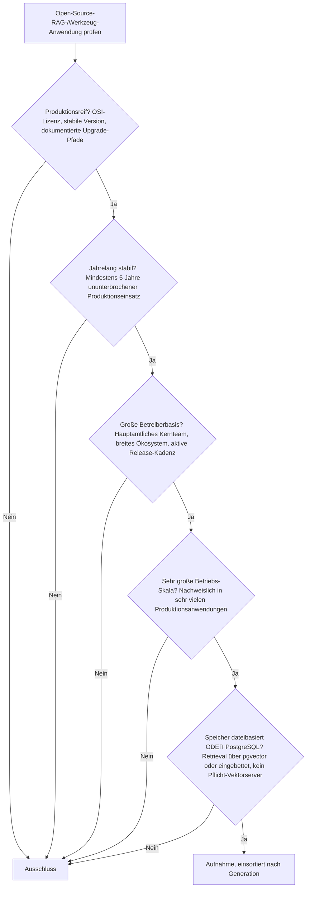
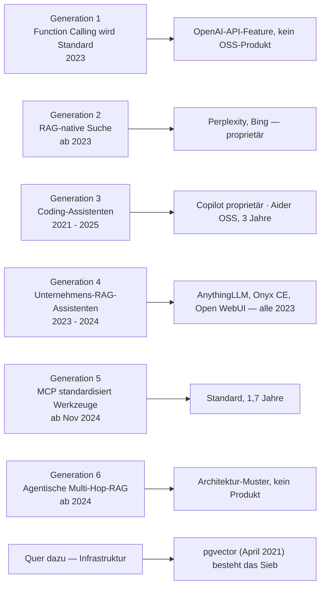

# Produktionsreife Open-Source-RAG- & Werkzeug-Anwendungen nach Generation — Reifegrad, Evaluation & Betriebs-Skala (noch kein Treffer)

Die [Evolution und Architekturen digitaler RAG- & Werkzeug-Anwendungen](evolution-digitaler-rag-werkzeug-anwendungen.md) ordnet die **Anwendungsseite** von Retrieval und Tool-Calling chronologisch in sechs Generationen — sie ist Generation 5 der [Evolution digitaler KI-Anwendungen](evolution-digitaler-ki-anwendungen.md). Die [Topliste bester RAG- & Werkzeug-Anwendungen 2026](rag-werkzeug-anwendungen-2026-topliste.md) rankt die Kategorie. Diese Seite legt — parallel zu den [autonomen KI-Agenten](produktionsreife-autonome-ki-agenten-generationen-2026-topliste.md), den [KI-nativen Web-Frameworks](../entwicklung/webentwicklung/produktionsreife-ki-native-webframeworks-generationen-2026-topliste.md) und den Schwesterseiten für [Wissenssysteme](../wissen/dokumentation/produktionsreife-wissenssysteme-generationen-2026-topliste.md), [CMS](../wissen/dokumentation/produktionsreife-cms-generationen-2026-topliste.md) und [LMS](../wissen/e-learning/produktionsreife-lms-generationen-2026-topliste.md) — dasselbe bewusst **konservative** Fünf-Filter-Sieb an: produktionsreif · jahrelang stabil · große Betreiberbasis · sehr große Betriebs-Skala · Speicher dateibasiert oder PostgreSQL. Sortiert nach Generation.

!!! warning "Achtung: Kein Treffer bei den Anwendungen — aber die Ebene darunter ist reif"
    Die OSS-RAG-**Anwendungen** — AnythingLLM, Onyx CE, Open WebUI, Aider — sind allesamt 2023 entstanden und damit unter der Fünf-Jahres-Marke; die älteren Produkte (GitHub Copilot, Perplexity) sind proprietär; die Generationen 1, 5 und 6 sind Muster und Standards, keine Produkte. Anders die **Infrastruktur**: **pgvector** (April 2021) besteht das Sieb, ebenso die RAG-Pipeline-Mechanik selbst. Genau deshalb ist hier die [Speicherfrage](#dateibasiert-oder-postgresql-pgvector-ist-die-antwort) die eigentliche Entscheidung — pgvector hält Retrieval in PostgreSQL, statt Qdrant, Weaviate oder Milvus als Pflicht-Zweitsystem danebenzustellen.

---

## Die fünf harten Filter

!!! note "Hinweis: Anwendung, Muster, Standard und Infrastruktur sind vier verschiedene Dinge"
    Die [Basis-Topliste](rag-werkzeug-anwendungen-2026-topliste.md) mischt Kategorien:

    - **Anwendungen** — Perplexity, AnythingLLM, Onyx, Open WebUI, die Coding-Assistenten: laufende Produkte.
    - **Muster** — ReAct, agentische Multi-Hop-RAG: Architektur-Bauformen, kein Code.
    - **Standards & API-Features** — Function Calling, Structured Outputs, MCP: Schnittstellen.
    - **Infrastruktur** — pgvector, Embeddings, die Pipeline-Mechanik: die Ebene, die dieser Artikel voraussetzt und die [Semantische & RAG-Wissenssysteme](../wissen/dokumentation/evolution-digitaler-semantische-rag-wissenssysteme.md) vertieft.

    Nur die Anwendungen sind Kandidaten für dieses Sieb.

---

## Ergebnis: alle sechs Generationen unter der Reifezeit- oder Lizenzschwelle

---

## Kandidaten nach Generation

### Generation 1 — Function Calling wird Standard (2023)

**OpenAI Function Calling** (Juni 2023), das **ReAct-Pattern** (Reasoning + Acting in einer Schleife) und **Structured Outputs / JSON Mode** sind das Fundament aller folgenden Generationen — aber es sind **API-Features und Architektur-Muster**, keine quelloffenen Produkte. Vertiefung: [Structured Outputs mit Pydantic](coding/structured-outputs-pydantic.md).

### Generation 2 — RAG-native Such- und Recherche-Anwendungen (ab 2023)

**Perplexity AI** und **Bing Chat / Copilot** (Websuche-Modus) sind proprietäre Konsumentenprodukte → Lizenzfilter.

### Generation 3 — KI-Coding-Assistenten mit Werkzeugzugriff (2021 – 2025)

- **GitHub Copilot** (2021) — mit fünf Jahren an der Reifezeit-Marke, aber proprietär.
- **Cursor**, **Windsurf**, **Claude Code** — proprietär.
- **Aider** (2023, Apache-2.0) — das quelloffene Terminal-Werkzeug, das direkt Git-Commits aus KI-Änderungen erzeugt; erst drei Jahre alt → **Grenzfall**.

### Generation 4 — Unternehmensweite RAG-Assistenten & Wissensdatenbank-Chatbots (2023 – 2024)

| System | Lizenz | Seit | Warum (noch) nicht |
|---|---|---|---|
| **[AnythingLLM](../wissen/dokumentation/anythingllm-rag-plattform.md)** | MIT | 2023 | All-in-One für lokale Dokumente in privaten Chat-Kontexten; drei Jahre alt |
| **[Onyx](../wissen/dokumentation/onyx-danswer-rag-plattform.md)** (ehem. Danswer) | MIT (Community Edition) | 2023 | Verbindet Slack, Google Drive, Wikis; Kern unter MIT, drei Jahre alt |
| **[Open WebUI](../wissen/dokumentation/open-webui-rag-agenten-plattform.md)** | BSD-3 mit Branding-Klausel (seit April 2025) | 2023 | LLM-Frontend mit RAG; die Branding-Beschränkung ab 50 Nutzern trübt zusätzlich den Lizenzfilter |

Dies ist die aussichtsreichste Generation für einen künftigen Treffer — **AnythingLLM** oder **Onyx CE** dürften ~2028 die Fünf-Jahres-Marke erreichen.

### Generation 5 — MCP standardisiert den Werkzeugzugriff (ab November 2024)

**MCP** ist der De-facto-Standard für Werkzeugzugriff (rund 41 % der befragten Organisationen im Produktionseinsatz, knapp 10.000 registrierte Server), aber ein **Protokoll, kein Produkt** — und erst 1,7 Jahre alt. Siehe [Beste MCP-Server (Top 20)](coding/mcp-server-topliste.md).

### Generation 6 — Agentische RAG mit mehrstufigem Retrieval (ab 2024)

Selbstkorrigierende Retrieval-Schleifen und Multi-Hop-RAG sind ein **Architektur-Muster**, keine eigenständige Software — die technische Grundlage liefert [GraphRAG](../wissen/dokumentation/evolution-digitaler-semantische-rag-wissenssysteme.md), die praktische Umsetzung das [AI Agents Praxis-Handbuch](coding/ai-agents-praxis.md).

### Quer zu den Generationen — die reife Infrastruktur

| Baustein | Reife |
|---|---|
| **pgvector** | Erste Version April 2021, aktuell 0.8.x; PostgreSQL-Erweiterung, deren Releases die PostgreSQL Global Development Group ankündigt — **besteht das Fünf-Filter-Sieb** |
| **Volltextsuche** (`tsvector`, GIN) | Teil von PostgreSQL seit Jahrzehnten |
| **Das RAG-Muster selbst** | Ursprungspapier 2020 |

Die Anwendungen sind jung — das Fundament, auf dem sie stehen, ist es nicht.

---

## Der pragmatische Weg: reife Anwendung auf reifer Infrastruktur

| Aufgabe | Belastbarer Weg heute |
|---|---|
| Unternehmensinterne Wissensbasis | **Onyx CE** oder **AnythingLLM** — die reifsten OSS-Vertreter, auf **pgvector** |
| LLM-Frontend mit RAG | **Open WebUI** — Lizenzbedingungen vor dem Rollout prüfen |
| Coding-Assistent im Terminal | **Aider** (OSS) statt Cursor/Windsurf |
| Werkzeugzugriff | **MCP** — herstellerübergreifend ([Beste MCP-Server](coding/mcp-server-topliste.md)) |
| Retrieval-Qualität messen | [Beste KI-Evaluationswerkzeuge 2026](ki-evaluation-2026-topliste.md) — Recall, Präzision, Antworttreue |
| Vektor-Speicher | **pgvector** (siehe unten) |

---

## Dateibasiert oder PostgreSQL? — pgvector ist die Antwort

Bei RAG ist der Speicherfilter kein Randthema, sondern die zentrale Architekturentscheidung:

| Ansatz | Einordnung |
|---|---|
| **pgvector** | PostgreSQL-Erweiterung — Embeddings und relationale Daten in **einer** Datenbank: ein Backup, ein Migrationspfad, eine Betriebsdisziplin. Besteht selbst das Sieb (seit April 2021). |
| **Chroma** (eingebettet) | SQLite-gestützt, läuft **dateibasiert** im Prozess — die schlanke Option für kleine Wissensbasen und Edge-Deployments |
| **Qdrant, Weaviate, Milvus** | Dedizierte Vektor-Serversysteme mit eigener Persistenz — genau das **Pflicht-Zweitsystem**, das der Speicherfilter identifiziert: technisch stark, aber Betriebs-, Backup- und Migrationsaufwand eines zweiten Datenbanksystems |
| **Pinecone** | Proprietärer SaaS-Vektordienst → Lizenzfilter |

**Für eine Produktions-RAG-Anwendung, die den Speicherfilter besteht, ist pgvector die Standardantwort.** Eine dedizierte Vektordatenbank lohnt sich erst jenseits vieler Millionen Vektoren mit hohen Query-Raten oder bei speziellen Index-Anforderungen — und dann ist es eine bewusste Entscheidung für ein zweites System, kein Framework-Zwang. Vertiefung: [PostgreSQL + pgvector](../wissen/daten/datenbanken/pgvector-anleitung.md), [PostgreSQL DBA Praxis-Handbuch](../entwicklung/infrastruktur/postgresql-dba-praxis.md).

!!! warning "Achtung: Momentaufnahme, Stand August 2026"
    Die Anwendungsschicht verändert sich im Quartalsrhythmus — Open WebUI hat 2025 die Lizenz verschärft, Onyx und AnythingLLM entwickeln aktiv Enterprise-Tiers. Die Infrastruktur (pgvector) ist die stabile Konstante.

---

## Was bewusst nicht auf dieser Liste steht

| System(e) | Erfüllt nicht | Anmerkung |
|---|---|---|
| **GitHub Copilot, Cursor, Windsurf, Claude Code, Perplexity, Bing Copilot** | Lizenzfilter | Proprietäre Produkte und Dienste |
| **OpenAI Function Calling, Structured Outputs** | keine Produkte | Herstellergebundene API-Features |
| **ReAct, agentische Multi-Hop-RAG** | keine Software | Architektur-Muster |
| **MCP** | Kategorie / Reifezeit | Standard, kein Produkt; 1,7 Jahre alt |
| **Aider** | Reifezeit | OSS, aber erst 2023 |
| **AnythingLLM, Onyx CE** | Reifezeit | OSS-Referenzen ihrer Nische, aber ~drei Jahre |
| **Open WebUI** | Reifezeit + Lizenz | 2023; Branding-Klausel seit April 2025 |
| **Qdrant, Weaviate, Milvus** | Speicherfilter (in RAG-Stacks) | Dedizierte Vektor-Serversysteme — als Anwendungsbaustein ein Pflicht-Zweitsystem |

---

## 🔗 Verwandte Themen

- [Evolution und Architekturen digitaler RAG- & Werkzeug-Anwendungen](evolution-digitaler-rag-werkzeug-anwendungen.md) — das sechsstufige Generationenmodell, nach dem diese Liste sortiert ist
- [Beste RAG- & Werkzeug-Anwendungen 2026 (Top 15)](rag-werkzeug-anwendungen-2026-topliste.md) — breiteste Basis-Topliste inklusive proprietärer Produkte
- [Evolution und Architekturen digitaler Semantischer & RAG-Wissenssysteme](../wissen/dokumentation/evolution-digitaler-semantische-rag-wissenssysteme.md) — die Infrastruktur (Embeddings, Vektor-DBs, Pipeline), die dieser Artikel voraussetzt
- [Produktionsreife Open-Source-semantische & RAG-Wissenssysteme nach Generation (Top 7)](../wissen/dokumentation/produktionsreife-semantische-rag-wissenssysteme-generationen-2026-topliste.md) — dasselbe Sieb auf die Infrastruktur; dort bestehen sieben Systeme (FAISS, Weaviate, Haystack, pgvector, Apache Jena, Neo4j, sentence-transformers)
- [Produktionsreife autonome Open-Source-KI-Agenten nach Generation](produktionsreife-autonome-ki-agenten-generationen-2026-topliste.md) — dasselbe „kein Treffer"-Bild in der Agenten-Kategorie
- [Produktionsreife Rust-Bausteine für KI-Anwendungen nach Generation (Top 1)](produktionsreife-rust-ki-anwendungen-generationen-2026-topliste.md) — die Rust-Bauteil-Ebene (Candle, tokenizers) unter diesen Anwendungen; nur `tokenizers` besteht das Sieb
- [AI Agents – Das Praxis-Handbuch](coding/ai-agents-praxis.md) — konkrete Umsetzung des pragmatischen Wegs
- [Beste MCP-Server (Top 20)](coding/mcp-server-topliste.md) — der Werkzeug-Standard hinter Generation 5
- [PostgreSQL + pgvector](../wissen/daten/datenbanken/pgvector-anleitung.md) — Retrieval in derselben Datenbank wie die relationalen Daten
- [Beste KI-Evaluationswerkzeuge 2026 (Top 15)](ki-evaluation-2026-topliste.md) — Qualitätssicherung für Retrieval und Antworten
