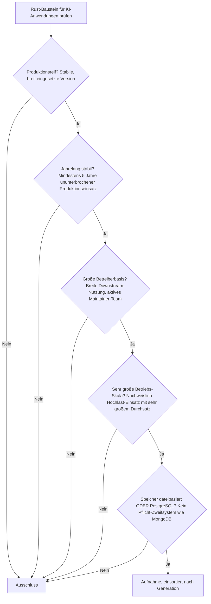
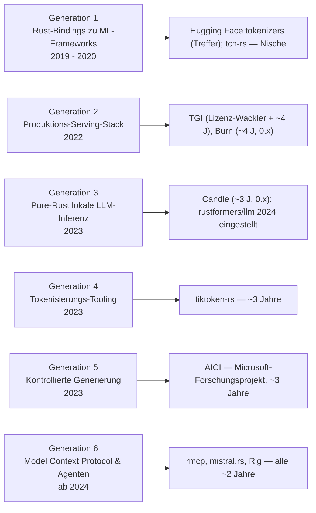
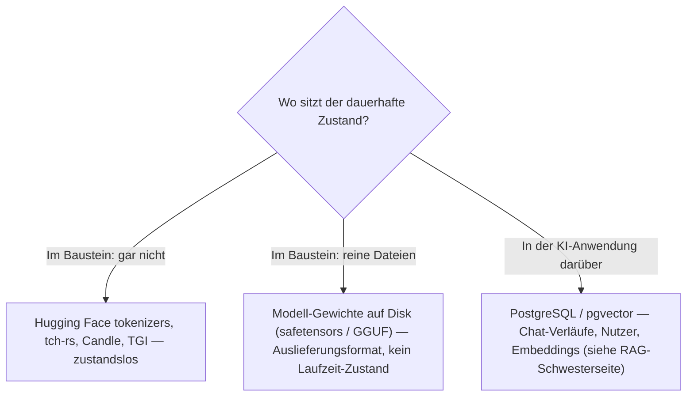

# Produktionsreife Rust-Bausteine für KI-Anwendungen nach Generation — Reifegrad, Evaluation & Betriebs-Skala (Top 1 — nur Hugging Face `tokenizers`)

Die [Evolution und Architekturen digitaler Rust-KI-Anwendungen](evolution-digitaler-rust-ki-anwendungen.md) verfolgt Rust nicht als eigene KI-Anwendungsklasse, sondern als **quer zu allen sechs Generationen von [KI-Anwendungen](evolution-digitaler-ki-anwendungen.md) liegende Implementierungsachse** — Bindings zu ML-Frameworks (1), Produktions-Serving-Stacks (2), pure-Rust-Inferenz (3), Tokenisierungs-Tooling (4), kontrollierte Generierung (5), Model Context Protocol & Agenten (6). Die [Topliste bester Rust-Bausteine für KI-Anwendungen 2026](rust-ki-anwendungen-2026-topliste.md) rankt diese Achse nach Relevanz. Diese Seite legt das **konservative** Fünf-Filter-Sieb an — produktionsreif · jahrelang stabil · große Betreiberbasis · sehr große Betriebs-Skala · Speicher dateibasiert oder PostgreSQL — und ist die KI-Parallele zur [Rust-Wissenssysteme-](../wissen/dokumentation/produktionsreife-rust-wissenssysteme-generationen-2026-topliste.md), [Rust-CMS-](../wissen/dokumentation/produktionsreife-rust-cms-generationen-2026-topliste.md) und der [Rust-LMS-Seite](../wissen/e-learning/produktionsreife-rust-lms-generationen-2026-topliste.md). Sortiert nach Generation.

!!! warning "Achtung: Genau ein Treffer — Hugging Face `tokenizers`, das einzige Stück von vor dem LLM-Boom"
    Dieselbe Beobachtung wie bei allen Rust-Schwesterseiten, hier am schärfsten: Die reife Rust-Schicht ist **quer genutzte Infrastruktur**, kein domäneneigener Baustein — und diese Achse ist die **jüngste** der Familie. Ihr Aushängeschild **Candle** (Rang 1 der Basis-Topliste) und die **gesamten Generationen 3–6** (rustformers/llm, tiktoken-rs, AICI, rmcp, mistral.rs, Rig) sind allesamt **nach 2023 entstanden** — unter fünf Jahre, überwiegend `0.x`. Was besteht, ist der eine Baustein, den Rust schon **2019** still übernommen hat: **Hugging Face `tokenizers`**, der Tokenisierungs-Kern unter praktisch jeder `transformers`-Pipeline. **tch-rs** (Generation 1) ist gleich alt, aber Nische; **TGI** und **Burn** (Generation 2) sind an der Fünf-Jahres-Marke; **rustformers/llm** wurde 2024 eingestellt. Der Speicherfilter ist bei diesen Werkzeug-Bausteinen strukturell bedeutungslos; die siebende Achse ist **stabile Verbreitung plus fünf Jahre Produktion** ([Speicher-Fazit](#dateibasiert-oder-postgresql)).

---

## Die fünf harten Filter

!!! note "Hinweis: „Baustein für KI-Anwendungen" ist weit gefasst, nur OSI-Lizenzen"
    Aufgenommen wird, was 2026 produktiv in KI-Pipelines eingebettet ist — auch wenn der Baustein hinter einer Python-API oder einem Chat-Interface unsichtbar bleibt. Alle Kandidaten stehen unter permissiver Lizenz (Apache-2.0, MIT). Bei **TGI** war die Lizenz 2023 kurzzeitig auf ein nicht-quelloffenes Modell umgestellt und 2024 nach Apache-2.0 zurückgeführt — vor einer Produktiv-Entscheidung die aktuelle Lizenzdatei prüfen.

---

## Ergebnis: ein Treffer über sechs Generationsstufen

---

## Systeme nach Generation

### Generation 1 — Rust-Bindings zu bestehenden ML-Frameworks (2019 – 2020)

| # | System | Speicher | Lizenz | Seit | Skala-Nachweis |
|---|---|---|---|---|---|
| 1 | **[Hugging Face `tokenizers`](evolution-digitaler-rust-ki-anwendungen.md#generation-1-rust-bindings-zu-bestehenden-ml-frameworks-2019-2020)** | keine — Tokenizer, „Text rein, Token-IDs raus" | Apache-2.0 | 2019 | Rust-Kern für Byte-Pair-Encoding unter praktisch jeder `transformers`-basierten Pipeline weltweit; über die Python-Bindings unsichtbar hinter `AutoTokenizer.from_pretrained(...)` |

**Hugging Face `tokenizers`** ist der einzige Treffer: seit 2019 in Produktion, sieben Jahre ununterbrochen, in gigantischer Skala — jede Trainings- und Inferenz-Pipeline auf Basis von `transformers` lädt diesen Rust-Kern. Konservativ bei `0.x` versioniert, aber das ist — wie bei [Tantivy und den Markdown-Parsern der Schwesterseiten](../wissen/dokumentation/produktionsreife-rust-wissenssysteme-generationen-2026-topliste.md) — zurückhaltende Semver-Politik, keine Instabilität. Der Speicherfilter greift nicht: Ein Tokenizer hält keinen Zustand.

**tch-rs** aus derselben Generation (Rust-Bindings für libtorch, ebenfalls 2019, von Laurent Mazare — dem späteren Candle-Autor) ist gleich alt und aktiv, bleibt aber ein **Nischenwerkzeug**: Wer PyTorch-Modelle nutzt, greift meist direkt zu Python; wer Rust-native Inferenz will, nimmt inzwischen Candle. Keine große Betreiberbasis — Grenzfall.

### Generation 2 – 6 — warum hier nichts steht

- **Generation 2 (TGI, Burn)**: **Text Generation Inference** ist der Rust-Router für kontinuierliches Batching hinter Hugging Faces Inferenz-Infrastruktur — seit 2022 (~4 Jahre), zusätzlich mit einem Lizenz-Wackler 2023/24. **Burn** ist das erste umfassende eigenständige Rust-Deep-Learning-Framework, ebenfalls 2022, noch `0.x` und ohne nachweisbare Hochlast-Skala über viele Betreiber. Beide dicht dran, aber unter der Fünf-Jahres-Marke.
- **Generation 3 (rustformers/llm, Candle)**: **Candle** ist das Aushängeschild der ganzen Achse und Rang 1 der Basis-Topliste — aber seit August 2023 (~3 Jahre) und bei `0.x`. Dieselbe Einordnung wie auf der [Rust-LMS-](../wissen/e-learning/produktionsreife-rust-lms-generationen-2026-topliste.md) und der [Rust-Wissenssysteme-Seite](../wissen/dokumentation/produktionsreife-rust-wissenssysteme-generationen-2026-topliste.md): interessanter, aber verfrühter Kandidat. **rustformers/llm** war einer der ersten pure-Rust-Inferenz-Runner, wurde aber **2024 eingestellt**.
- **Generation 4 (tiktoken-rs)**: Rust-Portierung von OpenAIs `tiktoken`, seit 2023 — zu jung.
- **Generation 5 (AICI)**: WASM-basierte Constrained-Decoding-Controller von Microsoft Research, seit 2023 — ein Forschungsprojekt, keine breit betriebene Produktionskomponente.
- **Generation 6 (rmcp, mistral.rs, Rig)**: das offizielle Rust-MCP-SDK, ein Rust-natives Serving-Backend und ein Rust-Agenten-Framework — alle seit 2024 (~2 Jahre). Die gesamte jüngste Generation reißt die Fünf-Jahres-Marke klar, analog zu den [autonomen KI-Agenten](produktionsreife-autonome-ki-agenten-generationen-2026-topliste.md) und den [RAG-Werkzeug-Anwendungen](produktionsreife-rag-werkzeug-anwendungen-generationen-2026-topliste.md).

---

## Dateibasiert oder PostgreSQL?

Die Frage ist auf dieser Seite fast gegenstandslos: Der einzige Treffer und fast alle Kandidaten sind **zustandslose Werkzeug-Bausteine** — sie tokenisieren, rechnen oder routen, sie speichern nicht.

- Die Rust-KI-Bausteine sind bewusst zustandslos — genau das macht sie als Bibliotheks-Kern unter einer fremden API einsetzbar. Der Speicherfilter ist strukturell bedeutungslos, wie bei [Compiler- und Interpreter-Werkzeugen](../entwicklung/system/produktionsreife-compiler-werkzeuge-generationen-2026-topliste.md).
- **Modell-Gewichte** liegen dateibasiert auf der Platte (safetensors, GGUF) — das ist Auslieferungsformat, nicht laufender Zustand.
- Die **KI-Anwendung über** diesen Bausteinen hält ihren Zustand relational — Chat-Verläufe, Nutzer, Embeddings — konkret PostgreSQL bzw. pgvector, siehe [RAG-Werkzeug-Anwendungen nach Generation](produktionsreife-rag-werkzeug-anwendungen-generationen-2026-topliste.md).

Vertiefung zur Datenbankschicht: [PostgreSQL DBA Praxis-Handbuch](../entwicklung/infrastruktur/postgresql-dba-praxis.md).

!!! warning "Achtung: Momentaufnahme, Stand August 2026"
    Diese Achse wird sich von allen Rust-Schwesterseiten am schnellsten verändern. Erreicht **Candle** (2028) oder **Burn** eine 1.0 mit fünf Jahren Produktion, oder festigen sich **TGI**, **rmcp** und **mistral.rs** als breit betriebene Standards, wächst diese Liste deutlich. **Hugging Face `tokenizers`** ist die einzige stabile Konstante.

---

## Was bewusst nicht auf dieser Liste steht

| Baustein | Erfüllt nicht | Anmerkung |
|---|---|---|
| **Candle** | Reifezeit + 1.0 | Rang 1 der Basis-Topliste, aber seit August 2023 (~3 Jahre), `0.x` |
| **tch-rs** | Betreiberbasis | Gleich alt wie `tokenizers`, aber Nische — verdrängt von Candle und direktem Python-Einsatz |
| **TGI** | Reifezeit (+ Lizenz-Historie) | Rust-Router seit 2022; Lizenz 2023 kurz nicht-quelloffen, 2024 nach Apache-2.0 zurück |
| **Burn** | Reifezeit + Skala | Erstes eigenständiges Rust-DL-Framework, 2022, noch `0.x` |
| **rustformers/llm** | Kontinuität | Früher pure-Rust-Inferenz-Runner, 2024 eingestellt |
| **tiktoken-rs, AICI** | Reifezeit | Beide seit 2023; AICI zusätzlich reines Forschungsprojekt |
| **rmcp, mistral.rs, Rig** | Reifezeit | Gesamte Generation 6, alle seit 2024 (~2 Jahre) |

---

## 🔗 Verwandte Themen

- [Evolution und Architekturen digitaler Rust-KI-Anwendungen](evolution-digitaler-rust-ki-anwendungen.md) — das Generationenmodell der Rust-Implementierungsachse, nach dem diese Liste sortiert ist
- [Beste Rust-Bausteine für KI-Anwendungen 2026 (Top 10)](rust-ki-anwendungen-2026-topliste.md) — breitere Basis-Topliste inklusive der jungen Generation-3–6-Bausteine
- [Produktionsreife Rust-Bausteine für Wissenssysteme nach Generation (Top 3)](../wissen/dokumentation/produktionsreife-rust-wissenssysteme-generationen-2026-topliste.md) — dieselbe Beobachtung: die reife Rust-Schicht ist geteilte Infrastruktur; Candle fällt dort aus demselben Grund
- [Produktionsreife Rust-Bausteine für CMS nach Generation (Top 2)](../wissen/dokumentation/produktionsreife-rust-cms-generationen-2026-topliste.md) — Schwesterseite für CMS (SWC, Wasmtime)
- [Produktionsreife Rust-Bausteine für LMS nach Generation (Top 2)](../wissen/e-learning/produktionsreife-rust-lms-generationen-2026-topliste.md) — Schwesterseite für LMS (Firecracker, Wasmtime)
- [Produktionsreife Rust-Web-Frameworks nach Generation](../entwicklung/webentwicklung/produktionsreife-rust-webframeworks-generationen-2026-topliste.md) — dort ist Rig als Generation-6-KI-Backend eingeordnet
- [Produktionsreife autonome KI-Agenten nach Generation (kein Treffer)](produktionsreife-autonome-ki-agenten-generationen-2026-topliste.md) — die Anwendungsebene über rmcp/Rig, dieselbe „zu jung + proprietär"-Struktur
- [Produktionsreife RAG- & Werkzeug-Anwendungen nach Generation](produktionsreife-rag-werkzeug-anwendungen-generationen-2026-topliste.md) — die Datenbankschicht (pgvector) über diesen Bausteinen
- [PostgreSQL DBA Praxis-Handbuch](../entwicklung/infrastruktur/postgresql-dba-praxis.md) — Datenbankschicht der KI-Anwendung über den Bausteinen
