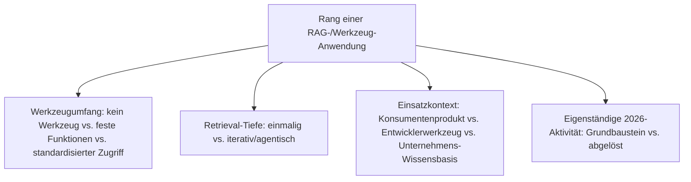
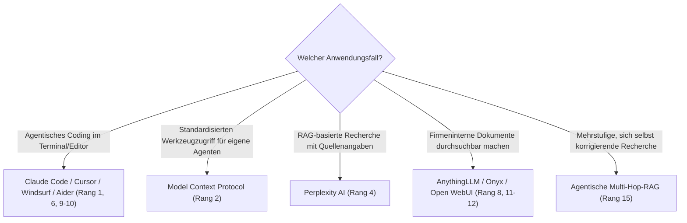

# Beste RAG- & Werkzeug-Anwendungen 2026 — Top-15-Topliste

Die [Evolution und Architekturen digitaler RAG- & Werkzeug-Anwendungen](evolution-digitaler-rag-werkzeug-anwendungen.md) ordnet diese Architekturlinie chronologisch — vom Function Calling über RAG-native Such-Anwendungen, Coding-Assistenten und Unternehmens-RAG-Chatbots bis zum Model Context Protocol und agentischer Multi-Hop-RAG. Diese Seite übersetzt die Chronologie in eine **nach architektonischer Bedeutung gerankte Top-15-Liste**.

!!! note "Hinweis: Anwendungskategorien, nicht Retrieval-Technologie"
    Diese Liste rankt konkrete Produktkategorien, die Retrieval und Tool-Calling nutzen. Die zugrundeliegende Technologie (Embeddings, Vektordatenbanken, RAG-Pipeline-Mechanik) behandelt vertieft [Evolution und Architekturen digitaler Semantischer & RAG-Wissenssysteme](../wissen/dokumentation/evolution-digitaler-semantische-rag-wissenssysteme.md).

---

## Bewertungskriterien

---

## Top 15 im Überblick

| Rang | System | Generation | Status 2026 | Historische/aktuelle Bedeutung |
|---|---|---|---|---|
| 1 | **Claude Code** | 3 (Coding-Assistenten mit Werkzeugzugriff) | Aktiv | Agentisches Coding-Werkzeug mit vollem Datei-, Werkzeug- und Ausführungszugriff, auch der Stack hinter diesem Repository |
| 2 | **Model Context Protocol (MCP)** | 5 (MCP standardisiert Werkzeugzugriff) | Aktiv | Offener, herstellerübergreifender Standard für Werkzeug- und Datenzugriff statt proprietärer Integrationen |
| 3 | **OpenAI Function Calling** | 1a (Function Calling wird Standard) | Aktiv (als Fundament) | Erste standardisierte, herstellerseitige Lösung für kontrolliertes Werkzeug-Handling |
| 4 | **Perplexity AI** | 2 (RAG-native Such- und Recherche-Anwendungen) | Aktiv | RAG-basierte Suchmaschine mit Quellenangaben als eigenständiges Produkt |
| 5 | **GitHub Copilot** | 3 (Coding-Assistenten mit Werkzeugzugriff) | Aktiv | Erste breit adoptierte Code-Vervollständigung, Wegbereiter aller folgenden Coding-Agenten |
| 6 | **Cursor** | 3 (Coding-Assistenten mit Werkzeugzugriff) | Aktiv | Editor-integrierter Agent mit Datei- und Terminalzugriff, Mehrschritt-Refactorings |
| 7 | **ReAct-Pattern** | 1b (ReAct in Produktivsystemen) | Aktiv (als Fundament) | Verschränkt Denken und Handeln in einer wiederholten Schleife, Grundmuster jedes folgenden Agenten |
| 8 | **AnythingLLM** | 4 (Unternehmensweite RAG-Assistenten) | Aktiv | All-in-One-Anwendung für lokale Dokumente in privaten Chat-Kontexten |
| 9 | **Windsurf** | 3 (Coding-Assistenten mit Werkzeugzugriff) | Aktiv | Editor-integrierter Agent mit Datei- und Terminalzugriff, direkte Konkurrenz zu Cursor |
| 10 | **Aider** | 3 (Coding-Assistenten mit Werkzeugzugriff) | Aktiv | Terminal-natives Werkzeug, erzeugt direkt Git-Commits aus KI-Änderungen |
| 11 | **Onyx** (ehem. Danswer) | 4 (Unternehmensweite RAG-Assistenten) | Aktiv | Verbindet sich mit bestehenden Datenquellen wie Slack, Google Drive und Wikis |
| 12 | **Open WebUI** | 4 (Unternehmensweite RAG-Assistenten) | Aktiv | Web-Frontend für LLMs mit integriertem, konfigurierbarem RAG-System |
| 13 | **Structured Outputs / JSON Mode** | 1c (strukturierte Ausgaben) | Aktiv (als Fundament) | Garantiert syntaktisch valides JSON, Voraussetzung für produktionsreife Tool-Integration |
| 14 | **Bing Chat / Copilot** (Websuche-Modus) | 2 (RAG-native Such- und Recherche-Anwendungen) | Aktiv | Kombiniert klassische Websuche mit LLM-Zusammenfassung der Ergebnisse |
| 15 | **Agentische Multi-Hop-RAG** | 6 (Agentische RAG mit mehrstufigem Retrieval) | Aktiv | Selbstkorrigierende Retrieval-Schleifen kombinieren mehrere Teilantworten statt eines einzelnen Treffers |

---

## Highlights im Detail

### Rang 1, 5–6, 9–10: Coding-Assistenten als produktivste Werkzeug-Kategorie
Claude Code, GitHub Copilot, Cursor, Windsurf und Aider belegen fünf der fünfzehn Plätze — Coding ist 2026 die Domäne, in der werkzeugnutzende KI am zuverlässigsten produktionsreif arbeitet, siehe [Generation 3](evolution-digitaler-rag-werkzeug-anwendungen.md#generation-3-ki-gestutzte-coding-assistenten-mit-werkzeugzugriff-2021-2023).

### Rang 2–3, 7, 13: die architektonischen Fundamente jeder Werkzeug-Anwendung
MCP, Function Calling, ReAct-Pattern und Structured Outputs sind selbst keine Endnutzerprodukte, tragen aber jede Anwendung auf dieser Liste — ohne sie bliebe Werkzeugzugriff fragiles Prompt-Parsing statt kontrollierter Ausführung, siehe [Generation 1](evolution-digitaler-rag-werkzeug-anwendungen.md#generation-1-vom-prompt-zum-tool-aufruf-function-calling-wird-standard-2023).

### Rang 8, 11–12: Unternehmens-RAG als eigene Plattform-Kategorie
AnythingLLM, Onyx und Open WebUI machen firmeninterne Dokumente statt öffentlicher Trainingsdaten durchsuchbar — meist als selbst hostbare All-in-One-Plattform statt Cloud-Abhängigkeit.

---

## Wegweiser: von Anwendungsfall zu passendem Werkzeug

!!! tip "Tipp: die KI-Haupt-Zeitachse separat prüfen"
    Diese Liste vertieft Generation 5 der übergeordneten Chronologie — für den vollständigen Sechs-Generationen-Überblick siehe [Beste KI-Anwendungen 2026](ki-anwendungen-2026-topliste.md).

---

## 🔗 Verwandte Themen

- [Startseite](../index.md) — zurück zur Dokumentations-Zentrale
- [Evolution und Architekturen digitaler RAG- & Werkzeug-Anwendungen](evolution-digitaler-rag-werkzeug-anwendungen.md) — chronologisches Generationenmodell, dessen aktuellen Stand diese Topliste zusammenfasst
- [Beste KI-Anwendungen 2026 (Top 20)](ki-anwendungen-2026-topliste.md) — Gesamtmarkt-Topliste über alle sechs KI-Generationen hinweg
- [Evolution und Architekturen digitaler Semantischer & RAG-Wissenssysteme](../wissen/dokumentation/evolution-digitaler-semantische-rag-wissenssysteme.md) — technische Grundlage hinter dieser Anwendungs-Zeitachse
- [AI Agents – Das Praxis-Handbuch & Architektur-Leitfaden](coding/ai-agents-praxis.md) — Vertiefung zu Rang 15
- [Beste MCP-Server (Top 20)](coding/mcp-server-topliste.md) — Vertiefung zu Rang 2
- [Claude Code in der Praxis](coding/claude-code-praxis.md) — Vertiefung zu Rang 1
- [KI-Modelle & Frameworks: Übersicht](index.md) — Gesamtübersicht Modell-Kategorien und Frameworks
