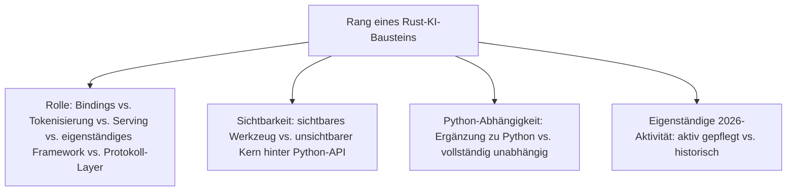
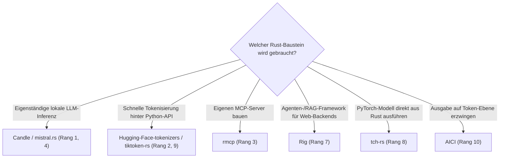

# Beste Rust-Bausteine für KI-Anwendungen 2026 — Top-10-Topliste

Die [Evolution und Architekturen digitaler Rust-KI-Anwendungen](evolution-digitaler-rust-ki-anwendungen.md) ordnet Rust nicht als eigenständige KI-Anwendung ein, sondern als **quer zu allen sechs Generationen liegende Implementierungsachse** — Bindings, Serving-Stacks, pure-Rust-Inferenz, Tokenisierung, kontrollierte Generierung und das Model Context Protocol. Diese Seite übersetzt die Chronologie in eine **nach aktueller Relevanz gerankte Top-10-Liste** konkreter Rust-Bausteine.

!!! note "Hinweis: meist unsichtbar hinter Python oder einem Chat-Interface"
    Die meisten dieser Bausteine sind für Endnutzer nicht sichtbar — sie laufen als Rust-Kern hinter einer Python-API (`tokenizers`) oder einem Chat-Interface, statt als eigenständiges Werkzeug wahrgenommen zu werden. Diese Liste rankt nach **Verbreitung und architektonischer Bedeutung**, nicht nach Bekanntheitsgrad beim Endnutzer.

---

## Bewertungskriterien

---

## Top 10 im Überblick

| Rang | Baustein | Generation | Status 2026 | Historische/aktuelle Bedeutung |
|---|---|---|---|---|
| 1 | **Candle** (Hugging Face) | 3 (Pure-Rust lokale LLM-Inferenz ohne Python) | Aktiv | Schlankes, von Laurent Mazare entwickeltes Rust-ML-Framework, Kern mehrerer RAG- und Inferenz-Stacks |
| 2 | **Hugging Face `tokenizers`** | 1 (Rust-Bindings zu bestehenden ML-Frameworks) | Aktiv | Rust-Kern für Byte-Pair-Encoding, praktisch in jeder `transformers`-Pipeline unsichtbar im Einsatz |
| 3 | **rmcp** | 6 (Rust im MCP- & Agenten-Ökosystem) | Aktiv | Offizielles Rust-SDK für das Model Context Protocol, Grundlage vieler performanter MCP-Server |
| 4 | **mistral.rs** | 6 (Rust im MCP- & Agenten-Ökosystem) | Aktiv | Vollständig Rust-natives LLM-Serving-Backend mit Quantisierungs-Unterstützung |
| 5 | **Burn** (Tracel AI) | 2 (Rust im Produktions-Serving-Stack) | Aktiv | Erstes umfassendes, eigenständiges Rust-natives Deep-Learning-Framework mit austauschbaren Backends |
| 6 | **Text Generation Inference (TGI)** | 2 (Rust im Produktions-Serving-Stack) | Aktiv | Rust-Router für kontinuierliches Batching und Token-Streaming bei Hugging Face |
| 7 | **Rig** | 6 (Rust im MCP- & Agenten-Ökosystem) | Aktiv | Rust-natives Agenten-/RAG-Framework für Web-Backends |
| 8 | **tch-rs** | 1 (Rust-Bindings zu bestehenden ML-Frameworks) | Aktiv (Nische) | Rust-Bindings für libtorch, erlaubt PyTorch-Modelle direkt aus Rust auszuführen |
| 9 | **tiktoken-rs** | 4 (Tokenisierungs- & Prompt-Kompatibilitäts-Tooling) | Aktiv (Nische) | Rust-Portierung von OpenAIs `tiktoken`, exaktes Token-Counting ohne Modell-API-Aufruf |
| 10 | **AICI** (Microsoft Research) | 5 (Kontrollierte Generierung & Constrained Decoding) | Aktiv (Forschung) | WASM-basierte Constrained-Decoding-Controller, greifen Token-für-Token in die Generierung ein |

---

## Highlights im Detail

### Rang 1, 4, 7: die aktuelle Rust-Serving- und Agenten-Generation
Candle, mistral.rs und Rig zeigen, wie weit sich das Ökosystem seit den frühen Bindings entwickelt hat — vollständig Rust-native Inferenz und Agenten-Frameworks statt reiner Python-Ergänzung, siehe [Generation 3 und 6](evolution-digitaler-rust-ki-anwendungen.md#generation-6-rust-im-model-context-protocol-agenten-okosystem-ab-2024).

### Rang 2, 8: personelle Kontinuität über zwei Generationen
Laurent Mazare entwickelte zunächst `tch-rs` (Generation 1, Rang 8), später Candle (Generation 3, Rang 1) — derselbe Architekt, zwei Generationen des Musters „Rust trifft Tensor-Berechnung", siehe [Generation 1](evolution-digitaler-rust-ki-anwendungen.md#generation-1-rust-bindings-zu-bestehenden-ml-frameworks-2019-2020).

### Rang 5–6: das hybride Serving-Muster als Vorbild
Burn (vollständig eigenständig) und TGI (Rust-Router, Python-Inferenz) zeigen die zwei parallelen Antworten dieser Generation auf dieselbe Frage — dasselbe Hybrid-Muster, das später auch außerhalb von KI-Anwendungen wiederkehrt.

---

## Wegweiser: von Anwendungsfall zu passendem Rust-Baustein

!!! tip "Tipp: die KI-Haupt-Zeitachse separat prüfen"
    Diese Liste vertieft die quer liegende Rust-Implementierungsachse — für den vollständigen Sechs-Generationen-Überblick siehe [Beste KI-Anwendungen 2026](ki-anwendungen-2026-topliste.md).

---

## 🔗 Verwandte Themen

- [Startseite](../index.md) — zurück zur Dokumentations-Zentrale
- [Evolution und Architekturen digitaler Rust-KI-Anwendungen](evolution-digitaler-rust-ki-anwendungen.md) — chronologisches Generationenmodell, dessen aktuellen Stand diese Topliste zusammenfasst
- [Produktionsreife Rust-Bausteine für KI-Anwendungen nach Generation (Top 1)](produktionsreife-rust-ki-anwendungen-generationen-2026-topliste.md) — härtestes Sieb: zusätzlich fünf Jahre Produktion und sehr große Betriebs-Skala; übrig bleibt nur Hugging Face `tokenizers`
- [Beste KI-Anwendungen 2026 (Top 20)](ki-anwendungen-2026-topliste.md) — Gesamtmarkt-Topliste über alle sechs KI-Generationen hinweg
- [Beste autonome KI-Agenten 2026 (Top 20)](autonome-ki-agenten-2026-topliste.md) — Anwendungsseite von Rang 3 (MCP)
- [Beste MCP-Server (Top 20)](coding/mcp-server-topliste.md) — konkrete MCP-Server-Implementierungen, teils auf rmcp basierend
- [Rust in der Praxis](../entwicklung/system/rust-praxis.md) — allgemeine Rust-Werkzeuglandschaft jenseits von KI-Anwendungen
- [KI-Modelle & Frameworks: Übersicht](index.md) — Gesamtübersicht Modell-Kategorien und Frameworks
