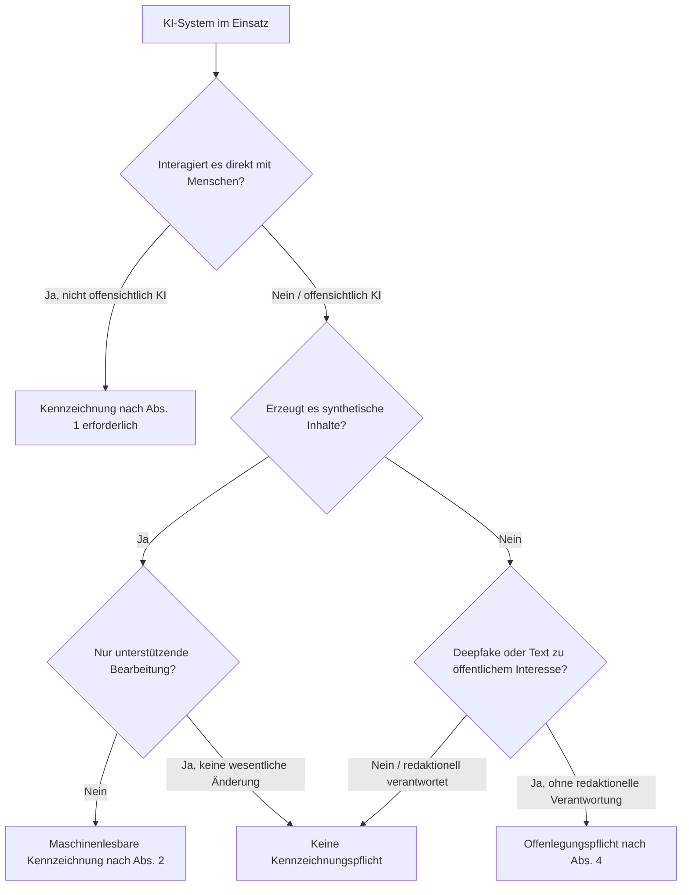

# Artikel 50 EU AI Act: Kennzeichnungspflicht für KI-Inhalte

Art. 50 der EU-Verordnung über Künstliche Intelligenz (Verordnung (EU) 2024/1689, „EU AI Act“) regelt die **Transparenzpflichten** für KI-Systeme, die mit Menschen interagieren oder synthetische Inhalte erzeugen. Diese Pflichten gelten seit dem **2. August 2026** unmittelbar in allen EU-Mitgliedstaaten.

---

## Übersicht

!!! note "Hinweis"
    Diese Seite fasst Art. 50 EU AI Act allgemeinverständlich zusammen und ersetzt keine Rechtsberatung. Für die verbindliche Fassung siehe den [Verordnungstext im EUR-Lex](https://eur-lex.europa.eu/legal-content/DE/TXT/?uri=CELEX%3A32024R1689).

!!! warning "Achtung"
    Verstöße gegen die Transparenzpflichten können nach Art. 99 EU AI Act mit Bußgeldern von bis zu 15 Mio. € oder 3 % des weltweiten Jahresumsatzes geahndet werden.

Art. 50 richtet sich an zwei Adressaten mit unterschiedlichen Pflichten: **Anbieter** (Provider), die ein KI-System entwickeln oder in Verkehr bringen, und **Betreiber** (Deployer), die es beruflich einsetzen.

---

## Wer muss was kennzeichnen?

| Adressat | Pflicht | Beispiel |
|---|---|---|
| **Anbieter** von KI-Systemen mit direkter Nutzerinteraktion (Abs. 1) | System muss offenlegen, dass eine Interaktion mit KI stattfindet – außer es ist ohnehin offensichtlich | Chatbot muss sich als KI zu erkennen geben |
| **Anbieter** von Systemen, die synthetische Inhalte erzeugen (Abs. 2) | Ausgaben (Audio, Bild, Video, Text) müssen maschinenlesbar und als KI-generiert/-manipuliert erkennbar markiert werden | Wasserzeichen/Metadaten (z. B. C2PA) in KI-generierten Bildern |
| **Betreiber** von Emotionserkennungs- oder biometrischen Kategorisierungssystemen (Abs. 3) | Betroffene Personen müssen über den Betrieb des Systems informiert werden | Kamera mit Emotionsanalyse im Einzelhandel |
| **Betreiber**, die Deepfakes veröffentlichen (Abs. 4) | Offenlegen, dass Bild-, Audio- oder Videoinhalt künstlich erzeugt oder manipuliert wurde | KI-generiertes „Video" einer Person, die etwas nie gesagt hat |
| **Betreiber**, die KI-Texte zu Themen von öffentlichem Interesse veröffentlichen (Abs. 4) | Offenlegen, dass der Text KI-generiert ist – **außer** er wurde redaktionell/menschlich geprüft und verantwortet | KI-Rohentwurf eines News-Artikels ohne Redaktion |

**Wichtige Ausnahmen** (Abs. 2 und Abs. 4):

- Rein unterstützende Bearbeitungsfunktionen (z. B. Grammatik-/Stilkorrektur), die den Ausgangsinhalt nicht wesentlich verändern.
- KI-Einsatz, der gesetzlich zur Aufdeckung, Verhütung oder Verfolgung von Straftaten erlaubt ist (mit Schutzvorkehrungen).
- Content mit substanzieller menschlicher Redaktion/Verantwortung (z. B. ein Artikel, den ein Mensch mit KI-Unterstützung schreibt und redaktionell verantwortet, muss nicht als „KI-generiert" gekennzeichnet werden).

---

## Ablauf: Prüfschema für eigene KI-Nutzung

---

## Praxis: Was das für Content-Ersteller und Entwickler bedeutet

!!! tip "Tipp"
    Im Zweifel lieber kennzeichnen als riskieren: Ein kurzer Hinweis „mit KI erstellt/unterstützt" kostet wenig und schützt vor Bußgeldrisiken.

- ✅ KI-generierte Bilder, Videos oder Audio mit sichtbarem oder maschinenlesbarem Hinweis versehen (z. B. C2PA-Metadaten, Wasserzeichen, Bildunterschrift).
- ✅ Chatbots und Sprachassistenten so gestalten, dass sie sich auf Nachfrage oder beim Start als KI zu erkennen geben.
- ✅ Bei KI-unterstützten Redaktionsprozessen die menschliche Prüfung/Verantwortung dokumentieren – das befreit von der Kennzeichnungspflicht nach Abs. 4.
- ❌ Realistische Deepfakes ohne Kennzeichnung veröffentlichen, auch wenn sie nicht bösartig gemeint sind.
- ❌ Sich bei reinen Text-Tools auf die „unterstützende Bearbeitung"-Ausnahme verlassen, wenn der KI-Anteil den Inhalt inhaltlich prägt statt nur zu korrigieren.

Diese Pflichten ergänzen die themenspezifischen Hinweise auf [Video-Produktion](../kreativ/video/ki-filmproduktion.md), [Bildgenerierung](../kreativ/design/design-nach-ki.md) und [Content-Erstellung](../künstliche-intelligenz/content/ki-content-creation.md) in diesem Wiki.

---

## Verwandte Themen

- [EU AI Act: Rechtliche Aspekte für Content Creator](../künstliche-intelligenz/content/ki-content-creation.md)
- [KI-Kennzeichnung bei Bildgenerierung](../kreativ/design/design-nach-ki.md)
- [KI-Kennzeichnung bei Videoproduktion](../kreativ/video/ki-filmproduktion.md)
- [EU AI Act Risikoklassifizierung (IT-Sicherheit)](../entwicklung/infrastruktur/sicherheit/index.md)

## Ressourcen

| Ressource | Beschreibung | Link |
|---|---|---|
| Verordnungstext Art. 50 | Verbindliche Fassung auf EUR-Lex | [eur-lex.europa.eu](https://eur-lex.europa.eu/legal-content/DE/TXT/?uri=CELEX%3A32024R1689) |
| EU AI Act – offizielle Übersicht | Europäische Kommission | [digital-strategy.ec.europa.eu](https://digital-strategy.ec.europa.eu/de/policies/european-approach-artificial-intelligence) |
| C2PA Standard | Offener Standard für Herkunfts-/KI-Kennzeichnung | [c2pa.org](https://c2pa.org) |
