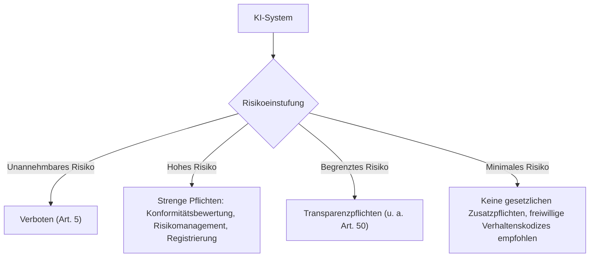

# EU AI Act: Überblick über die KI-Regeln und die Umsetzung in Deutschland

Der **EU AI Act** (Verordnung (EU) 2024/1689) ist das weltweit erste umfassende KI-Gesetz. Er gilt unmittelbar als EU-Verordnung in allen Mitgliedstaaten — auch in Deutschland ist kein zusätzliches nationales Umsetzungsgesetz für die materiellen Pflichten nötig, wohl aber für Zuständigkeiten und Sanktionen. Diese Seite gibt eine kurze, allgemeinverständliche Einordnung: Wer ist betroffen, welche Risikoklassen gibt es, und wer überwacht die Einhaltung in Deutschland.

!!! note "Hinweis"
    Diese Seite ersetzt keine Rechtsberatung. Für Details zur Kennzeichnungspflicht von KI-Inhalten siehe die eigene Seite [Artikel 50 EU AI Act](eu-ai-act-artikel-50.md).

---

## Was regelt der EU AI Act?

Der EU AI Act verfolgt einen **risikobasierten Ansatz**: Je größer das Risiko eines KI-Systems für Grundrechte, Sicherheit oder Gesundheit, desto strenger die Pflichten.

### Die vier Risikoklassen

| Risikoklasse | Beispiele | Pflichten |
|---|---|---|
| **Unannehmbar (verboten)** | Social Scoring durch Behörden, manipulative Systeme, biometrische Echtzeit-Überwachung im öffentlichen Raum (mit engen Ausnahmen) | Einsatz seit **2. Februar 2025** verboten |
| **Hochrisiko** | KI in kritischer Infrastruktur, Personalauswahl/-bewertung, Kreditwürdigkeitsprüfung, Medizinprodukte, Strafverfolgung | Risikomanagementsystem, Datenqualität, technische Dokumentation, menschliche Aufsicht, Registrierung in EU-Datenbank |
| **Begrenztes Risiko** | Chatbots, Deepfakes, KI-generierte Texte/Bilder/Audio | Transparenz-/Kennzeichnungspflichten nach Art. 50 |
| **Minimal** | Spamfilter, KI in Videospielen, einfache Empfehlungssysteme | Keine spezifischen Pflichten aus dem AI Act |

!!! warning "Achtung: Gestaffeltes Inkrafttreten"
    Der AI Act gilt nicht auf einen Schlag, sondern in Stufen: Verbote seit Februar 2025, Pflichten für General-Purpose-AI-Modelle seit August 2025, Transparenzpflichten (Art. 50) und die meisten übrigen Pflichten seit **2. August 2026**, Hochrisiko-Pflichten für bestimmte Produktkategorien greifen erst **August 2027**.

---

## Wer ist betroffen?

- **Anbieter (Provider)**: entwickeln ein KI-System oder bringen es unter eigenem Namen in Verkehr — unabhängig vom Sitz, sobald das System in der EU auf den Markt kommt (Marktortprinzip).
- **Betreiber (Deployer)**: setzen ein KI-System beruflich ein, ohne es selbst entwickelt zu haben (z. B. ein Unternehmen, das ein KI-Bewerbertool nutzt).
- **Einführer und Händler**: bringen KI-Systeme Dritter in der EU in Verkehr bzw. auf den Markt.

!!! tip "Tipp für kleine Unternehmen und Selbstständige"
    Wer ausschließlich fertige KI-Tools (z. B. Chatbots, Schreibassistenten) im eigenen Betrieb nutzt, ist in der Regel **Betreiber**, nicht Anbieter — die Pflichten sind dann deutlich schlanker als für den Hersteller des Systems.

---

## Umsetzung und Zuständigkeit in Deutschland

Deutschland benennt nationale Behörden für Marktüberwachung und Konformitätsbewertung, wie es der AI Act vorschreibt:

- **Bundesnetzagentur**: zentrale Marktüberwachungsbehörde und Ansprechpartnerin für den AI Act in Deutschland.
- **Bundesbeauftragte für Datenschutz und Informationsfreiheit (BfDI)**: zuständig, soweit KI-Systeme von Bundesbehörden betroffen sind bzw. bei Berührungspunkten mit Datenschutz.
- **Landesdatenschutzbehörden**: bei KI-Einsatz durch Landes- und Kommunalbehörden sowie private Unternehmen mit Datenschutzbezug.

!!! warning "Achtung: Bußgelder"
    Verstöße gegen verbotene KI-Praktiken (Art. 5) können mit bis zu **35 Mio. € oder 7 % des weltweiten Jahresumsatzes** geahndet werden, Verstöße gegen sonstige Pflichten (z. B. Hochrisiko-Anforderungen) mit bis zu **15 Mio. € oder 3 %** — es gilt jeweils der höhere Betrag.

---

## Praxis-Checkliste

- [ ] Prüfen, ob eigene KI-Systeme/-Nutzung in eine der vier Risikoklassen fallen.
- [ ] Bei Hochrisiko-Systemen: Risikomanagement, Dokumentation und menschliche Aufsicht einplanen.
- [ ] Bei Chatbots, KI-Texten, -Bildern, -Audio: Transparenzpflichten nach [Art. 50](eu-ai-act-artikel-50.md) umsetzen.
- [ ] Bei Fragen zur Zuständigkeit: Bundesnetzagentur als deutsche Marktüberwachungsbehörde kontaktieren.
- [ ] Regelmäßig prüfen, welche Pflichten laut Stufenplan bereits gelten (Stand dieser Seite: August 2026).

---

## Verwandte Themen

- [Artikel 50 EU AI Act: Kennzeichnungspflicht für KI-Inhalte](eu-ai-act-artikel-50.md)
- [KI in Deutschland: weitere Gesetze](ki-gesetze-deutschland.md)
- [EU AI Act Risikoklassifizierung (IT-Sicherheit)](../entwicklung/infrastruktur/sicherheit/index.md)
- [EU AI Act: Rechtliche Aspekte für Content Creator](../künstliche-intelligenz/content/ki-content-creation.md)

## Ressourcen

| Ressource | Beschreibung | Link |
|---|---|---|
| Verordnungstext EU AI Act | Verbindliche Fassung auf EUR-Lex | [eur-lex.europa.eu](https://eur-lex.europa.eu/legal-content/DE/TXT/?uri=CELEX%3A32024R1689) |
| EU AI Act – offizielle Übersicht | Europäische Kommission | [digital-strategy.ec.europa.eu](https://digital-strategy.ec.europa.eu/de/policies/european-approach-artificial-intelligence) |
| Bundesnetzagentur zum AI Act | Deutsche Marktüberwachungsbehörde | [bundesnetzagentur.de](https://www.bundesnetzagentur.de) |
