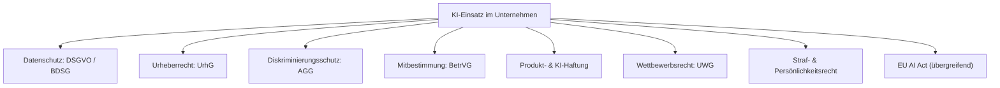

# KI in Deutschland: Welche Gesetze neben dem EU AI Act gelten

Der [EU AI Act](eu-ai-act-uebersicht.md) ist nicht das einzige Gesetz, das beim Einsatz von KI in Deutschland zu beachten ist. Er regelt speziell Risikoeinstufung und Transparenz von KI-Systemen — daneben gelten weiterhin die bestehenden deutschen und europäischen Gesetze zu Datenschutz, Urheberrecht, Diskriminierungsschutz, Mitbestimmung, Haftung und Wettbewerb, sobald KI in diesen Bereichen berührt wird.

!!! note "Hinweis"
    Diese Seite gibt einen Überblick, welche zusätzlichen Gesetze bei typischen KI-Anwendungsfällen in Deutschland relevant werden. Sie ersetzt keine Rechtsberatung im Einzelfall.

---

## Überblick: Gesetze rund um KI-Nutzung in Deutschland

---

## Die wichtigsten Gesetze im Überblick

| Gesetz / Bereich | Relevanz für KI | Typisches Beispiel |
|---|---|---|
| **DSGVO & BDSG** (Datenschutz) | Verarbeitung personenbezogener Daten beim Training oder Betrieb von KI-Systemen, Recht auf Auskunft/Löschung, Verbot automatisierter Einzelentscheidungen (Art. 22 DSGVO) | KI-gestützte Bewerberauswahl ohne menschliche Prüfung |
| **UrhG** (Urheberrecht) | Nutzung urheberrechtlich geschützter Werke zum KI-Training (§ 44b UrhG, Text- und Data-Mining-Schranke), Urheberschaft an KI-generierten Werken | Training eines Sprachmodells mit geschützten Texten ohne Opt-out-Beachtung |
| **AGG** (Allgemeines Gleichbehandlungsgesetz) | Diskriminierungsverbot gilt auch bei algorithmischen Entscheidungen (mittelbare Diskriminierung durch Trainingsdaten) | KI-Recruiting-Tool benachteiligt systematisch bestimmte Gruppen |
| **BetrVG** (Betriebsverfassungsgesetz) | Mitbestimmungsrecht des Betriebsrats bei Einführung von KI-Systemen zur Verhaltens-/Leistungskontrolle (§ 87 Abs. 1 Nr. 6, § 90 BetrVG) | Einführung eines KI-Tools zur Mitarbeiterüberwachung ohne Betriebsratsbeteiligung |
| **Produkthaftung / KI-Haftungsrecht** | Haftung für Schäden durch fehlerhafte KI-Systeme (ProdHaftG, EU-Produkthaftungsrichtlinie, nationale Umsetzung) | Fehlerhafte KI-Steuerung eines Geräts verursacht Personenschaden |
| **UWG** (Wettbewerbsrecht) | Irreführungsverbot bei Werbung mit KI-Fähigkeiten, Kennzeichnungspflichten bei KI-generierter Werbung | Produkt wirbt mit „KI-geprüft", ohne dass dies zutrifft |
| **StGB / Persönlichkeitsrecht** | Deepfakes und KI-generierte Inhalte können Straftatbestände (z. B. § 201a StGB Bildrechte, Beleidigung, üble Nachrede) oder das allgemeine Persönlichkeitsrecht berühren | Veröffentlichung eines KI-Deepfakes einer realen Person ohne Einwilligung |

!!! warning "Achtung: Gesetze gelten parallel, nicht alternativ"
    Der EU AI Act tritt **neben** diese Gesetze, nicht an ihre Stelle. Ein KI-System kann gleichzeitig AI-Act-konform sein und trotzdem gegen DSGVO, AGG oder Urheberrecht verstoßen — alle einschlägigen Gesetze müssen unabhängig voneinander geprüft werden.

---

## Praxis-Checkliste für den KI-Einsatz in Deutschland

- [ ] **Datenschutz**: Rechtsgrundlage für die Datenverarbeitung klären, Betroffenenrechte sicherstellen, keine vollautomatisierten Entscheidungen mit rechtlicher Wirkung ohne Ausnahme nach Art. 22 DSGVO.
- [ ] **Urheberrecht**: Bei eigenem Training prüfen, ob genutzte Inhalte durch die TDM-Schranke (§ 44b UrhG) gedeckt sind bzw. ob ein Rechteinhaber-Opt-out vorliegt.
- [ ] **Diskriminierungsschutz**: KI-gestützte Personalentscheidungen regelmäßig auf mittelbare Diskriminierung prüfen (Bias-Testing).
- [ ] **Mitbestimmung**: Betriebsrat frühzeitig einbinden, wenn KI zur Leistungs- oder Verhaltenskontrolle von Beschäftigten eingesetzt wird.
- [ ] **Haftung**: Verantwortlichkeiten und Versicherungsschutz für KI-bedingte Schäden klären.
- [ ] **Werbung/Wettbewerb**: KI-bezogene Werbeaussagen nur treffen, wenn sie tatsächlich zutreffen.
- [ ] **EU AI Act**: zusätzlich die [Risikoklassifizierung](eu-ai-act-uebersicht.md) und [Kennzeichnungspflichten nach Art. 50](eu-ai-act-artikel-50.md) prüfen.

---

## Verwandte Themen

- [EU AI Act: Überblick & Umsetzung in Deutschland](eu-ai-act-uebersicht.md)
- [Artikel 50 EU AI Act: Kennzeichnungspflicht für KI-Inhalte](eu-ai-act-artikel-50.md)
- [Datenschutz](datenschutz.md)

## Ressourcen

| Ressource | Beschreibung | Link |
|---|---|---|
| DSGVO Volltext | Verbindliche Fassung auf EUR-Lex | [eur-lex.europa.eu](https://eur-lex.europa.eu/legal-content/DE/TXT/?uri=CELEX%3A32016R0679) |
| Urheberrechtsgesetz (UrhG) | Gesetzestext im Bundesjustizministerium-Portal | [gesetze-im-internet.de](https://www.gesetze-im-internet.de/urhg/) |
| Allgemeines Gleichbehandlungsgesetz (AGG) | Gesetzestext im Bundesjustizministerium-Portal | [gesetze-im-internet.de](https://www.gesetze-im-internet.de/agg/) |
| Betriebsverfassungsgesetz (BetrVG) | Gesetzestext im Bundesjustizministerium-Portal | [gesetze-im-internet.de](https://www.gesetze-im-internet.de/betrvg/) |
