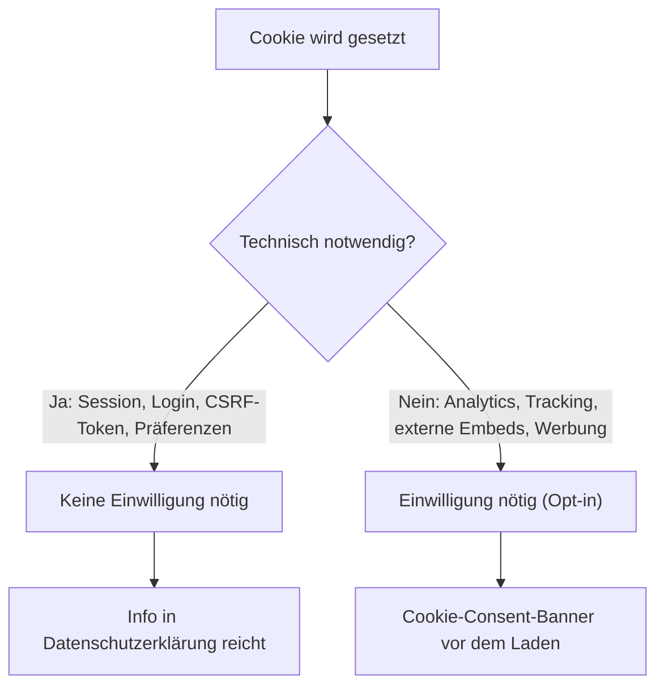

# Cookie-Banner für MediaWiki: Wann ist er nötig?

Ein **Standard-MediaWiki** (Vanilla-Installation ohne Tracking-Erweiterungen) braucht **keinen** Cookie-Consent-Banner. Sobald Analytics, externe Einbettungen oder Werbung dazukommen, kann sich das ändern. Diese Seite erklärt die rechtliche Grundlage und die praktische Umsetzung.

!!! note "Hinweis"
    Diese Seite gibt eine allgemeine Einordnung für Deutschland/EU und ersetzt keine Rechtsberatung im Einzelfall.

---

## Rechtliche Grundlage

Ein Cookie-Consent-Banner (aktives Opt-in) ist nach **TTDSG §25 Abs. 2 Nr. 2** nur für **nicht technisch notwendige** Cookies vorgeschrieben. Technisch notwendige Cookies sind von der Einwilligungspflicht ausgenommen — für sie reicht eine **Informationspflicht** nach Art. 13 DSGVO, also ein Eintrag in der Datenschutzerklärung.



---

## MediaWiki-Standardcookies

| Cookie | Zweck | Einwilligungspflichtig? |
|---|---|---|
| `*_session` | Session-Verwaltung | Nein |
| `*UserID`, `*UserName`, `*Token` | Login-Status | Nein |
| Edit-Token (im Storage) | CSRF-Schutz | Nein |
| Preference-Cookies (Skin, Sprache) | Nutzereinstellung | Nein |

Diese Cookies fallen unter die technisch-notwendig-Ausnahme — kein Banner erforderlich, nur ein Passus in der Datenschutzerklärung.

---

## Wann ein Banner doch nötig wird

Sobald **nicht-notwendige** Dienste dazukommen, kippt die Ausnahme:

- Analytics/Tracking ohne datenschutzkonformen Modus (Google Analytics, Matomo im Tracking-Modus, Cloudflare-Analytics mit Fingerprinting)
- Externe Einbettungen mit eigenen Cookies (YouTube-Embeds, Social-Media-Buttons, extern geladene Google Fonts statt selbst gehostet)
- Werbung
- Event-/Tracking-Erweiterungen wie `EventLogging`, `WikimediaEvents`, falls aktiviert

!!! warning "Achtung"
    Die Ausnahme gilt nur, solange **ausschließlich** technisch notwendige Cookies gesetzt werden. Eine einzelne Analytics- oder Embed-Erweiterung reicht, um consent-pflichtig zu werden.

---

## Umsetzung in MediaWiki

### Fall 1: Nur Standardcookies — kein Banner nötig

Es reicht, die eingebaute Systemnachricht `MediaWiki:Privacy` mit einer Datenschutzerklärung zu füllen; MediaWiki verlinkt sie automatisch im Footer als "Datenschutz"-Link. Optional `MediaWiki:Copyright` für ein Impressum, je nach Anbieter-Status (§5 TMG/DDG).

### Fall 2: Analytics/Tracking aktiv — Consent-Tool vorschalten

Die Erweiterung **[CookieWarning](https://www.mediawiki.org/wiki/Extension:CookieWarning)** zeigt einen einfachen Hinweis-Banner (Info, nicht granulares Opt-in) an. Konfiguration in `LocalSettings.php`:

```php
wfLoadExtension( 'CookieWarning' );
$wgCookieWarningEnabled = true;
$wgCookieWarningMoreUrl = '';
$wgCookieWarningGeoIPServiceURL = '';
$wgCookieWarningGeoIPLookup = 'none';
$wgCookieWarningForCountryCodes = 'EU';
```

!!! warning "CookieWarning ist nur ein Hinweisbanner, kein granulares Opt-in"
    Die Extension informiert lediglich und blockiert **keine** nachgelagerten Skripte, bis eine Einwilligung erteilt wurde. Werden echte Tracking-Dienste (z. B. Matomo im Tracking-Modus) eingesetzt, ist rechtlich ein **echtes Opt-in vor dem Laden der Skripte** nötig (z. B. Klaro, Cookiebot, oder ein selbst gebautes Consent-Gate) — nicht nur ein Hinweistext.

Matomo kann alternativ **cookieless** konfiguriert werden; je nach Einzelfallbewertung ist dann ebenfalls kein Consent-Banner nötig.

---

## Praxis-Checkliste

- [ ] Prüfen, ob Extensions mit Tracking/externen Assets installiert sind (`LocalSettings.php`: `wfLoadExtension`, externe `<script>`-Quellen in Skins, `ResourceLoaderRegisterModules`).
- [ ] Nur Standard-MediaWiki + selbst gehostete Assets → kein Banner, nur Datenschutzerklärung (`MediaWiki:Privacy`) pflegen.
- [ ] Analytics/Tracking aktiv → echtes Opt-in vor dem Laden der Skripte, nicht nur ein Hinweisbanner.
- [ ] Bei Matomo: cookieless-Modus als bannerfreie Alternative prüfen.

---

## Verwandte Themen

- [Datenschutz](datenschutz.md)
- [MediaWiki installieren](../wissen/dokumentation/mediawiki/index.md)
